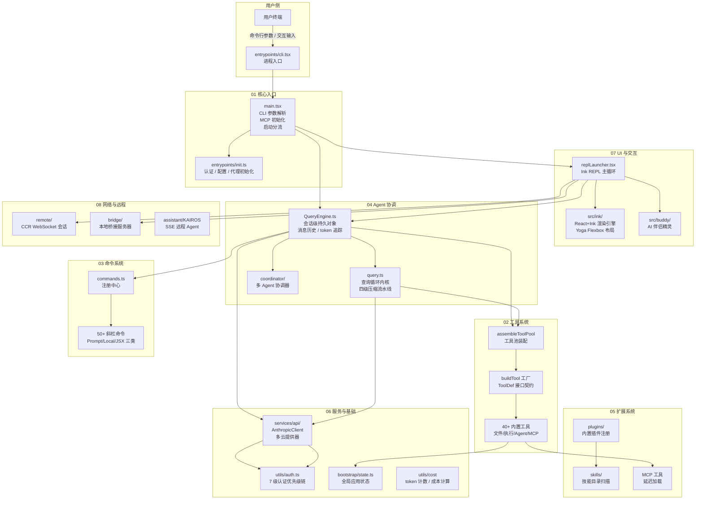
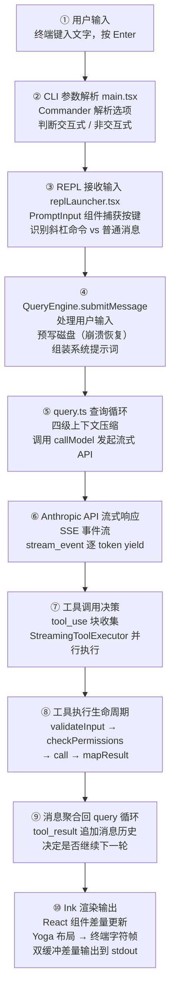
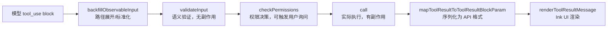

# Claude Code 全局架构总览

> 基于 Claude Code v2.1.88 source map 还原版本的宏观架构分析
> 涵盖 8 个模块组、核心数据流、设计决策与推荐学习路径

---

## 一、整体架构图



---

## 二、关键数据流

### 2.1 一次完整用户交互的生命周期

从用户在终端输入一条消息，到屏幕上渲染出 AI 回复，经历以下 10 个关键站点：



**核心循环说明：**

步骤 ⑤ 到 ⑨ 形成 `query.ts` 的 `while (true)` 主循环。每轮循环：先对消息历史执行四级压缩（snip → microcompact → contextCollapse → autocompact），再发起 API 请求，收集模型输出的 `tool_use` 块，并行执行工具，将 `tool_result` 追加到消息历史，进入下一轮——直到模型输出无需工具调用（`stop_reason: 'end_turn'`）或触发终止条件（`max_turns`、token 预算耗尽、用户中断）。

步骤 ④ 的 `QueryEngine` 是跨轮次的持久对象，负责维护 `mutableMessages`（完整对话历史）和 `totalUsage`（累计 token 成本）；`query.ts` 是无状态的单次循环执行器，每次 `submitMessage()` 调用时被构造参数并驱动。

### 2.2 工具调用完整生命周期



---

## 三、核心设计决策

Claude Code 的架构中有若干设计决策值得深入理解，这些决策体现了工程团队在性能、安全、可扩展性之间的权衡。

### 决策一：React/Ink 渲染 CLI（而非直接操作终端）

**问题背景：** CLI 工具通常直接调用 `process.stdout.write` 输出 ANSI 转义序列。随着 REPL 交互复杂度增长（流式输出、权限对话框、多工具并发状态），命令式终端代码极难维护。

**解决方案：** 引入 React + Ink，将终端 UI 建模为 `UI = f(state)`。自定义 `react-reconciler` 将 React 虚拟 DOM 映射到 Ink 的 `DOMElement` 树，经 Yoga Flexbox 计算布局，最终通过双缓冲差量渲染输出到终端。

**收益：** 组件复用（`PermissionRequest`、`Spinner`、`Messages` 等独立可测试）；状态管理统一（`useState` / Context）；差量渲染消除闪烁；`blit` 优化将稳态帧渲染开销降至 O(变化行数)。

### 决策二：queryLoop 四级上下文压缩流水线

**问题背景：** Claude 的上下文窗口有上限（约 200K token）。长对话的消息历史会超出窗口，导致 API 返回 `prompt_too_long` 错误。

**解决方案：** 在每轮 API 调用前执行四级递进压缩：
1. **snip**：截断超长的单条工具结果
2. **microcompact**：压缩最近一条大型工具结果的冗余部分
3. **contextCollapse**：折叠已完成的工具调用序列为摘要
4. **autocompact**：当上下文使用率超过阈值时，调用 Claude 对全部历史生成摘要，保留关键信息

**收益：** 四级设计保证了从轻量到重量的渐进式处理，仅在必要时才触发耗费 token 的完整压缩，平衡了成本与可用性。

### 决策三：MCP 工具延迟加载防止 token 浪费

**问题背景：** MCP（Model Context Protocol）服务器可能提供数十个工具，每个工具的 schema 描述都会消耗 input token。若在会话开始时就将所有 MCP 工具定义注入系统提示词，成本极高。

**解决方案：** `lazySchema()` 包装器使工具的 Zod schema 只在首次被访问时构建（延迟初始化）。MCP 工具通过 `assembleToolPool()` 动态注入，仅包含用户当前配置且可达的服务器提供的工具。`inputSchema` 的 getter 实现确保模块加载时不触发 schema 构建。

**收益：** 启动开销接近零；仅实际使用的工具消耗 token；MCP 服务器连接失败不影响其他工具可用性。

### 决策四：7 级认证优先级链

**问题背景：** Claude Code 需要支持直连 API Key、Claude.ai OAuth、AWS Bedrock IAM、GCP Vertex ADC、Azure Foundry AAD、企业 SSO、桌面应用注入等多种认证模式，且各模式的优先级在不同部署场景下不同（如远程会话不应读取本地 API Key）。

**解决方案：** `getAuthTokenSource()` 实现责任链模式，按 7 个条件依序检查：`bareMode → ANTHROPIC_AUTH_TOKEN → CLAUDE_CODE_OAUTH_TOKEN → CLAUDE_CODE_OAUTH_TOKEN_FILE_DESCRIPTOR → apiKeyHelper → Claude.ai OAuth → none`。`isManagedOAuthContext()` 作为门卫，在 CCR 远程会话或 Claude Desktop 启动的子进程中屏蔽本地配置，防止认证头冲突。

**收益：** 所有认证场景通过单一入口统一处理；新增认证来源只需在责任链中插入新检查点；运行时认证切换（如 OAuth 刷新）对上层透明。

### 决策五：工具系统的 lazySchema + buildTool() 工厂设计

**问题背景：** Claude Code 有 40+ 内置工具，每个工具需要 Zod schema 定义输入/输出结构。若在模块加载时全量构建所有 schema，启动时间会显著增加（CLI 工具的冷启动体验敏感）。

**解决方案：** 所有工具的 `inputSchema` / `outputSchema` 通过 TypeScript getter + `lazySchema()` 包装实现按需构建。`buildTool()` 工厂函数屏蔽元数据绑定、默认值填充等横切关注点，工具定义只需 `satisfies ToolDef<I, O>` 的纯对象字面量，无需类继承。

**收益：** 工具注册零启动开销；`satisfies` 关键字在编译期验证实现完整性同时保留字面量类型推断；工厂函数遵循开闭原则，可在不侵入具体工具代码的情况下附加日志、监控等横切逻辑。

### 决策六：Buddy 伴侣的骨骼/灵魂分离存储与 charCodeAt 绕过 canary 扫描

**问题背景：** Buddy 伴侣系统需要存储用户伴侣的外观（物种/稀有度）和个性（AI 生成的名字/性格），且外观数据需要防止用户篡改（将 common 改为 legendary）。此外，某物种名与内部模型代号存在字符串字面量碰撞，会触发构建产物扫描警告。

**解决方案：** 骨骼（`CompanionBones`，外观特征）每次从 `hash(userId + SALT)` 通过 Mulberry32 PRNG 重新生成，永不持久化——相同账号永远得到相同结果，无需存储。灵魂（`CompanionSoul`，名字/性格）由 Claude API 生成一次后存入 `config.companion`。特殊物种名通过 `String.fromCharCode()` 在运行时构造，绕过构建期字面量扫描，并以 `as 'typename'` 类型断言保留 TypeScript 类型安全。

**收益：** 防止配置文件篡改稀有度；外观枚举可随版本迭代演化而不破坏已存伴侣；时间窗口门控（本地时间而非 UTC）平滑了伴侣孵化时的 API 流量峰值。

### 决策七：QueryEngine 与 query() 的状态/无状态分层

**问题背景：** SDK 消费者（claude-desktop、cowork）需要跨多次 `submitMessage()` 保持对话历史和累计 token 统计；而测试和 headless 场景需要对单次查询循环进行依赖注入和单元测试。

**解决方案：** `QueryEngine` 是有状态的会话管理器（持有 `mutableMessages`、`totalUsage`、`readFileState`），负责持久化和跨轮次状态管理。`query()` 是无状态的单次查询循环，每次调用通过参数接受完整上下文，内部通过 `deps` 对象实现依赖注入（`callModel`、`autocompact` 等可在测试中替换）。

**收益：** `query()` 可独立单元测试；`QueryEngine` 封装 SDK 契约（`SDKMessage` 格式转换）；双缓冲消息列表（`mutableMessages` 快照 → 查询 → push 新消息）防止查询进行中的新消息污染本次上下文。

---

## 四、推荐阅读顺序

### 路径 A：面试备考路径（按重要性排序）

适合准备工程面试、希望在有限时间内掌握最核心设计的读者。

| 优先级 | 文档 | 核心考点 |
|--------|------|----------|
| ★★★ | `04-Agent协调/04-QueryEngine.md` | 会话管理、预写日志、双缓冲消息 |
| ★★★ | `04-Agent协调/03-query.md` | 查询循环、四级压缩、工具执行 |
| ★★★ | `02-工具系统/00-工具系统总览.md` | ToolDef 接口、buildTool 工厂、权限生命周期 |
| ★★★ | `07-UI与交互/01-ink渲染引擎.md` | React 协调器、Yoga 布局、差量渲染 |
| ★★ | `01-核心入口/01-main.md` | 启动性能优化、并行预取、双路径分流 |
| ★★ | `06-服务与基础/04-utils-model-auth.md` | 7 级认证链、OAuth 刷新、多云适配 |
| ★★ | `03-命令系统/00-命令系统总览.md` | 命令联合类型、memoize 缓存、Feature Flag |
| ★ | `04-Agent协调/01-coordinator.md` | 多 Agent 协调、环境变量模式切换 |
| ★ | `07-UI与交互/06-buddy-AI伴侣.md` | 确定性生成、骨骼/灵魂分离、canary 绕过 |

### 路径 B：深度学习路径（按依赖关系排序）

适合希望系统理解 Claude Code 完整架构、从底层到上层逐步建立认知的读者。

```
第一阶段：基础层
  06-服务与基础/07-schemas.md          → 核心类型定义（Message、ToolResult 等）
  06-服务与基础/08-constants-types-migrations.md → 常量与迁移基础设施
  06-服务与基础/06-state.md            → 全局状态管理

第二阶段：通信层
  06-服务与基础/01-services-api.md     → Anthropic API 客户端与重试机制
  06-服务与基础/04-utils-model-auth.md → 多云认证体系
  08-网络与远程/01-remote.md           → CCR 远程会话

第三阶段：工具层
  02-工具系统/00-工具系统总览.md       → 工具系统架构
  02-工具系统/01~08 各工具文档        → 具体工具实现

第四阶段：查询层
  04-Agent协调/03-query.md            → 查询循环内核
  04-Agent协调/04-QueryEngine.md      → 会话管理层
  04-Agent协调/01-coordinator.md      → 多 Agent 协调

第五阶段：入口与命令层
  03-命令系统/00-命令系统总览.md       → 命令注册体系
  03-命令系统/01~08 各命令文档        → 具体命令实现
  05-扩展系统/01-plugins.md           → 插件系统
  05-扩展系统/02-skills.md            → 技能系统
  01-核心入口/01-main.md              → CLI 主入口

第六阶段：UI 层
  07-UI与交互/01-ink渲染引擎.md       → Ink 渲染架构
  07-UI与交互/02~07 各 UI 文档        → 具体组件与交互
```

---

## 五、模块速查表

| 模块组 | 文档数 | 源码路径 | 核心职责 | 关键对象 |
|--------|--------|----------|----------|----------|
| **01 核心入口** | 4 篇 | `src/main.tsx` `src/entrypoints/` | CLI 参数解析、启动性能优化、双路径分流 | `main()`, `run()`, `startDeferredPrefetches()` |
| **02 工具系统** | 9 篇 | `src/tools/` | 40+ 内置工具的注册、权限检查与执行生命周期 | `ToolDef<I,O>`, `buildTool()`, `assembleToolPool()` |
| **03 命令系统** | 9 篇 | `src/commands.ts` `src/commands/` | 斜杠命令注册、分类管理、懒加载调度 | `Command` 联合类型, `getCommands()`, `REMOTE_SAFE_COMMANDS` |
| **04 Agent 协调** | 4 篇 | `src/query.ts` `src/QueryEngine.ts` `src/coordinator/` | 查询循环驱动、会话持久化、多 Agent 协调 | `query()`, `QueryEngine`, `isCoordinatorMode()` |
| **05 扩展系统** | 3 篇 | `src/plugins/` `src/skills/` | 内置插件注册、技能目录扫描、按键绑定扩展 | `registerBuiltinPlugin()`, `getDynamicSkills()` |
| **06 服务与基础** | 8 篇 | `src/services/` `src/utils/` `src/bootstrap/` | API 通信、认证体系、全局状态、token 成本计算 | `getAnthropicClient()`, `getAuthTokenSource()`, `AppState` |
| **07 UI 与交互** | 7 篇 | `src/ink/` `src/buddy/` `src/components/` | React/Ink 渲染引擎、核心 UI 组件、AI 伴侣 | `Ink` 类, `reconciler`, `CompanionSprite`, `roll()` |
| **08 网络与远程** | 6 篇 | `src/remote/` `src/server/` `src/bridge/` | CCR 远程会话、本地桥接服务器、KAIROS 远程 Agent | `RemoteSessionManager`, `SessionsWebSocket`, `KAIROS` |

---

> **版权声明**：源码版权归 [Anthropic](https://www.anthropic.com) 所有，本文档基于 Claude Code v2.1.88 source map 还原版本分析，仅供学习研究使用。文档内容采用 [CC BY-NC 4.0](https://creativecommons.org/licenses/by-nc/4.0/) 协议。
