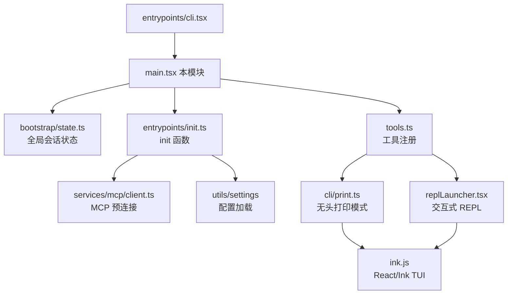
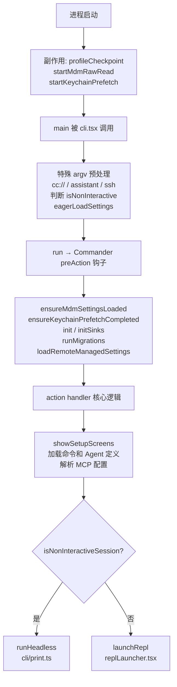

# main.tsx — Claude Code 源码分析

> 模块路径：`src/main.tsx`
> 核心职责：CLI 主入口，负责参数解析、初始化编排、工具注册，以及分流交互式 REPL 与无头打印两条执行路径
> 源码版本：v2.1.88

## 一、模块概述（是什么）

`src/main.tsx` 是 Claude Code CLI 的核心主控文件，全文约 4683 行。它承担了从进程启动到用户开始交互或 `-p` 打印输出之间的全部编排工作：

- **启动性能优化**：在所有 `import` 语句执行之前，注册性能检测点并并行派生子进程（MDM 配置读取、keychain 预取），以掩盖 ~135ms 的模块加载延迟。
- **CLI 参数解析**：基于 `commander-js` 构建超过 60 个选项的命令行解析器，包括 `-p`、`--model`、`--permission-mode` 等核心标志。
- **初始化流程编排**：通过 `preAction` 钩子协调 MDM 设置加载、`init()` 调用、日志汇聚器初始化、配置迁移等多个异步步骤。
- **双路径分流**：根据是否为非交互式会话，分别进入 `runHeadless()`（`-p` 打印模式）或 `launchRepl()`（交互式 TUI 模式）。
- **MCP 客户端初始化**：加载、验证、合并所有 MCP 服务器配置，在 REPL 渲染前完成预连接。

## 二、架构设计（为什么这么设计）

### 2.1 核心类 / 接口 / 函数

**`main()` 函数**（`src/main.tsx:585`）
异步主入口。先处理特殊命令（`cc://` 协议、`assistant`、`ssh` 等）的 argv 改写，再判断交互式/非交互式模式，最终调用 `run()`。设计为异步函数以便顶层使用 `await`。

**`run()` 函数**（`src/main.tsx:884`）
构建 Commander 程序对象，注册所有选项和默认动作处理器。它是 main.tsx 中最重量级的函数，包含了完整的命令行选项树和核心 action handler（约 3000 行）。

**`startDeferredPrefetches()` 函数**（`src/main.tsx:388`）
将非关键的后台预取（用户上下文、系统上下文、模型能力刷新、技能变更检测等）推迟到 REPL 首次渲染后触发，避免阻塞首屏。

**`runMigrations()` 函数**（`src/main.tsx:326`）
基于版本号（`CURRENT_MIGRATION_VERSION = 11`）的幂等迁移系统。每次启动检查是否需要运行一批配置迁移（模型名称重命名、权限设置迁移等）。

**`PendingConnect` / `PendingSSH` / `PendingAssistantChat` 类型**（`src/main.tsx:543-584`）
三个模块级可变对象，用于在 argv 预解析阶段暂存特殊子命令的参数（`cc://`、`ssh`、`assistant`），避免 Commander 在不了解这些子命令的情况下解析失败。

### 2.2 模块依赖关系图



### 2.3 关键数据流



## 三、核心实现走读（怎么做的）

### 3.1 关键流程（编号步骤式）

**启动阶段（进程初始化）**

1. 模块顶层立即执行 `profileCheckpoint('main_tsx_entry')` 记录时间戳
2. `startMdmRawRead()` 派生 `plutil`/`reg query` 子进程读取 MDM 配置（macOS/Windows）
3. `startKeychainPrefetch()` 并行启动 keychain 读取（OAuth token + legacy API key），节省 ~65ms
4. 所有 `import` 语句执行完毕后记录 `profileCheckpoint('main_tsx_imports_loaded')`

**main() 函数执行**

5. 设置 `NoDefaultCurrentDirectoryInExePath=1` 防止 Windows PATH 劫持
6. 注册 `process.on('exit')` 恢复终端光标，注册 `SIGINT` 处理（-p 模式忽略以避免中断查询）
7. 处理特殊子命令：检测 `cc://` 协议 URL、`assistant`、`ssh` 并改写 `process.argv`
8. 检查 `-p`/`--print` 和 `!process.stdout.isTTY` 确定 `isNonInteractive`
9. 调用 `eagerLoadSettings()` 提前解析 `--settings` 和 `--setting-sources` 标志

**Commander preAction 钩子**

10. 并行等待 `ensureMdmSettingsLoaded()` 和 `ensureKeychainPrefetchCompleted()`
11. 调用 `init()`（来自 `entrypoints/init.ts`）：启用配置、应用环境变量、配置 mTLS/代理、预连接 API
12. 调用 `initSinks()` 连接分析日志汇聚器（确保子命令也能发送事件）
13. 设置 `process.title = 'claude'`（供 shell 集成显示 tab 名）
14. 调用 `runMigrations()` 执行版本迁移

**action handler**

15. 调用 `showSetupScreens()`（信任对话框 / OAuth 登录 / 首次引导），等待用户授权
16. 获取信任后初始化 LSP 服务器管理器（避免在未信任目录执行代码）
17. 解析并合并所有 MCP 服务器配置（CLI flag + 项目设置 + 企业策略过滤）
18. 调用 `prefetchAllMcpResources()` 预连接 MCP 服务器（交互式模式）
19. 构建 `initialState` 或 `headlessInitialState`，分流进入 REPL 或 `runHeadless()`
20. 交互式路径：调用 `startDeferredPrefetches()` 触发后台预取，然后 `launchRepl()`

### 3.2 重要源码片段（带中文注释）

**启动阶段的并行预取（`src/main.tsx:9-20`）**
```typescript
// 模块加载副作用必须在所有 import 之前执行
// profileCheckpoint 记录入口时间戳，用于启动耗时分析
profileCheckpoint('main_tsx_entry');

// 派生 plutil/reg query 子进程读取 MDM 配置
// 与后续 ~135ms 的模块加载并行执行
startMdmRawRead();

// 并行启动 keychain 读取（OAuth token + 旧版 API key）
// 避免 isRemoteManagedSettingsEligible() 内串行 ~65ms 延迟
startKeychainPrefetch();
```

**非交互式模式判断（`src/main.tsx:800-812`）**
```typescript
// 通过四个条件综合判断是否为非交互式会话
const hasPrintFlag = cliArgs.includes('-p') || cliArgs.includes('--print');
const hasInitOnlyFlag = cliArgs.includes('--init-only');
const hasSdkUrl = cliArgs.some(arg => arg.startsWith('--sdk-url'));
const isNonInteractive = hasPrintFlag || hasInitOnlyFlag
  || hasSdkUrl || !process.stdout.isTTY;

setIsInteractive(!isNonInteractive);
initializeEntrypoint(isNonInteractive); // 设置 CLAUDE_CODE_ENTRYPOINT
```

**preAction 钩子中的串行初始化（`src/main.tsx:907-966`）**
```typescript
program.hook('preAction', async thisCommand => {
  // 等待模块顶层启动的并行任务完成
  await Promise.all([
    ensureMdmSettingsLoaded(),       // MDM 设置
    ensureKeychainPrefetchCompleted() // keychain 预取
  ]);
  await init(); // 核心初始化（配置、网络、mTLS）
  // 连接日志汇聚器，确保子命令也能发送分析事件
  const { initSinks } = await import('./utils/sinks.js');
  initSinks();
  runMigrations(); // 版本迁移
  void loadRemoteManagedSettings(); // 企业远程设置（异步，失败不阻塞）
});
```

**版本迁移系统（`src/main.tsx:324-352`）**
```typescript
const CURRENT_MIGRATION_VERSION = 11; // 版本号变动触发全量迁移
function runMigrations(): void {
  if (getGlobalConfig().migrationVersion !== CURRENT_MIGRATION_VERSION) {
    migrateAutoUpdatesToSettings();
    migrateSonnet45ToSonnet46();   // 模型名称迁移示例
    migrateOpusToOpus1m();
    // ... 共 8 个同步迁移
    saveGlobalConfig(prev => ({    // 不可变更新配置
      ...prev,
      migrationVersion: CURRENT_MIGRATION_VERSION
    }));
  }
}
```

**延迟预取策略（`src/main.tsx:388-431`）**
```typescript
export function startDeferredPrefetches(): void {
  // 仅在首屏渲染后触发，避免阻塞 REPL 初始化
  if (isEnvTruthy(process.env.CLAUDE_CODE_EXIT_AFTER_FIRST_RENDER)
    || isBareMode()) return;

  // 用户正在打字时并行完成这些耗时操作
  void initUser();               // 用户信息缓存
  void getUserContext();         // 用户上下文
  prefetchSystemContextIfSafe(); // Git 状态（仅信任目录）
  void refreshModelCapabilities(); // 模型能力刷新
  void settingsChangeDetector.initialize(); // 设置变更检测
}
```

### 3.3 设计模式分析

**观察者 + 钩子模式（Commander preAction）**
Commander 的 `preAction` 钩子解耦了「解析时机」与「执行时机」：help 输出不触发初始化，正式命令才触发，避免 `--help` 时执行昂贵的 `init()`。

**惰性模块加载（DCE 友好）**
借助 Bun 的 `feature()` 宏实现编译时死代码消除。外部发布版本中，`COORDINATOR_MODE`、`KAIROS`、`SSH_REMOTE` 等功能的整个代码块会被打包工具移除：
```typescript
// 编译时决策，外部构建中此行代码整体被 DCE 移除
const coordinatorModeModule = feature('COORDINATOR_MODE')
  ? require('./coordinator/coordinatorMode.js') : null;
```

**启动性能优化（流水线并行）**
采用「先点火后等待」模式：在模块顶层立即派生子进程，在 `preAction` 钩子处才 `await` 结果。子进程执行时间（~65-135ms）与模块加载时间完全重叠，实现零额外延迟。

**不可变状态更新**
`saveGlobalConfig` 始终接收纯函数参数，保证配置写入为不可变操作：
```typescript
saveGlobalConfig(prev =>
  prev.migrationVersion === CURRENT_MIGRATION_VERSION ? prev
    : { ...prev, migrationVersion: CURRENT_MIGRATION_VERSION }
);
```

## 四、高频面试 Q&A

### 设计决策题

**Q1：为什么在 `import` 语句之前执行副作用（`startMdmRawRead`、`startKeychainPrefetch`）？这不违反最佳实践吗？**

这是有意为之的性能优化。ES Modules 的顶层副作用在模块求值时同步执行，但 `import` 语句本身会触发约 135ms 的模块加载（依赖图解析、JIT 编译）。通过在第一个 `import` 之前调用这两个函数，子进程派生（`plutil`、`reg query`、keychain 读取）与整个导入阶段并行执行。在 `preAction` 钩子处 `await` 时，子进程早已完成，几乎不产生额外等待。代码注释中明确标注了 `eslint-disable custom-rules/no-top-level-side-effects` 并说明了原因，这是一种明确记录、有意接受的权衡。

**Q2：为什么选择在 `preAction` 钩子中执行 `init()` 而不是在 `run()` 函数顶部？**

`run()` 函数在注册 Commander 对象后立即被调用，此时用户可能只是执行 `claude --help`。在 `preAction` 钩子中执行初始化可以确保：只有在真正执行命令时才触发 `init()`（约 200-400ms），`--help` 输出即时返回。同时，所有子命令（`mcp`、`plugin`、`auth`）共享同一个 `preAction` 钩子，避免在每个子命令 handler 内重复初始化逻辑。

### 原理分析题

**Q3：`main.tsx` 如何处理交互式与非交互式（`-p` 模式）的分流？**

判断依据有四个条件之一成立即为非交互式：`-p`/`--print` 标志、`--init-only` 标志、`--sdk-url` 标志、或 `!process.stdout.isTTY`。判断结果通过 `setIsInteractive()` 写入 `bootstrap/state.ts` 全局状态。后续在 action handler 内，非交互式路径构建 `headlessInitialState` + `headlessStore`，然后调用 `runHeadless()`（`cli/print.ts`）；交互式路径则创建 Ink `root` 对象并调用 `launchRepl()`。

**Q4：`runMigrations()` 的版本迁移系统如何保证幂等性？**

每次迁移函数（如 `migrateSonnet45ToSonnet46`）内部检查当前配置值是否已是目标值，若已迁移则直接返回。外层通过比较 `getGlobalConfig().migrationVersion` 与 `CURRENT_MIGRATION_VERSION`（当前为 11），只有版本不匹配时才运行全套迁移。迁移完成后使用不可变的展开运算符更新配置：`{ ...prev, migrationVersion: CURRENT_MIGRATION_VERSION }`，保证写入安全。

**Q5：MCP 服务器配置是如何被加载和过滤的？**

配置来源有多层：CLI `--mcp-config` 标志 → 项目 `.claude/settings.json` → 用户 `~/.claude/settings.json` → 企业 MDM 策略。加载后经过 `filterMcpServersByPolicy()` 过滤企业策略中的 `allowedMcpServers`/`deniedMcpServers`。特殊场景下 `doesEnterpriseMcpConfigExist()` 会拒绝 CLI 动态配置。最终合并为 `allMcpConfigs`，在交互式模式下调用 `prefetchAllMcpResources()` 并行连接所有服务器，服务器连接不阻塞 REPL 首屏渲染。

### 权衡与优化题

**Q6：`startDeferredPrefetches()` 推迟了哪些工作？为什么不在更早的时候执行？**

推迟的工作包括：`initUser()`（HTTP 请求）、`getUserContext()`（文件系统 + 可能的 Git 操作）、`prefetchSystemContextIfSafe()`（Git 状态，可能触发 `core.fsmonitor` 等 hooks）、`countFilesRoundedRg()`（目录文件数统计）、`settingsChangeDetector.initialize()`（文件监听）。这些操作总计约 100-500ms，且在用户输入第一条消息之前完成即可（有足够的时间窗口）。如果在 `init()` 阶段执行，会延迟 REPL 首屏渲染；在首屏渲染后触发，用户看到界面时后台工作已同步进行，不影响感知延迟。`--bare` 模式（脚本化 `-p` 调用）完全跳过这些预取，因为脚本没有「用户正在打字」的时间窗口。

**Q7：`feature()` 宏与运行时特性标志（GrowthBook）的区别是什么？各自适用什么场景？**

`feature()` 是 Bun 的编译时宏，在打包时求值。`feature('COORDINATOR_MODE')` 为 `false` 时，整个代码块从产物中移除（DCE）。适用于：外部发布版本与内部 Ant 版本的功能差异、实验性代码的安全隔离、减少外部发布包体积。GrowthBook 特性标志（`getFeatureValue_CACHED_MAY_BE_STALE`）是运行时 A/B 测试，在已发布的同一二进制中按用户/百分比动态开关，适用于渐进式发布和灰度测试。两者可以叠加使用：先用 `feature()` 控制代码是否存在，再用 GrowthBook 控制是否激活。

### 实战应用题

**Q8：如果你想为 Claude Code 添加一个新的 CLI 子命令（如 `claude analyze`），应该在 `main.tsx` 的哪些位置修改？**

1. 在 `entrypoints/cli.tsx` 中添加快速路径检测（如果不需要完整初始化），用于提前拦截和处理简单命令。
2. 在 `run()` 函数内通过 `program.command('analyze')` 注册子命令，添加 `.action()` 处理器。
3. 子命令 handler 通过 `preAction` 钩子自动获得 `init()` 和 `initSinks()`，无需在 handler 内重复调用。
4. 若子命令需要写入会话状态，在 `bootstrap/state.ts` 添加相应状态字段并提供 setter。
5. 注意在 `logManagedSettings()` 或 `logSessionTelemetry()` 内添加相应的分析事件上报。

**Q9：`main.tsx` 如何处理调试模式检测，为什么要在检测到调试器时退出？**

`isBeingDebugged()` 函数（`src/main.tsx:232`）检查三个指标：`process.execArgv` 中的 `--inspect`/`--debug` 标志、`NODE_OPTIONS` 环境变量中的检测标志、以及 `inspector.url()` API 是否返回非空值。检测到调试器时立即 `process.exit(1)`。这是安全措施：Claude Code 的部分敏感操作（keychain 读取、权限检查）不应在未授权的调试会话中被检查。同时也防止通过调试器绕过信任对话框或权限验证流程。注意该检测仅在非 Ant（外部）构建中激活（`"external" !== 'ant'` 条件）。

---

> **版权声明**：源码版权归 [Anthropic](https://www.anthropic.com) 所有，本文档基于 Claude Code v2.1.88 npm 发布包的 source map 还原版本分析，仅供学习研究使用。文档内容采用 [CC BY-NC 4.0](https://creativecommons.org/licenses/by-nc/4.0/) 协议。
