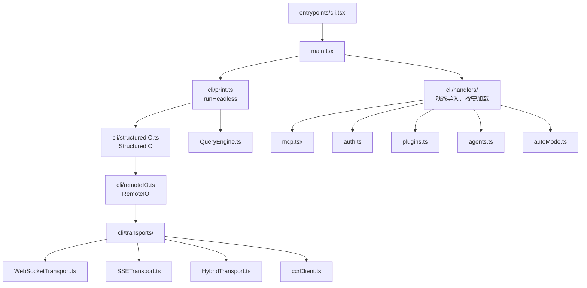
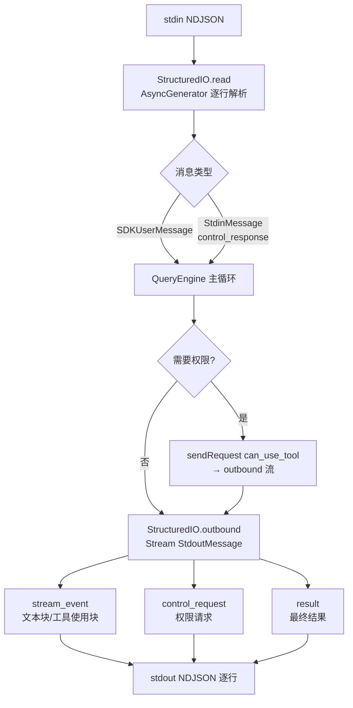
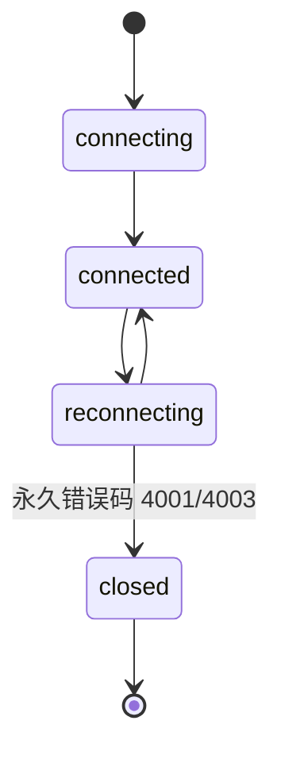

# cli/ — Claude Code 源码分析

> 模块路径：`src/cli/`
> 核心职责：CLI 基础设施层，提供快速路径分发、结构化 I/O 协议、传输层抽象及子命令处理器
> 源码版本：v2.1.88

## 一、模块概述（是什么）

`src/cli/` 目录是 Claude Code CLI 的基础设施层，共包含以下文件：

| 文件 | 职责 |
|------|------|
| `handlers/mcp.tsx` | MCP 子命令处理器（`claude mcp *`） |
| `handlers/auth.ts` | 认证子命令处理器（`claude auth *`） |
| `handlers/plugins.ts` | 插件子命令处理器（`claude plugin *`） |
| `handlers/agents.ts` | Agent 子命令处理器 |
| `handlers/autoMode.ts` | 自动模式相关处理器 |
| `handlers/util.tsx` | 共享处理器工具函数 |
| `print.ts` | 无头打印模式主逻辑（`-p` 标志路径） |
| `structuredIO.ts` | 结构化 I/O 协议实现（SDK 模式输入输出） |
| `remoteIO.ts` | 远程 I/O（继承 `StructuredIO`，支持 WebSocket/SSE） |
| `exit.ts` | CLI 退出辅助函数 |
| `update.ts` | 自动更新检查逻辑 |
| `ndjsonSafeStringify.ts` | NDJSON 安全序列化 |
| `transports/` | 传输层（WebSocket、SSE、Hybrid、CCR） |

该层的核心设计目标是：将与具体命令逻辑无关的基础设施（I/O、传输、退出、更新）从 `main.tsx` 中提取出来，并通过惰性动态导入确保这些模块仅在需要时才加载。

## 二、架构设计（为什么这么设计）

### 2.1 核心类 / 接口 / 函数

**`StructuredIO` 类**（`src/cli/structuredIO.ts:135`）
SDK 模式下的结构化双向 I/O 引擎。从 stdin 读取 NDJSON 格式的 `StdinMessage`/`SDKMessage`，并通过 `outbound` 流向 stdout 写出 `StdoutMessage`。管理 `pendingRequests` Map 实现请求-响应配对（`control_request`/`control_response`），以及 `resolvedToolUseIds` Set 防止重复处理。

**`RemoteIO` 类**（`src/cli/remoteIO.ts:35`）
继承 `StructuredIO`，将 stdin/stdout 替换为 WebSocket 或 SSE 传输层。用于 CCR（Claude Code Remote）环境，通过 Bearer token 认证，支持重连和会话恢复。

**`Transport` 接口**（`src/cli/transports/Transport.ts`）
传输层抽象接口，`WebSocketTransport` 和 `SSETransport` 均实现此接口，使上层 `RemoteIO` 无需关心底层通信协议。

**`runHeadless()` 函数**（`src/cli/print.ts`）
无头（`-p`）模式的核心运行循环。接收输入提示词，驱动 `QueryEngine`，将结果以 `text`/`json`/`stream-json` 格式输出到 stdout，不渲染任何 TUI 界面。

**`cliError()` / `cliOk()` 函数**（`src/cli/exit.ts`）
统一的 CLI 退出函数，返回类型为 `never`，允许 TypeScript 在调用点收窄控制流。用 `console.error`（测试可 spy）而非 `process.stderr.write` 输出错误，用 `process.stdout.write` 输出成功（与 `console.log` 行为不同，在 Bun 中更可预测）。

### 2.2 模块依赖关系图



### 2.3 关键数据流

**SDK 模式（`-p --output-format stream-json`）的数据流**



**传输层状态机（WebSocketTransport）**



## 三、核心实现走读（怎么做的）

### 3.1 关键流程（编号步骤式）

**快速路径分发（`entrypoints/cli.tsx`）**

1. 检查 `args[0]` 是否为 `--version`/-v`，若是则直接 `console.log` 版本号并返回（零模块加载）
2. 检查特殊子命令：`--daemon-worker`、`remote-control`、`daemon`、`ps`/`logs`/`attach`/`kill`、`new`/`list`/`reply`、`environment-runner` 等
3. 每个快速路径均为动态 `import()` + `await handler(args)`，不加载完整 CLI
4. 若无快速路径匹配，则动态导入 `main.js` 并调用 `cliMain()`

**MCP 子命令处理器（`cli/handlers/mcp.tsx`）**

5. `mcpServeHandler()` 调用 `setup()` 初始化工作目录，然后动态导入 `entrypoints/mcp.ts` 的 `startMCPServer()`
6. `mcpRemoveHandler()` 先查找并记录被移除服务器的配置（用于清理安全存储中的 token），再调用 `removeMcpConfig()`
7. MCP 服务器健康检查 `checkMcpServerHealth()` 尝试 `connectToServer()`，返回 `✓ Connected` / `! Needs authentication` / `✗ Failed`

**认证处理器（`cli/handlers/auth.ts`）**

8. `installOAuthTokens()` 是 OAuth 登录后的统一清理函数：先执行 `performLogout({ clearOnboarding: false })` 清除旧凭证，再存储新 token 和账户信息
9. 通过 `storeOAuthAccountInfo()` 保存账户 UUID、邮箱、组织 UUID 等信息到全局配置
10. `clearOAuthTokenCache()` 确保后续读取不使用缓存中的旧 token

**StructuredIO 核心协议（`cli/structuredIO.ts`）**

11. `read()` 方法是一个 `AsyncGenerator`，从 stdin 逐行读取，尝试 JSON 解析
12. 解析后的消息类型分为：`SDKUserMessage`（用户输入）、`StdinMessage`（控制协议），其余忽略
13. `sendRequest()` 将 `SDKControlRequest` 写入 `outbound` 流，并在 `pendingRequests` Map 中注册 `Promise` 的 resolve/reject
14. 当 `control_response` 到达时，从 `pendingRequests` 取出对应 Promise 并 resolve，完成请求-响应配对
15. `resolvedToolUseIds` Set 最多保存 1000 条记录（`MAX_RESOLVED_TOOL_USE_IDS`），防止重复处理和内存泄漏

**WebSocket 传输层（`cli/transports/WebSocketTransport.ts`）**

16. 维护状态机：`connecting` → `connected` → `reconnecting` → `connected`（循环）或 `closed`（永久错误）
17. 永久关闭码（1002、4001、4003）立即进入 `closed` 状态，不再重连
18. 睡眠检测：若两次重连间隔超过 `SLEEP_DETECTION_THRESHOLD_MS`（60s），重置重连预算，认为机器刚从睡眠中恢复
19. 保活机制：每 10s 发送 ping，每 5 分钟发送 `keep_alive` 帧维持连接

### 3.2 重要源码片段（带中文注释）

**CLI 退出辅助函数（`src/cli/exit.ts:19-31`）**
```typescript
// never 返回类型让 TypeScript 在调用点收窄控制流（如同 throw）
// 测试可以 spy process.exit，让它返回，call site 写 `return cliError()`
export function cliError(msg?: string): never {
  if (msg) console.error(msg)  // console.error 可被测试 spy
  process.exit(1)
  return undefined as never
}

export function cliOk(msg?: string): never {
  if (msg) process.stdout.write(msg + '\n') // Bun 中 console.log 路径不同
  process.exit(0)
  return undefined as never
}
```

**StructuredIO 请求-响应配对（`src/cli/structuredIO.ts:135,162-170`）**
```typescript
export class StructuredIO {
  // 待处理的控制协议请求（工具权限询问等）
  private readonly pendingRequests = new Map<string, PendingRequest<unknown>>()

  // 输出流：sendRequest 和 print.ts 均向此队列写入
  // drain 循环是唯一的写出方，防止消息乱序
  readonly outbound = new Stream<StdoutMessage>()

  constructor(
    private readonly input: AsyncIterable<string>,
    private readonly replayUserMessages?: boolean,
  ) {
    this.structuredInput = this.read() // 启动 AsyncGenerator
  }
}
```

**WebSocket 永久关闭检测（`src/cli/transports/WebSocketTransport.ts:42-46`）**
```typescript
// 这些关闭码表示服务端永久拒绝，不再重连
const PERMANENT_CLOSE_CODES = new Set([
  1002, // 协议错误，服务端拒绝握手（如会话已被回收）
  4001, // 会话过期或不存在
  4003, // 未授权
])
```

**MCP 服务器健康检查（`src/cli/handlers/mcp.tsx:26-38`）**
```typescript
async function checkMcpServerHealth(
  name: string, server: ScopedMcpServerConfig
): Promise<string> {
  try {
    const result = await connectToServer(name, server)
    if (result.type === 'connected') return '✓ Connected'
    else if (result.type === 'needs-auth') return '! Needs authentication'
    else return '✗ Failed to connect'
  } catch (_error) {
    return '✗ Connection error'
  }
}
```

**SSE 传输层重连策略（`src/cli/transports/SSETransport.ts:17-20`）**
```typescript
// 指数退避重连：基础 1s，上限 30s，总预算 10 分钟
const RECONNECT_BASE_DELAY_MS = 1000
const RECONNECT_MAX_DELAY_MS = 30_000
const RECONNECT_GIVE_UP_MS = 600_000  // 10 分钟后放弃

// 永久错误码（401/403/404）立即放弃，不进入重连循环
const PERMANENT_HTTP_CODES = new Set([401, 403, 404])
```

### 3.3 设计模式分析

**策略模式（Transport 接口）**
`WebSocketTransport`、`SSETransport`、`HybridTransport` 均实现统一的 `Transport` 接口，`RemoteIO` 通过 `getTransportForUrl()` 工厂函数获取合适的实现。上层代码无需感知底层协议差异。

**职责提取 + 惰性加载**
所有子命令处理器（`mcp.tsx`、`auth.ts`、`plugins.ts`）均作为独立模块，在 `main.tsx` 中通过 `await import('./cli/handlers/xxx.js')` 动态加载。这意味着 `claude mcp add` 命令不会加载认证处理器的代码，反之亦然，优化了每个子命令的冷启动时间。

**请求-响应配对（Correlation Pattern）**
`StructuredIO.sendRequest()` 使用 UUID 关联控制请求和响应，本质上是在单个 NDJSON 流上实现多路复用。这是一种在非双向协议上模拟双向 RPC 的经典模式，类似于 HTTP/2 的流 ID 机制。

**内存有界集合**
`resolvedToolUseIds` 使用 `MAX_RESOLVED_TOOL_USE_IDS = 1000` 上限，超出后 FIFO 淘汰最旧条目。这是一种防止长会话中内存无限增长的实用模式，比使用 `WeakMap`（需要对象键）更简单。

## 四、高频面试 Q&A

### 设计决策题

**Q1：子命令处理器（`handlers/mcp.tsx` 等）为什么从 `main.tsx` 中提取出来？为什么不直接在 `main.tsx` 中内联？**

原因是惰性加载和职责分离。`main.tsx` 约 4683 行，如果内联所有子命令处理器，会进一步膨胀。更重要的是，`claude mcp list` 这类简单子命令在快速路径下不需要加载完整的 CLI（`main.tsx` 约 200 个导入语句）。通过动态 `import()` 延迟加载，子命令只在执行时付出模块加载代价，而非进程启动时。Bun 的 `feature()` 宏还可以在编译时将整个处理器从外部发布版本中消除。

**Q2：`StructuredIO` 为何使用 `outbound` 流（`Stream<StdoutMessage>`）而非直接写出 stdout？**

直接写出 stdout 会产生竞态问题：`sendRequest()`（发送权限请求）和 `print.ts` 的流事件输出（发送模型输出块）会同时尝试写出，可能产生交错的 NDJSON 行。`outbound` 流作为单一写入点，由 drain 循环按序输出，确保消息不会相互穿插，同时保证 `control_request` 不会"超车"已排队的 `stream_event` 消息，维护了 NDJSON 协议的有序性。

### 原理分析题

**Q3：`RemoteIO` 与 `StructuredIO` 的继承关系是如何工作的？**

`RemoteIO` 继承 `StructuredIO`，核心差异是构造函数参数：`StructuredIO` 接受 `AsyncIterable<string>`（stdin），而 `RemoteIO` 创建一个 `PassThrough` 流作为 stdin 替代，并通过 WebSocket/SSE 传输层将接收到的消息写入该流。上层 `StructuredIO` 的 `read()` AsyncGenerator 完全不感知底层是 stdin 还是网络流，实现了干净的协议/传输分离。

**Q4：`WebSocketTransport` 的睡眠检测机制是如何工作的，为什么需要它？**

系统睡眠时 JavaScript 定时器被挂起，`setTimeout` 在系统唤醒后立即触发（而非定时器设定的时间点后触发）。这导致重连尝试之间的实际时间间隔远超 `DEFAULT_MAX_RECONNECT_DELAY`（30s）。若不检测这种情况，重连预算（600s）在睡眠期间就会被「用完」，导致系统唤醒后立即放弃重连。通过检测两次重连之间的实际时间差是否超过 `SLEEP_DETECTION_THRESHOLD_MS`（60s），传输层能识别睡眠-唤醒场景并重置预算，让用户唤醒电脑后仍能重连到 CCR 会话。

**Q5：`SSETransport` 为何需要维护 POST 重试逻辑？**

SSE（Server-Sent Events）是单向流：服务器 → 客户端。客户端向服务器发送消息需要单独的 HTTP POST 请求。SSE 传输层维护了 `POST_MAX_RETRIES = 10` 的指数退避重试机制（基础 500ms，上限 8s），以处理短暂的网络抖动。与重连逻辑分开实现，是因为 GET 连接（SSE 流）和 POST 请求（命令发送）有不同的失败模式和恢复策略。

### 权衡与优化题

**Q6：`cliError()` 和 `cliOk()` 为什么选择不同的输出方式（`console.error` vs `process.stdout.write`）？**

这是一个可测试性设计。在 Bun 测试环境中，`console.log` 并不总是路由到被 spy 的 `process.stdout.write`，而 `console.error` 可以被直接 spy。`cliOk` 使用 `process.stdout.write` 确保输出可以在测试中被捕获并断言，不依赖 console 重定向。同时，`return undefined as never` 让调用点可以写 `return cliError(msg)` 满足 TypeScript 的控制流分析，避免之后的代码中的「可能为 undefined」警告。

**Q7：传输层如何处理 `PERMANENT_HTTP_CODES`（401、403、404）与普通网络错误的区别？**

收到永久 HTTP 状态码时，`SSETransport` 立即将状态机切换为 `closed`，不进入重试循环。这一设计避免了在服务端已明确拒绝请求（认证失败、会话不存在）时进行毫无意义的重试，既节省网络资源，又能更快地向用户反馈错误。相比之下，网络超时或 5xx 错误属于瞬时故障，会触发指数退避重试。

### 实战应用题

**Q8：如果你需要为 Claude Code 添加一种新的传输协议（如 UNIX socket），应该如何扩展传输层？**

1. 在 `src/cli/transports/` 下新建 `UnixSocketTransport.ts`，实现 `Transport` 接口（`send(message: StdoutMessage): void`、`onMessage(callback)`、状态管理）。
2. 在 `transportUtils.ts` 的 `getTransportForUrl()` 工厂函数中添加对 `cc+unix://` URL scheme 的检测，返回 `new UnixSocketTransport(url)`。
3. 在 `RemoteIO` 构造函数中调整初始化逻辑（已有 `cc+unix://` 的 URL scheme 支持，见 `main.tsx` 的 URL 预处理）。
4. 无需修改 `StructuredIO`，它通过 `PassThrough` 流抽象屏蔽了传输层细节。

**Q9：`runHeadless()`（`cli/print.ts`）与 `launchRepl()`（`replLauncher.tsx`）的核心区别是什么？**

`runHeadless()` 不初始化 Ink/React 渲染器，不监听键盘输入，直接将输入提示词传递给 `QueryEngine`，以流式或批量方式将输出写到 stdout。适用于脚本化调用、CI 环境和 SDK 集成。`launchRepl()` 则初始化完整的 React/Ink TUI 界面，支持键盘快捷键、历史导航、实时状态显示等交互功能。两者共享同一套 `QueryEngine`、工具系统和 MCP 客户端，差异仅在 I/O 层。这种设计使核心逻辑（模型调用、工具执行、权限检查）完全与界面解耦，可以独立测试。

---

> **版权声明**：源码版权归 [Anthropic](https://www.anthropic.com) 所有，本文档基于 Claude Code v2.1.88 npm 发布包的 source map 还原版本分析，仅供学习研究使用。文档内容采用 [CC BY-NC 4.0](https://creativecommons.org/licenses/by-nc/4.0/) 协议。
