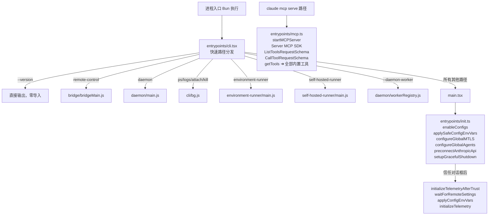
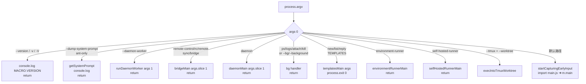

# entrypoints/ — Claude Code 源码分析

> 模块路径：`src/entrypoints/`
> 核心职责：定义所有入口点的差异化行为，包括快速路径分发（cli.tsx）、核心初始化（init.ts）、MCP 服务器模式（mcp.ts）及 SDK 类型系统
> 源码版本：v2.1.88

## 一、模块概述（是什么）

`src/entrypoints/` 目录包含 Claude Code 所有执行模式的入口逻辑：

| 文件 | 职责 |
|------|------|
| `cli.tsx` | 主入口文件（由 Bun 直接执行），实现快速路径分发，在需要时才加载完整 CLI |
| `init.ts` | 核心初始化函数 `init()`，被所有路径共享，完成配置、网络、遥测的启动工作 |
| `mcp.ts` | MCP 服务器模式（`claude mcp serve`），将 Claude 工具暴露为 MCP 工具集 |
| `agentSdkTypes.ts` | Agent SDK 公共类型的聚合导出 |
| `sandboxTypes.ts` | 沙箱相关类型定义 |
| `sdk/` | SDK 核心类型子目录（`coreTypes.ts`、`coreSchemas.ts`、`controlSchemas.ts`） |

这一层的设计原则是：**把所有「入口判断」逻辑集中在 `cli.tsx`，把所有「入口共享初始化」集中在 `init.ts`，避免在 `main.tsx` 中堆积快速路径代码**。

## 二、架构设计（为什么这么设计）

### 2.1 核心类 / 接口 / 函数

**`main()` 函数（`cli.tsx`）**（`src/entrypoints/cli.tsx:33`）
Bun 直接执行的真正入口。实现快速路径检测：对于 `--version`、MCP 服务器、守护进程、远程控制等特殊模式，零延迟地直接加载对应模块并执行，完全绕过完整的 Commander CLI 初始化（~135ms）。

**`init()` 函数**（`src/entrypoints/init.ts:57`）
被 `memoize()` 包装的异步初始化函数。只执行一次（多次调用直接返回缓存结果）。负责：启用配置系统、应用安全环境变量、配置 mTLS/代理、预连接 Anthropic API、设置优雅退出钩子等。

**`initializeTelemetryAfterTrust()` 函数**（`src/entrypoints/init.ts:247`）
信任建立后才初始化遥测（OpenTelemetry）的专用函数。对于需要等待远程管理设置的企业用户，先异步等待设置加载完成，再重新应用环境变量，最后初始化遥测，确保遥测配置包含所有远程设置。

**`startMCPServer()` 函数**（`src/entrypoints/mcp.ts:35`）
MCP 服务器模式的核心函数。创建 MCP `Server` 实例，注册 `list_tools` 和 `call_tool` 两个请求处理器，将 Claude Code 的全部内置工具（`getTools()`）通过标准 MCP 协议暴露给外部 MCP 客户端（如 Claude Desktop）。

**SDK 类型聚合（`agentSdkTypes.ts`）**
`agentSdkTypes.ts` 是 Agent SDK 的公共 API 门面，通过 `export * from './sdk/coreTypes.js'` 等方式将类型从子目录聚合导出，避免 SDK 消费者直接依赖内部目录结构。

### 2.2 模块依赖关系图



### 2.3 关键数据流

**`cli.tsx` 快速路径分发决策树**



**`init()` 内部执行时序**

```mermaid
flowchart LR
    A[init 调用] --> B[enableConfigs\n验证并启用配置系统]
    B --> C[applySafeConfigEnvironmentVariables\n应用安全环境变量]
    C --> D[applyExtraCACertsFromConfig\nTLS 握手前设置 CA 证书]
    D --> E[setupGracefulShutdown\n注册退出钩子]
    E --> F[async: initialize1PEventLogging\npopulateOAuthAccountInfoIfNeeded\ninitJetBrainsDetection\ndetectCurrentRepository]
    F --> G[initializeRemoteManagedSettingsLoadingPromise\nrecordFirstStartTime]
    G --> H[configureGlobalMTLS\nconfigureGlobalAgents\npreconnectAnthropicApi]
    H --> I{REMOTE?}
    I -- "是" --> J[initUpstreamProxy]
    I -- "否" --> K[setShellIfWindows\nensureScratchpadDir]
    J --> K
```



## 三、核心实现走读（怎么做的）

### 3.1 关键流程（编号步骤式）

**`cli.tsx` 的版本快速路径**

1. 不等待任何 `import`，仅读取 `process.argv.slice(2)`
2. 若匹配 `--version`/`-v`/`-V`，直接 `console.log(MACRO.VERSION)`（`MACRO.VERSION` 在编译时被内联替换为字符串）
3. 立即 `return`，整个进程不加载任何其他模块

**`cli.tsx` 的 Bridge 路径**

4. 检测到 `remote-control` 子命令后，依次动态导入：`utils/config.js`（`enableConfigs`）、`bridge/bridgeEnabled.js`（门控检查）、`utils/auth.js`（OAuth 验证）
5. 先检查 OAuth token 是否存在，若没有则 `exitWithError(BRIDGE_LOGIN_ERROR)` 快速失败
6. 再检查 `getBridgeDisabledReason()`（等待 GrowthBook 初始化获取特性标志），若有禁用原因则报错
7. 通过策略限制检查（`allow_remote_control`）后，调用 `bridgeMain()`

**`init()` 的幂等保证**

8. `memoize()` 包装确保 `init()` 全局只执行一次，无论被调用多少次
9. 首次调用时进行完整初始化，后续调用直接返回首次返回的 `Promise`
10. 即便多个子命令（`preAction` 钩子中调用）和 SDK 代码同时触发 `init()`，也只执行一次

**`init()` 的配置解析错误处理**

11. 捕获 `ConfigParseError` 时，检查是否为非交互式会话
12. 非交互式（如 `plugin marketplace list --json`）：直接向 stderr 写文本错误，`gracefulShutdownSync(1)` 退出
13. 交互式：动态导入 `components/InvalidConfigDialog.js` 展示 Ink TUI 错误对话框（避免在 `init()` 时加载 React 增加冷启动开销）

**`startMCPServer()` 工具暴露流程**

14. 初始化 MCP `Server`（名称 `claude/tengu`，仅声明 `tools` 能力）
15. 注册 `ListToolsRequestSchema` 处理器：调用 `getTools(getEmptyToolPermissionContext())`，将每个工具的 `inputSchema`（Zod → JSON Schema）和 `description`（异步 `tool.prompt()`）序列化后返回
16. `outputSchema` 仅对根类型为 `object` 的工具暴露（排除 `z.union`、`z.discriminatedUnion` 等会产生 `anyOf` 的根类型）
17. 注册 `CallToolRequestSchema` 处理器：按名称查找工具，调用 `tool.call()`，将结果序列化为 MCP `CallToolResult`

### 3.2 重要源码片段（带中文注释）

**`cli.tsx` 版本快速路径（`src/entrypoints/cli.tsx:36-42`）**
```typescript
// 完全零模块加载：仅读取 argv，输出版本，立即退出
// MACRO.VERSION 在编译时内联为字符串常量
if (args.length === 1 &&
    (args[0] === '--version' || args[0] === '-v' || args[0] === '-V')) {
  // biome-ignore lint/suspicious/noConsole:: 有意的 console 输出
  console.log(`${MACRO.VERSION} (Claude Code)`);
  return;
}
```

**`cli.tsx` 远端控制路径鉴权（`src/entrypoints/cli.tsx:134-146`）**
```typescript
// 必须先检查 OAuth token，再检查 GrowthBook 门控
// 因为没有 auth headers，GrowthBook 无法获取用户上下文
// getBridgeDisabledReason 会等待 GB 初始化，但需要 auth 才有意义
const { getClaudeAIOAuthTokens } = await import('../utils/auth.js');
if (!getClaudeAIOAuthTokens()?.accessToken) {
  exitWithError(BRIDGE_LOGIN_ERROR); // 快速失败，避免无效的 GrowthBook 请求
}
const disabledReason = await getBridgeDisabledReason();
if (disabledReason) {
  exitWithError(`Error: ${disabledReason}`);
}
```

**`init()` 的幂等保证（`src/entrypoints/init.ts:57-59`）**
```typescript
// memoize() 确保 init() 全局只执行一次
// 无论多少并发调用，都等待同一个 Promise
export const init = memoize(async (): Promise<void> => {
  const initStartTime = Date.now()
  // ... 初始化逻辑
})
```

**`initializeTelemetryAfterTrust()` 的两条路径（`src/entrypoints/init.ts:247-286`）**
```typescript
export function initializeTelemetryAfterTrust(): void {
  if (isEligibleForRemoteManagedSettings()) {
    // 企业用户：等待远程设置加载（含 OTLP 端点配置）后才初始化
    void waitForRemoteManagedSettingsToLoad()
      .then(async () => {
        applyConfigEnvironmentVariables() // 重新应用（含远程设置）
        await doInitializeTelemetry()
      })
  } else {
    // 普通用户：直接初始化
    void doInitializeTelemetry()
  }
}
```

**MCP 服务器输出模式过滤（`src/entrypoints/mcp.ts:70-81`）**
```typescript
// MCP SDK 要求 outputSchema 根类型必须为 object
// 跳过 anyOf/oneOf 根（z.union/z.discriminatedUnion 产生）
if (
  typeof convertedSchema === 'object' && convertedSchema !== null &&
  'type' in convertedSchema &&
  convertedSchema.type === 'object'
) {
  outputSchema = convertedSchema as ToolOutput
}
// 不满足条件的工具 outputSchema 设为 undefined（不暴露）
```

### 3.3 设计模式分析

**门面模式（`agentSdkTypes.ts`）**
`agentSdkTypes.ts` 是 Agent SDK 的门面（Facade）：对外暴露统一的导入路径 `src/entrypoints/agentSdkTypes.js`，内部实现可以随时重构（例如将 `coreTypes` 拆分为更小的文件），而不影响 SDK 消费者的导入路径。

**记忆化（Memoize Pattern）**
`init()` 使用 lodash 的 `memoize()` 实现单次执行语义。相比手动维护 `let initialized = false` 标志位，`memoize()` 的优势是它自动处理并发调用（多个 `await init()` 共享同一个 Promise）和错误传播（如果初始化失败，后续调用不会重试也不会静默成功，符合快速失败原则）。

**条件延迟加载（信任门控）**
`init()` 中使用 `dynamic import` 加载 `InvalidConfigDialog`，而非静态导入 React/Ink。这是一个细致的优化：在正常启动路径（无配置解析错误）中，React 只在需要渲染 TUI 时才加载，不影响非交互式工具（如 `claude plugin marketplace list --json`）的内存占用。

## 四、高频面试 Q&A

### 设计决策题

**Q1：`cli.tsx` 中为什么对 `--version` 实现「零模块加载」的快速路径，而不是在 Commander 中注册 `-V` 选项？**

Commander 的 `-V/--version` 选项需要加载 Commander 本身（~50KB），而 Commander 加载又会触发 `main.tsx` 的模块图（约 200 个导入，总计 ~135ms）。用户运行 `claude --version` 期望的是类似 `echo` 的即时响应。通过在任何 `import` 之前拦截 argv，这个版本查询可以在 <1ms 内完成。这是典型的「快速路径优先」设计哲学：首先排除最频繁但最简单的情况。

**Q2：`init()` 为什么不在 `cli.tsx` 的所有快速路径中调用，而只在 Commander 的 `preAction` 钩子中调用？**

快速路径（`--version`、`--daemon-worker`、`remote-control` 等）有各自定制的初始化需求，且大多不需要完整的 `init()` 流程（配置系统、mTLS、代理配置、Anthropic API 预连接等）。例如 `--version` 什么都不需要，`remote-control` 只需要 `enableConfigs()` 和 OAuth 检查。完整的 `init()` 在每个快速路径中都调用会增加不必要的延迟和副作用。`preAction` 钩子确保只有进入完整 CLI 流程时才执行完整初始化。

### 原理分析题

**Q3：`cli.tsx` 中对 `remote-control` 的鉴权顺序（先检查 OAuth → 再检查 GrowthBook → 再检查策略限制）的依赖关系是什么？**

三个检查存在严格依赖链：
- GrowthBook 的特性标志查询需要用户 identity（通过 OAuth header 传递），没有 OAuth token 的 GrowthBook 查询返回匿名用户的默认值，可能不准确。
- 策略限制（`isPolicyAllowed`）依赖 `waitForPolicyLimitsToLoad()`，而 Policy Limits 的加载本身依赖 OAuth 认证（需要用户组织信息）。
- 因此，先验证 OAuth token 是否存在是一种快速失败优化（避免向 GrowthBook 发送无意义请求），同时也是逻辑上的必要前提。

**Q4：`startMCPServer()` 中 `getEmptyToolPermissionContext()` 的作用是什么？MCP 模式下工具权限如何处理？**

`getEmptyToolPermissionContext()` 创建一个「空」权限上下文，意味着所有工具调用都需要经过用户明确确认（或者在 MCP 客户端侧配置了授权规则）。MCP 服务器模式下，工具调用的权限决策被移交给 MCP 客户端（如 Claude Desktop 或其他 MCP 宿主），而非 Claude Code 自身的权限系统。`ListToolsRequestSchema` 使用同一上下文确保工具列表与实际可调用工具保持一致。

**Q5：`agentSdkTypes.ts` 为什么使用 `export *` 而非命名导出？有什么权衡？**

使用 `export *` 的好处是：SDK 内部可以重组子文件（如将 `coreTypes.ts` 拆分为 `messageTypes.ts` + `configTypes.ts`）而无需修改 `agentSdkTypes.ts`。缺点是：`export *` 可能导致命名冲突（若两个子模块导出同名符号），且 tree-shaking 工具难以确定哪些符号真正被使用。代码中通过注释（`// Re-export core types`）明确标注了每个 `export *` 的来源，是一种文档化补偿。

### 权衡与优化题

**Q6：`cli.tsx` 中 `startCapturingEarlyInput()` 为什么只在默认路径（加载 `main.tsx`）前调用，而不在快速路径中调用？**

`startCapturingEarlyInput()` 的作用是在 CLI 初始化期间（约 200ms）捕获用户提前输入的字符，待 REPL 渲染完成后重放到输入框，改善感知延迟。快速路径（`--version`、`remote-control` 等）要么立即退出，要么启动非 TUI 模式，没有「输入框」概念，捕获 stdin 反而可能干扰这些模式的 stdin 读取逻辑。

**Q7：`initializeTelemetryAfterTrust()` 中为什么企业用户路径（等待远程设置）还需要在快速模式（SDK + beta tracing）下提前初始化一次？**

SDK 的 beta 追踪（`isBetaTracingEnabled()`）需要追踪器在第一个 `query()` 调用之前就绪，而 `query()` 在会话开始时立即发送 API 请求。对于企业用户，远程设置的加载是异步的（可能有网络延迟），如果只走「等待远程设置」这一路径，tracker 可能在第一个 API 调用完成后才初始化，导致第一个 query 的追踪数据丢失。因此非交互式 + beta tracing 的组合触发一次「急切初始化」，后续的异步路径通过 `doInitializeTelemetry()` 内部的 `telemetryInitialized` 标志防止重复初始化。

### 实战应用题

**Q8：如果需要为 Claude Code 添加一个 `claude worker` 快速路径命令（无需完整 CLI 初始化），应该在哪里添加？**

在 `src/entrypoints/cli.tsx` 的 `main()` 函数中，按照现有快速路径的模式添加：
```typescript
if (feature('MY_WORKER') && args[0] === 'worker') {
  profileCheckpoint('cli_worker_path');
  const { workerMain } = await import('../myworker/main.js');
  await workerMain(args.slice(1));
  return;
}
```
将该检查放在加载 `main.js` 之前，利用 `feature()` 宏在编译时消除外部版本的代码。若命令需要配置系统，在 `workerMain` 内部调用 `enableConfigs()`；若需要分析事件，在 `workerMain` 内部调用 `initSinks()`，不必调用完整的 `init()`。

**Q9：`mcp.ts` 中 MCP 服务器暴露的工具与 CLI 交互模式下可用的工具有何区别？**

MCP 模式使用 `getEmptyToolPermissionContext()` 创建权限上下文，意味着工具集基于「最宽松」的权限假设。CLI 交互模式的工具集由实际的 `toolPermissionContext`（从 `--permission-mode`、会话设置、Enterprise 策略等计算得出）决定，某些工具可能因权限不足而被过滤。另一个差异是：MCP 模式仅暴露内置工具（`getTools()` 的结果），而 CLI 模式还包括 MCP 客户端工具（来自其他 MCP 服务器的工具）。最后，`outputSchema` 在 MCP 模式下有额外限制（根类型必须为 `object`），CLI 模式无此限制。

---

> **版权声明**：源码版权归 [Anthropic](https://www.anthropic.com) 所有，本文档基于 Claude Code v2.1.88 npm 发布包的 source map 还原版本分析，仅供学习研究使用。文档内容采用 [CC BY-NC 4.0](https://creativecommons.org/licenses/by-nc/4.0/) 协议。
