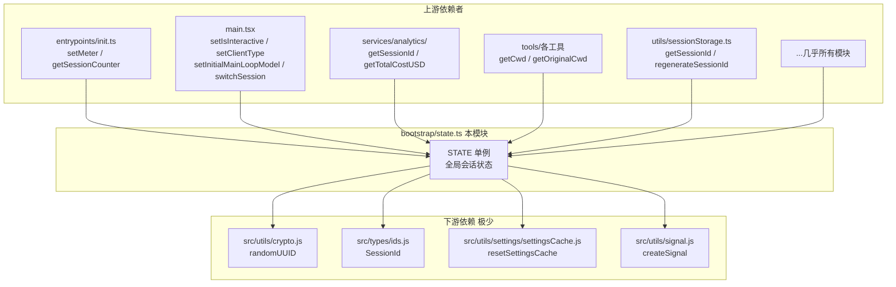

# bootstrap/state.ts — Claude Code 源码分析

> 模块路径：`src/bootstrap/`
> 核心职责：维护整个 Claude Code 会话的全局单例状态，是系统唯一的状态中枢，提供所有模块读写会话级数据的统一接口
> 源码版本：v2.1.88

## 一、模块概述（是什么）

`src/bootstrap/` 目录当前只有一个文件：`state.ts`（约 700 行）。它是 Claude Code 最基础的全局状态模块，在整个导入图的最底层（叶节点），不依赖任何其他内部模块（设计为「bootstrap 隔离」）。

该模块的核心是一个名为 `STATE` 的模块级对象，包含约 80 个字段，覆盖以下类别：

| 类别 | 字段示例 |
|------|---------|
| **会话标识** | `sessionId`、`parentSessionId`、`originalCwd`、`projectRoot` |
| **模型状态** | `initialMainLoopModel`、`mainLoopModelOverride`、`modelStrings`、`modelUsage` |
| **交互模式** | `isInteractive`、`kairosActive`、`userMsgOptIn`、`clientType` |
| **成本统计** | `totalCostUSD`、`totalAPIDuration`、`totalLinesAdded`/`Removed` |
| **遥测基础设施** | `meter`、`meterProvider`、`loggerProvider`、`eventLogger`、`tracerProvider` |
| **会话缓存** | `invokedSkills`、`planSlugCache`、`systemPromptSectionCache` |
| **Prompt Cache 状态** | `promptCache1hEligible`、`afkModeHeaderLatched`、`fastModeHeaderLatched` |
| **权限控制** | `sessionBypassPermissionsMode`、`sessionTrustAccepted`、`registeredHooks` |
| **插件/技能** | `inlinePlugins`、`allowedChannels`、`allowedSettingSources` |

模块文件顶部的注释 `// DO NOT ADD MORE STATE HERE - BE JUDICIOUS WITH GLOBAL STATE`（不要在这里添加更多状态——对全局状态要谨慎）体现了核心设计约束。

## 二、架构设计（为什么这么设计）

### 2.1 核心类 / 接口 / 函数

**`State` 类型**（`src/bootstrap/state.ts:45`）
约 80 个字段的大型对象类型，严格区分「会话持久化」与「仅会话内有效」两类字段（后者在注释中标注 `Session-only`）。

**`getInitialState()` 函数**（`src/bootstrap/state.ts:260`）
工厂函数，返回状态的初始值。`sessionId` 在此处通过 `randomUUID()` 生成，`originalCwd`/`cwd`/`projectRoot` 通过 `realpathSync(cwd())` 解析符号链接后归一化（`.normalize('NFC')`）。

**`STATE` 常量**（`src/bootstrap/state.ts:429`）
模块级单例，只初始化一次。注释 `// AND ESPECIALLY HERE` 强调这是最不应随意修改的地方。

**`regenerateSessionId()` 函数**（`src/bootstrap/state.ts:435`）
切换会话 ID（如用户执行 `/clear` 命令后创建新会话）。可选地将当前 ID 存为 `parentSessionId`，清理对应的 `planSlugCache` 条目，并重置 `sessionProjectDir` 为 `null`（使后续操作重新推导路径）。

**`ChannelEntry` 类型**（`src/bootstrap/state.ts:37`）
插件频道/服务器条目的联合类型，包含 `kind: 'plugin' | 'server'`，以及 `dev?: boolean` 标志（用于开发频道的 allowlist 旁路）。

### 2.2 模块依赖关系图



### 2.3 关键数据流

**会话生命周期中的状态变更**

```
进程启动
    │
    ▼
STATE = getInitialState()
    │  sessionId = randomUUID()
    │  originalCwd = realpathSync(cwd()).normalize('NFC')
    │  isInteractive = false (默认)
    │  clientType = 'cli' (默认)
    │
    ▼
main() 执行
    │  setIsInteractive(true/false)
    │  setClientType('cli'/'sdk-cli'/'remote'/...)
    │  setInitialMainLoopModel(model)
    │
    ▼
用户执行 /clear（新对话）
    │  regenerateSessionId({ setCurrentAsParent: true })
    │    → STATE.parentSessionId = 旧 sessionId
    │    → STATE.sessionId = randomUUID()
    │    → STATE.planSlugCache.delete(旧 sessionId)
    │    → STATE.sessionProjectDir = null
    │
    ▼
API 调用完成
    │  STATE.totalCostUSD += response.cost
    │  STATE.totalAPIDuration += duration
    │  STATE.modelUsage[modelName].inputTokens += ...
    │  STATE.lastApiCompletionTimestamp = Date.now()
    │
    ▼
进程退出
    │  STATE.inMemoryErrorLog → 可用于 /share bug report
    │  STATE.lastMainRequestId → 发送缓存驱逐提示（cache eviction hint）
```

**Prompt Cache 状态机（粘性锁存）**

```
初始状态: afkModeHeaderLatched = null

首次进入 auto 模式
    └─► afkModeHeaderLatched = true (设置后永不变回 false)

此后即使用户切换出 auto 模式：
    └─► afkModeHeaderLatched 仍为 true
    └─► 每次 API 请求仍发送 AFK_MODE_BETA_HEADER

目的：防止 ~50-70K token prompt cache 因模式切换被失效
```

## 三、核心实现走读（怎么做的）

### 3.1 关键流程（编号步骤式）

**初始状态构建**

1. `getInitialState()` 调用 `cwd()` 获取原始工作目录
2. 尝试 `realpathSync(rawCwd)` 解析符号链接（macOS CloudStorage 挂载可能抛出 EPERM，此时回退使用原始路径）
3. 对路径调用 `.normalize('NFC')` 统一 Unicode 规范化形式（防止 macOS HFS+ 与其他系统之间的路径比较问题）
4. `sessionId` 通过 `randomUUID()` 生成（使用 `src/utils/crypto.js` 的间接导入，支持浏览器 SDK 构建的多态替换）
5. `allowedSettingSources` 初始化为所有五个来源：`userSettings`、`projectSettings`、`localSettings`、`flagSettings`、`policySettings`

**遥测计数器的延迟绑定**

6. 初始状态下所有计数器为 `null`（`sessionCounter`、`locCounter`、`tokenCounter` 等）
7. `initializeTelemetryAfterTrust()` 调用后，`setMeterState()` 异步初始化 OpenTelemetry `Meter`
8. `createAttributedCounter()` 工厂为每个计数器创建 `AttributedCounter` 包装，在 `add()` 时动态调用 `getTelemetryAttributes()` 获取最新属性（而非在创建时捕获）
9. 计数器设置完成后，`getSessionCounter()?.add(1)` 递增会话计数

**Prompt Cache 锁存字段的工作原理**

10. 多个 `*Latched` 字段（`afkModeHeaderLatched`、`fastModeHeaderLatched`、`cacheEditingHeaderLatched`、`thinkingClearLatched`）设计为「粘性开关」（只能从 `null/false` 变为 `true`，不可逆）
11. 一旦某个 beta header 被首次激活，对应锁存字段设为 `true`
12. 之后每次 API 请求，即使当前模式已变更，仍检查锁存字段决定是否发送 header
13. 目的：避免 ~50-70K token 的 prompt cache 因用户临时切换模式而被失效，节省 API 成本

**会话 ID 与追踪的关系**

14. `sessionId` 用于会话文件命名（`~/.claude/projects/<cwd>/<sessionId>.jsonl`）、遥测事件标记、API 请求关联
15. `parentSessionId` 在 `/clear` 后记录前序会话 ID，用于追踪「plan mode → implementation」会话链
16. `promptId` 在每个用户输入时生成，关联该轮次的所有 OTel 事件（方便按 prompt 维度聚合诊断数据）

### 3.2 重要源码片段（带中文注释）

**工作目录的符号链接解析（`src/bootstrap/state.ts:261-276`）**
```typescript
function getInitialState(): State {
  let resolvedCwd = ''
  if (typeof process !== 'undefined' && typeof realpathSync === 'function') {
    const rawCwd = cwd()
    try {
      // 解析符号链接并统一 Unicode 规范化（NFC）
      // 防止 macOS HFS+ 与 Linux 间的路径比较不一致
      resolvedCwd = realpathSync(rawCwd).normalize('NFC')
    } catch {
      // File Provider EPERM（CloudStorage 挂载时每个路径组件都会 lstat）
      // 回退到原始路径
      resolvedCwd = rawCwd.normalize('NFC')
    }
  }
```

**多来源设置允许列表（`src/bootstrap/state.ts:313-319`）**
```typescript
// 默认允许所有五个设置来源
// --setting-sources 标志可以覆盖此列表（如仅允许 flagSettings）
allowedSettingSources: [
  'userSettings',      // ~/.claude/settings.json
  'projectSettings',   // .claude/settings.json（项目根目录）
  'localSettings',     // .claude/settings.local.json
  'flagSettings',      // --settings 标志指定的设置
  'policySettings',    // MDM/Enterprise 策略设置
],
```

**会话 ID 重新生成（`src/bootstrap/state.ts:435-448`）**
```typescript
export function regenerateSessionId(
  options: { setCurrentAsParent?: boolean } = {},
): SessionId {
  if (options.setCurrentAsParent) {
    STATE.parentSessionId = STATE.sessionId  // 记录会话链
  }
  // 清理旧 session 对应的 plan slug 缓存条目（防止 Map 积累陈旧键）
  STATE.planSlugCache.delete(STATE.sessionId)
  STATE.sessionId = randomUUID() as SessionId
  // null = 让 getTranscriptPath() 从 originalCwd 重新推导
  STATE.sessionProjectDir = null
  return STATE.sessionId
}
```

**遥测计数器的动态属性绑定（`src/entrypoints/init.ts:314-330`）**
```typescript
// 在 add() 时动态获取属性，而非在创建时捕获快照
// 确保属性（如 model、sessionId）始终是最新值
const createAttributedCounter = (name: string, options: MetricOptions) => {
  const counter = meter?.createCounter(name, options)
  return {
    add(value: number, additionalAttributes: Attributes = {}) {
      const currentAttributes = getTelemetryAttributes() // 每次都查询当前值
      counter?.add(value, { ...currentAttributes, ...additionalAttributes })
    },
  }
}
```

**`ChannelEntry` 联合类型（`src/bootstrap/state.ts:37-39`）**
```typescript
// 'plugin' 类型走 marketplace 验证 + GrowthBook allowlist
// 'server' 类型总是 allowlist 失败（schema 仅支持 plugin 类型）
// dev?: true 可以绕过 allowlist（仅开发者使用 --dangerously-load-development-channels）
export type ChannelEntry =
  | { kind: 'plugin'; name: string; marketplace: string; dev?: boolean }
  | { kind: 'server'; name: string; dev?: boolean }
```

### 3.3 设计模式分析

**模块级单例（Module Singleton）**
`STATE` 是一个模块级常量（`const STATE: State = getInitialState()`），利用 Node.js/Bun 的模块缓存保证全局唯一性。相比类单例（`getInstance()` 模式），模块单例更简洁，且天然与模块系统集成，无需手动管理实例生命周期。

**Bootstrap 隔离（Bootstrap Isolation Pattern）**
`state.ts` 通过 ESLint 规则 `custom-rules/bootstrap-isolation` 强制要求：该文件只能通过 `src/` 路径别名导入其他文件，不能使用相对路径导入内部业务模块（`./` 和 `/` 前缀被禁止）。唯一的例外是 `src/utils/crypto.js`，使用路径别名导入正是为了支持浏览器 SDK 构建中的同名替换（`package.json` 的 `browser` 字段）。

**粘性锁存（Sticky Latch）**
`afkModeHeaderLatched`、`fastModeHeaderLatched` 等字段实现了不可逆的布尔开关。这是一种专门为 HTTP prompt cache 设计的模式：cache key 的稳定性比单次请求的精确性更重要（一次不必要的 beta header 比 cache miss 的成本低得多）。字段初始化为 `null`（而非 `false`），允许区分「从未触发」与「已触发并锁定」两种状态，方便诊断首次触发的时机。

**防御性 null 检查**
遥测计数器全部初始化为 `null`，使用时均用可选链 `?.add()`，例如 `getSessionCounter()?.add(1)`。这确保了在遥测未初始化（单测、`--bare` 模式、初始化失败）时，调用计数器不会抛出错误，实现了「fail-open」的遥测降级策略。

## 四、高频面试 Q&A

### 设计决策题

**Q1：`bootstrap/state.ts` 为什么被设计为「叶节点」（不依赖任何其他内部业务模块）？**

这是为了防止循环依赖（circular dependency）。`state.ts` 被几乎所有内部模块引用（工具、命令、服务、分析等）。如果 `state.ts` 反过来导入任何业务模块，就会产生循环依赖，导致模块在求值时依赖尚未完成求值的另一个模块，产生 `undefined` 导入错误。通过强制 `state.ts` 只依赖极少数基础工具（`randomUUID`、类型定义、信号工具），整个导入图保持有向无环。`bootstrap-isolation` ESLint 规则自动检测并阻止任何破坏这个约束的改动。

**Q2：为什么 `originalCwd` 和 `cwd` 是两个独立字段？**

`originalCwd`（以及 `projectRoot`）在启动时设置一次，后续不变，用于：会话文件路径（`.claude/projects/<originalCwd>/<sessionId>.jsonl`）、`CLAUDE.md` 文件查找、技能发现等「项目身份」相关操作。`cwd` 则跟随用户的 `cd` 操作（由 `setCwd()` 更新），用于工具的实际文件系统操作。分离两者可以正确处理「用户在会话中切换目录」的场景：会话仍属于原始项目，但 Bash 工具在当前目录下执行命令。

### 原理分析题

**Q3：`STATE.allowedSettingSources` 的作用是什么？`--setting-sources` 标志如何影响它？**

该字段控制哪些配置来源对当前会话有效，这是企业安全策略的核心机制之一。默认包含全部五个来源。`--setting-sources` 标志（由 `setAllowedSettingSources()` 写入）可以限制为子集，例如 `--setting-sources flagSettings` 只使用 `--settings` 标志提供的配置，忽略所有磁盘上的配置文件。`getSettingsForSource()` 等配置读取函数在返回数据前会检查当前来源是否在允许列表中。这允许 SDK 调用者完全控制 Claude Code 看到的配置，防止宿主机的用户配置干扰 SDK 的预期行为。

**Q4：`promptId` 和 `sessionId` 的区别是什么？各自用于什么目的？**

`sessionId` 是整个对话的 UUID，对应一个 `.jsonl` 文件，会话恢复（`--resume`）基于它。`promptId` 是每次用户输入时生成的 UUID，生命周期是「一次轮次」（一个 user message → N 个 assistant message + tool calls）。`sessionId` 用于会话管理（存储、恢复、遥测聚合）；`promptId` 用于诊断（在 OTel 追踪中将一次用户请求的所有 API 调用、工具调用、钩子执行关联在一起），适合按单次提示维度调试性能问题。

**Q5：`lastMainRequestId` 和 `lastApiCompletionTimestamp` 存储在 state 中，在进程退出时有什么用？**

`lastMainRequestId` 在进程退出时发送「缓存驱逐提示」（cache eviction hint）给 Anthropic 推理服务。由于 prompt cache 的 TTL 约为 5 分钟，而用户可能短时间内重新启动 Claude Code，提前通知推理服务这个会话结束了，可以让服务更主动地释放缓存内存。`lastApiCompletionTimestamp` 配合 `tengu_api_success` 事件中的 `timeSinceLastApiCallMs` 字段，帮助区分「由缓存 TTL 到期导致的 cache miss」与「仅因重试退避导致的延迟」，精确归因 cache miss 的原因。

### 权衡与优化题

**Q6：遥测计数器（如 `sessionCounter`）为什么使用自定义的 `AttributedCounter` 包装类型，而不是直接存储 OpenTelemetry 的 `Counter` 对象？**

`AttributedCounter` 的 `add()` 方法每次调用都动态执行 `getTelemetryAttributes()` 获取当前遥测属性（包括 `sessionId`、`model`、`clientType` 等），而非在创建时捕获快照。这解决了一个问题：OTel 的 `Meter` 必须在 `init()` 阶段早期创建（以便工具调用时可用），但 `sessionId`、`model` 等属性在 `init()` 完成时还未确定（需要用户通过信任对话框或命令行参数指定）。动态查询确保了每个遥测事件都包含最新的属性值，避免了「用旧值初始化 counter，后续属性变更但事件仍带旧属性」的问题。

**Q7：`inMemoryErrorLog` 字段保存在内存中而不是写入磁盘，有什么优缺点？**

优点：写入磁盘的错误日志可能包含敏感信息（文件路径、用户提示词、API 响应内容），持久化日志存在隐私风险。内存日志随进程退出而消失，更安全。此外，磁盘写入引入延迟和 I/O 风险，不应在错误处理路径中出现（防止因磁盘满而产生级联错误）。缺点：进程崩溃时内存日志丢失，无法诊断崩溃原因。设计取舍是：`inMemoryErrorLog` 主要为 `/share` bug report 功能服务（用户手动触发时将近期错误附在报告中），而非崩溃诊断。崩溃场景应通过 OTel traces（发送到 Anthropic 服务端）或系统级崩溃报告处理。

### 实战应用题

**Q8：如果你需要在 `State` 中添加一个跟踪「当前会话累计工具调用次数」的字段，你会如何设计？**

根据 `state.ts` 顶部的「不要随意添加全局状态」原则，首先确认这是会话级统计（不同于 `AppStateStore` 的 UI 状态或工具级状态），适合放在 `State` 中。实现方式：
```typescript
// 在 State 类型中添加（与其他计数字段放在一起）
totalToolCallCount: number

// 在 getInitialState() 中初始化
totalToolCallCount: 0

// 导出 getter/setter（保持封装）
export function getTotalToolCallCount(): number {
  return STATE.totalToolCallCount
}
export function incrementToolCallCount(): void {
  STATE.totalToolCallCount++  // 简单自增，无需不可变更新
}
```
注意：计数器使用直接自增而非不可变更新（`{ ...STATE, count: STATE.count + 1 }`），因为 `State` 是模块级单例，不需要 Redux 式的不可变性（没有订阅者监听 State 变化，不会触发重渲染）。

**Q9：如何利用 `bootstrap/state.ts` 中的状态在多个模块之间共享会话信息，而不产生循环依赖？**

正确的模式是：所有模块都「单向」依赖 `bootstrap/state.ts`（导入 getter/setter），而 `state.ts` 不导入任何业务模块。例如：

- 工具执行后更新成本：`tools/BashTool.ts` 导入 `addCost()` from `state.ts`，调用 `addCost(response.cost)`
- 分析模块读取当前成本：`services/analytics/` 导入 `getTotalCostUSD()` from `state.ts`
- 两个模块之间没有直接依赖，通过 `state.ts` 中介共享数据

若需要模块间通知（如成本更新后更新 UI），不能通过 `state.ts` 引入回调（会产生依赖），而应使用 `createSignal()` 或 `AppStateStore` 的订阅机制（UI 层），或通过 `React` 的状态管理在组件树中传递变化。

---

> **版权声明**：源码版权归 [Anthropic](https://www.anthropic.com) 所有，本文档基于 Claude Code v2.1.88 npm 发布包的 source map 还原版本分析，仅供学习研究使用。文档内容采用 [CC BY-NC 4.0](https://creativecommons.org/licenses/by-nc/4.0/) 协议。
