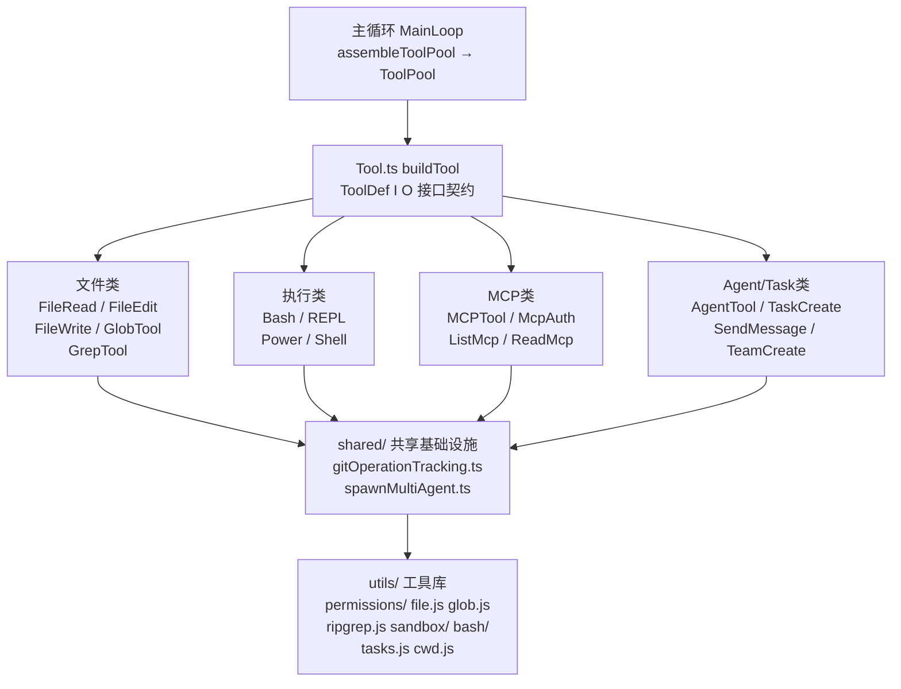
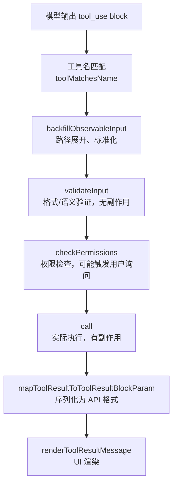

# 工具系统总览 — Claude Code 源码分析

> 模块路径：`src/tools/`
> 核心职责：统一管理所有内置工具的注册、权限检查与执行生命周期
> 源码版本：v2.1.88

## 一、模块概述

Claude Code 的工具系统是整个 AI 代理能力的基础设施层。它通过统一的 `ToolDef` 接口定义了 40+ 个内置工具，涵盖文件操作、命令执行、Agent 协作、MCP 集成、会话控制等各个维度。工具系统的核心设计理念是：**每个工具是一个独立的、可组合的单元**，拥有完整的生命周期（描述生成 → 输入验证 → 权限检查 → 执行 → 结果渲染）。

所有工具通过 `buildTool()` 工厂函数构建，满足 `ToolDef` 类型约束，最终由 `assembleToolPool()` 汇聚成工具池，注入到主循环（main loop）中供模型调用。

## 二、架构设计

### 2.1 核心类/接口/函数

**`ToolDef<I, O>`** — 工具定义接口（核心契约）

定义一个工具所需的全部方法与属性：`name`（工具名）、`inputSchema`（输入模式）、`outputSchema`（输出模式）、`call()`（执行逻辑）、`checkPermissions()`（权限检查）、`validateInput()`（输入验证）、`renderToolUseMessage()` / `renderToolResultMessage()`（UI 渲染）等。接口采用 TypeScript 泛型 `<I, O>` 分别约束输入输出类型，利用 `satisfies` 关键字在实现时获得类型推断。

**`buildTool(def)`** — 工具构建工厂函数

位于 `src/Tool.js`，接收满足 `ToolDef` 接口的对象，返回 `Tool` 实例。工厂函数执行必要的元数据绑定（名称、模式懒加载等），并附加默认实现（如 `isConcurrencySafe()` 默认返回 `false`、`isReadOnly()` 默认返回 `false`）。

**`ToolUseContext`** — 工具执行上下文

工具 `call()` 方法的第二个参数，提供运行时依赖注入：
- `getAppState()` — 获取全局应用状态
- `setAppState()` — 更新全局应用状态
- `readFileState` — 文件读取时间戳 Map（防止脏写）
- `abortController` — 取消信号
- `agentId` — 当前 Agent ID（若在 Agent 上下文中运行）

**`lazySchema()`** — 懒加载模式包装器

工具的 `inputSchema` 和 `outputSchema` 使用 getter + `lazySchema()` 实现懒加载：首次访问时才执行 Zod 模式构建，避免模块加载时的性能开销。

**`assembleToolPool()`** — 工具池装配函数

位于 `src/tools.js`，将所有内置工具和 MCP 动态工具合并为工具池数组，按照模式（plan / auto / bypass）过滤出可用工具集，注入主循环。

### 2.2 模块依赖关系图



### 2.3 关键数据流

工具调用完整数据流：



## 三、核心实现走读

### 3.1 关键流程

**工具注册流程：**

1. 各工具目录（如 `FileReadTool/`）导出满足 `ToolDef` 接口的常量对象
2. `buildTool()` 工厂函数绑定元数据并附加默认实现
3. `src/tools.js` 中的 `assembleToolPool()` 导入所有内置工具，合并 MCP 动态工具
4. 主循环（`main-loop.tsx`）调用 `assembleToolPool()` 获取工具池
5. 工具池以数组形式传递给 Anthropic API 的 `tools` 参数

**权限检查流程：**

1. `checkPermissions()` 接收 `input` 和 `context`，访问 `context.getAppState().toolPermissionContext`
2. 工具依据当前权限模式（`auto` / `plan` / `bypass`）和用户配置规则做判定
3. 返回 `PermissionDecision`：`allow`（放行）、`ask`（询问用户）、`deny`（拒绝）
4. 文件类工具调用 `checkReadPermissionForTool()` / `checkWritePermissionForTool()` 统一处理
5. 命令类工具（BashTool）调用 `bashToolHasPermission()` 进行前缀匹配/通配符匹配

**生命周期完整序列：**

1. 模型产生 `tool_use` 内容块 → 识别工具名
2. `backfillObservableInput()` — 规范化输入（路径展开等）
3. `validateInput()` — 语义校验，返回 `ValidationResult`（`{ result: true/false, message?, errorCode? }`）
4. `checkPermissions()` — 权限决策
5. 用户确认（若 `behavior: 'ask'`）
6. `call()` — 执行，产生 `{ data: O }` 或抛出异常
7. `mapToolResultToToolResultBlockParam()` — 转换为 `ToolResultBlockParam`
8. `renderToolResultMessage()` — 渲染 UI 组件

### 3.2 重要源码片段

**`utils.ts` — 消息标记工具函数（`src/tools/utils.ts`）**

```typescript
// 将用户消息打标签，使其在工具调用解析前保持瞬态状态
// 防止"正在运行"消息在 UI 中重复显示
export function tagMessagesWithToolUseID(
  messages: (UserMessage | AttachmentMessage | SystemMessage)[],
  toolUseID: string | undefined,
): (UserMessage | AttachmentMessage | SystemMessage)[] {
  if (!toolUseID) return messages
  return messages.map(m => {
    if (m.type === 'user') {
      return { ...m, sourceToolUseID: toolUseID }  // 不可变更新
    }
    return m
  })
}
```

**`shared/gitOperationTracking.ts` — Git 操作检测（`src/tools/shared/gitOperationTracking.ts`）**

```typescript
// 构建能容忍 git 全局选项的正则（如 git -c commit.gpgsign=false commit）
function gitCmdRe(subcmd: string, suffix = ''): RegExp {
  return new RegExp(
    `\\bgit(?:\\s+-[cC]\\s+\\S+|\\s+--\\S+=\\S+)*\\s+${subcmd}\\b${suffix}`,
  )
}

// 扫描命令+输出，检测值得展示的 git 操作
export function detectGitOperation(command: string, output: string) {
  // 检测 commit、push、cherry-pick、merge、rebase、PR 操作
  // 避免误匹配 git log 输出中的 SHA 或 URL
}
```

**`shared/spawnMultiAgent.ts` — Teammate 模型解析（`src/tools/shared/spawnMultiAgent.ts`）**

```typescript
// 解析 teammate 模型值，处理 'inherit' 别名
// 'inherit' 从 frontmatter 传入，表示继承 leader 模型
export function resolveTeammateModel(
  inputModel: string | undefined,
  leaderModel: string | null,
): string {
  if (inputModel === 'inherit') {
    return leaderModel ?? getDefaultTeammateModel(leaderModel)
  }
  return inputModel ?? getDefaultTeammateModel(leaderModel)
}
```

### 3.3 设计模式分析

**模板方法模式（Template Method）**

`ToolDef` 接口定义了工具生命周期的"骨架"，各个具体工具实现各步骤。主循环按固定顺序调用 `validateInput → checkPermissions → call → mapToolResultToToolResultBlockParam`，具体行为由工具自定义。

**策略模式（Strategy）**

权限检查是可插拔的策略。文件类工具使用 `checkReadPermissionForTool`/`checkWritePermissionForTool`，命令类工具使用 `bashToolHasPermission`，MCP 工具使用 passthrough 策略。各策略实现相同接口，可在运行时替换。

**工厂模式（Factory）**

`buildTool()` 是工具工厂，屏蔽了默认值填充、元数据绑定等细节，调用者只需提供差异化实现。

**懒加载模式（Lazy Initialization）**

所有工具的 `inputSchema` 和 `outputSchema` 通过 getter + `lazySchema()` 实现懒加载，Zod 模式只在首次访问时构建，避免模块级副作用。

## 四、高频面试 Q&A

### 设计决策题

**Q1：为什么工具接口使用 `ToolDef` + `buildTool()` 工厂，而不是类继承？**

A：有三个关键原因。首先，TypeScript 的结构类型系统使接口比类继承更灵活，工具可以是纯对象字面量，不需要 `extends` 语法；其次，`satisfies ToolDef<I, O>` 关键字在编译期验证实现完整性，同时保留字面量类型推断（若用 `as ToolDef` 则会丢失具体类型）；最后，工厂函数可在不侵入具体工具代码的情况下附加横切关注点（如日志、默认值填充），符合开闭原则。

**Q2：`validateInput()` 和 `checkPermissions()` 都能拒绝工具调用，为什么要分开？**

A：两者有本质区别。`validateInput()` 是**无副作用的语义验证**，检查输入是否在逻辑上合理（文件是否存在、字符串是否找到、参数格式是否合法），只访问状态不修改状态。`checkPermissions()` 是**有副作用的授权决策**，可能触发权限规则查询、用户对话框，并记录权限决定到 `toolPermissionContext`。分离允许主循环在不同阶段应用不同策略（比如在权限检查前先做验证，失败则跳过权限询问）。

### 原理分析题

**Q3：`lazySchema()` 解决了什么实际问题？**

A：工具模式（Zod schema）构建会产生内存分配和计算开销。若在模块顶层立即构建，所有工具的模式在程序启动时就会全部初始化，形成不必要的启动开销。特别是 Claude Code 作为 CLI 工具，快速启动很重要。`lazySchema()` 包装 getter 属性，使模式只在第一次被访问时才构建，实现按需加载。

**Q4：工具的 `maxResultSizeChars` 属性有什么作用？**

A：控制工具输出的最大字符数，超过此限制的结果会被持久化到磁盘（`toolResultStorage`），并在 API 请求中用引用替代完整内容。这解决了两个问题：防止超大输出填满 Claude 的上下文窗口，以及避免重复传输相同的大型内容（如大文件内容）。不同工具根据典型输出大小设置不同阈值：GrepTool 为 20,000（内容搜索结果通常较大），其余多数为 100,000。

**Q5：`backfillObservableInput()` 在工具生命周期中的作用是什么？**

A：在权限检查和钩子（hooks）调用之前规范化用户输入，使后续处理基于一致的格式。主要做路径展开（`expandPath()`），将 `~`、相对路径转换为绝对路径，防止通过路径变体绕过 allowlist 白名单规则。例如 `~/secret` 和 `/home/user/secret` 在白名单匹配时是等价的，必须在检查前统一。

### 权衡与优化题

**Q6：工具系统如何平衡安全性与灵活性？**

A：通过分层防御实现。第一层是 `validateInput()` 的语义验证，拒绝明显无意义的输入；第二层是 `checkPermissions()` 的权限决策，结合用户配置的 allowlist/denylist 规则；第三层是工具内部的安全检查（如 FileEditTool 中 UNC 路径跳过、BashTool 中的 AST 解析安全检查）；第四层是沙箱（SandboxManager）进一步隔离命令执行。灵活性体现在：每层都可以被用户配置覆盖，`bypass` 权限模式下跳过大多数检查，适应自动化场景。

**Q7：为什么 Git 操作追踪（gitOperationTracking）放在 `shared/` 而不是 BashTool 内部？**

A：因为 PowerShellTool 也需要追踪 git 操作。`shared/` 目录存放跨工具共享的基础设施。Git 操作检测基于命令文本的正则匹配，与具体 Shell 无关（Bash 和 PowerShell 都以相同的 argv 语法调用 git/gh），因此可以复用同一套检测逻辑。

### 实战应用题

**Q8：如何给 Claude Code 添加一个自定义工具？**

A：按照 `ToolDef<I, O>` 接口实现工具定义，创建新目录（如 `src/tools/MyTool/`），在主文件中用 `buildTool({...}) satisfies ToolDef<InputSchema, OutputSchema>` 构建，然后在 `src/tools.js` 的 `assembleToolPool()` 中导入并添加到工具数组。关键实现点：定义 `inputSchema`（使用 `lazySchema()` 包装）、实现 `call()` 方法、实现 `checkPermissions()` 权限逻辑、实现 `renderToolUseMessage()` UI 渲染。

**Q9：工具执行失败时，系统如何向模型传递错误信息？**

A：有三种路径。第一，`validateInput()` 返回 `{ result: false, message: '...' }` 时，主循环将 `message` 格式化为 `tool_result` 块返回给模型，模型可据此调整输入重试；第二，`call()` 抛出异常时，框架捕获异常并调用 `renderToolUseErrorMessage()` 渲染错误 UI，同时构造包含错误信息的 `tool_result` 块；第三，工具返回 `{ data: ... }` 但结果表示失败（如 `exitCode: 1`），工具在 `mapToolResultToToolResultBlockParam()` 中将失败信息序列化，模型从结果内容中理解失败原因。

---
> **版权声明**：源码版权归 [Anthropic](https://www.anthropic.com) 所有，本文档基于 Claude Code v2.1.88 source map 还原版本分析，仅供学习研究使用。文档内容采用 [CC BY-NC 4.0](https://creativecommons.org/licenses/by-nc/4.0/) 协议。
