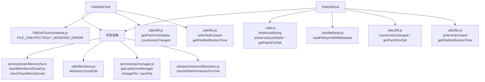

# 文件类工具-写入与编辑 — Claude Code 源码分析

> 模块路径：`src/tools/FileWriteTool/`、`src/tools/FileEditTool/`
> 核心职责：FileWriteTool 负责全量覆盖写入文件，FileEditTool 负责精确的字符串替换编辑
> 源码版本：v2.1.88

## 一、模块概述

写入与编辑是代码修改能力的核心，也是风险最高的两类操作。Claude Code 设计了两种截然不同的文件修改工具：

- **FileWriteTool** — 接收完整文件内容，整体覆盖写入（适合新建文件或完全重写）
- **FileEditTool** — 接收 `old_string` + `new_string`，精确替换（适合局部修改，节省 token）

两者均实现了完整的脏写防护（时间戳 + 内容比对）、LSP 通知（触发编辑器诊断）、文件历史备份、技能目录发现等横切功能。

**核心差异对比：**

| 维度 | FileWriteTool | FileEditTool |
|------|--------------|-------------|
| 输入 | `file_path` + `content`（全量） | `file_path` + `old_string` + `new_string` |
| Token 消耗 | 高（需传完整内容） | 低（仅传差异片段） |
| 适用场景 | 新建文件、完整重写 | 局部修改、追加、删除 |
| 先决条件 | 无（可直接创建） | 文件必须已存在且已读取 |
| 安全约束 | 不能创建已存在文件（除非已读取） | 必须先完整读取文件 |

## 二、架构设计

### 2.1 核心类/接口/函数

**`FileEditTool`** — 字符串替换编辑工具

实现了 `validateInput()` → `call()` 两阶段执行模型，`validateInput()` 完成所有只读验证（文件存在、字符串可找到、无歧义匹配等），`call()` 只做原子性的"读取-修改-写入"操作。通过 `findActualString()` 处理引号风格规范化，通过 `preserveQuoteStyle()` 保持原文件的引号习惯。

**`FileWriteTool`** — 全量写入工具

相比 FileEditTool 更简单，核心是 `call()` 中的原子写入：读取现有内容（若文件存在）→ 生成 diff → 写入 → 更新 `readFileState`。

**`findActualString(file, oldString)`** — 智能字符串查找（`src/tools/FileEditTool/utils.ts`）

在文件内容中查找与 `oldString` 等价的字符串，处理弯引号（`"`/`"`）和直引号（`"`）之间的差异，解决 AI 输出引号形式与源代码不匹配的常见问题。

**`getPatchForEdit({ filePath, fileContents, oldString, newString, replaceAll })`** — 差异计算函数

执行实际替换并计算 unified diff patch，供 UI 展示和行变更统计使用。

**`readFileForEdit(absoluteFilePath)`** — 同步文件读取（FileEditTool 内部）

在 `call()` 的原子操作段内使用同步读取（避免异步操作打断原子性），同时返回编码（UTF-8/UTF-16LE）和行尾风格（LF/CRLF），确保写回时保持原始格式。

### 2.2 模块依赖关系图



### 2.3 关键数据流

**FileEditTool 两阶段执行：**

```mermaid
flowchart TD
    subgraph P1["Phase 1: validateInput() — 无副作用验证"]
        V1[checkTeamMemSecrets\n拒绝写入密钥] --> V2[old_string === new_string?\n拒绝无意义操作]
        V2 --> V3[denyRule / UNC 路径检查]
        V3 --> V4[文件大小 > 1GiB?\n拒绝防 OOM]
        V4 --> V5[文件不存在 + old_string 非空?\n拒绝提示相似文件]
        V5 --> V6[文件是 .ipynb?\n拒绝引导 NotebookEditTool]
        V6 --> V7[readFileState 无记录?\n拒绝未读取]
        V7 --> V8[时间戳比读取时间新?\n拒绝文件已被修改]
        V8 --> V9[findActualString 找不到?\n拒绝]
        V9 --> V10[多处匹配 + replace_all=false?\n拒绝歧义]
    end

    subgraph P2["Phase 2: call() — 原子性写入"]
        C1[discoverSkillDirsForPaths\n发现新技能目录] --> C2[diagnosticTracker.beforeFileEdited\n诊断预备]
        C2 --> C3[mkdir 确保父目录存在]
        C3 --> C4[fileHistoryTrackEdit\n备份预编辑内容]
        C4 --> C5[readFileForEdit 同步重读\n原子性保障]
        C5 --> C6[时间戳二次检查\n防并发修改]
        C6 --> C7[findActualString + preserveQuoteStyle\n规范化]
        C7 --> C8[getPatchForEdit\n计算替换内容和 diff]
        C8 --> C9[writeTextContent 写入磁盘]
        C9 --> C10[lspManager.changeFile + saveFile\n通知 LSP]
        C10 --> C11[notifyVscodeFileUpdated\n通知 VSCode diff 视图]
        C11 --> C12[更新 readFileState\n新内容 + 新时间戳]
    end

    P1 --> P2
```



## 三、核心实现走读

### 3.1 关键流程

**脏写保护的双重检查：**

FileEditTool 对文件时间戳做了两次检查：第一次在 `validateInput()` 中（异步，用于给用户友好提示），第二次在 `call()` 中 `writeTextContent()` 之前（同步，原子操作段内，用于最终防线）。两次检查都有 Windows 特殊处理——Windows 上云同步、杀毒软件可能在不改变内容的情况下更新时间戳，因此对"完整读取"（无 offset/limit）还会做内容比对兜底。

**原子性写入的设计：**

`call()` 注释明确标注"请避免在此处和写入磁盘之间进行异步操作以保证原子性"。关键的"读取-比较-写入"序列使用同步 API（`readFileSyncWithMetadata`）而非异步 API，防止在两次 `await` 之间被并发编辑插入。

**LSP 通知机制：**

文件写入后立即向 LSP 服务器发送两个通知：`changeFile()`（触发 `textDocument/didChange`）和 `saveFile()`（触发 `textDocument/didSave`）。TypeScript 语言服务器在 `didSave` 后才触发完整诊断，这确保了写入后错误提示即时更新。通知失败时仅记录日志，不影响主流程（LSP 是增强功能，非核心依赖）。

### 3.2 重要源码片段

**FileEditTool 关键验证逻辑（`src/tools/FileEditTool/FileEditTool.ts`）**

```typescript
async validateInput(input: FileEditInput, toolUseContext: ToolUseContext) {
  const { file_path, old_string, new_string, replace_all = false } = input
  const fullFilePath = expandPath(file_path)

  // 安全检查：拒绝向团队记忆文件写入密钥
  const secretError = checkTeamMemSecrets(fullFilePath, new_string)
  if (secretError) return { result: false, message: secretError, errorCode: 0 }

  // 验证编辑有实际效果
  if (old_string === new_string)
    return { result: false, behavior: 'ask',
      message: 'No changes to make: old_string and new_string are exactly the same.' }

  // 文件大小保护（防止 V8 OOM）
  const { size } = await fs.stat(fullFilePath)
  if (size > MAX_EDIT_FILE_SIZE)  // 1 GiB
    return { result: false, message: `File too large...` }
}
```

**FileEditTool 原子写入段（`src/tools/FileEditTool/FileEditTool.ts`）**

```typescript
// 2. 加载当前状态并确认自上次读取以来无变化
// 请避免在此处和写入磁盘之间进行异步操作以保证原子性
const { content: originalFileContents, fileExists, encoding, lineEndings: endings }
  = readFileForEdit(absoluteFilePath)  // 同步读取！

if (fileExists) {
  const lastWriteTime = getFileModificationTime(absoluteFilePath)
  const lastRead = readFileState.get(absoluteFilePath)
  if (!lastRead || lastWriteTime > lastRead.timestamp) {
    // Windows 特殊处理：时间戳变化但内容未变时放行
    const isFullRead = lastRead?.offset === undefined && lastRead?.limit === undefined
    const contentUnchanged = isFullRead && originalFileContents === lastRead.content
    if (!contentUnchanged) throw new Error(FILE_UNEXPECTEDLY_MODIFIED_ERROR)
  }
}
```

**多处匹配拒绝逻辑（`src/tools/FileEditTool/FileEditTool.ts`）**

```typescript
const matches = file.split(actualOldString).length - 1

// 多处匹配且未明确指定 replace_all 时，要求用户提供更多上下文
if (matches > 1 && !replace_all) {
  return {
    result: false, behavior: 'ask',
    message: `Found ${matches} matches of the string to replace, but replace_all is false. ` +
      `To replace all occurrences, set replace_all to true. ` +
      `To replace only one occurrence, please provide more context.`,
    meta: { isFilePathAbsolute: String(isAbsolute(file_path)), actualOldString },
    errorCode: 9,
  }
}
```

### 3.3 设计模式分析

**两阶段提交（Two-Phase Commit）**

FileEditTool 的 `validateInput()`（只读验证）+ `call()`（有副作用写入）是两阶段提交的变体。第一阶段确认所有前提条件满足，第二阶段执行不可逆操作。两阶段之间可能存在时间差（用户确认对话框等），因此第二阶段开始时重新验证时间戳（防止第一阶段检查后、第二阶段执行前文件被外部修改）。

**乐观锁（Optimistic Locking）**

时间戳检查机制是乐观锁的实现：不阻止并发读取，但在写入前检查版本（时间戳），冲突时回滚（抛出 `FILE_UNEXPECTEDLY_MODIFIED_ERROR`）并要求重新读取。适合低冲突场景（AI 工具调用频率远低于数据库事务）。

**门卫模式（Guard Clause）**

`validateInput()` 中大量使用提前返回（early return）的门卫模式，每个验证条件独立处理，避免深层嵌套。每个失败路径都有明确的 `errorCode`，便于调试和测试。

## 四、高频面试 Q&A

### 设计决策题

**Q1：FileEditTool 为什么不允许在"未读取文件"的情况下编辑？**

A：这是核心安全约束，防止 AI 在没有完整上下文的情况下修改文件。如果 AI 没有读取文件，它可能：提供错误的 `old_string`（文件内容不符合预期）；在不了解文件结构的情况下破坏格式；对文件内容做出错误假设。强制先读取确保了 AI 有充分信息做出正确的编辑决策。`readFileState` Map 作为"读取凭证"，未读取的文件没有凭证，直接拒绝编辑（errorCode: 6）。

**Q2：为什么 FileEditTool 在 `validateInput()` 和 `call()` 中都做时间戳检查？**

A：防御性分层设计，两次检查的目的不同。`validateInput()` 检查：给用户提供早期失败的友好提示，此时还未产生副作用（文件备份等），可以安全地终止并建议"请重新读取文件"；`call()` 检查：最后防线，处理 `validateInput()` 通过后、`call()` 执行前的时间窗口内文件被修改的情况（如：用户在 AI 等待确认时手动编辑了文件）。

### 原理分析题

**Q3：`findActualString()` 如何解决引号不匹配问题？**

A：AI 生成的代码中经常出现弯引号（`"`/`"`/`'`/`'`）和直引号（`"`/`'`）的混用问题，这是因为 AI 训练数据包含大量使用弯引号的自然语言文档。`findActualString()` 在查找 `old_string` 时，会尝试多种引号等价替换：将 `old_string` 中的直引号替换为弯引号版本，以及反向替换，在文件中分别查找。若找到等价匹配，返回文件中实际存在的字符串（保持原始引号风格），避免引号差异导致的"字符串未找到"错误。

**Q4：`readFileForEdit()` 为什么使用同步读取而不是异步？**

A：在 `call()` 的原子操作段内，使用异步读取（`await fs.readFile()`）会在等待期间将控制权交回事件循环，允许其他 I/O 操作（包括其他工具调用）插入。若两次 `await` 之间有并发的文件写入，原子性就被破坏了。同步读取（`readFileSyncWithMetadata()`）不会让出控制权，"读取-比较-写入"序列作为一个不可分割的单元执行。这是刻意在注释中提醒的设计决策。

**Q5：FileEditTool 如何处理 `replace_all` 模式？**

A：`replace_all: true` 时，验证阶段允许多处匹配（跳过歧义检查），执行阶段调用 `String.replaceAll(actualOldString, actualNewString)` 替换所有出现。差异在结果消息上也有体现：`mapToolResultToToolResultBlockParam()` 对 `replace_all` 返回"All occurrences were successfully replaced"。注意：`replace_all` 仍然要求 `old_string` 至少存在一处匹配，完全找不到时仍然返回错误。

### 权衡与优化题

**Q6：FileWriteTool 和 FileEditTool 在 token 效率上如何取舍？**

A：核心权衡是"上下文携带量"与"精确性"。FileWriteTool 需要在输入中携带完整文件内容（对大文件可能是几千 token），但对新建文件或完全重写而言是必要的。FileEditTool 只需携带修改片段（通常几十到几百 token），但需要更复杂的验证逻辑（脏写检测、字符串查找）。Claude Code 的最佳实践是：新文件用 FileWriteTool，已有文件的局部修改用 FileEditTool。对于超过 2000 行的大文件修改，FileEditTool 的 token 优势尤为显著。

**Q7：LSP 通知失败会影响核心功能吗？**

A：不会。LSP 通知在 `.catch()` 中只记录日志，不会抛出异常或中断写入流程。LSP 集成是增强功能（IDE 内的实时诊断），不是核心依赖。即使 LSP 服务器未运行（`getLspServerManager()` 返回 null），写入依然正常完成。这体现了"核心路径不依赖可选组件"的设计原则。

### 实战应用题

**Q8：在实际使用中，如何选择使用 FileWriteTool 还是 FileEditTool？**

A：选择依据：若修改面积超过文件的 60% 或需要新建文件，选 FileWriteTool；若修改是局部的（函数修改、变量重命名、代码块替换），选 FileEditTool。典型 FileEditTool 场景：修复一个函数中的 bug、修改配置文件中的某个值、在文件末尾追加代码（用 `old_string` 匹配文件最后几行）。典型 FileWriteTool 场景：生成新组件文件、重构后完全重写某个模块、根据模板生成配置文件。

**Q9：如果 FileEditTool 报错"File has been modified since read"，正确的处理流程是什么？**

A：这是脏写保护触发。正确流程：先调用 FileReadTool 重新读取该文件（获取最新内容），然后重新分析差异，构建新的 `old_string`/`new_string`，再次调用 FileEditTool。错误原因通常是：外部 linter（如 Prettier、ESLint）自动格式化了文件，或者多个并发的 Agent 工具在竞争写入同一文件。对于后者，应确保编辑同一文件的操作串行执行，避免并发冲突。

---
> **版权声明**：源码版权归 [Anthropic](https://www.anthropic.com) 所有，本文档基于 Claude Code v2.1.88 source map 还原版本分析，仅供学习研究使用。文档内容采用 [CC BY-NC 4.0](https://creativecommons.org/licenses/by-nc/4.0/) 协议。
