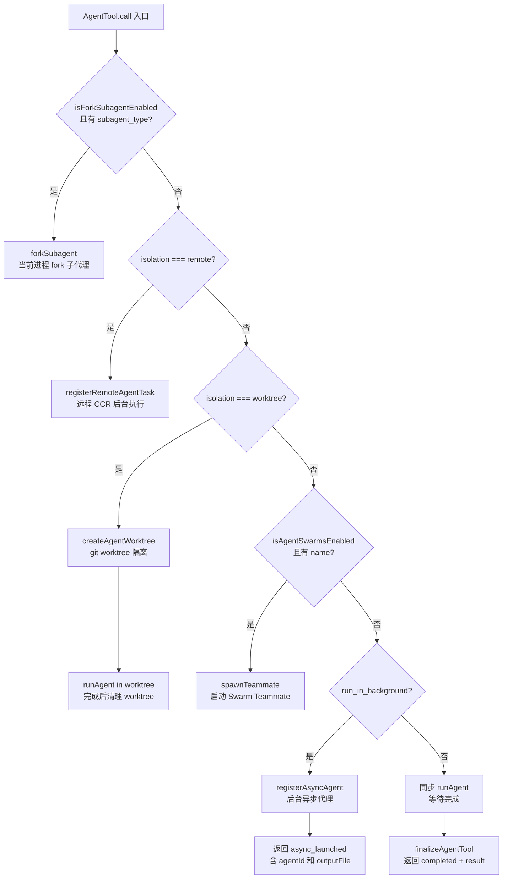

# Agent 任务类工具 — Claude Code 源码分析

> 模块路径：`src/tools/AgentTool/`、`src/tools/TaskCreateTool/`、`src/tools/TaskGetTool/`、`src/tools/TaskListTool/`、`src/tools/TaskOutputTool/`、`src/tools/TaskStopTool/`、`src/tools/TaskUpdateTool/`、`src/tools/SendMessageTool/`
> 核心职责：启动和管理子代理（Agent），通过任务系统（Task）跟踪进度，通过邮箱（Mailbox）实现 Agent 间通信
> 源码版本：v2.1.88

## 一、模块概述

Agent 任务类工具是 Claude Code 多代理（multi-agent）协作能力的基础设施，分为两个层次：

**Agent 层（AgentTool/SendMessageTool）** — 控制 Agent 的生命周期与通信
- `AgentTool` — 创建并运行子代理，支持同步/异步/后台模式，支持 worktree 隔离和远程执行
- `SendMessageTool` — 在 Agent 之间传递结构化消息（关闭请求、计划批准、任意文本）

**任务层（TaskCreate/Get/List/Output/Stop/Update）** — TodoV2 任务管理系统
- 对应 `isTodoV2Enabled()` 特性标志，是 TodoWriteTool 的下一代替代品
- 提供持久化的任务状态跟踪，支持任务间依赖（blocks/blockedBy）

两层设计分离了"Agent 执行"（AgentTool）和"任务状态管理"（Task 工具），前者是计算层，后者是数据层。

## 二、架构设计

### 2.1 核心类/接口/函数

**`AgentTool`** — 子代理编排工具

输入模式支持 `prompt`（任务描述）、`subagent_type`（代理类型）、`model`（模型覆盖）、`run_in_background`（异步模式）、`isolation`（隔离模式：`worktree` 或 `remote`）、`cwd`（工作目录覆盖）、`name`（代理命名）、`mode`（权限模式）。多代理参数（`name`、`team_name`、`mode`）仅在 Agent 蜂群（swarm）模式下可用。

**`resolveTeammateModel(inputModel, leaderModel)`** — 模型继承解析

处理 `'inherit'` 模型别名：子代理继承父代理的模型，若 leader 模型尚未确定则回退到默认模型（`getHardcodedTeammateModelFallback()`）。

**`SendMessageTool`** — Agent 间消息传递工具

消息使用 `StructuredMessage` 判别联合类型（discriminated union）：`shutdown_request`（请求关闭）、`shutdown_response`（批准/拒绝关闭）、`plan_approval_response`（计划批准响应）。消息通过 `writeToMailbox()` 写入目标 Agent 的邮箱目录，目标 Agent 轮询读取。

**`TaskCreateTool`** — 任务创建工具（TodoV2）

创建带状态（`pending`/`in_progress`/`completed`）、依赖关系（`blocks`/`blockedBy`）的持久任务。`shouldDefer: true` 表示工具调用需要用户确认后才执行（延迟确认模式）。`isEnabled()` 检查 `isTodoV2Enabled()` 特性标志，在旧系统（TodoWriteTool）和新系统（Task 工具组）之间互斥。

**`getTask(id, taskListId)`** — 任务查询（`src/utils/tasks.js`）

TaskGet/Update/Stop 的共同底层函数，基于任务列表 ID 和任务 ID 检索任务状态。

### 2.2 模块依赖关系图

```
AgentTool.tsx
    │
    ├─ tasks/LocalAgentTask/     ← 本地异步代理任务
    │  LocalAgentTask.ts
    ├─ tasks/RemoteAgentTask/    ← 远程 CCR 执行
    │  RemoteAgentTask.ts
    ├─ utils/worktree.ts         ← Git worktree 隔离
    ├─ utils/agentContext.ts     ← 代理上下文管理
    ├─ shared/spawnMultiAgent.ts ← Teammate 生成（swarm 模式）
    ├─ runAgent.ts               ← 代理执行循环
    ├─ forkSubagent.ts           ← Fork 子代理实现
    └─ loadAgentsDir.ts          ← 自定义代理定义加载

SendMessageTool.ts
    ├─ utils/teammateMailbox.ts  ← 邮箱读写
    ├─ utils/peerAddress.ts      ← 对等地址解析
    └─ tasks/InProcessTeammateTask/ ← 进程内 Teammate 查找

TaskCreateTool.ts ─────────────────────┐
TaskGetTool.ts    ──────────────────── ├─ utils/tasks.ts
TaskListTool.ts   ──────────────────── │  (createTask, getTask,
TaskUpdateTool.ts ──────────────────── │   listTasks, updateTask,
TaskStopTool.ts   ──────────────────── │   stopTask, isTodoV2Enabled)
TaskOutputTool.ts ─────────────────────┘
```

### 2.3 关键数据流

**AgentTool 执行路径决策树：**

```
AgentTool.call()
    │
    ├─ isForkSubagentEnabled() && subagent_type?
    │   └─ forkSubagent() → 在当前进程中 fork 子代理
    │
    ├─ isolation === 'remote'?
    │   └─ registerRemoteAgentTask() → 远程 CCR 执行（后台）
    │
    ├─ isolation === 'worktree'?
    │   └─ createAgentWorktree() → git worktree 创建
    │       └─ runAgent() in worktree context
    │
    ├─ isAgentSwarmsEnabled() && name?
    │   └─ spawnTeammate() → 启动 Swarm Teammate
    │
    ├─ run_in_background?
    │   └─ registerAsyncAgent() → 后台异步代理
    │       └─ 返回 { status: 'async_launched', agentId, outputFile }
    │
    └─ 同步执行
        └─ runAgent() → 等待完成
            └─ 返回 { status: 'completed', result }
```



**SendMessageTool 消息路由：**

```
SendMessageTool.call({ to, message })
    │
    ├─ to === 'leader' → TEAM_LEAD_NAME
    ├─ to === 'broadcast' → 所有 teammates
    ├─ to === '@agent-name' → 按名称查找 AgentId
    └─ to 是 AgentId → 直接路由
    │
    └─ writeToMailbox(targetAgentId, message)
        → 写入 ~/.claude/mailboxes/{agentId}/inbox/
```

```mermaid
flowchart TD
    S[SendMessageTool.call\nto + message] --> R{to 目标解析}
    R -- leader --> T1[TEAM_LEAD_NAME\n领队代理]
    R -- broadcast --> T2[所有 Teammates\n群发]
    R -- @agent-name --> T3[按名称查找 AgentId\nInProcessTeammateTask]
    R -- AgentId --> T4[直接路由\n已知目标]
    T1 --> W[writeToMailbox\n写入目标邮箱]
    T2 --> W
    T3 --> W
    T4 --> W
    W --> MB[~/.claude/mailboxes\n/{agentId}/inbox/\n带时间戳的 JSON 文件]
    MB --> P[目标 Agent 轮询读取\n按时间戳顺序处理]
```

## 三、核心实现走读

### 3.1 关键流程

**AgentTool 的多模式执行：**

1. `call()` 首先检查是否满足各种特殊执行路径条件（fork、remote、worktree、swarm）
2. 若需要 worktree 隔离：调用 `createAgentWorktree()` 创建 git worktree，在 worktree 路径下运行代理，完成后通过 `removeAgentWorktree()` 清理（无论成功失败）
3. 若是后台模式：`registerAsyncAgent()` 创建异步代理任务，立即返回 `async_launched` 状态，包含 `outputFile` 路径供后续检查进度
4. 同步模式：`runAgent()` 在当前线程中运行完整的代理对话循环，等待完成后返回结果
5. 代理完成后，调用 `finalizeAgentTool()` 处理输出截断、结果提取、进度摘要生成

**TaskCreateTool 生命周期：**

1. `call()` 检查 `isTodoV2Enabled()` — 只在新任务系统下激活
2. 调用 `createTask({ subject, description, activeForm, metadata })` 在任务列表中创建记录
3. 执行 `executeTaskCreatedHooks()` — 触发任务创建钩子（可自定义回调）
4. 返回 `{ task: { id, subject } }`，调用者可用 `id` 后续查询/更新任务
5. `shouldDefer: true` 意味着此工具调用在主线程中需要用户确认

### 3.2 重要源码片段

**AgentTool 输入模式分层设计（`src/tools/AgentTool/AgentTool.tsx`）**

```typescript
// 基础模式：同步代理参数
const baseInputSchema = lazySchema(() => z.object({
  description: z.string().describe('A short (3-5 word) description of the task'),
  prompt: z.string().describe('The task for the agent to perform'),
  subagent_type: z.string().optional(),
  model: z.enum(['sonnet', 'opus', 'haiku']).optional(),
  run_in_background: z.boolean().optional(),
}))

// 完整模式：合并多代理参数与隔离模式
const fullInputSchema = lazySchema(() => {
  const multiAgentInputSchema = z.object({
    name: z.string().optional(),
    team_name: z.string().optional(),
    mode: permissionModeSchema().optional(),
  })
  return baseInputSchema().merge(multiAgentInputSchema).extend({
    isolation: z.enum(['worktree']).optional(),
    cwd: z.string().optional(),
  })
})
```

**SendMessageTool 结构化消息类型（`src/tools/SendMessageTool/SendMessageTool.ts`）**

```typescript
// 使用判别联合类型确保消息结构完整性
const StructuredMessage = lazySchema(() =>
  z.discriminatedUnion('type', [
    z.object({ type: z.literal('shutdown_request'), reason: z.string().optional() }),
    z.object({ type: z.literal('shutdown_response'),
      request_id: z.string(), approve: semanticBoolean(), reason: z.string().optional() }),
    z.object({ type: z.literal('plan_approval_response'),
      request_id: z.string(), /* ... */ }),
  ])
)
```

**TaskGetTool 的 TodoV2 特性门控（`src/tools/TaskGetTool/TaskGetTool.ts`）**

```typescript
export const TaskGetTool = buildTool({
  shouldDefer: true,
  // 仅在 TodoV2 启用时激活（与 TodoWriteTool 互斥）
  isEnabled() { return isTodoV2Enabled() },
  async call({ taskId }, context) {
    const taskListId = getTaskListId(context)
    const task = await getTask(taskId, taskListId)
    return { data: { task } }
  },
})
```

### 3.3 设计模式分析

**策略模式（Strategy）**

AgentTool 的执行路径是策略模式：fork、remote、worktree、swarm、async、sync 六种策略，根据输入参数和特性标志在运行时选择。每种策略有独立的实现模块，AgentTool 作为上下文（Context）选择合适的策略执行。

**邮箱模式（Mailbox / Actor Model）**

SendMessageTool 实现了简化的 Actor 模型：每个 Agent 有独立的邮箱（文件系统目录），发送者通过邮箱写入消息，接收者轮询读取。这种异步、解耦的通信方式避免了直接引用（不需要持有目标 Agent 的引用），支持跨进程、跨主机通信。

**特性开关（Feature Toggle）**

Task 工具组使用 `isTodoV2Enabled()` 特性开关控制启用，`TodoWriteTool` 在 `isEnabled()` 中检查 `!isTodoV2Enabled()`，两者严格互斥。这种设计支持渐进式迁移——在特性标志翻转前，系统行为完全不变。

## 四、高频面试 Q&A

### 设计决策题

**Q1：AgentTool 为什么提供 worktree 隔离模式？**

A：worktree 隔离解决了并发代理写入冲突问题。当主代理让多个子代理并行工作（如同时修改前端和后端代码）时，不隔离的情况下所有代理共享同一个工作目录，文件修改相互干扰，可能产生无法预期的合并冲突。worktree 模式为每个子代理创建独立的 git worktree（同一仓库的独立检出目录），子代理的修改只在自己的 worktree 中进行，完成后由主代理决定是否将修改合并回主分支。远程执行（`isolation: 'remote'`）则更进一步，在完全独立的 CCR 环境中运行，适合风险较高的操作。

**Q2：TodoV2（Task 工具组）相比 TodoWriteTool 有什么优势？**

A：设计理念的根本差异。TodoWriteTool 是"全量替换"模式——每次更新必须传入完整的 todo 列表，无法做细粒度操作（如只更新单个任务的状态）。Task 工具组提供 CRUD 操作：`TaskCreate`（创建单个任务）、`TaskUpdate`（更新单个任务状态）、`TaskStop`（停止任务）、`TaskGet`（查询单个任务）、`TaskList`（列出所有任务），各操作原子独立。同时 Task 系统支持任务依赖关系（`blocks`/`blockedBy`），表达"A 完成前 B 不能开始"的约束，TodoWriteTool 无此能力。

### 原理分析题

**Q3：AgentTool 的 `run_in_background` 如何实现异步通知？**

A：后台代理通过 `registerAsyncAgent()` 注册，立即返回 `{ status: 'async_launched', agentId, outputFile }`，`outputFile` 是代理输出写入的磁盘路径。代理在独立任务（`LocalAgentTask`）中运行，完成时调用 `completeAsyncAgent()` 或 `failAsyncAgent()` 更新任务状态，并通过 `enqueueAgentNotification()` 将完成通知加入主循环的消息队列。主循环在下一次迭代中看到通知，将其作为新的用户消息注入对话，触发模型继续处理。

**Q4：SendMessageTool 的邮箱目录在哪里？如何防止消息丢失？**

A：邮箱目录在 `~/.claude/mailboxes/{agentId}/inbox/`，每条消息是一个带时间戳的 JSON 文件。写入使用原子操作（写临时文件 → rename），避免读取端看到半写状态。Agent 轮询邮箱时按文件名（时间戳）顺序处理，处理后删除文件。若 Agent 崩溃，未处理的消息文件留在磁盘，重启后可以继续处理（持久性）。接收端会检查消息中的 `request_id` 进行关联，避免重复处理相同请求（幂等性）。

**Q5：`subagent_type` 如何路由到不同的代理定义？**

A：`subagent_type` 对应 `loadAgentsDir.ts` 中加载的代理定义（`AgentDefinition`），包括内置代理（`GENERAL_PURPOSE_AGENT` 等）和用户自定义代理（从 `~/.claude/agents/` 目录加载）。路由逻辑：先检查是否匹配 `ONE_SHOT_BUILTIN_AGENT_TYPES`（一次性内置代理）；再通过 `filterAgentsByMcpRequirements()` 过滤出满足 MCP 需求的代理；若为自定义代理，解析 frontmatter 获取模型、系统提示等配置。特性标志 `isForkSubagentEnabled()` 开启时，`subagent_type` 会通过 fork 机制启动，而非完整的 Agent 对话循环。

### 权衡与优化题

**Q6：Agent 蜂群（swarm）模式和异步后台代理有什么区别？**

A：两者面向不同协作场景。**蜂群模式**（`isAgentSwarmsEnabled()`）使用 tmux pane 或进程间通信（IPC），每个 Teammate 在独立的终端 pane 中运行，有独立的视觉标识（颜色），通过 SendMessageTool 通信，适合需要持续交互的长期并行任务（如多个 Agent 共同开发一个项目）。**异步后台代理**（`run_in_background`）是轻量的一次性并行任务，在主进程内以 `LocalAgentTask` 运行，完成后通知主代理，适合独立的短时并行子任务（如同时分析多个模块）。前者更重但更灵活，后者更轻量但功能受限。

**Q7：worktree 创建和清理是否有异常安全保证？**

A：是的，通过 try-finally 保证。`call()` 中使用如下模式：`const worktreePath = await createAgentWorktree(...)；try { result = await runAgent(worktreePath) } finally { await removeAgentWorktree(worktreePath) }`。即使代理执行中抛出异常，worktree 也会被清理。`hasWorktreeChanges()` 函数在清理前检查 worktree 是否有未合并的修改，若有则先通知主代理是否保留修改。这确保了不会在系统中留下孤立的 worktree 目录。

### 实战应用题

**Q8：如何使用 AgentTool 实现并行代码分析任务？**

A：对独立模块的分析任务，使用后台代理并行执行：同时调用多个 `AgentTool`（设 `run_in_background: true`），每个代理分析不同模块，主代理继续处理其他工作或等待通知。通知到达后，通过 `outputFile` 读取各代理的分析结果并汇总。关键点：各后台代理的 `description` 应简洁清晰（3-5 词），`prompt` 要明确分析范围和输出格式，避免各代理结果格式不统一导致汇总困难。若各分析涉及写入操作，使用 `isolation: 'worktree'` 避免文件冲突。

**Q9：TaskCreate 和 TodoWriteTool 在实际使用中如何迁移？**

A：TodoWriteTool 使用全局 `todos` 数组（按 `sessionId` 或 `agentId` 分区），一次调用替换全部 todo 列表。TaskCreateTool 使用持久化的任务列表（`taskListId` 基于上下文），通过 CRUD 操作管理。迁移时：不再需要在每次更新时传递完整列表；可以通过 `TaskUpdate` 单独更新某个任务的状态而不影响其他任务；新增了任务间依赖表达能力。两个系统通过 `isTodoV2Enabled()` 特性标志互斥，系统内不会同时存在两个 todo 系统，迁移过程中用户体验无断层。

---
> **版权声明**：源码版权归 [Anthropic](https://www.anthropic.com) 所有，本文档基于 Claude Code v2.1.88 source map 还原版本分析，仅供学习研究使用。文档内容采用 [CC BY-NC 4.0](https://creativecommons.org/licenses/by-nc/4.0/) 协议。
