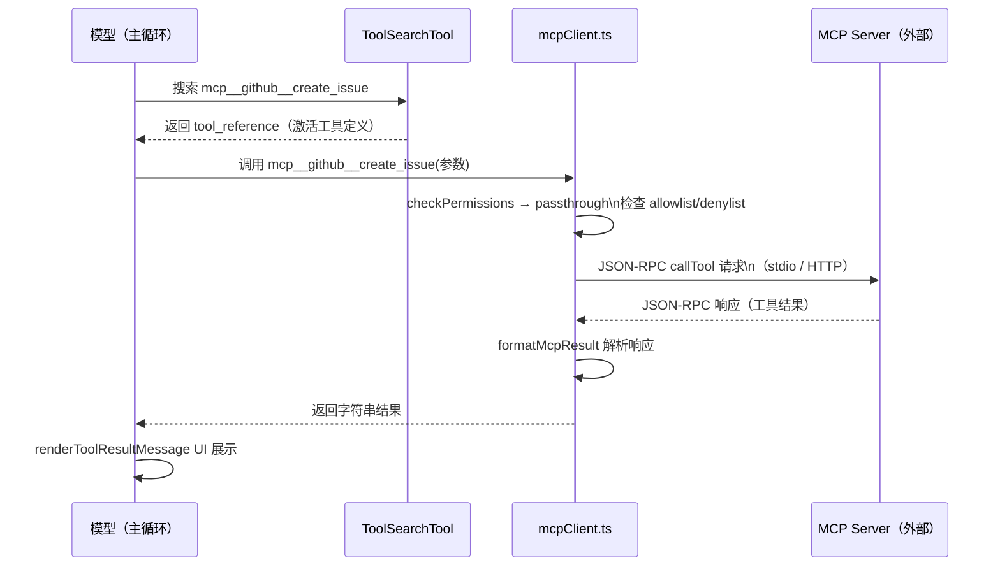

# MCP 类工具 — Claude Code 源码分析

> 模块路径：`src/tools/MCPTool/`、`src/tools/ListMcpResourcesTool/`、`src/tools/ReadMcpResourceTool/`、`src/tools/McpAuthTool/`
> 核心职责：作为 MCP（Model Context Protocol）协议的客户端，动态加载并执行外部 MCP 服务器提供的工具和资源
> 源码版本：v2.1.88

## 一、模块概述

MCP（Model Context Protocol）是 Anthropic 提出的开放协议，允许第三方服务器向 AI 模型暴露工具、资源和提示词。Claude Code 的 MCP 类工具是这一协议的客户端实现：

- **MCPTool** — MCP 工具的基础模板，每个动态 MCP 工具都是 MCPTool 的实例（在 `mcpClient.ts` 中用实际工具名/参数/调用逻辑覆盖）
- **ListMcpResourcesTool** — 列出所有已连接 MCP 服务器提供的资源（URI 列表）
- **ReadMcpResourceTool** — 读取指定 URI 的 MCP 资源内容
- **McpAuthTool** — 处理 MCP 服务器的 OAuth 认证流程

这四个工具协同工作，形成完整的 MCP 生命周期：认证（McpAuth） → 发现资源（ListMcpResources） → 读取资源（ReadMcpResource） → 调用工具（MCPTool 实例）。

## 二、架构设计

### 2.1 核心类/接口/函数

**`MCPTool`** — MCP 工具基础模板

定义了 MCP 工具的通用骨架：`isMcp: true` 标志、`passthrough` 权限策略（权限由 MCP 客户端层管理）、透传的输入/输出模式（`z.object({}).passthrough()`，允许任意 MCP 自定义参数）。`name`、`description`、`call()` 等核心方法在 `mcpClient.ts` 中用实际 MCP 工具定义覆盖。

**`mcpClient.ts` 中的动态工具注册**（`src/services/mcp/mcpClient.ts`）

每个 MCP 服务器连接后，`mcpClient.ts` 为其每个工具创建 MCPTool 的定制实例：覆盖 `name`（格式为 `mcp__{serverName}__{toolName}`）、`description()`、`call()`（委托给 MCP 服务器执行）。这些动态工具通过 `assembleToolPool()` 注入主循环，与内置工具无缝混合。

**`ListMcpResourcesTool`** — 资源列举工具

调用 `ensureConnectedClient()` 确认服务器已连接，再通过 `fetchResourcesForClient()` 获取资源列表。`isReadOnly()` 和 `isConcurrencySafe()` 均为 `true`，可安全并发调用。`shouldDefer: true` 需要用户确认（MCP 资源访问是外部操作）。

**`McpAuthTool`** — OAuth 认证工具

处理 MCP 服务器的 OAuth 2.0 认证流程，引导用户完成浏览器授权 → 获取 code → 换取 token 的完整流程。

### 2.2 模块依赖关系图

```
MCPTool（基础模板）
    │
    └─ services/mcp/mcpClient.ts  ← 动态覆盖 name/description/call
        ├─ MCP SDK (@modelcontextprotocol/sdk)
        ├─ services/mcp/client.ts    ← 连接管理
        └─ services/mcp/mcpTypes.ts  ← 协议类型定义

ListMcpResourcesTool
    └─ services/mcp/client.ts
        ├─ ensureConnectedClient()   ← 连接保障
        └─ fetchResourcesForClient() ← 资源获取

ReadMcpResourceTool
    └─ services/mcp/client.ts
        └─ readResource(uri)         ← 资源内容读取

McpAuthTool
    └─ services/mcp/oauth.ts         ← OAuth 流程
        └─ browser auth → code → token

ToolSearchTool（协同工具）
    └─ 在 deferred tools 中搜索 mcp__ 前缀工具
       在模型需要特定 MCP 工具时，从延迟加载池中激活
```

### 2.3 关键数据流

**MCP 工具调用完整流程：**

```
模型决定调用 mcp__github__create_issue
    ↓
ToolSearchTool（若工具为延迟加载状态）
    → 解析 mcp__github__ 前缀，激活 github 服务器工具
    ↓
MCPTool 实例（由 mcpClient.ts 定制）
    ├─ checkPermissions() → MCPTool 基类返回 passthrough
    │   → mcpClient.ts 层处理实际权限（用户 allowlist）
    ↓
call() → MCP SDK 发送工具调用请求到 GitHub MCP 服务器
    ↓
MCP 服务器响应（JSON-RPC over stdio/HTTP）
    ↓
mcpClient.ts 解析响应 → 返回字符串结果
    ↓
renderToolResultMessage() → UI 展示
```



## 三、核心实现走读

### 3.1 关键流程

**MCPTool 的"空实现 + 运行时覆盖"模式：**

`MCPTool` 在源码中是一个占位符（placeholder），`call()` 返回 `{ data: '' }`，`description()` 返回占位描述，`name` 是 `'mcp'`。真正的工具在 `mcpClient.ts` 中动态创建：

```typescript
// mcpClient.ts（概念性）
const dynamicTool = {
  ...MCPTool,  // 继承基础骨架
  name: `mcp__${serverName}__${toolName}`,
  description: async () => mcpToolDef.description,
  inputSchema: buildZodSchema(mcpToolDef.inputSchema),
  call: async (input) => {
    const result = await mcpServer.callTool(toolName, input)
    return { data: formatMcpResult(result) }
  }
}
```

**延迟加载（Deferred Tools）与 ToolSearchTool 协同：**

MCP 工具数量可能很大（一个 GitHub MCP 服务器有 30+ 工具），全部注入工具池会显著增加每次 API 调用的提示词 token 消耗。通过延迟加载机制，MCP 工具在未被引用时以 `isDeferredTool()` 形式存在（只有名称，无完整描述）。模型需要特定工具时，先调用 `ToolSearchTool` 搜索并激活，然后使用完整的工具定义。

**ListMcpResourcesTool 的连接保障：**

调用 `ensureConnectedClient(serverName)` 而非直接假设连接存在，处理 MCP 服务器可能断开重连的情况。若服务器未连接，尝试重新连接；若连接失败，返回明确的错误信息而非静默失败。

### 3.2 重要源码片段

**MCPTool 基础骨架（`src/tools/MCPTool/MCPTool.ts`）**

```typescript
export const MCPTool = buildTool({
  isMcp: true,
  isOpenWorld() { return false },  // 实例化后由具体工具覆盖
  name: 'mcp',                     // 运行时被覆盖为实际工具名
  maxResultSizeChars: 100_000,
  // passthrough 策略：权限由 mcpClient.ts 层处理
  async checkPermissions(): Promise<PermissionResult> {
    return { behavior: 'passthrough', message: 'MCPTool requires permission.' }
  },
  // 允许任意 MCP 自定义参数（passthrough schema）
  get inputSchema(): InputSchema { return inputSchema() },  // z.object({}).passthrough()
  async call() { return { data: '' } },  // 实例化后由具体调用逻辑覆盖
} satisfies ToolDef<InputSchema, Output>)
```

**ListMcpResourcesTool 资源列举（`src/tools/ListMcpResourcesTool/ListMcpResourcesTool.ts`）**

```typescript
export const ListMcpResourcesTool = buildTool({
  isConcurrencySafe() { return true },
  isReadOnly() { return true },
  shouldDefer: true,
  async call({ server }, { getAppState }) {
    // 支持按服务器名过滤
    const clients = server
      ? [getAppState().mcp.clients.find(c => c.name === server)].filter(Boolean)
      : getAppState().mcp.clients.filter(c => c.type === 'connected')

    const allResources = await Promise.allSettled(
      clients.map(async client => {
        await ensureConnectedClient(client.name)
        return fetchResourcesForClient(client.name)
      })
    )
    // 聚合各服务器资源，每项附加 server 字段
    return { data: allResources.flatMap(r => r.status === 'fulfilled' ? r.value : []) }
  }
})
```

**MCP 工具名解析（`src/tools/ToolSearchTool/ToolSearchTool.ts`）**

```typescript
// MCP 工具名解析：mcp__server__action → { parts: ['server', 'action'], isMcp: true }
function parseToolName(name: string) {
  if (name.startsWith('mcp__')) {
    const withoutPrefix = name.replace(/^mcp__/, '').toLowerCase()
    const parts = withoutPrefix.split('__').flatMap(p => p.split('_'))
    return { parts: parts.filter(Boolean), full: withoutPrefix, isMcp: true }
  }
  // 普通工具的 CamelCase 解析...
}
```

### 3.3 设计模式分析

**代理模式（Proxy）**

MCPTool 是 MCP 服务器工具的代理——它拦截工具调用，将其转发给外部 MCP 服务器，将响应包装后返回给调用者，调用者（模型）感知不到底层是本地工具还是远程 MCP 工具。

**模板方法模式（Template Method）**

MCPTool 定义了执行骨架（权限 passthrough、输出截断、UI 渲染），各字段（name、description、call）由 `mcpClient.ts` 在运行时填充，形成完整工具实例。

**注册表模式（Registry）**

MCP 服务器连接时，将动态工具注册到 `AppState.mcp` 中；工具池装配时（`assembleToolPool()`）从注册表读取 MCP 工具列表。注册表提供工具的统一存储和检索，避免了硬编码工具集合。

## 四、高频面试 Q&A

### 设计决策题

**Q1：为什么 MCP 工具使用 passthrough 权限而不是标准权限检查？**

A：MCP 工具的权限由两层机制共同保障，不需要 `checkPermissions()` 做工具级权限检查。第一层是 `mcpClient.ts` 在调用 MCP 服务器前检查用户的 allowlist（`alwaysAllowRules`）和 denylist（`alwaysDenyRules`），根据服务器名和工具名决定是否需要用户确认；第二层是工具调用记录（`shouldDefer: true`）要求用户批准高风险操作。passthrough 策略意味着"我不检查，但上一层已经检查过"，避免了双重权限检查造成的用户体验摩擦。

**Q2：为什么 MCP 工具名采用 `mcp__{server}__{tool}` 格式而非其他格式？**

A：这个命名约定解决了命名空间冲突和来源追溯两个问题。`mcp__` 前缀使 ToolSearchTool 能快速识别 MCP 工具（`name.startsWith('mcp__')`），双下划线分隔符支持服务器名和工具名本身包含单下划线（如 `mcp__github__create_pull_request`），不与内置工具命名（如 `FileReadTool`、`BashTool`）冲突。模型和用户都能从工具名直观理解工具的来源（哪个 MCP 服务器）和功能。

### 原理分析题

**Q3：延迟加载（Deferred Tools）机制是如何工作的？**

A：延迟工具在工具池中以轻量形式存在——只有名称（`name`），没有完整的 `description`、`inputSchema`、`call` 等实现。`isDeferredTool(tool)` 检查工具是否处于延迟状态（`tool.isDeferred === true`）。当模型需要使用特定工具时，先调用 `ToolSearchTool`（使用 `select:toolName` 或关键词搜索），ToolSearchTool 在 `mapToolResultToToolResultBlockParam()` 中返回 `tool_reference` 内容块；API 服务器端看到 `tool_reference` 后，将对应工具的完整定义注入到模型的可用工具上下文中，模型随后可以正常调用该工具。整个过程对模型透明，降低了大型 MCP 集成场景的 token 消耗。

**Q4：ReadMcpResourceTool 和 FileReadTool 的读取有什么本质区别？**

A：两者的读取对象和协议完全不同。FileReadTool 通过文件系统 API 读取本地磁盘文件，操作同步（或异步文件 I/O），资源是本地的。ReadMcpResourceTool 通过 MCP 协议向远程服务器请求资源，资源由 MCP 服务器管理（可能是数据库记录、API 响应、内存中的数据结构等），通过 URI 寻址（格式如 `github://repos/owner/repo/issues`）。MCP 资源的语义由服务器定义，Claude Code 对资源内容格式无预设，只负责转发请求和显示响应。

**Q5：McpAuthTool 的 OAuth 流程如何在命令行环境中工作？**

A：Claude Code 作为 CLI 工具，通过 "Device Authorization Grant" 或 "Authorization Code with PKCE" 等适合命令行的 OAuth 流程：显示授权 URL → 用户在浏览器中打开 → 完成授权 → 服务器重定向到本地 callback（`http://localhost:{port}`）→ McpAuthTool 在本地启动临时 HTTP 服务器监听 callback → 提取 authorization code → 通过 MCP 服务器换取 access token → 存储 token 供后续调用使用。整个流程通过 `McpAuthTool` 的 `call()` 实现，对用户显示进度提示，失败时给出明确错误信息。

### 权衡与优化题

**Q6：ToolSearchTool 的评分算法如何权衡精确匹配和语义相关性？**

A：评分权重设计体现了对工具名称结构的信任优先级。工具名精确部分匹配得分最高（MCP 工具 12 分，内置工具 10 分），因为工具名是开发者有意设计的，高度信息密集；子字符串匹配次之（MCP 6 分，内置 5 分）；`searchHint`（策划的能力短语，信号质量高于提示词）得 4 分；工具完整名的子字符串匹配 3 分；提示词（描述）中的词边界匹配最低（2 分），因为描述文本可能包含噪声词。支持 `+term` 强制包含语法，确保特定服务器或功能词必须出现。这种加权设计在实际测试中对 `slack send` → `mcp__slack__send_message` 等典型查询表现良好。

**Q7：MCP 服务器断开重连时，已注册的动态工具如何处理？**

A：通过 `AppState.mcp.clients` 中的客户端状态管理。断开的服务器状态变为 `pending`（重连中）或 `disconnected`（永久断开）。已注册的动态工具仍然存在于工具池中，但 `call()` 会先调用 `ensureConnectedClient()` 检查连接，失败时返回明确错误（"MCP server disconnected"），而非崩溃。ToolSearchTool 在搜索无结果时，会返回 `pending_mcp_servers` 字段提示哪些服务器正在重连，引导模型稍后重试。

### 实战应用题

**Q8：如何在 Claude Code 中配置和使用自定义 MCP 服务器？**

A：在 Claude Code 配置文件（`~/.claude/settings.json` 或项目级 `.claude/settings.json`）中添加 MCP 服务器配置：`{ "mcpServers": { "my-server": { "command": "node", "args": ["path/to/server.js"] } } }`。Claude Code 启动时自动连接配置的 MCP 服务器，工具以 `mcp__my-server__tool-name` 形式出现在工具池中（延迟加载）。首次使用时，模型会自动调用 ToolSearchTool 激活所需工具。如果服务器需要认证，McpAuthTool 会引导完成 OAuth 流程。

**Q9：如何排查 MCP 工具调用失败的问题？**

A：诊断步骤：首先检查 MCP 服务器是否正常运行（Claude Code 启动日志中应有连接成功信息）；其次调用 `ListMcpResourcesTool` 验证服务器是否正确连接并暴露资源；再用 ToolSearchTool 的 `select:mcp__server__tool` 语法检查工具是否可发现；若工具可找到但调用失败，查看 stderr 中的 MCP 协议错误（通常是参数格式错误或服务器端业务逻辑错误）；若是认证问题，使用 McpAuthTool 重新完成认证流程。MCP 协议使用 JSON-RPC，错误响应有标准的 `code` 和 `message` 字段，便于定位问题根源。

---
> **版权声明**：源码版权归 [Anthropic](https://www.anthropic.com) 所有，本文档基于 Claude Code v2.1.88 source map 还原版本分析，仅供学习研究使用。文档内容采用 [CC BY-NC 4.0](https://creativecommons.org/licenses/by-nc/4.0/) 协议。
