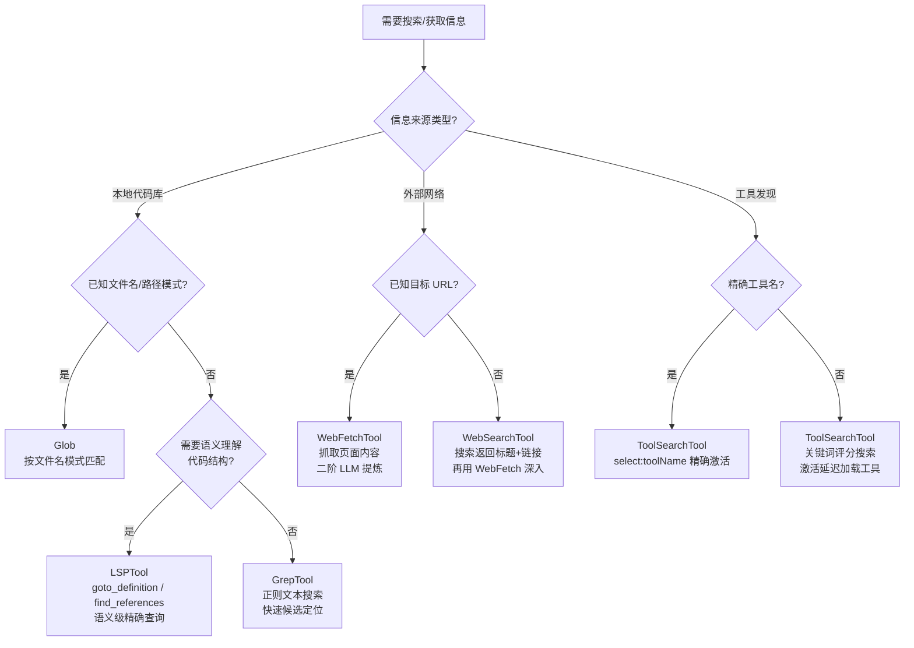

# 搜索与信息类工具 — Claude Code 源码分析

> 模块路径：`src/tools/WebFetchTool/`、`src/tools/WebSearchTool/`、`src/tools/LSPTool/`、`src/tools/ToolSearchTool/`
> 核心职责：从网络、代码语言服务和工具注册表获取外部信息，扩展 AI 的知识边界
> 源码版本：v2.1.88

## 一、模块概述

搜索与信息类工具是 Claude Code 获取外部信息的渠道，分为三类来源：

- **WebFetchTool** — 抓取网页内容，转换为 Markdown，再用 prompt 提炼关键信息（二次 LLM 处理）
- **WebSearchTool** — 调用 Anthropic 的 Beta Web Search API，返回搜索结果集合
- **LSPTool** — 通过 Language Server Protocol（LSP）查询代码语义信息（类型、引用、符号等）
- **ToolSearchTool** — 在延迟加载工具池中按关键词或精确名称搜索并激活工具

这四个工具均为只读工具（`isReadOnly()` 返回 `true`），并发安全（`isConcurrencySafe()` 返回 `true`）。



## 二、架构设计

### 2.1 核心类/接口/函数

**`WebFetchTool`** — 网页内容抓取工具

接收 `{ url, prompt }` 输入，先通过 `getURLMarkdownContent()` 将网页转为 Markdown，再调用 LLM（`applyPromptToMarkdown()`）根据用户 `prompt` 提炼关键内容，返回处理后的文本。`isPreapprovedHost()` 检查域名白名单（如 `docs.anthropic.com`），预批准的域名无需用户确认。

**`WebSearchTool`** — Web 搜索工具

调用 `@anthropic-ai/sdk` 的 Beta Web Search API（`BetaWebSearchTool20250305`），支持 `allowed_domains`/`blocked_domains` 过滤。底层通过 `queryModelWithStreaming()` 实现——将搜索请求包装为对话，让模型使用 `web_search_20250305` 内置工具执行搜索，提取工具结果块返回。搜索结果为 `{ title, url }` 数组（标题 + 链接），不含内容摘要。

**`LSPTool`** — 语言服务器协议工具

支持 8 种操作：`goto_definition`（跳转到定义）、`find_references`（查找引用）、`hover`（悬停信息）、`document_symbols`（文档符号）、`workspace_symbols`（工作区符号）、`prepare_call_hierarchy`（调用层次准备）、`incoming_calls`/`outgoing_calls`（调用图）。通过 `getLspServerManager()` 与 TypeScript 语言服务器通信，获取精确的代码语义信息。

**`ToolSearchTool`** — 工具搜索激活器

支持 `select:toolName` 精确选择和关键词搜索两种模式，对 MCP 工具名（`mcp__server__action`）和内置工具名（`CamelCase`）做分别解析。返回 `tool_reference` 内容块，触发 API 服务器端工具激活。

### 2.2 模块依赖关系图

```
WebFetchTool                    WebSearchTool
    │                               │
    ├─ utils/format.js              ├─ services/api/claude.js
    │  (formatFileSize)             │  queryModelWithStreaming()
    ├─ ./utils.js                   ├─ @anthropic-ai/sdk
    │  (getURLMarkdownContent,      │  BetaWebSearchTool20250305
    │   applyPromptToMarkdown,      └─ utils/model/model.js
    │   isPreapprovedUrl)               getSmallFastModel()
    └─ ./preapproved.js
       (isPreapprovedHost)

LSPTool                         ToolSearchTool
    │                               │
    ├─ services/lsp/manager.js      ├─ lodash-es/memoize
    │  getLspServerManager()        │  getToolDescriptionMemoized
    ├─ services/lsp/                ├─ Tool.js
    │  waitForInitialization()      │  findToolByName
    ├─ vscode-languageserver-types  └─ utils/stringUtils.js
    │  (LSP 类型定义)                   escapeRegExp
    └─ ./formatters.js              (详见文档1/MCP类工具文档)
       (格式化各 LSP 结果)
```

### 2.3 关键数据流

**WebFetchTool 二阶处理流程：**

```
输入: { url: "https://docs.example.com/api", prompt: "列出所有 API 端点" }
    ↓
权限检查: isPreapprovedHost(hostname)?
    ├─ 预批准域名 → 直接通过
    └─ 其他域名 → getRuleByContentsForTool() 查 allowlist
    ↓
第一阶段: getURLMarkdownContent(url)
    ├─ HTTP GET 请求抓取原始 HTML
    ├─ HTML → Markdown 转换（移除导航/广告等噪音）
    └─ 截断至 MAX_MARKDOWN_LENGTH（防止超大内容）
    ↓
第二阶段: applyPromptToMarkdown(markdown, prompt)
    ├─ 调用 LLM（小模型，如 Haiku）
    ├─ system: "从以下 Markdown 内容中回答用户问题"
    └─ user: markdown + "\n\n" + prompt
    ↓
输出: { result, bytes, code, codeText, durationMs, url }
```

**LSPTool 语义查询流程：**

```
输入: { operation: "goto_definition", file_path, line, column }
    ↓
validateInput()
    ├─ 文件大小检查 (< 10MB)
    ├─ 文件存在检查
    └─ LSP 服务器连接检查
    ↓
waitForInitialization() → 确保 LSP 服务器就绪
    ↓
lspManager.gotoDefinition(fileUri, { line, character: column })
    ↓
格式化结果: formatGoToDefinitionResult(result)
    → "Definition at file:path:line:column"
    ↓
输出: 人类可读的位置字符串
```

## 三、核心实现走读

### 3.1 关键流程

**WebFetchTool 的权限分层：**

权限检查首先调用 `isPreapprovedUrl(url)` 检查完整 URL 是否在白名单（如 `https://docs.anthropic.com/**`）；若不在则检查 `isPreapprovedHost(hostname)` 检查域名是否预批准；最后 `getRuleByContentsForTool()` 检查用户手动添加的 allowlist 规则。预批准的域名是 Anthropic 维护的可信域名列表，减少了对常用文档站点的重复授权摩擦。

**WebSearchTool 的"委托给模型执行搜索"模式：**

WebSearchTool 不直接调用搜索 API，而是构造一个对话，让一个小模型（`getSmallFastModel()`）使用 Anthropic 的内置 `web_search_20250305` 工具执行搜索。这个设计使 Claude Code 复用了 Anthropic 模型原生的搜索能力，同时支持 `allowed_domains`/`blocked_domains` 过滤（作为搜索指令的一部分传给模型）。搜索结果从模型响应的 `tool_result` 块中提取。

**LSPTool 的等待初始化机制：**

LSP 服务器（如 TypeScript Language Server）启动需要时间索引代码库。`waitForInitialization()` 在查询前等待 LSP 服务器完成初始化（通过 `initialized` 通知检测），最多等待一定超时时间（避免无限等待）。若初始化超时，`validateInput()` 返回友好错误提示，建议用户稍后重试。

### 3.2 重要源码片段

**WebFetchTool 权限检查（`src/tools/WebFetchTool/WebFetchTool.ts`）**

```typescript
// 从 URL 提取域名作为权限规则匹配内容
function webFetchToolInputToPermissionRuleContent(input) {
  try {
    const parsedInput = WebFetchTool.inputSchema.safeParse(input)
    if (!parsedInput.success) return `input:${input.toString()}`
    const { url } = parsedInput.data
    const hostname = new URL(url).hostname
    return `domain:${hostname}`  // 规则格式：domain:docs.anthropic.com
  } catch {
    return `input:${input.toString()}`
  }
}
```

**WebSearchTool 输入模式（`src/tools/WebSearchTool/WebSearchTool.ts`）**

```typescript
const inputSchema = lazySchema(() =>
  z.strictObject({
    query: z.string().min(2).describe('The search query to use'),
    // 域名过滤：只返回这些域名的结果
    allowed_domains: z.array(z.string()).optional(),
    // 域名排除：不返回这些域名的结果
    blocked_domains: z.array(z.string()).optional(),
  })
)
```

**LSPTool 最大文件大小限制（`src/tools/LSPTool/LSPTool.ts`）**

```typescript
// 10MB 限制：防止超大文件导致 LSP 服务器 OOM
const MAX_LSP_FILE_SIZE_BYTES = 10_000_000

// validateInput 中的检查
const fileStats = await fs.stat(absolutePath)
if (fileStats.size > MAX_LSP_FILE_SIZE_BYTES) {
  return {
    result: false,
    message: `File too large for LSP analysis (${formatFileSize(fileStats.size)})`,
  }
}
```

**ToolSearchTool MCP 工具评分（`src/tools/ToolSearchTool/ToolSearchTool.ts`）**

```typescript
// MCP 工具名称部分精确匹配权重更高（12 vs 内置工具 10）
// MCP 服务器名称是高度信息密集的标识符
if (parsed.parts.includes(term)) {
  score += parsed.isMcp ? 12 : 10
} else if (parsed.parts.some(part => part.includes(term))) {
  score += parsed.isMcp ? 6 : 5
}
// searchHint（策划能力短语）权重 4，高于描述文本（2）
if (hintNormalized && pattern.test(hintNormalized)) { score += 4 }
if (pattern.test(descNormalized)) { score += 2 }
```

### 3.3 设计模式分析

**中介者模式（Mediator）**

WebSearchTool 是模型搜索能力的中介——它不直接调用搜索 API，而是构造小模型调用，让模型"中间人"执行搜索。这种中介模式使 Claude Code 能复用 Anthropic 模型的原生能力（内置工具），无需维护独立的搜索 API 客户端。

**代理与缓存组合（Proxy + Cache）**

ToolSearchTool 中 `getToolDescriptionMemoized` 是 `memoize()` 缓存装饰的工具描述获取函数，每个工具名只需调用一次 `tool.prompt()` 方法。同时通过 `maybeInvalidateCache()` 在延迟工具集合变化时自动失效缓存，确保缓存一致性。

**适配器模式（Adapter）**

LSPTool 将 LSP 协议（面向编辑器的 JSON-RPC 协议）适配为 AI 工具接口。LSP 使用 URI（`file:///path/to/file`）而 Claude Code 用文件路径；LSP 使用 0-based 行列号而用户通常用 1-based；LSP 响应是 `Location`/`LocationLink` 对象而工具返回人类可读字符串。`formatters.ts` 处理了所有这些适配转换。

## 四、高频面试 Q&A

### 设计决策题

**Q1：WebFetchTool 为什么要做两阶段处理（先抓取再用 LLM 提炼）？**

A：直接返回原始 Markdown 存在两个问题。第一，原始 Markdown 可能很长（文档页面通常 5000-50000 字），大量 token 消耗在与任务无关的内容（导航、页脚、侧边栏、代码示例等）上。第二，模型在上下文中处理大量原始内容效率低于针对性 prompt 提炼。用小模型（如 Haiku）提炼的原因是：提炼任务（"从文档中提取 X"）相对简单，不需要最强的推理能力，Haiku 成本低 3 倍。代价是额外的 API 调用延迟（约 0.5-2 秒），但通常值得。

**Q2：LSPTool 支持 `find_references` 等操作，但 GrepTool 也能做类似搜索，两者的定位差异是什么？**

A：两者解决不同问题。GrepTool 是文本级搜索（基于正则）：快速但不理解代码语义，会返回注释中的字符串匹配、变量名子串匹配等假阳性。LSPTool 是语义级搜索：通过类型系统理解代码，`find_references` 只返回真正引用了特定符号的位置（考虑作用域、类型推断），不会误报。LSPTool 的代价是需要 LSP 服务器初始化（可能需要几秒）和较高的计算资源（类型检查）。最佳实践是：先用 GrepTool 快速定位候选文件，再用 LSPTool 获取精确语义信息。

### 原理分析题

**Q3：WebSearchTool 如何通过"委托给小模型"实现搜索？**

A：WebSearchTool 的 `call()` 方法调用 `queryModelWithStreaming()`，向小模型（`getSmallFastModel()`，通常是 Haiku）发送一个对话请求，工具列表只包含 `BetaWebSearchTool20250305`（Anthropic SDK 提供的内置搜索工具）。对话内容是用户的搜索查询加上域名过滤指令。小模型收到请求后自动使用 `web_search_20250305` 工具执行搜索，将结果作为 `tool_result` 返回。WebSearchTool 解析模型响应，从 `web_search_results` 内容块中提取 `{ title, url }` 列表返回给主模型。整个过程对主模型透明，它只看到搜索结果列表。

**Q4：LSPTool 的 8 种操作中，`prepare_call_hierarchy` + `incoming_calls` + `outgoing_calls` 的组合用法是什么？**

A：这是调用图分析的三步流程。`prepare_call_hierarchy` 首先获取指定位置符号的 `CallHierarchyItem`（包含符号名、文件路径、范围）；然后 `incoming_calls` 返回调用此符号的所有上层调用者（谁调用了这个函数？）；`outgoing_calls` 返回此符号调用的所有下层被调用者（这个函数调用了哪些其他函数？）。组合使用可以构建完整的调用链分析：追踪某个关键函数的调用路径，理解代码流程，定位性能瓶颈或安全漏洞的传播路径。

**Q5：ToolSearchTool 的 `select:` 前缀语法有什么特殊处理？**

A：`select:` 前缀是精确选择模式，比关键词搜索更可靠。支持逗号分隔的多工具选择（`select:ToolA,ToolB,ToolC`）。查找逻辑：先在延迟工具列表（deferred tools）中查找，若找到则直接返回；若在延迟列表中找不到，再在完整工具池（包括已激活工具）中查找——若工具已经激活，"选择"它是幂等的无操作，让模型继续而不需要重试。若工具完全不存在，返回空结果并记录调试日志。这种"延迟优先，完整工具兜底"的策略减少了重试链。

### 权衡与优化题

**Q6：ToolSearchTool 的描述缓存如何平衡命中率和新鲜度？**

A：缓存键是工具名称，通过 `memoize()` 对 `tool.prompt()` 结果缓存（`tool.prompt()` 是异步的，可能有延迟）。`maybeInvalidateCache()` 通过比较延迟工具集合的哈希值（所有工具名排序后 join）来检测集合变化，变化时全量清除缓存。这是"保守失效"策略——任何工具变化都清除所有缓存，而非精确失效单个工具。代价是集合变化后的首次搜索需要重新获取描述；收益是实现简单，不会出现陈旧缓存导致搜索结果不准确的问题。

**Q7：WebFetchTool 的 `MAX_MARKDOWN_LENGTH` 截断发生在什么阶段？**

A：截断在第一阶段（HTML → Markdown 转换后，LLM 提炼前）进行，避免向 LLM 传递超长内容。这是必要的：某些技术文档页面 Markdown 后可能有 100,000+ 字符，若全部传给 LLM（即使是 Haiku）会产生极高的 token 成本，且超过上下文窗口限制。截断策略是取前 `MAX_MARKDOWN_LENGTH` 字符（保留文档开头，因为通常最重要的内容在前面）。副作用是长文档的后半部分内容可能丢失，若 `prompt` 关心的信息在截断区域后，WebFetchTool 会给出不完整的答案。这是必要的性能权衡。

### 实战应用题

**Q8：如何用 LSPTool 定位复杂 TypeScript 项目中某函数的所有调用者？**

A：标准流程：先用 GrepTool 在工作区中搜索函数名，找到一个定义位置（文件 + 行号）；然后调用 LSPTool 的 `prepare_call_hierarchy` 操作，传入文件路径和行列号，获取该符号的 `CallHierarchyItem`；再调用 `incoming_calls` 操作，传入上一步得到的 item，获取所有调用者列表；最后遍历调用者列表，若需要深层追踪，对每个调用者继续执行 `incoming_calls`，构建完整调用树。注意：LSP 分析需要项目已完成 TypeScript 初始化（`tsconfig.json` 存在），对大型项目可能需要等待 `waitForInitialization()` 超时。

**Q9：WebSearchTool 和 WebFetchTool 的协同使用模式是什么？**

A：两者互补：WebSearchTool 返回搜索结果列表（标题 + URL），不含内容摘要；WebFetchTool 抓取具体页面内容并提炼。典型协同工作流：先用 WebSearchTool 搜索"TypeScript 类型守卫最佳实践"，获取 5-10 个相关链接；从中选择最权威的 2-3 个（如官方文档、知名博客）；再用 WebFetchTool 分别抓取并提炼，prompt 指定"提取类型守卫语法示例和使用规则"；最后综合多源信息生成最终答案。这比直接用 WebFetchTool 盲目抓取更高效，也比只看标题列表更深入。

---
> **版权声明**：源码版权归 [Anthropic](https://www.anthropic.com) 所有，本文档基于 Claude Code v2.1.88 source map 还原版本分析，仅供学习研究使用。文档内容采用 [CC BY-NC 4.0](https://creativecommons.org/licenses/by-nc/4.0/) 协议。
