# 会话控制类工具 — Claude Code 源码分析

> 模块路径：`src/tools/EnterPlanModeTool/`、`src/tools/ExitPlanModeTool/`、`src/tools/EnterWorktreeTool/`、`src/tools/ExitWorktreeTool/`、`src/tools/AskUserQuestionTool/`、`src/tools/SleepTool/`
> 核心职责：控制 AI 会话的执行模式、工作环境和人机交互流程
> 源码版本：v2.1.88

## 一、模块概述

会话控制类工具是 Claude Code 中影响"AI 行为方式"而非"AI 做什么"的元工具。它们不处理具体业务逻辑，而是控制会话状态、权限模式和用户交互：

- **EnterPlanModeTool / ExitPlanModeTool** — 切换计划模式（只读探索）与执行模式（允许写入），形成"先计划后执行"的双阶段工作流
- **EnterWorktreeTool / ExitWorktreeTool** — 创建/销毁 git worktree，使 AI 在隔离的代码副本中工作，主分支不受影响
- **AskUserQuestionTool** — 结构化多选题交互，允许 AI 在关键决策点向用户征求意见（而非单纯自主决策）
- **SleepTool** — 在工作流中插入等待，适用于轮询检查、速率限制等场景

这类工具的共同特征是 `shouldDefer: true`（需要用户确认）和 `isReadOnly()` 为 `true`（不直接修改代码）。

## 二、架构设计

### 2.1 核心类/接口/函数

**`EnterPlanModeTool`** — 进入计划模式工具

调用 `handlePlanModeTransition()` 记录模式转换分析事件，调用 `prepareContextForPlanMode()` 更新权限上下文（设为只读），通过 `applyPermissionUpdate()` 将模式持久化到会话。`isEnabled()` 检查：当 `--channels` 参数激活时禁用（计划模式需要终端交互，channels 模式下不可用）。

**`EnterWorktreeTool`** — 进入 worktree 工具

接收可选的 `name`（worktree 名称，格式为 `slug/slug`，仅允许字母/数字/点/下划线/连字符）。调用 `createWorktreeForSession()` 创建 git worktree，调用 `setCwd()` 将工作目录切换到 worktree 路径，调用 `setOriginalCwd()` 记录原始目录以便 ExitWorktree 恢复。同时清除系统提示词缓存（`clearSystemPromptSections`）和记忆文件缓存（`clearMemoryFileCaches`）。

**`AskUserQuestionTool`** — 结构化问题工具

接收 1-10 个问题的数组，每个问题包含 `question`（问题文本）、`header`（芯片标签，最多固定字符数）、`options`（2-4 个选项，每选项含 `label`/`description`/`preview`）、`multiSelect`（是否多选）。Zod 约束验证问题唯一性（所有问题文本不重复）和选项唯一性（每题内选项不重复）。

**`SleepTool`** — 等待工具

仅在提示词层（`prompt.ts`）有定义，功能是让 AI 等待一段时间（毫秒），配合轮询、速率限制等场景使用。

### 2.2 模块依赖关系图

```
EnterPlanModeTool              ExitPlanModeTool
    │                              │
    ├─ bootstrap/state.js          ├─ bootstrap/state.js
    │  handlePlanModeTransition    │  (同样处理模式转换)
    ├─ utils/permissions/          └─ utils/permissions/
    │  applyPermissionUpdate()         applyPermissionUpdate()
    │  prepareContextForPlanMode()
    └─ utils/planModeV2.js
       isPlanModeInterviewPhaseEnabled()

EnterWorktreeTool              ExitWorktreeTool
    │                              │
    ├─ utils/worktree.ts            ├─ utils/worktree.ts
    │  createWorktreeForSession     │  removeWorktree / getWorktreeSession
    ├─ utils/Shell.ts               ├─ utils/Shell.ts
    │  setCwd()                     │  setCwd()（恢复原始目录）
    ├─ bootstrap/state.js           └─ utils/sessionStorage.ts
    │  setOriginalCwd()                clearWorktreeState()
    └─ utils/sessionStorage.ts
       saveWorktreeState()

AskUserQuestionTool
    ├─ bootstrap/state.js
    │  getQuestionPreviewFormat()
    ├─ ink.js（React TUI 渲染）
    └─ components/MessageResponse.js
```

### 2.3 关键数据流

**计划模式状态转换图：**

```
初始状态: mode = 'auto' / 'default'
    │
    ├─ AI 调用 EnterPlanModeTool
    │   └─ applyPermissionUpdate({ type: 'setMode', mode: 'plan', destination: 'session' })
    │       → toolPermissionContext.mode = 'plan'
    │       → FileWrite/FileEdit 等写操作返回 'denied'
    │
    ├─ [Plan Mode] AI 只能执行只读操作（File/Read/Glob/Grep/Bash 只读命令）
    │
    └─ AI 调用 ExitPlanModeTool（携带计划内容）
        └─ 用户审查计划 → 批准 / 拒绝
            ├─ 批准: mode = 'auto'，AI 开始执行写入操作
            └─ 拒绝: 保持 plan mode，AI 修改计划后再次提交
```



```mermaid
flowchart TD
    INIT([会话启动\nmode = auto]) --> ACTIVE[执行模式\nauto/default\n允许读写操作]
    ACTIVE -- AI 调用 EnterPlanModeTool --> PLAN[计划模式\nmode = plan\n只读约束]
    PLAN -- AI 探索代码库\nGlob/Grep/FileRead --> PLAN
    PLAN -- AI 调用 AskUserQuestionTool --> PAUSE[等待用户选择\n关键决策检查点]
    PAUSE -- 用户回答 --> PLAN
    PLAN -- AI 调用 ExitPlanModeTool\n提交计划 --> REVIEW[用户审查计划\nshouldDefer 确认]
    REVIEW -- 拒绝 --> PLAN
    REVIEW -- 批准 --> ACTIVE
    ACTIVE -- AI 调用 EnterWorktreeTool --> WORKTREE[Worktree 模式\n隔离工作目录\n主分支不受影响]
    WORKTREE -- AI 在 worktree 中工作 --> WORKTREE
    WORKTREE -- AI 调用 ExitWorktreeTool --> ACTIVE
    ACTIVE -- AI 调用 SleepTool --> SLEEP[等待中\n轮询/速率限制]
    SLEEP -- 等待完成 --> ACTIVE
```

**EnterWorktreeTool 工作目录切换：**

```
原始 cwd: /home/user/project
    ↓
EnterWorktreeTool.call({ name: 'feature/my-fix' })
    ├─ findCanonicalGitRoot() → /home/user/project
    ├─ createWorktreeForSession('feature/my-fix')
    │   → git worktree add /tmp/claude-worktrees/feature-my-fix main
    │   → 返回 { worktreePath, worktreeBranch }
    ├─ setOriginalCwd(/home/user/project)  ← 保存原始目录
    ├─ setCwd(/tmp/claude-worktrees/feature-my-fix)  ← 切换工作目录
    ├─ clearSystemPromptSections()  ← 清除缓存的系统提示
    └─ saveWorktreeState(sessionId, worktreeInfo)  ← 持久化状态

[AI 在 worktree 中工作，不影响主分支]

ExitWorktreeTool.call()
    ├─ getCurrentWorktreeSession() → 获取当前 worktree 信息
    ├─ setCwd(originalCwd)  ← 恢复原始目录
    └─ removeWorktree(worktreePath)  ← 删除临时 worktree
```

## 三、核心实现走读

### 3.1 关键流程

**计划模式的指令差异：**

`EnterPlanModeTool` 的 `mapToolResultToToolResultBlockParam()` 根据 `isPlanModeInterviewPhaseEnabled()` 返回不同的指令文本：

- 标准计划模式：包含 5 步工作流（探索代码库 → 识别模式 → 考虑方案 → 设计策略 → ExitPlanMode 提交）
- 面试阶段计划模式（V2）：更精简的指令，加入"除计划文件外不写入任何文件"的强约束

**AskUserQuestionTool 的 React 渲染：**

这是 Claude Code 中少数使用 React 组件的工具之一（`AskUserQuestionTool.tsx` 而非 `.ts`）。工具调用后，`renderToolUseMessage()` 返回 React 组件，在 Ink（终端 React 渲染库）中渲染交互式多选界面：
- 显示每个问题的 `header` 芯片
- 展示 `options` 列表（支持键盘导航）
- 若 option 有 `preview` 字段，在选中时显示预览内容（代码片段、设计稿等）
- `multiSelect` 模式允许用户选择多个选项后一次性提交

**worktree 名称的严格验证：**

`EnterWorktreeTool` 的输入模式对 `name` 字段使用 `z.string().superRefine()` 自定义验证：调用 `validateWorktreeSlug(s)`，该函数检查每个 `/` 分隔的段只包含 `[a-zA-Z0-9._-]`，总长度不超过 64 字符。这防止了路径遍历攻击（如 `../../etc/passwd`）和 git 不允许的分支名字符。

### 3.2 重要源码片段

**EnterPlanModeTool 计划模式激活（`src/tools/EnterPlanModeTool/EnterPlanModeTool.ts`）**

```typescript
async call(_input, context) {
  if (context.agentId) {
    // 计划模式只在主会话中有效，子代理不能切换计划模式
    throw new Error('EnterPlanMode tool cannot be used in agent contexts')
  }
  const appState = context.getAppState()
  handlePlanModeTransition(appState.toolPermissionContext.mode, 'plan')

  // 不可变更新 appState，切换权限上下文到计划模式（只读）
  context.setAppState(prev => ({
    ...prev,
    toolPermissionContext: applyPermissionUpdate(
      prepareContextForPlanMode(prev.toolPermissionContext),
      { type: 'setMode', mode: 'plan', destination: 'session' },
    ),
  }))
  return { data: { message: 'Entered plan mode...' } }
}
```

**EnterWorktreeTool 工作目录切换（`src/tools/EnterWorktreeTool/EnterWorktreeTool.ts`）**

```typescript
// 保存原始目录，切换到 worktree，清除缓存
const { worktreePath, worktreeBranch } = await createWorktreeForSession(name)
setOriginalCwd(getCwd())  // 保存当前目录供退出时恢复
setCwd(worktreePath)      // 切换工作目录（影响所有后续 Bash/File 操作）
clearSystemPromptSections()  // 重置系统提示（worktree 中可能有不同的 CLAUDE.md）
clearMemoryFileCaches()      // 重置记忆文件缓存
await saveWorktreeState(getSessionId(), { worktreePath, worktreeBranch })
```

**AskUserQuestionTool 问题唯一性验证（`src/tools/AskUserQuestionTool/AskUserQuestionTool.tsx`）**

```typescript
const UNIQUENESS_REFINE = {
  check: (data) => {
    // 所有问题文本不重复
    const questions = data.questions.map(q => q.question)
    if (questions.length !== new Set(questions).size) return false
    // 每个问题内的选项标签不重复
    for (const question of data.questions) {
      const labels = question.options.map(opt => opt.label)
      if (labels.length !== new Set(labels).size) return false
    }
    return true
  },
  message: 'Question texts must be unique, option labels must be unique within each question'
}
```

### 3.3 设计模式分析

**状态机模式（State Machine）**

计划模式是一个简单的状态机：`default/auto` ↔ `plan`，通过 EnterPlanModeTool 和 ExitPlanModeTool 转换。每个状态对应不同的权限约束（计划模式只读），模式转换有明确的入口和出口。这确保了"先设计后执行"的工作流完整性。

**命令模式（Command）**

EnterWorktreeTool / ExitWorktreeTool 是可撤销命令的实现：Enter 执行"创建 worktree + 切换目录"，Exit 执行相应的"切换回原目录 + 删除 worktree"撤销操作。配对设计确保了状态的正确恢复。

**中断点模式（Checkpoint）**

AskUserQuestionTool 是工作流中的检查点（checkpoint）——在关键决策点暂停自主执行，收集人类意见后再继续。这平衡了 AI 效率（大部分时候自主执行）和人类控制（关键决策时介入）。

## 四、高频面试 Q&A

### 设计决策题

**Q1：为什么计划模式（plan mode）要以工具调用方式触发，而不是通过系统提示词直接控制？**

A：工具调用方式有三个关键优势。第一，可审计性——工具调用产生可见的 `tool_use` 记录，用户能在 UI 中看到 AI 何时进入了计划模式，形成透明的状态变化历史；第二，可撤销性——ExitPlanModeTool 作为对称的退出工具，配合用户审查和批准流程，防止 AI 在未经用户确认的情况下自主退出只读约束；第三，条件控制——`isEnabled()` 可根据运行模式（如 `--channels` 参数）动态禁用工具，若通过系统提示词控制则无法在提示词层做条件判断。

**Q2：EnterWorktreeTool 为什么要清除系统提示词缓存和记忆文件缓存？**

A：工作目录（cwd）的变化直接影响 CLAUDE.md 记忆文件的发现路径。Claude Code 在项目根目录、父目录和 `~/.claude/` 中寻找 CLAUDE.md 文件，将其内容注入系统提示词。切换到 worktree 后，新的工作目录可能有不同的 CLAUDE.md（或没有 CLAUDE.md），若不清除缓存，系统提示词会保留切换前的记忆内容，导致 AI 在 worktree 中使用了来自主分支的错误上下文。`clearSystemPromptSections()` 和 `clearMemoryFileCaches()` 强制下次使用时从新目录重新加载。

### 原理分析题

**Q3：AskUserQuestionTool 的 `preview` 字段如何在终端中渲染？**

A：`preview` 是选项聚焦时显示的预览内容（代码片段、设计稿、配置示例等）。`getQuestionPreviewFormat()` 从 bootstrap 状态读取当前渲染格式（可能是 Markdown 渲染或原始文本）。Ink 组件（React TUI 库）在终端中使用键盘导航，当用户选中某选项时，组件通过 `Box` 和 `Text` 在选项描述下方展开渲染 preview 内容。若 preview 包含代码块，使用语法高亮；若包含 ASCII 表格，保持格式。这为用户提供了在做决策前的可视化参考，特别适用于"展示两种 UI 布局方案让用户选择"的场景。

**Q4：ExitPlanModeTool 的用户批准流程是如何实现的？**

A：ExitPlanModeTool 的 `shouldDefer: true` 标志触发权限对话框（permission dialog），用户在对话框中看到 AI 提交的计划内容，可以选择"批准"或"拒绝"。批准时，主循环调用 `call()`，工具将权限上下文从 `plan` 模式恢复为 `auto`；拒绝时，工具结果包含拒绝信息，AI 收到后了解需要修改计划，继续在 plan mode 中工作。注意：在 `isPlanModeInterviewPhaseEnabled()` 时，Exit 流程还包含计划文件的审查，AI 需要将计划写入指定文件，用户审查文件内容后再批准。

**Q5：`SleepTool` 在实际工作流中有哪些应用场景？**

A：三类主要场景。第一，轮询等待：当 AI 触发了一个需要时间完成的操作（如 CI 构建），可用 Sleep 间隔固定时间后再检查状态，模拟轮询模式而非暴力循环（防止快速连续 API 调用）；第二，速率限制遵守：某些 API 有速率限制（如 GitHub API），连续调用多个接口时 Sleep 可以分散请求，避免 429 错误；第三，等待 external 变化生效：如 DNS 传播、缓存过期、数据库事务提交等需要等待时间的操作后使用。Sleep 的等待时间是 AI 根据场景判断的，不需要用户介入。

### 权衡与优化题

**Q6：EnterWorktreeTool 的 worktree 隔离与 AgentTool 的 worktree 隔离有何区别？**

A：两者隔离层次不同。`AgentTool` 的 `isolation: 'worktree'` 为**子代理**创建临时 worktree，子代理工作完成后 worktree 自动删除，主会话工作目录不变；`EnterWorktreeTool` 为**当前会话**切换 worktree，主循环后续的所有操作（文件读写、Bash 命令）都在 worktree 中执行，直到 `ExitWorktreeTool` 调用。前者是透明的子任务隔离，后者是主会话级别的环境切换，影响范围更大，需要显式退出。使用 `EnterWorktreeTool` 时，用户对当前会话状态变化有更强的感知需求，因此它是需要用户确认的 `shouldDefer` 工具。

**Q7：AskUserQuestionTool 限制每个问题最多 4 个选项，这个设计有什么依据？**

A：认知负荷研究（米勒定律的变体）表明：人类在决策时处理 2-4 个并列选项最高效，超过 5-7 个选项会导致"选择悖论"（paradox of choice），用户陷入犹豫，决策时间指数增长，满意度反而下降。4 个选项的上限还有实际的 UI 原因：终端宽度有限，选项描述文本需要在合理行数内显示清楚，选项过多会导致滚动或截断。系统会自动在选项末尾添加"Other（其他）"选项，让用户可以输入自由文本，补充了有限选项无法覆盖的边界情况。

### 实战应用题

**Q8：如何设计一个使用计划模式的完整工作流？**

A：最佳实践的双阶段工作流：第一阶段（探索与计划），AI 调用 EnterPlanModeTool 进入只读模式，使用 GrepTool/GlobTool/FileReadTool 深度理解代码库，调用 AskUserQuestionTool 确认关键设计决策（选择 A 方案还是 B 方案），综合信息生成详细实施计划，调用 ExitPlanModeTool 提交计划等待批准；第二阶段（执行），用户批准计划后，AI 在 `auto` 模式下逐步执行，使用 FileEditTool/FileWriteTool 实施变更，期间使用 BashTool 运行测试验证。若在执行过程中发现计划不可行，AI 可以再次调用 EnterPlanModeTool 回到计划模式修订方案。这种双阶段设计减少了"AI 一边修改一边犯错"的情况。

**Q9：EnterWorktreeTool 创建的 worktree 和主分支的代码如何合并？**

A：worktree 是 git worktree，内部是一个独立的 git 工作区（但共享同一个 `.git` 仓库）。AI 在 worktree 中的文件修改需要在 worktree 内 commit 才能保留（`BashTool` 执行 `git add && git commit`）。退出 worktree（`ExitWorktreeTool`）时，修改保留在 worktree 对应的分支上，不会自动合并到主分支。用户可以之后通过 `git merge` 或 `git rebase` 手动合并，或者 AI 在退出前就执行合并操作。`ExitWorktreeTool` 的 `call()` 会先通过 `hasWorktreeChanges()` 检查是否有未提交的修改，若有则在结果中警告用户，防止意外丢失工作。

---
> **版权声明**：源码版权归 [Anthropic](https://www.anthropic.com) 所有，本文档基于 Claude Code v2.1.88 source map 还原版本分析，仅供学习研究使用。文档内容采用 [CC BY-NC 4.0](https://creativecommons.org/licenses/by-nc/4.0/) 协议。
