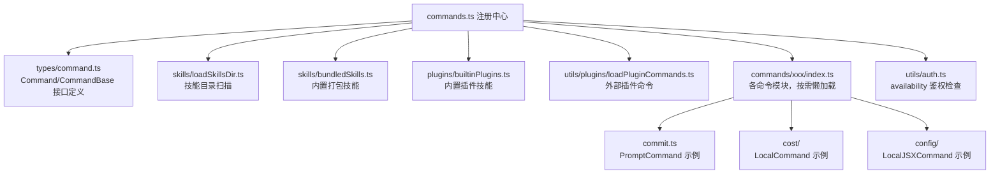
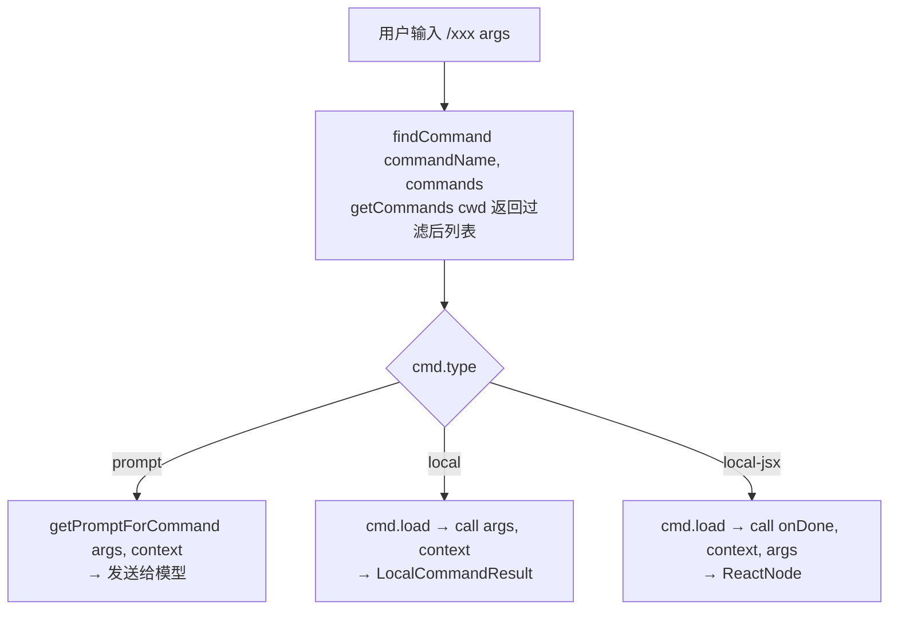

# 命令系统总览 — Claude Code 源码分析

> 模块路径：`src/commands.ts` + `src/types/command.ts`
> 核心职责：命令注册、分类管理与生命周期调度中心
> 源码版本：v2.1.88

## 一、模块概述

Claude Code 的命令系统（Command System）是用户与 AI 交互的入口层。所有以 `/` 开头的斜杠命令（slash command）均通过该系统注册、发现和执行。`commands.ts` 是命令的总注册中心，`types/command.ts` 定义了完整的类型体系。

命令系统设计目标：
- 统一管理内建命令、插件命令、技能命令（Skill）、MCP 命令
- 支持懒加载（lazy load）降低启动开销
- 提供多维度过滤：身份验证（availability）、动态开关（isEnabled）、远程安全性（remote safe）

## 二、架构设计

### 2.1 核心类/接口/函数

**`CommandBase`（命令基础接口）**
所有命令的公共元数据：`name`、`description`、`isEnabled()`、`availability`、`isHidden`、`immediate`、`aliases`、`argumentHint` 等。其中 `userFacingName()` 用于插件命令前缀剥离，`loadedFrom` 标记来源（skills/plugin/bundled/mcp）。

**`Command`（联合类型）**
```typescript
type Command = CommandBase & (PromptCommand | LocalCommand | LocalJSXCommand)
```
三种命令类型：
- `PromptCommand`：展开为 AI 提示词，由模型执行（如 `/commit`）
- `LocalCommand`：纯 TypeScript 逻辑，返回 `LocalCommandResult`（如 `/cost`）
- `LocalJSXCommand`：渲染 React/Ink UI 组件（如 `/config`、`/diff`）

**`getCommands(cwd)`**
核心入口函数，聚合所有命令并执行过滤：
```typescript
export async function getCommands(cwd: string): Promise<Command[]>
```
内部调用 `loadAllCommands`（memoized）、`getDynamicSkills()`，并按 `meetsAvailabilityRequirement` + `isCommandEnabled` 过滤。

**`COMMANDS()`**
内建命令工厂函数，使用 `lodash-es/memoize` 缓存，返回全部内建命令数组。在 `getCommands` 调用时才执行，避免启动时读取配置。

**`loadAllCommands(cwd)`（memoized）**
并发加载：内建技能（bundledSkills）、内建插件技能（builtinPluginSkills）、技能目录命令（skillDirCommands）、工作流命令（workflowCommands）、插件命令（pluginCommands），最终合并 `COMMANDS()`。

### 2.2 模块依赖关系图



### 2.3 关键数据流



## 三、核心实现走读

### 3.1 关键流程

1. **启动阶段**：`commands.ts` 顶部执行所有 `import`，但 `COMMANDS()` 函数由 memoize 包裹，第一次调用 `getCommands` 时才实际执行
2. **Feature Flag 命令**：通过 `bun:bundle` 的 `feature()` 函数做死代码消除，如 `const bridge = feature('BRIDGE_MODE') ? require(...) : null`，未启用的功能在打包时直接剔除
3. **命令加载**：`loadAllCommands` 使用 `Promise.all` 并发加载五类来源，性能优先
4. **过滤逻辑**：`meetsAvailabilityRequirement` 检查 auth 环境，`isCommandEnabled` 调用命令自身的 `isEnabled()` 钩子
5. **动态技能去重**：`getDynamicSkills()` 获取运行时发现的技能，与基础命令合并时通过 `Set<name>` 去重，插入位置在插件命令之后、内建命令之前

### 3.2 重要源码片段

**命令类型联合定义（`src/types/command.ts`）**
```typescript
// 命令基础字段：所有命令共享
export type CommandBase = {
  availability?: CommandAvailability[] // 鉴权范围
  isEnabled?: () => boolean            // 动态开关
  immediate?: boolean                  // 是否跳过队列立即执行
  loadedFrom?: 'skills'|'plugin'|'bundled'|'mcp'
  userFacingName?: () => string        // 插件前缀剥离
}

// 三种命令类型的联合
export type Command = CommandBase &
  (PromptCommand | LocalCommand | LocalJSXCommand)
```

**Feature Flag 条件导入（`src/commands.ts`）**
```typescript
// 死代码消除：只有 BRIDGE_MODE 启用时才打包 bridge 模块
const bridge = feature('BRIDGE_MODE')
  ? require('./commands/bridge/index.js').default
  : null
```

**命令聚合与过滤（`src/commands.ts`）**
```typescript
// memoize 保证昂贵的扫描只执行一次
const loadAllCommands = memoize(async (cwd: string) => {
  const [bundledSkills, builtinPluginSkills,
         skillDirCommands, workflowCommands, pluginCommands] =
    await Promise.all([
      getBundledSkills(), getBuiltinPluginSkillCommands(),
      getSkillDirCommands(cwd), getWorkflowCommands?.(cwd) ?? [],
      getPluginCommands(),
    ])
  return [...bundledSkills, ...builtinPluginSkills,
          ...skillDirCommands, ...workflowCommands,
          ...pluginCommands, ...COMMANDS()]
})
```

**远程安全命令集（`src/commands.ts`）**
```typescript
// 远程模式仅允许这些命令，防止本地文件系统操作
export const REMOTE_SAFE_COMMANDS: Set<Command> = new Set([
  session, exit, clear, help, theme, color, vim,
  cost, usage, copy, btw, feedback, plan, keybindings,
  statusline, stickers, mobile,
])
```

### 3.3 设计模式分析

**策略模式（Strategy）**：三种命令类型（`PromptCommand`/`LocalCommand`/`LocalJSXCommand`）对应三种执行策略，通过 `type` 字段判别。调用方无需了解具体执行逻辑。

**工厂 + 备忘录模式（Factory + Memoize）**：`COMMANDS()` 是延迟工厂，`memoize` 确保同一 cwd 的命令列表只计算一次，兼顾灵活性和性能。

**白名单过滤器（Allowlist Filter）**：`REMOTE_SAFE_COMMANDS`、`BRIDGE_SAFE_COMMANDS` 使用 `Set<Command>` 而非字符串匹配，避免命名冲突，且引用级别的比较更安全。

**懒加载（Lazy Load）**：所有命令通过 `load: () => import('./xxx.js')` 懒加载实现模块，启动时只加载元数据，首次调用才拉取实现代码。

## 四、高频面试 Q&A

### 设计决策题

**Q1：为什么命令系统使用三种 type（prompt/local/local-jsx）而非统一接口？**

A：三者代表完全不同的执行路径和运行时需求。`PromptCommand` 需要 token 预算（`contentLength`）、允许工具列表（`allowedTools`），最终进入 LLM 推理循环；`LocalCommand` 是纯 TypeScript 同步/异步函数，不经过模型；`LocalJSXCommand` 需要 React/Ink 渲染上下文和 `onDone` 回调机制。强行统一会导致每种类型都携带其他类型的冗余字段，破坏类型安全。TypeScript 联合类型 + 判别字段（discriminated union）的方式在编译期即可捕获错误。

**Q2：`availability` 与 `isEnabled()` 的职责如何划分？为什么要拆开？**

A：`availability` 是静态声明，描述命令适用的认证/提供商环境（`claude-ai`、`console`），基于用户身份，在会话期间不变；`isEnabled()` 是动态函数，每次 `getCommands` 调用都重新计算，用于功能开关（GrowthBook feature flag）、环境变量、平台检测等运行时条件。注释中明确说明："auth changes（e.g. /login）take effect immediately"——`loadAllCommands` memoize 了慢路径，但 `isEnabled` 每次都新鲜执行，支持登录后立即刷新命令列表。

### 原理分析题

**Q3：`loadAllCommands` 为什么用 `memoize` 而不是模块级变量？**

A：命令加载依赖 `cwd`（当前工作目录），不同目录可能有不同的技能目录命令和工作流。模块级变量无法区分不同 cwd；`memoize` 以参数为键，允许按 cwd 缓存。同时，`clearCommandsCache()` 可按需清除缓存（插件安装、`/reload-plugins` 等场景），而模块级变量只能整体重置。

**Q4：`feature()` 函数与 `require()` 配合实现了什么？**

A：这是 Bun 打包器的死代码消除（Dead Code Elimination）机制。`feature('BRIDGE_MODE')` 在编译期求值，若为 `false`，整个 `require(...)` 分支连同目标模块都被剔除出产物。这使得同一份源码可生成"内部版"和"外部发布版"两种不同的产物——外部版不含 ANT-ONLY 功能，减小体积并避免泄漏内部实现。

**Q5：`INTERNAL_ONLY_COMMANDS` 数组的作用是什么？**

A：标记仅在内部构建中保留的命令（如 `commit`、`bughunter`、`antTrace`、`backfillSessions` 等）。构建脚本使用该列表在生成外部发布版时将这些命令从打包结果中排除。这比在每个命令内用 `isEnabled: () => false` 更彻底——后者仍会打包代码，前者在模块图中直接断开连接。

### 权衡与优化题

**Q6：懒加载（`load: () => import('./xxx.js')`）带来了什么权衡？**

A：优点：启动时仅加载命令元数据（约几十字节的对象字面量），降低 TTFR（Time to First Response）；体积较大的模块（如 `insights.ts`，113KB/3200 行）不影响冷启动。缺点：首次调用命令时有额外的模块解析延迟；`local-jsx` 命令需要 React 运行时，若多个命令共用组件，重复引用反而会增加内存压力。权衡结果：Claude Code 作为 CLI 工具，启动速度优先于首次命令执行延迟，懒加载是合理选择。

**Q7：`getSkillToolCommands` 和 `getSlashCommandToolSkills` 有何区别？**

A：前者面向模型（model-facing），过滤出所有可被 AI 调用的 `prompt` 类命令，包含所有来源（bundled/skills/commands_DEPRECATED），是"模型能看到的技能"；后者面向斜杠命令提示，过滤条件更严格，要求有 `hasUserSpecifiedDescription` 或 `whenToUse`，且来源为 skills/plugin/bundled，是"用户在打 `/` 时看到的技能"。两者独立 memoize，保持职责分离。

### 实战应用题

**Q8：如果我要添加一个新的内建命令，需要做哪些步骤？**

A：
1. 在 `src/commands/` 下创建新目录，编写 `index.ts`（命令元数据）和实现文件
2. 在 `src/commands.ts` 顶部 `import` 该命令
3. 将命令加入 `COMMANDS()` 函数的返回数组
4. 若是内部专用命令，同时加入 `INTERNAL_ONLY_COMMANDS` 数组
5. 若命令需要 Feature Flag 保护，使用 `feature()` + 条件 `require()` 模式

**Q9：`clearCommandsCache()` 在什么场景下需要调用？应注意什么？**

A：需要调用的场景：安装/卸载插件后（`/reload-plugins`）；动态技能发现后；用户登录/登出后（改变 availability）。注意事项：该函数会清除 `loadAllCommands`、`getSkillToolCommands`、`getSlashCommandToolSkills` 的 memoize 缓存，以及插件和技能的专项缓存（`clearPluginCommandCache`/`clearSkillCaches`）；`clearSkillIndexCache` 需单独清除，因为技能搜索索引是建立在命令缓存之上的独立 memoize 层，不清除会导致"清了内层、外层仍返回旧结果"的陷阱。

---
> **版权声明**：源码版权归 [Anthropic](https://www.anthropic.com) 所有，本文档基于 Claude Code v2.1.88 source map 还原版本分析，仅供学习研究使用。文档内容采用 [CC BY-NC 4.0](https://creativecommons.org/licenses/by-nc/4.0/) 协议。
