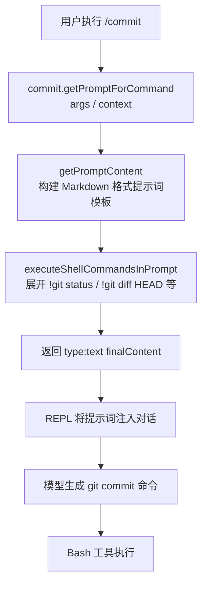
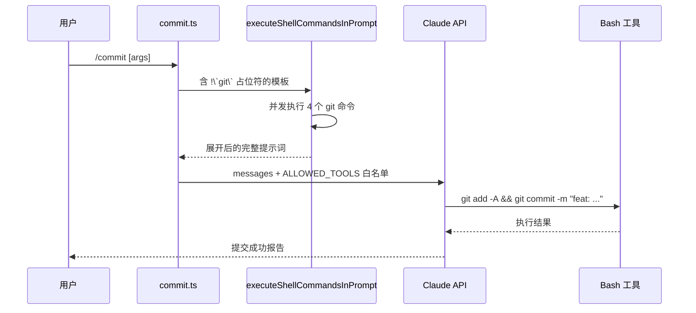

# Git 类命令 — Claude Code 源码分析

> 模块路径：`src/commands/commit.ts`、`src/commands/commit-push-pr.ts`、`src/commands/branch/`、`src/commands/diff/`、`src/commands/autofix-pr/`
> 核心职责：将 Git 操作封装为 AI 驱动的提示词命令，涵盖提交、PR 创建、分支管理与差异查看
> 源码版本：v2.1.88

## 一、模块概述

Git 类命令是 Claude Code 中使用频率最高的一类命令，将繁琐的 Git 工作流自动化。其中 `/commit` 和 `/commit-push-pr` 属于 `PromptCommand` 类型——它们将当前 Git 状态作为上下文注入提示词，由 AI 模型生成提交信息并执行 Git 操作；`/branch` 和 `/diff` 属于 `LocalJSXCommand`，渲染 Ink UI 界面；`/autofix-pr` 是内部专用的 PR 自动修复命令。

## 二、架构设计

### 2.1 核心类/接口/函数

**`commit`（`src/commands/commit.ts`）**
类型：`PromptCommand`。通过 `ALLOWED_TOOLS`（仅 `git add`/`git status`/`git commit`）限制模型可调用的工具，防止越权操作。`getPromptForCommand` 调用 `executeShellCommandsInPrompt` 将 `!\`cmd\`` 语法的 Shell 命令结果内联到提示词中。

**`commitPushPr`（`src/commands/commit-push-pr.ts`）**
类型：`PromptCommand`。相比 `commit` 权限更广，额外允许 `gh pr create/edit/view/merge`，并在初始化时通过 `getDefaultBranch()` 和 `getEnhancedPRAttribution()` 并发获取默认分支名和 PR 归因文本。

**`branch`（`src/commands/branch/index.ts`）**
类型：`LocalJSXCommand`。使用 `feature('FORK_SUBAGENT')` 判断是否提供 `fork` 别名。实现在 `branch.ts` 中，核心是 `createFork()` 函数——复制当前 transcript 文件，生成新的 `sessionId`，写入 `forkedFrom` 追踪字段。

**`diff`（`src/commands/diff/index.ts`）**
类型：`LocalJSXCommand`。实现极简，仅渲染 `DiffDialog` 组件，传入 `context.messages`。这是"UI 命令作为薄壳"的典型示例——命令本身不含逻辑，仅桥接组件层。

**`autofixPr`（`src/commands/autofix-pr/`）**
内部专用（列在 `INTERNAL_ONLY_COMMANDS`）。用于 CI 失败后自动分析错误并推送修复。

### 2.2 模块依赖关系图

```mermaid
graph TD
    COMMIT[commit.ts\nPromptCommand]
    CPP[commit-push-pr.ts\nPromptCommand]
    BRANCH[branch/\nLocalJSXCommand]
    DIFF[diff/\nLocalJSXCommand]

    COMMIT --> ATTR[utils/attribution.js\n生成 Co-Authored-By 归因]
    COMMIT --> PSE[utils/promptShellExecution.js\n执行 !cmd 内联 Shell 输出]
    COMMIT --> UC[utils/undercover.js\nANT 内部隐身指令]
    COMMIT --> AT1[ALLOWED_TOOLS\ngit add/status/commit]

    CPP --> ATTR
    CPP --> GIT[utils/git.js\ngetDefaultBranch]
    CPP --> PSE
    CPP --> AT2[ALLOWED_TOOLS\n含 gh CLI 命令]

    BRANCH --> BT[branch.ts → createFork\n复制 transcript 创建分支]
    BRANCH --> SS[utils/sessionStorage.js\ngetTranscriptPath/getProjectDir]
    BRANCH --> ANA[services/analytics\nlogEvent 追踪 branch 行为]

    DIFF --> DD[components/diff/DiffDialog.js\nInk UI 差异对话框组件]
```



### 2.3 关键数据流



## 三、核心实现走读

### 3.1 关键流程

**`/commit` 执行流程：**
1. 用户输入 `/commit`，REPL 匹配到 `commit` 命令（type: 'prompt'）
2. 调用 `getPromptForCommand(args, context)`
3. `getPromptContent()` 构建包含 Git Safety Protocol 的提示词，其中 `!\`git status\`` 等是占位符
4. `executeShellCommandsInPrompt` 扫描 `!\`...\`` 模式，逐一执行 Shell 命令并将输出替换进模板
5. 返回最终提示词，注入 LLM 上下文，模型据此生成 `git add + git commit` 命令
6. Bash 工具执行模型生成的命令（受 `ALLOWED_TOOLS` 白名单限制）

**`/branch` 创建会话分支流程：**
1. 用户输入 `/branch [name]`，触发 `LocalJSXCommand`
2. 惰性加载 `branch.ts`，调用 `createFork(customTitle)`
3. 读取当前 `transcript` 文件（JSONL 格式）
4. 生成新 `sessionId`（UUID），复制 transcript 内容，添加 `forkedFrom` 元数据
5. 写入新的 transcript 文件路径，保存 `customTitle`
6. UI 展示新分支信息，用户可通过 `/resume` 切换分支

### 3.2 重要源码片段

**`/commit` 安全工具白名单（`src/commands/commit.ts`）**
```typescript
// 严格限制模型只能调用这三个 git 命令，防止越权
const ALLOWED_TOOLS = [
  'Bash(git add:*)',
  'Bash(git status:*)',
  'Bash(git commit:*)',
]
```

**提示词中的 Shell 命令内联（`src/commands/commit.ts`）**
```typescript
// !\`cmd\` 语法：executeShellCommandsInPrompt 负责展开
return `## Context
- Current git status: !\`git status\`
- Current git diff: !\`git diff HEAD\`
- Current branch: !\`git branch --show-current\`
- Recent commits: !\`git log --oneline -10\``
```

**`/commit-push-pr` 并发初始化（`src/commands/commit-push-pr.ts`）**
```typescript
// getDefaultBranch 和 getEnhancedPRAttribution 独立异步，并发执行
const [defaultBranch, prAttribution] = await Promise.all([
  getDefaultBranch(),
  getEnhancedPRAttribution(context.getAppState),
])
```

**`/branch` 创建分支核心逻辑（`src/commands/branch/branch.ts`）**
```typescript
// 为分叉会话生成新 UUID，保留 forkedFrom 追踪链路
const forkSessionId = randomUUID() as UUID
const originalSessionId = getSessionId()
// forkedFrom 字段在 transcript 中建立父子追踪关系
```

**`/diff` 命令薄壳实现（`src/commands/diff/diff.tsx`）**
```typescript
// 极简实现：命令层不含逻辑，仅转发给 UI 组件
export const call: LocalJSXCommandCall = async (onDone, context) => {
  const { DiffDialog } = await import('../../components/diff/DiffDialog.js')
  return <DiffDialog messages={context.messages} onDone={onDone} />
}
```

### 3.3 `/commit` 提交信息生成管道详解

`/commit` 命令的核心价值是"AI 理解代码语义并生成符合项目风格的提交信息"，这一能力通过多层次的信息注入实现：

**阶段一：Git 状态采集**

`executeShellCommandsInPrompt` 在提示词模板中展开以下命令（按执行顺序）：

| 占位符 | 展开命令 | 注入信息 |
|--------|---------|---------|
| `!\`git status\`` | `git status` | 当前工作区/暂存区状态 |
| `!\`git diff HEAD\`` | `git diff HEAD` | 所有改动的完整 diff |
| `!\`git branch --show-current\`` | `git branch --show-current` | 当前分支名 |
| `!\`git log --oneline -10\`` | `git log --oneline -10` | 近 10 次提交（学习项目风格）|

`git log --oneline -10` 是关键：模型通过阅读近期提交信息，学习该项目的提交消息风格（是否使用 Conventional Commits、是否有 issue 编号前缀、惯用措辞等），生成风格一致的新提交信息。

**阶段二：Git Safety Protocol 注入**

提示词中有一段固定的"Git Safety Protocol"安全规则，不可被用户覆盖：

```typescript
// src/commands/commit.ts（提示词内嵌安全规则）
`## Git Safety Protocol
- NEVER update the git config
- NEVER run destructive git commands (push --force, reset --hard,
  checkout ., restore ., clean -f, branch -D) unless the user
  explicitly requests these actions
- NEVER skip hooks (--no-verify, --no-gpg-sign, etc)
- Create NEW commits rather than amending, unless user asks`
```

这段规则是 Claude Code 承诺给用户的安全底线。即使用户在 `/commit` 末尾加上"--no-verify"，AI 也会拒绝执行（因为规则明确禁止跳过 hooks）。

**阶段三：归因文本注入**

`getAttributionTexts()` 根据 `CLAUDE_CODE_DISABLE_NONESSENTIAL_TRAFFIC` 等环境变量和 `DISABLE_ATTRIBUTION` 标志决定是否追加归因行：

```typescript
// src/utils/attribution.ts:28-45
// commitAttribution 决定是否在提交信息末尾加入
// "Co-Authored-By: Claude <noreply@anthropic.com>" 行
export async function getAttributionTexts(getAppState) {
  if (isAttributionDisabled(getAppState)) return { commitAttribution: '', prAttribution: '' }
  return {
    commitAttribution: '\n\nCo-Authored-By: Claude <noreply@anthropic.com>',
    prAttribution: '\n\n🤖 Generated with [Claude Code](https://claude.ai/claude-code)'
  }
}
```

**阶段四：用户指令追加**

若用户输入 `/commit fix login bug`，`args` 参数（`"fix login bug"`）被追加到提示词末尾：

```
## Additional instructions from the user:
fix login bug
```

AI 在生成提交信息时自然融合"Additional instructions"，无需代码层解析。

**完整管道时序：**



### 3.4 `/commit` 与 raw `git commit` 的关键差异

| 特性 | `/commit` | `git commit` |
|------|-----------|-------------|
| 提交信息生成 | AI 读取 diff 语义自动生成 | 用户手动输入 |
| 风格学习 | 读取近 10 条日志匹配项目风格 | 无 |
| 多文件暂存决策 | AI 判断哪些文件应一起提交 | 用户手动 `git add` |
| Hook 处理 | 必须通过（Safety Protocol 禁止 --no-verify）| 用户可跳过 |
| 危险操作防护 | 系统提示词禁止 force push 等操作 | 无限制 |
| 工具权限范围 | 仅 `git add`/`git status`/`git commit` | 无限制（用户全权限）|
| 归因追踪 | 可选追加 Co-Authored-By | 无 |

### 3.5 `/commit-push-pr` 完整流程与幂等性设计

**初始化阶段（进程启动时并发执行）：**

```typescript
// src/commands/commit-push-pr.ts:45-52
// 命令注册时即开始预取，而非等用户输入 /commit-push-pr
const [defaultBranch, prAttribution] = await Promise.all([
  getDefaultBranch(),          // git symbolic-ref refs/remotes/origin/HEAD
  getEnhancedPRAttribution(getAppState),  // 检查 DISABLE_ATTRIBUTION 标志
])
```

**PR 幂等性检查（提示词中的 gh CLI 序列）：**

提示词指示 AI 按如下顺序执行，确保幂等：

```
1. git status && git diff HEAD      ← 确认有改动
2. git add -A && git commit -m "…"  ← 创建提交
3. git push -u origin HEAD          ← 推送分支
4. gh pr view --json number 2>/dev/null  ← 检查 PR 是否已存在
5a. 若 PR 存在: gh pr edit --title "…" --body "…"  ← 更新
5b. 若 PR 不存在: gh pr create --title "…" --body "…"  ← 创建
```

步骤 4-5 保证了命令的幂等性：重复执行不会创建多个 PR，而是更新已有 PR。

**`ALLOWED_TOOLS` 扩展对比：**

```typescript
// commit.ts：最小权限
const COMMIT_ALLOWED_TOOLS = [
  'Bash(git add:*)', 'Bash(git status:*)', 'Bash(git commit:*)'
]

// commit-push-pr.ts：包含 gh CLI 和 git push
const CPP_ALLOWED_TOOLS = [
  'Bash(git add:*)', 'Bash(git status:*)', 'Bash(git commit:*)',
  'Bash(git push:*)',   // 新增：允许推送
  'Bash(gh pr:*)',      // 新增：允许 PR 操作
  'Bash(gh auth:*)',    // 新增：允许认证检查
]
```

### 3.6 分支命名策略（`/branch` 的 `customTitle` 处理）

`createFork()` 的分支命名遵循"首选用户输入，回退到父会话首条消息"的策略：

```typescript
// src/commands/branch/branch.ts:35-58
async function createFork(customTitle?: string): Promise<ForkResult> {
  const forkSessionId = randomUUID() as UUID
  const parentSessionId = getSessionId()

  // 标题决策：优先用户指定 > 从父会话首条消息提取
  const title = customTitle
    ?? deriveFirstPrompt(parentMessages)  // 截取 100 字符，折叠空白
    ?? `Fork of ${parentSessionId.slice(0, 8)}`  // 最终回退

  // forkedFrom 字段建立父子追踪关系
  const forkMetadata = {
    forkedFrom: { sessionId: parentSessionId, messageUuid: lastMessageUuid },
    customTitle: title,
    createdAt: Date.now(),
  }
  // 写入新 transcript 文件（JSONL 格式）
  await writeTranscriptFile(forkSessionId, parentMessages, forkMetadata)
  return { sessionId: forkSessionId, title }
}
```

`deriveFirstPrompt()` 的两个关键处理：
1. 折叠内嵌换行（代码块、错误堆栈可能包含 `\n`），防止标题多行显示破坏会话列表 UI
2. 截断至 100 字符 + 省略号，保证列表对齐

### 3.7 `/diff` 的差量渲染层（DiffDialog 架构）

`/diff` 命令的极简实现背后，`DiffDialog` 组件承载了完整的差量渲染逻辑：

**DiffDialog 的工作流程：**

1. 接收 `context.messages`（完整对话历史）
2. 扫描消息历史，找出所有 `tool_use: Write`/`Edit` 操作的文件变更
3. 调用 `git diff` 或对比文件快照，生成 unified diff 格式输出
4. 使用 Ink 的 `Text` 组件以 ANSI 着色渲染（绿色添加行，红色删除行）
5. 支持键盘导航（`j`/`k` 滚动，`q` 退出）

**为什么 diff 渲染逻辑在 UI 组件而非命令层：**

`DiffDialog` 需要直接访问 React 渲染树和键盘事件，这些只能在组件上下文中实现。将逻辑放在命令层不仅无法利用 Ink 的响应式更新机制，还需要额外的状态管理。"命令作为薄壳"模式将关注点彻底分离：命令负责接入路由，组件负责交互逻辑。

### 3.8 设计模式分析

**模板方法模式（Template Method）**：`/commit` 和 `/commit-push-pr` 都使用 `getPromptContent()` 函数构建提示词模板，通过参数化（`defaultBranch`、`commitAttribution`、`prAttribution`）定制具体内容。Git Safety Protocol 作为固定安全约束内嵌在模板中，不可被用户覆盖（仅在末尾追加 Additional instructions）。

**命令模式 + 工具调用委托（Command + Tool Delegation）**：`PromptCommand` 本身不执行 Git 操作，而是将意图编码进提示词，委托 AI 模型生成具体命令，再由 Bash 工具执行。权限控制在 `ALLOWED_TOOLS` 层，而非在命令层。

**组合模式（Composition over inheritance）**：`commit-push-pr` 不继承 `commit`，而是重新组合了更宽的工具权限和更丰富的提示词模板。两者共享 `getAttributionTexts()` 等工具函数。

## 四、高频面试 Q&A

### 设计决策题

**Q1：为什么 `/commit` 和 `/commit-push-pr` 使用 `PromptCommand` 而非 `LocalCommand` 直接调用 Git？**

A：使用 `PromptCommand` 的核心优势是自适应性。Git 提交信息需要理解代码语义、遵循项目惯例（通过 `git log` 学习已有风格）、判断变更类型（feat/fix/refactor 等）。这些都是 LLM 的强项而非规则引擎的强项。同时，提示词模板中的 Git Safety Protocol 是对 AI 行为的约束（不跳过 hooks、不 force push、不提交 secrets），而非硬编码的命令序列。当用户追加 `args`（如 `/commit fix typo`），提示词在末尾追加用户指令，AI 自然融合两者，无需代码层面的指令解析。

**Q2：`ALLOWED_TOOLS` 工具白名单为何在 `PromptCommand` 而非全局层面控制？**

A：工具权限应与命令语义绑定，而非用户级别控制。`/commit` 只需要读取 Git 状态并执行提交，不需要 `Read`、`Write`、`WebFetch` 等工具——允许这些工具会使模型有机会在"写提交信息"过程中意外修改文件。`ALLOWED_TOOLS` 通过覆盖 `alwaysAllowRules` 实现，白名单之外的工具仍受正常权限控制。这是最小权限原则的命令级实现。

### 原理分析题

**Q3：`executeShellCommandsInPrompt` 中的 `!\`...\`` 语法是如何工作的？**

A：这是 Claude Code 自定义的"Shell 内联"语法，不是标准 Markdown。`executeShellCommandsInPrompt` 扫描提示词中所有 `!\`...\`` 模式，在命令执行前使用 `child_process`（或 Bun 的等价 API）逐一运行这些 Shell 命令，将输出替换原始占位符。这样最终发送给模型的提示词已包含实时的 `git status`、`git diff` 输出，模型看到的是真实数据而非模板占位符。权衡：每次调用 `/commit` 都会执行多次 Git 查询，但 Git 读操作开销极低，换来的是提示词内容的实时性。

**Q4：`/branch` 命令的 `forkedFrom` 字段如何实现会话追踪？**

A：每条 transcript 条目（`TranscriptEntry`）会记录 `forkedFrom: { sessionId, messageUuid }`，建立从子会话到父会话的引用链。这使得 `/resume` 可以显示会话树而非扁平列表，用户可以看到分支点。同时，`deriveFirstPrompt()` 从父会话的第一条用户消息中提取标题（截断到 100 字符，折叠空白），用于分支的默认命名，避免标题中出现换行（代码、错误堆栈）破坏会话索引。

**Q5：`commit-push-pr` 中 `contentLength` 为何使用 `'main'` 作为 `getPromptContent` 的估算参数？**

A：`contentLength` 用于 REPL 在注入命令前估算 token 消耗，判断是否超过上下文窗口。`getDefaultBranch()` 是异步操作，而 `contentLength` 是同步的 getter 属性。用 `'main'` 作为占位符的长度与真实分支名（如 `master`、`develop`）差异极小（几个字节），对 token 估算影响可忽略不计，这是"实用主义优先于精确性"的合理权衡。

### 权衡与优化题

**Q6：`/commit-push-pr` 同时提交、推送和创建 PR，如何处理用户中途取消的情况？**

A：该命令将整个流程编码进单条提示词，由模型按步骤执行。用户在模型执行过程中按 `Ctrl+C` 会触发 `abortController.signal`，中断当前模型推理和工具调用链。已执行的 Git 操作（如 `git push`）无法回滚（Git 操作本身无事务性），但 PR 创建是最后一步，若中断发生在 `push` 之后、`gh pr create` 之前，用户可手动运行 `gh pr create`。提示词中的"check if PR already exists"逻辑（`gh pr view --json number`）支持幂等重试——已有 PR 的情况下会 `gh pr edit` 而非重复创建。

**Q7：为什么 `diff` 命令的实现只有 3 行？这种设计有什么优缺点？**

A：`diff` 是典型的"命令作为路由器"设计，所有逻辑下沉到 `DiffDialog` 组件。优点：命令层零逻辑，`DiffDialog` 可被其他 UI 直接复用；懒加载减少启动开销。缺点：命令的功能全部依赖外部组件，若 `DiffDialog` 需要重构，命令层无法提供任何缓冲。但对于纯展示型命令（无需参数解析、无复杂逻辑），这是最简洁的正确实现。

### 实战应用题

**Q8：如何为团队定制 `/commit` 的提交信息格式？**

A：Claude Code 有多个扩展点：
1. `CLAUDE.md` 中声明提交信息规范，会被 AI 系统提示读取
2. 用 `/skills` 创建自定义技能覆盖 `/commit` 的行为
3. 通过 `attribution` 工具函数（`getAttributionTexts`）可在构建时注入归因文本
4. 在 `/commit` 末尾追加参数（如 `/commit use conventional commits format`）可一次性调整

**Q9：`/branch` 创建的分支和 Git branch 有什么关系？**

A：没有直接关系。`/branch` 创建的是**会话分支（conversation branch）**，而非 Git 分支。它复制的是 Claude Code 的对话历史 transcript 文件，赋予新的 `sessionId`，通过 `forkedFrom` 追踪父子关系，存储在 `~/.claude/projects/<hash>/` 目录下。用户在会话分支中的操作（包括 Git 操作）仍然作用于同一个文件系统和 Git 仓库，只是对话上下文独立。若想同时创建 Git 分支，需要在分支会话中额外执行 `git checkout -b`。

**Q10：Git Safety Protocol 中禁止的操作由谁来执行？是代码层强制还是 AI 自律？**

A：是 AI 自律（软约束），而非代码层强制。系统提示词将安全规则注入 LLM 上下文，使模型"理解并遵守"这些规则。但从技术上讲，`ALLOWED_TOOLS` 白名单提供了一层硬约束：即使 AI 生成了 `git push --force` 命令，Bash 工具也需要通过正则检查 `Bash(git push:*)` 是否在白名单中——而 `/commit` 命令的白名单不包含 `git push`，因此 force push 实际上无法执行。两层防护互补：提示词规则防止 AI"想要"执行危险操作；工具白名单在 AI"失控"时提供最后一道屏障。

**Q11：`/autofix-pr` 是如何识别 CI 失败并生成修复方案的？**

A：`autofixPr` 是专为内部 ANT 构建管道设计的命令（`INTERNAL_ONLY_COMMANDS` 列表中）。其工作流程：1）读取 CI 系统传入的构建日志 URL 或错误文本（通过 `context.args` 注入）；2）将错误日志作为上下文注入提示词，请求 AI 分析失败原因；3）AI 生成修复 patch，通过 Bash 工具执行文件修改；4）调用 `git commit` 和 `git push` 将修复推送到同一 PR 分支。`ALLOWED_TOOLS` 包含比 `/commit` 更广的权限（允许读写文件），因为修复错误需要实际修改代码而非仅提交现有改动。

**Q12：为什么 `getDefaultBranch()` 在命令注册时就执行，而非等用户触发 `/commit-push-pr`？**

A：这是"预取（Prefetch）"优化。用户输入 `/commit-push-pr` 到 REPL 处理完命令注册之间有一定延迟，`getDefaultBranch()`（执行 `git symbolic-ref refs/remotes/origin/HEAD`）约需 50-100ms。在命令注册阶段异步预取并缓存结果，使 `getPromptForCommand()` 的同步路径无需等待 Git I/O，提升命令响应速度。代价是即使用户从未触发该命令，这次 Git 调用也已执行——但其成本可以忽略不计（本地 Git 读操作）。

**Q13：如何为团队定制 `/commit` 不追加 Co-Authored-By 行？**

A：有三个层次的控制：
1. **项目级**：在项目 `CLAUDE.md` 中写入 `Do not add Co-Authored-By attribution to commits`，AI 会遵守但非强制执行
2. **环境变量级**：设置 `CLAUDE_CODE_DISABLE_NONESSENTIAL_TRAFFIC=1`（或 ANT 内部的 `DISABLE_ATTRIBUTION=1`），`getAttributionTexts()` 返回空字符串，彻底禁用归因
3. **全局配置级**：在 `~/.claude/settings.json` 中设置 `"attribution": false`，通过 `getAppState` 传播到 `isAttributionDisabled()` 检查

方案 2 是最可靠的，因为它在代码层强制禁用，不依赖 AI 的提示词遵从性。

---
> 源码版权归 [Anthropic](https://www.anthropic.com) 所有，本笔记仅供学习研究使用。文档内容采用 [CC BY-NC 4.0](https://creativecommons.org/licenses/by-nc/4.0/) 协议。
