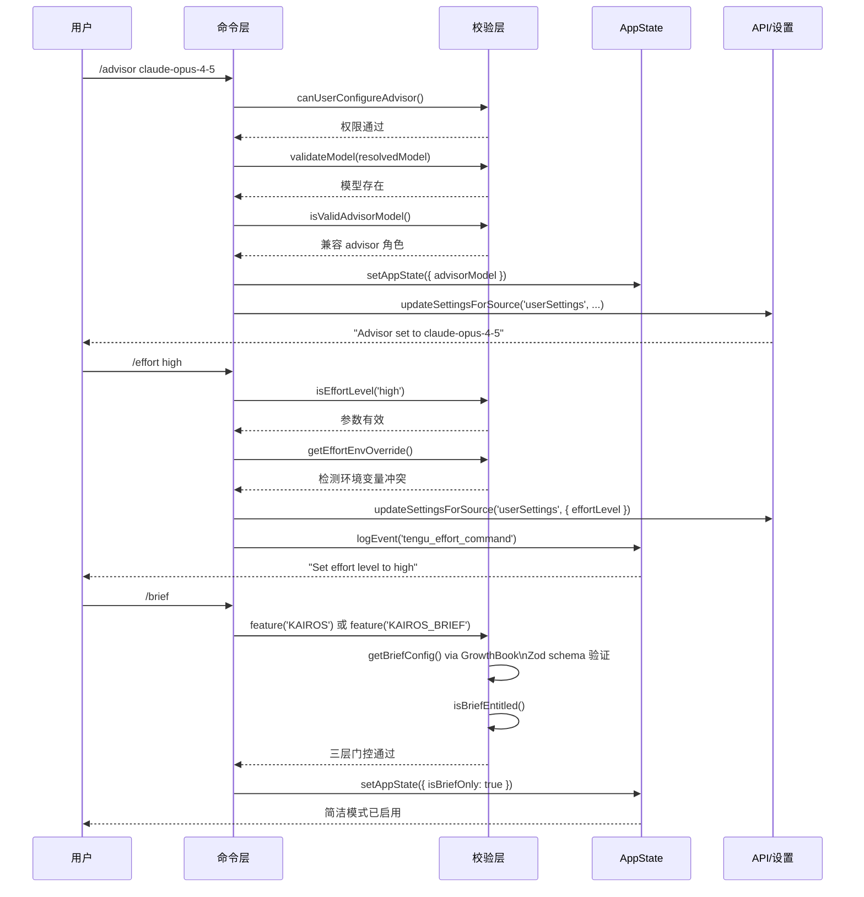

# AI 辅助类命令 — Claude Code 源码分析

> 模块路径：`src/commands/advisor.ts`、`src/commands/brief.ts`、`src/commands/bughunter/`、`src/commands/agents/`、`src/commands/effort/`
> 核心职责：配置和控制 AI 辅助功能——顾问模型、简洁模式、Bug 猎手、智能体管理和推理强度
> 源码版本：v2.1.88

## 一、模块概述

AI 辅助类命令是 Claude Code 中控制 AI 行为模式的一组命令。`/advisor` 配置辅助顾问模型（用于后台监督主模型）；`/brief` 切换简洁响应模式；`/bughunter` 是 ANT 内部专用的 Bug 分析工具；`/agents` 管理智能体配置（sub-agent 系统）；`/effort` 控制模型推理强度等级（low/medium/high/max/auto）。

这类命令的特点是：直接修改 `AppState` 中的 AI 行为配置，部分需要功能开关（GrowthBook feature flag）和权限验证。

## 二、架构设计

### 2.1 核心类/接口/函数

**`advisor`（`src/commands/advisor.ts`）**
类型：`LocalCommand`，`supportsNonInteractive: true`。可设置/取消/查询辅助顾问模型。内置三层校验：`canUserConfigureAdvisor()`（权限检查）、`validateModel(resolvedModel)`（模型有效性）、`isValidAdvisorModel(resolvedModel)`（是否支持 advisor 角色）。通过 `updateSettingsForSource('userSettings', ...)` 持久化配置。

**`brief`（`src/commands/brief.ts`）**
类型：`LocalJSXCommand`，仅在 `feature('KAIROS')` 或 `feature('KAIROS_BRIEF')` 且 GrowthBook 配置 `enable_slash_command: true` 时启用。切换 `appState.isBriefOnly` 布尔值。通过 Zod schema (`briefConfigSchema`) 验证 GrowthBook 推送的配置，防止错误配置导致功能异常。

**`agents`（`src/commands/agents/`）**
类型：`LocalJSXCommand`。通过 `getTools(permissionContext)` 获取当前所有可用工具，渲染 `AgentsMenu` 组件，让用户配置 sub-agent 的工具权限和定义。

**`effort`（`src/commands/effort/`）**
类型：`LocalJSXCommand`，`immediate: true`（`shouldInferenceConfigCommandBeImmediate()` 控制）。支持参数 `[low|medium|high|max|auto]`，通过 `updateSettingsForSource('userSettings', { effortLevel })` 持久化，同时检测 `CLAUDE_CODE_EFFORT_LEVEL` 环境变量是否覆盖用户设置。

**`bughunter`（`src/commands/bughunter/`）**
内部专用（`INTERNAL_ONLY_COMMANDS`），是 Anthropic 内部工程师用于快速创建 Bug 报告的工具，集成了代码路径分析和 Issue 创建工作流。

### 2.2 模块依赖关系图

```
advisor.ts
├── utils/advisor.js
│   ├── canUserConfigureAdvisor()   # 用户权限检查
│   ├── isValidAdvisorModel()        # 顾问模型兼容性
│   └── modelSupportsAdvisor()       # 主模型是否支持顾问
├── utils/model/model.js             # 模型名称解析/标准化
├── utils/model/validateModel.js     # 异步模型有效性验证
└── utils/settings/settings.js → updateSettingsForSource

brief.ts
├── services/analytics/growthbook.js → getFeatureValue_CACHED_MAY_BE_STALE
├── utils/lazySchema.js → lazySchema  # 延迟 Zod schema 初始化
├── tools/BriefTool/BriefTool.js → isBriefEntitled
└── bootstrap/state.js → getKairosActive

effort/effort.tsx
├── utils/effort.js
│   ├── isEffortLevel()              # 参数校验
│   ├── getEffortValueDescription()  # 人类可读描述
│   ├── getEffortEnvOverride()       # 环境变量覆盖检测
│   └── toPersistableEffort()        # 可持久化转换
└── utils/settings/settings.js → updateSettingsForSource

agents/agents.tsx
├── tools.js → getTools()            # 获取当前工具列表
└── components/agents/AgentsMenu.js  # Ink 智能体配置 UI
```

### 2.3 关键数据流



```
用户执行 /effort high
    ↓
effort.tsx: isEffortLevel('high') 校验
    ↓
getEffortEnvOverride() 检测环境变量是否冲突
    ↓
updateSettingsForSource('userSettings', { effortLevel: 'high' })
  → 写入用户配置文件
    ↓
logEvent('tengu_effort_command', { effort: 'high' })  # 分析事件
    ↓
返回描述文本："Set effort level to high: ..."
    ↓
REPL 更新 AppState，后续 API 调用使用新的 effort 参数
```

## 三、核心实现走读

### 3.1 关键流程

**`/advisor` 三阶段验证：**
1. `canUserConfigureAdvisor()` — 检查用户是否有权限配置 advisor（可能与订阅等级或内部账号绑定）
2. `isValidAdvisorModel(resolvedModel)` — 检查指定模型是否能担任 advisor 角色（通常要求是 Opus 或同级别模型）
3. `validateModel(resolvedModel)` — 异步验证模型 ID 是否真实存在（调用 API 或本地模型列表）
4. 三层校验全部通过后，更新 `appState.advisorModel` 并持久化到 `userSettings`

**`/brief` GrowthBook 双重门控：**
1. Feature Flag 层：`feature('KAIROS')` 或 `feature('KAIROS_BRIEF')` — 编译期功能开关
2. GrowthBook 运行时层：`getBriefConfig().enable_slash_command` — 动态配置，Zod 验证防止错误推送
3. 权利层：`isBriefEntitled()` — 用户账号是否有权使用（订阅/权限检查），仅在开启时检查（关闭始终允许）
4. 三层全部通过后，切换 `appState.isBriefOnly`，仅启用 `BriefTool`

**`/effort` 环境变量冲突检测：**
1. 用户设置 effort 后，调用 `getEffortEnvOverride()` 检查 `CLAUDE_CODE_EFFORT_LEVEL` 是否设置
2. 若环境变量与用户设置**不同**，发出警告（环境变量优先级更高）
3. 若 `toPersistableEffort` 返回 `undefined`（某些 session-only 级别），说明设置无法持久化，额外提示

### 3.2 重要源码片段

**`/advisor` 三层校验链（`src/commands/advisor.ts`）**
```typescript
// 逐层验证：权限 → 模型有效性 → advisor 兼容性
const normalizedModel = normalizeModelStringForAPI(arg)
const resolvedModel = parseUserSpecifiedModel(arg)
const { valid, error } = await validateModel(resolvedModel)
if (!valid) return { type: 'text', value: `Invalid advisor model: ${error}` }

if (!isValidAdvisorModel(resolvedModel)) {
  return { type: 'text', value: `${arg} cannot be used as an advisor` }
}
// 通过后，使用 immutable 更新 AppState
context.setAppState(s => ({ ...s, advisorModel: normalizedModel }))
```

**`/brief` Zod 防御性配置验证（`src/commands/brief.ts`）**
```typescript
// Zod 保护：防止 GrowthBook 推送格式错误的配置
const briefConfigSchema = lazySchema(() =>
  z.object({ enable_slash_command: z.boolean() })
)
function getBriefConfig(): BriefConfig {
  const raw = getFeatureValue_CACHED_MAY_BE_STALE<unknown>(
    'tengu_kairos_brief_config', DEFAULT_BRIEF_CONFIG
  )
  const parsed = briefConfigSchema().safeParse(raw)
  return parsed.success ? parsed.data : DEFAULT_BRIEF_CONFIG // 解析失败回退默认值
}
```

**`/effort` 环境变量冲突警告（`src/commands/effort/effort.tsx`）**
```typescript
// 仅在冲突时发出警告（相同值时不显示噪音）
const envOverride = getEffortEnvOverride()
if (envOverride !== undefined && envOverride !== effortValue) {
  return {
    message: `CLAUDE_CODE_EFFORT_LEVEL=${envRaw} overrides this session — clear it`,
    effortUpdate: { value: effortValue }, // 仍更新显示值
  }
}
```

**`/agents` 薄壳实现（`src/commands/agents/agents.tsx`）**
```typescript
// 命令只负责数据准备，UI 逻辑在 AgentsMenu 组件
export async function call(onDone, context) {
  const appState = context.getAppState()
  const permissionContext = appState.toolPermissionContext
  const tools = getTools(permissionContext)  // 传入当前权限下的工具列表
  return <AgentsMenu tools={tools} onExit={onDone} />
}
```

### 3.3 设计模式分析

**防御性编程（Defensive Programming）**：`/brief` 的 GrowthBook 配置使用 Zod 验证是防御性编程的典型实践。外部系统（GrowthBook）推送的配置是不可信数据源，可能包含类型错误或意外字段。Zod 的 `safeParse` 在解析失败时返回 `DEFAULT_BRIEF_CONFIG` 而非抛出异常，确保即使配置服务出错，功能也能以安全的默认值运行。

**职责单一原则（SRP）**：`/advisor` 的功能被分散到多个专用工具函数中——`canUserConfigureAdvisor`（权限）、`isValidAdvisorModel`（模型兼容性）、`validateModel`（存在性验证）、`normalizeModelStringForAPI`（规范化）。命令层只负责编排，不内联任何判断逻辑。

**优先级明确的配置层叠（Configuration Cascade）**：`/effort` 体现了明确的配置优先级：环境变量（`CLAUDE_CODE_EFFORT_LEVEL`）> 用户配置文件（`userSettings`）> 会话级设置 > 模型默认值。当发生覆盖时，系统主动提示而非静默接受，确保用户了解实际生效的值。

## 四、高频面试 Q&A

### 设计决策题

**Q1：`/advisor` 为什么需要三层校验，而不是直接尝试设置并让 API 报错？**

A：提前校验的核心理由是用户体验和资源效率。第一层 `canUserConfigureAdvisor()` 是本地权限检查，若用户根本没有 advisor 功能权限，直接提示清晰的错误比等到 API 调用失败后再解析错误信息更直接。第二层 `isValidAdvisorModel()` 是模型兼容性检查——并非所有模型都能作为 advisor（advisor 需要具备元认知能力来监督另一个模型），这是语义层面的约束，API 层不一定会返回有意义的错误。第三层 `validateModel()` 确保模型 ID 存在，避免将无效模型写入持久化配置（配置文件保存了错误的模型名，下次启动会静默失败）。

**Q2：`/brief` 的 `enable_slash_command` GrowthBook 配置与命令的 `isEnabled()` 有何关系？**

A：两者是分层的门控机制。`isEnabled()` 是代码层的可见性控制，决定命令是否出现在斜杠命令列表中——若为 `false`，用户甚至无法发现这个命令的存在。`enable_slash_command` 是运行时的动态配置，通过 GrowthBook 推送，可以在不发布新版本的情况下控制功能的滚动上线（A/B 测试、灰度发布）。前者是代码边界，后者是运营边界。注释中特别说明：这个配置"no TTL"（无过期时间），因为它控制命令的可见性（不是 kill switch），只有一次后台更新即可。

### 原理分析题

**Q3：`/effort` 的 `immediate: true` 是什么含义？**

A：`immediate: true` 表示该命令可以立即执行，无需等待当前正在进行的模型推理停止。大多数命令需要在模型推理"停止点"（stop point）才能执行，以避免状态竞争（修改配置时模型可能正在使用旧配置）。配置命令（effort、color 等）通常被标记为 `immediate`，因为它们的影响是幂等的——设置 effort 值不影响当前正在进行的 API 调用，只影响下一次调用。`shouldInferenceConfigCommandBeImmediate()` 可能基于当前模型状态动态决定是否立即执行。

**Q4：`toPersistableEffort` 为什么对某些值返回 `undefined`？**

A：`EffortValue` 类型包含一些会话级别（session-only）的 effort 值，这些值仅在当前会话有意义（如某些动态计算的值），无法写入配置文件。当用户设置了这类值时，`toPersistableEffort` 返回 `undefined`，跳过 `updateSettingsForSource` 的调用（避免写入 `undefined` 到配置文件），但 `logEvent` 和状态更新仍然执行——设置在当前会话生效，但下次启动不会记住。用户会收到 "(this session only)" 的后缀提示。

**Q5：`/agents` 通过 `getTools(permissionContext)` 获取工具列表有何意义？**

A：`getTools` 依据当前的权限上下文（`toolPermissionContext`）返回过滤后的工具列表，而非全部工具。不同用户、不同权限配置、不同 Feature Flag 下，可用工具集不同。将 `permissionContext` 传入 `AgentsMenu` 确保 UI 展示的工具与实际可用的工具一致，避免展示用户根本无法使用的工具（如受沙箱限制的工具、需要特定权限的 MCP 工具等）。这是最小惊讶原则的实践。

### 权衡与优化题

**Q6：`getBriefConfig()` 使用 `CACHED_MAY_BE_STALE` 而非每次实时拉取 GrowthBook 配置，有何权衡？**

A：`CACHED_MAY_BE_STALE` 的语义是：值可能是上次后台更新的版本，不保证实时最新。注释中说明：第一次调用触发后台更新，第二次调用才能看到新值。这对于"命令可见性"控制是可接受的——若 Anthropic 通过 GrowthBook 关闭 `/brief`，下次检查（约几分钟内）即可生效，不需要毫秒级的实时响应。相比之下，如果 `isBriefEnabled`（工具可用性 kill switch）需要 5 分钟 TTL 确保快速关闭，命令可见性的更新要求则更宽松。这是延迟与频率的权衡：宽松的缓存策略减少 GrowthBook 查询次数，适合低频变更的配置。

**Q7：`/effort` 的设计为什么选择环境变量 > 用户配置文件的优先级顺序？**

A：这符合 12-factor app 的配置原则：环境变量用于部署级别的覆盖，配置文件用于用户偏好。在 CI/CD 场景中，运维人员可以通过 `CLAUDE_CODE_EFFORT_LEVEL=low` 统一限制所有会话的推理强度（降低 API 成本），而无需修改用户的个人配置文件。个人配置文件则是用户的持久偏好。环境变量胜出确保了部署级别的策略可以覆盖个人偏好，但系统会主动告知冲突，不让用户困惑为何自己的设置不生效。

### 实战应用题

**Q8：如何利用 `/advisor` 实现"双模型协作"提升代码质量？**

A：典型配置：`/advisor claude-opus-4-5`（或更高级模型作为 advisor）+ 主模型使用 Sonnet。Advisor 模型在后台监督主模型的输出，可以提供代码审查、安全检查、逻辑验证等元层面的反馈。使用场景：
- 处理复杂架构决策时，Advisor 提供深度推理验证
- 执行安全敏感操作时，Advisor 作为第二双眼睛
- 需要更高代码质量但不想全程用 Opus 增加成本时（Sonnet 生成 + Opus 审查）
通过 `/advisor unset` 或 `/advisor off` 可随时关闭。

**Q9：在团队部署中，如何通过环境变量统一管理 effort 策略？**

A：在企业/团队部署中，可以通过以下方式：
1. 设置 `CLAUDE_CODE_EFFORT_LEVEL=medium` 作为团队默认值（通过 `.envrc` 或 CI 配置）
2. 个别工程师可以在 `~/.claude/settings.json` 中设置 `effortLevel: 'high'`，但环境变量会覆盖
3. 若需要允许用户覆盖团队策略，则不设置环境变量，仅通过 `CLAUDE.md` 的 guidance 建议合适的 effort 级别
4. `/effort` 命令在输出时会明确提示环境变量覆盖情况，团队成员不会困惑于为何自己的设置不生效

---
> **版权声明**：源码版权归 [Anthropic](https://www.anthropic.com) 所有，本文档基于 Claude Code v2.1.88 source map 还原版本分析，仅供学习研究使用。文档内容采用 [CC BY-NC 4.0](https://creativecommons.org/licenses/by-nc/4.0/) 协议。
