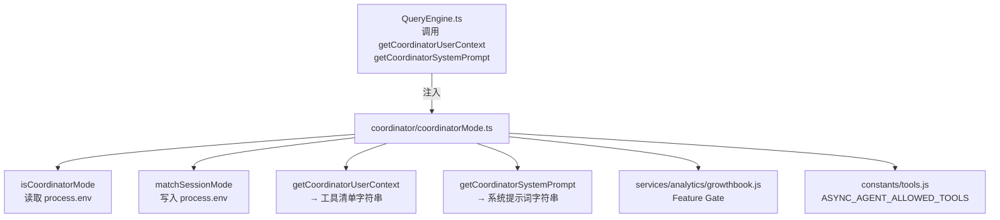
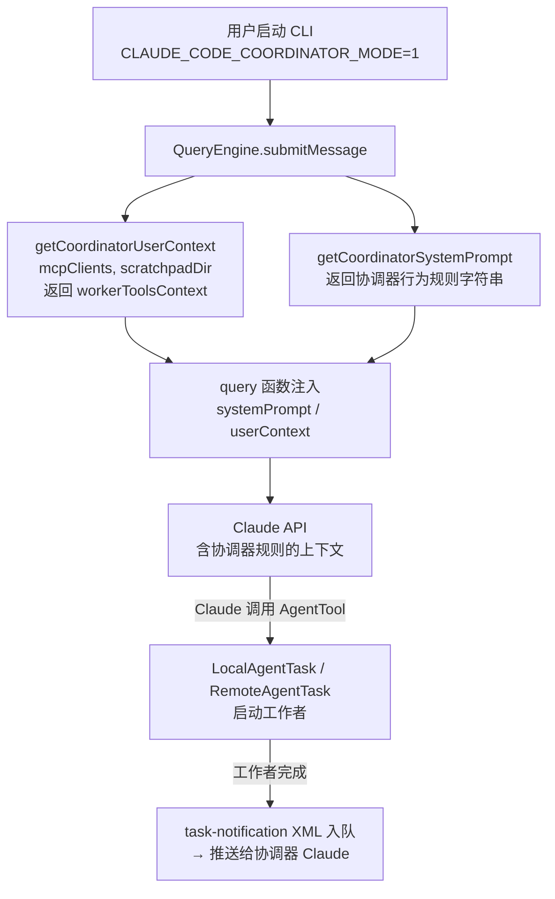
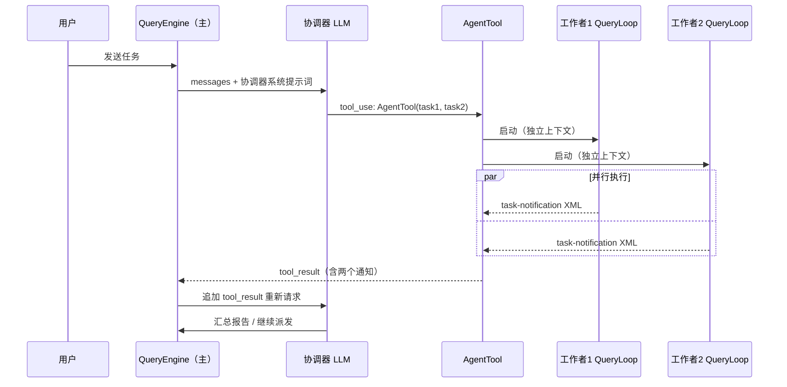

# coordinator（多Agent协调器）— Claude Code 源码分析

> 模块路径：`src/coordinator/`
> 核心职责：管理协调器模式的激活、会话模式匹配，以及向大模型注入工作者工具清单与系统提示词
> 源码版本：v2.1.88

## 一、模块概述

`coordinator` 模块是 Claude Code 多 Agent 架构的控制中枢。它通过环境变量 `CLAUDE_CODE_COORDINATOR_MODE` 切换"协调器模式"，决定当前进程是作为主协调者（orchestrator）还是普通会话运行。

在协调器模式下，Claude 不再直接执行任务，而是扮演派发者（dispatcher）角色：通过 `AgentTool` 生成子工作者（worker），借助 `SendMessageTool` 向已存在的工作者发送后续消息，并以 `TaskStopTool` 终止偏离方向的工作者。工作者完成时，结果以 `<task-notification>` XML 格式回流给协调器。

模块只有一个源文件 `coordinatorMode.ts`，但其影响范围贯穿整个请求生命周期，因为它向 `QueryEngine` 注入的用户上下文和系统提示词直接塑造了 LLM 的行为策略。

---

## 二、架构设计

### 2.1 核心类/接口/函数

| 函数 | 签名 | 职责 |
|------|------|------|
| `isCoordinatorMode()` | `() => boolean` | 读取环境变量，判断当前是否处于协调器模式 |
| `matchSessionMode()` | `(sessionMode) => string \| undefined` | 恢复会话时，对齐历史模式与当前进程模式；必要时翻转环境变量 |
| `getCoordinatorUserContext()` | `(mcpClients, scratchpadDir?) => {[k: string]: string}` | 生成注入模型上下文的工具清单描述，告知协调器"工作者能用哪些工具" |
| `getCoordinatorSystemPrompt()` | `() => string` | 返回长达数百行的协调器专属系统提示词，定义角色、工具用法、并发策略等 |
| `isScratchpadGateEnabled()` | `() => boolean` | 通过 Statsig Feature Gate 检查临时文件目录功能是否开启 |

### 2.2 模块依赖关系图



**注意循环依赖的处理**：`filesystem.ts → permissions → … → coordinatorMode` 存在潜在循环，因此 `isScratchpadGateEnabled()` 在本模块内单独实现，而非复用 `filesystem.ts` 的同名函数。实际 scratchpad 路径通过 `QueryEngine` 依赖注入传入，彻底规避循环。

### 2.3 关键数据流



---

## 三、核心实现走读

### 3.1 关键流程（编号步骤）

**协调器模式检测流程**

1. 进程启动，`isCoordinatorMode()` 读取 `CLAUDE_CODE_COORDINATOR_MODE` 环境变量
2. 同时检查 Bun Bundle 的 `feature('COORDINATOR_MODE')` 特性标志（用于死代码消除）
3. 仅当两者均为真时，返回 `true`

**会话恢复模式对齐流程**

1. 用户执行 `/resume` 恢复旧会话
2. `matchSessionMode(sessionMode)` 接收存档的模式字符串（`'coordinator'` 或 `'normal'`）
3. 与当前进程模式比较；若不一致，**原地修改** `process.env.CLAUDE_CODE_COORDINATOR_MODE`
4. 返回提示字符串（如 `'Entered coordinator mode to match resumed session.'`），并上报分析事件

**用户上下文生成流程**

1. 非协调器模式：直接返回空对象 `{}`，零开销
2. 协调器模式：
   - 判断是否为简单模式（`CLAUDE_CODE_SIMPLE`），简单模式仅提供 Bash/Read/Edit 三工具
   - 正常模式：从 `ASYNC_AGENT_ALLOWED_TOOLS` 集合中过滤掉内部工具（TeamCreate、TeamDelete、SendMessage、SyntheticOutput），排序后拼接工具名
   - 若有 MCP 客户端，附加 MCP 服务器名称列表
   - 若暂存目录已启用（Feature Gate 通过），附加 scratchpad 路径说明
   - 以 `workerToolsContext` 为键返回

### 3.2 重要源码片段（带中文注释）

**模式检测（`src/coordinator/coordinatorMode.ts:36-41`）**

```typescript
export function isCoordinatorMode(): boolean {
  // feature() 是 Bun Bundle 级别的标志，编译时决定是否包含本模块
  if (feature('COORDINATOR_MODE')) {
    // isEnvTruthy 检查环境变量是否为 '1'/'true'/'yes' 等
    return isEnvTruthy(process.env.CLAUDE_CODE_COORDINATOR_MODE)
  }
  return false
}
```

**工具清单构建（`src/coordinator/coordinatorMode.ts:88-108`）**

```typescript
// 非协调器模式直接返回空，零开销
if (!isCoordinatorMode()) return {}

// 简单模式 vs 完整模式工具集选择
const workerTools = isEnvTruthy(process.env.CLAUDE_CODE_SIMPLE)
  ? [BASH_TOOL_NAME, FILE_READ_TOOL_NAME, FILE_EDIT_TOOL_NAME].sort().join(', ')
  : Array.from(ASYNC_AGENT_ALLOWED_TOOLS)
      .filter(name => !INTERNAL_WORKER_TOOLS.has(name)) // 过滤内部控制工具
      .sort()
      .join(', ')

let content = `Workers spawned via the ${AGENT_TOOL_NAME} tool have access to: ${workerTools}`
// ... 追加 MCP 服务器、scratchpad 描述
return { workerToolsContext: content }
```

**会话模式翻转（`src/coordinator/coordinatorMode.ts:64-78`）**

```typescript
// 原地修改进程环境变量来切换模式——isCoordinatorMode() 实时读取，无缓存
if (sessionIsCoordinator) {
  process.env.CLAUDE_CODE_COORDINATOR_MODE = '1'
} else {
  delete process.env.CLAUDE_CODE_COORDINATOR_MODE
}
logEvent('tengu_coordinator_mode_switched', { to: sessionMode })
return sessionIsCoordinator
  ? 'Entered coordinator mode to match resumed session.'
  : 'Exited coordinator mode to match resumed session.'
```

### 3.3 设计模式分析

**策略模式（Strategy Pattern）**：`getCoordinatorSystemPrompt()` 根据 `CLAUDE_CODE_SIMPLE` 环境变量选择不同的工作者能力描述字符串，将"简单模式"与"完整模式"的行为策略分支内联在同一函数中，易于扩展新策略。

**依赖注入（Dependency Injection）**：`scratchpadDir` 参数由 `QueryEngine` 在调用时传入，而非 `coordinatorMode.ts` 内部解析。这一设计专门用于打破模块间循环依赖——`filesystem.ts` 处于依赖链下游，无法被本模块直接引用。

**特性标志门控（Feature Flag Gating）**：`feature('COORDINATOR_MODE')` 是 Bun 打包时的编译期常量，未启用时整个模块在外部发行版中被树摇（tree-shaking）消除，做到"按需包含"。

**内部工具集合（Set Exclusion）**：用 `INTERNAL_WORKER_TOOLS` 集合从工作者工具清单中排除协调器专有工具（`team_create`、`send_message` 等），防止工作者调用只应由协调器使用的控制平面工具，体现"最小权限"原则。

### 3.4 协调循环（Coordination Loop）机制详解

`coordinator` 模块并不直接实现事件循环，但它通过系统提示词向 LLM 定义了协调循环的行为规则。理解这一"软性循环"与 `QueryEngine` 硬性循环的关系，是掌握整个多 Agent 架构的关键。

**QueryEngine 的硬性循环**

`QueryLoop`（`src/query/QueryLoop.ts`）是处理多轮工具调用的迭代框架：
1. 向 Anthropic API 发送 `messages` 数组，获取 SSE 流式响应
2. 若响应包含 `tool_use` 块，依次执行每个工具调用
3. 将工具执行结果（`tool_result`）追加到 `messages`，重新发起 API 请求
4. 直到响应中不再包含 `tool_use`（或遇到 `stop_reason: end_turn`），循环结束

**协调器的"软性协调循环"**

在协调器模式下，`QueryLoop` 的每次迭代对应"协调器-工作者"交互的一轮：
1. 协调器 LLM 输出含多个 `AgentTool` 调用的响应
2. `AgentTool` 异步启动工作者，每个工作者运行独立的 `QueryLoop`
3. 工作者完成后，以 `<task-notification>` XML 格式向主会话发送 `tool_result`
4. 协调器 LLM 读取所有工作者结果，决策下一步动作（继续派发或收口汇总）



**关键细节：单次输出多工具调用实现并发**

LLM 的并发实际上是"单次 API 响应中包含多个 `tool_use` 块"。`QueryLoop` 检测到这种情况后，会并发执行所有工具调用（`Promise.all` 或并发队列），而非串行。这意味着协调器的"并发能力"受限于 LLM 愿意在单次输出中生成多少个 `AgentTool` 调用，而非运行时线程池大小。系统提示词中明确要求协调器"批量发起工具调用"，就是为了利用这一机制。

### 3.5 协调器与工具层、UI 层的中介关系

`coordinatorMode.ts` 是一个纯"配置生产者"，它不直接操作工具或 UI，但通过注入系统提示词和用户上下文间接影响二者：

**与工具层的关系**

```
coordinatorMode.ts
  ↓ getCoordinatorUserContext()
QueryEngine
  ↓ 注入 workerToolsContext 到 userTurn
LLM（知道工作者有哪些工具）
  ↓ 生成 AgentTool 调用（含适当子任务描述）
AgentTool
  ↓ 按 ASYNC_AGENT_ALLOWED_TOOLS 初始化工作者工具池
工作者工具池（Bash、Read、Write 等）
```

`getCoordinatorUserContext()` 的输出直接决定了协调器 LLM 如何分配任务——它列出了工作者可用的工具集，使 LLM 能够判断"这个子任务需要文件写操作，工作者有 Write 工具，可以派发"。若工作者工具集描述缺失或错误，LLM 会产生不合理的任务分解（如将需要网络访问的子任务分配给没有 `WebFetch` 工具的工作者）。

**与 UI 层的关系**

协调器模式下的 UI 展示与普通模式略有不同：
- 每个 `AgentTool` 调用对应一个独立的 `TaskView` 组件，实时展示子工作者的进度
- `task-notification` 消息以特殊样式渲染（有别于普通助手消息），清晰标示来源
- `SendMessageTool` 的调用在 UI 中显示为"向工作者 X 发送后续消息"的操作记录

**`coordinatorMode.ts` 不负责的部分**

| 职责 | 实际负责模块 |
|------|-------------|
| 并发工具调用执行 | `QueryLoop.ts` |
| 工作者生命周期管理 | `AgentTool.ts` |
| task-notification 消息路由 | `SendMessageTool.ts` + `AppState` |
| 工作者工具权限白名单 | `ASYNC_AGENT_ALLOWED_TOOLS`（`constants/tools.ts`） |
| 子 Agent UI 渲染 | `TaskView.tsx` |

### 3.6 并发工具调用的处理细节

**为何协调器不直接"调度"并发**

`coordinatorMode.ts` 的系统提示词教导 LLM"尽量在单次输出中发起多个 AgentTool"，但实际的并发调度由 `QueryLoop` 负责。这种设计分离了"意图表达"（LLM 决定并行什么）和"机制实现"（QueryLoop 决定如何并行执行）。

**并发工具调用的执行顺序保证**

`QueryLoop` 对同一轮 `tool_use` 块的处理策略：
- 多个工具调用共享同一个 `AbortController`，任一工具被用户中止则全部中止
- 工具结果按原始调用顺序追加到 `messages`，即使工具完成顺序不同（保证 LLM 输入的确定性）
- `AgentTool` 返回时，其 `tool_result` 包含完整的工作者输出 XML，不做截断

**工作者通信的背压机制**

若主协调器在工作者仍在运行时收到新消息（用户中断），`abortController.abort()` 信号会级联传播：
1. 主 QueryLoop 的 abort → 终止当前 API 流
2. 所有已启动的 AgentTool 收到 abort 信号 → 向子工作者的 QueryLoop 发送 abort
3. 子工作者的 Bash 进程收到 SIGTERM

这种级联中止是通过 `AbortController` 父子关联实现的，`coordinatorMode.ts` 不参与此逻辑。

---

## 四、高频面试 Q&A

### 设计决策题

**Q1：为什么 `matchSessionMode()` 选择原地修改 `process.env`，而非使用内存变量记录模式？**

A：`isCoordinatorMode()` 在整个系统多处被调用（QueryEngine、工具逻辑等），若只修改内存变量，所有调用点都需要持有对该变量的引用或经过单例访问。直接写 `process.env` 利用 Node/Bun 进程全局共享的特性，使 `isCoordinatorMode()` 保持"无参数、无缓存、即时读取"的简单签名，调用方无需任何改动。代价是对全局状态的副作用，但由于该函数只在会话恢复时触发一次，副作用范围可控。

**Q2：`isScratchpadGateEnabled()` 为何在 `coordinatorMode.ts` 中重复实现，而不复用 `filesystem.ts` 中的同名函数？**

A：`filesystem.ts` 位于依赖链路 `filesystem → permissions → … → coordinatorMode`，若直接引用会形成循环依赖，导致模块无法加载。通过在本模块内直接调用底层 `checkStatsigFeatureGate_CACHED_MAY_BE_STALE('tengu_scratch')`，跳过 `filesystem.ts` 这一中间层，以少量代码重复换取依赖图的无环性。注释中明确标注了重复的原因，属于有意为之的权衡。

### 原理分析题

**Q3：协调器如何保证工作者"看不到"主会话的对话历史？**

A：`getCoordinatorSystemPrompt()` 明确指出"Workers can't see your conversation"，并要求每个工作者提示词必须"self-contained"。在实现层面，`AgentTool` 以独立的上下文启动子 Agent 查询（独立的 `query()` 调用链），工作者的消息历史与主会话相互隔离。主协调器必须在工作者提示词中显式注入所需的文件路径、行号、错误信息等，而不能依赖共享记忆。

**Q4：`INTERNAL_WORKER_TOOLS` 集合包含哪些工具，设计动机是什么？**

A：集合包含 `team_create`、`team_delete`、`send_message`、`synthetic_output` 四个工具。这些工具属于协调器"控制平面"：`send_message` 用于主协调器向工作者发送后续消息；`team_create/delete` 管理工作者团队；`synthetic_output` 生成结构化输出。若工作者也能调用这些工具，将打破协调拓扑（工作者向另一工作者发消息，形成自组织网络），导致协调语义失控。过滤该集合实现了工作者工具权限的最小化。

**Q5：系统提示词中的并发策略规则是什么？**

A：提示词将任务分为三类：只读任务（研究类）可无限并行；写密集任务（实现类）同一文件集同时只能一个工作者操作；验证任务在不同文件区域时可与实现并行。并发的核心机制是"单次消息多工具调用"——协调器在同一 LLM 输出中发起多个 `AgentTool` 调用，每个工具调用异步启动一个工作者，所有工作者并行执行，结果通过 `<task-notification>` 逐一回流。

### 权衡与优化题

**Q6：协调器系统提示词非常长（数百行），这会带来什么性能影响？如何缓解？**

A：长系统提示词增加每次请求的输入 token 数，直接影响延迟和成本。Claude Code 通过 **Prompt Cache**（`skipCacheWrite` 等参数）将系统提示词缓存在 API 侧，后续请求只需支付 cache read 费用（约为全量输入的 1/10），大幅减轻重复开销。此外，提示词内容仅在协调器模式激活时注入，普通会话的调用路径完全跳过。

**Q7：`feature('COORDINATOR_MODE')` 这种编译期标志如何影响发布策略？**

A：Bun Bundle 在打包时将 `feature()` 调用替换为布尔常量。内部版本（ant 构建）启用该标志，协调器相关代码被包含；外部发行版标志为 false，整个 `coordinator/` 模块被树摇消除，不出现在最终产物中。这使团队可以在生产内部测试新协调能力而不影响外部用户，同时保证二进制体积最小化。

### 实战应用题

**Q8：如果要为协调器添加"预算控制"功能（限制所有工作者的总 token 用量），你会在哪里接入？**

A：最自然的接入点是 `getCoordinatorUserContext()`——在返回的 `workerToolsContext` 字符串中追加预算说明，告知模型当前剩余预算；同时在 `QueryEngine` 层面通过 `taskBudget` 参数传递给每个子 Agent 的 `query()` 调用。`coordinatorMode.ts` 不直接管理运行时状态，预算计数器应放在 `AppState` 中，由 `setAppState` 在每个工作者完成时更新。

**Q9：用户反馈"/resume 后协调器模式丢失"，如何排查？**

A：排查路径如下：1）确认会话存档中 `sessionMode` 字段是否为 `'coordinator'`（存档可能来自旧版本，缺少该字段）；2）检查 `matchSessionMode()` 是否被调用（QueryEngine 启动时应调用）；3）确认 `process.env.CLAUDE_CODE_COORDINATOR_MODE` 在 `matchSessionMode()` 返回后的值；4）检查是否有其他代码在之后清除了该环境变量。若 `sessionMode` 为 `undefined`（旧格式），`matchSessionMode()` 提前返回 `undefined`，模式不会被恢复，这是最常见原因。

**Q10：`getCoordinatorSystemPrompt()` 中的并发策略规则对 LLM 有约束力吗？如果 LLM 违反了怎么办？**

A：系统提示词对 LLM 是"软约束"——语言模型无法被强制执行规则，只能通过提示词引导行为。若 LLM 违反并发规则（如将写密集任务并行分配到同一文件），`QueryLoop` 层面没有锁机制防止两个工作者同时写入同一文件，可能导致竞态条件（后完成的工作者覆盖前者的修改）。实践中的缓解手段：1）Bash 工具的文件写操作是原子 IO，最小粒度不会出现字节级交错；2）工作者任务描述中要求明确的文件所有权边界；3）协调器系统提示词强调"验证并发"而非"写并发"，降低冲突概率。根本解决需要在 `AgentTool` 层引入文件级别的分布式锁，但当前实现未包含此机制。

**Q11：协调器模式下，scratchpad（临时文件目录）的作用是什么？为何需要 Feature Gate？**

A：Scratchpad 是工作者之间共享中间结果的机制：工作者可以将分析报告、部分代码片段写入 scratchpad 目录，协调器（或其他工作者）通过读取该目录来聚合信息。`getCoordinatorUserContext()` 在 scratchpad 启用时，向 LLM 注入目录路径说明，使 LLM 能够在提示词中指示工作者"将结果写入 `$SCRATCHPAD/analysis.md`"。Feature Gate（`tengu_scratch`）的存在是因为 scratchpad 引入了工作者间的隐式依赖——若工作者 A 在工作者 B 开始前未完成写入，B 读到的数据可能不完整。该功能尚在 Statsig 灰度验证阶段，Gate 允许逐步扩量并在发现问题时快速回滚，而无需发布新版本。

### 权衡与优化题（补充）

**Q12：若协调器需要管理 100 个并发工作者，当前架构的瓶颈在哪里？**

A：当前架构存在三个主要瓶颈：
1. **LLM 单次输出的工具调用上限**：Anthropic API 对单次响应中 `tool_use` 块的数量有隐性限制（约 20-50 个），超出则需要多轮协调循环，失去真正的并发优势。
2. **进程资源消耗**：每个工作者运行独立的 `QueryLoop`，持有独立的 API 连接、消息历史缓冲区和 Node.js 事件循环。100 个工作者并行时，内存和文件描述符消耗显著。
3. **task-notification 消息合并**：100 个工作者的通知全部堆积在主协调器的下一轮 `tool_result` 中，单次 `messages` 追加的 token 数激增，可能触发上下文溢出。
优化方向：引入"工作者池"上限（通过系统提示词约束或 `AgentTool` 并发限制），以及分层协调结构（子协调器管理子工作者组）。

**Q13：`isCoordinatorMode()` 每次调用都读取 `process.env`，在高频调用场景下会有性能影响吗？**

A：`process.env` 的读取在 Node.js/Bun 中是同步的原生调用，单次耗时约 0.01-0.1 微秒，远低于任何 I/O 操作。`isCoordinatorMode()` 在 `QueryLoop` 每次迭代时调用（约每秒数次），累计开销可以忽略不计。相比使用模块级缓存变量，不缓存的设计避免了"缓存失效"问题（`matchSessionMode()` 可能在任何时刻修改 `process.env`），换来的是代码简单性。若未来出现性能问题，可在 `matchSessionMode()` 调用处加入版本号，`isCoordinatorMode()` 只有在版本号变化时才读取环境变量。

---

> 源码版权归 [Anthropic](https://www.anthropic.com) 所有，本笔记仅供学习研究使用。文档内容采用 [CC BY-NC 4.0](https://creativecommons.org/licenses/by-nc/4.0/) 协议。
