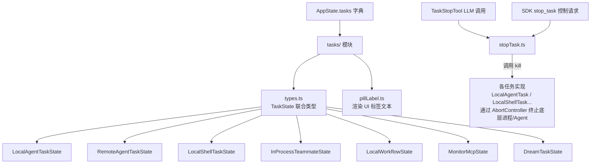
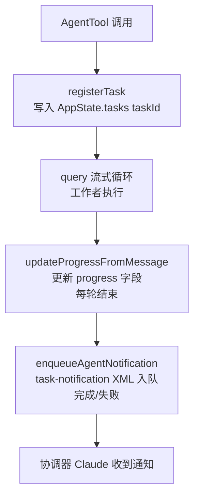
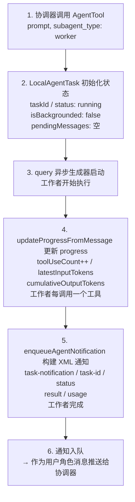
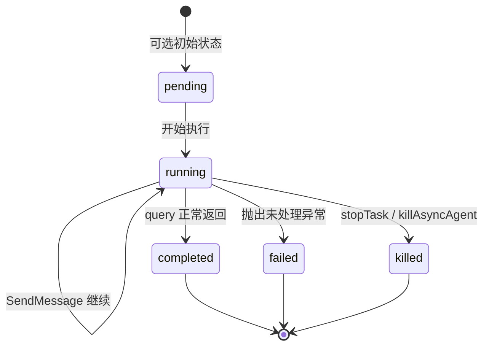

# tasks（任务系统）— Claude Code 源码分析

> 模块路径：`src/tasks/`
> 核心职责：定义所有后台任务的类型体系、生命周期状态机及终止逻辑，统一管理 Shell、Agent、远程会话等多种异步任务
> 源码版本：v2.1.88

## 一、模块概述

`tasks/` 模块是 Claude Code 后台任务管理的基础设施层。它并非单一类，而是一组针对不同任务类型的**具体实现目录**，通过共享的 `TaskState` 联合类型和 `Task` 接口统一抽象。

截至 v2.1.88，系统共有七种任务类型：

| 类型标识 | 实现目录 | 含义 |
|----------|----------|------|
| `local_bash` | `LocalShellTask/` | 本地 Shell 命令 / 监控进程 |
| `local_agent` | `LocalAgentTask/` | 本地子 Agent（协调器派发的工作者）|
| `remote_agent` | `RemoteAgentTask/` | 云端远程 Agent 会话（Ultraplan 等）|
| `in_process_teammate` | `InProcessTeammateTask/` | 进程内团队协作 Agent |
| `local_workflow` | `LocalWorkflowTask/` | 本地工作流（后台任务序列）|
| `monitor_mcp` | `MonitorMcpTask/` | MCP 服务器监控 |
| `dream` | `DreamTask/` | 预测性后台推理（实验性）|

所有任务的状态通过 `AppState.tasks` 字典（以 `taskId` 为键）集中存储，由 React 状态管理驱动 UI 更新。

---

## 二、架构设计

### 2.1 核心类/接口/函数

**`TaskState`（`types.ts`）**：所有具体任务状态类型的联合类型，是组件层操作任务的统一入口类型。

**`TaskStateBase`（`Task.ts`）**：所有具体任务状态的公共基类，包含 `taskId`、`type`、`status`、`startTime`、`endTime`、`notified` 等公共字段。

**`LocalAgentTaskState`（`LocalAgentTask/`）**：本地 Agent 任务的完整状态，包括 `agentId`、`prompt`、`progress`（工具调用计数、token 计数）、`pendingMessages`（排队中的后续消息）、`isBackgrounded`（是否已被后台化）等关键字段。

**`stopTask()`（`stopTask.ts`）**：统一的任务终止入口，被 `TaskStopTool`（LLM 调用）和 SDK `stop_task` 控制请求共用。

**`getPillLabel()`（`pillLabel.ts`）**：将后台任务集合渲染为紧凑的 UI 标签字符串（如 "2 local agents"、"◇ ultraplan"）。

### 2.2 模块依赖关系图





### 2.3 关键数据流

**任务创建到通知的完整数据流：**



---

## 三、核心实现走读

### 3.1 关键流程（编号步骤）

**任务生命周期状态机**



状态转换规则：
1. **running → completed**：工作者 `query()` 生成器正常返回
2. **running → failed**：`query()` 抛出未处理异常，或工作者主动报告失败
3. **running → killed**：`stopTask()` / `killAsyncAgent()` 被调用，触发 `AbortController.abort()`
4. 任何终态转换后，`notified` 标志被设为 `true`，防止重复推送通知

**`stopTask()` 执行流程**

1. 通过 `taskId` 从 `AppState.tasks` 查找任务
2. 校验 `task.status === 'running'`（非运行状态抛出 `StopTaskError`）
3. 通过 `getTaskByType(task.type)` 查找任务实现对象
4. 调用 `taskImpl.kill(taskId, setAppState)`，触发底层终止
5. 对于 Shell 任务，抑制"exit code 137"通知（减少噪音），但仍通过 SDK 事件队列发出终止信号

**`ProgressTracker` 计数规则**

- `input_tokens`：Claude API 返回的是**累计值**（当前轮次包含所有历史 token），只保留最新值 `latestInputTokens`
- `output_tokens`：每轮新增，累加到 `cumulativeOutputTokens`
- 实际显示 token 数 = `latestInputTokens + cumulativeOutputTokens`（避免重复计算）

### 3.2 重要源码片段（带中文注释）

**`TaskState` 联合类型定义（`src/tasks/types.ts:12-19`）**

```typescript
// 所有具体任务状态的判别联合，type 字段为判别器
export type TaskState =
  | LocalShellTaskState
  | LocalAgentTaskState
  | RemoteAgentTaskState
  | InProcessTeammateTaskState
  | LocalWorkflowTaskState
  | MonitorMcpTaskState
  | DreamTaskState
```

**后台任务判断（`src/tasks/types.ts:37-46`）**

```typescript
export function isBackgroundTask(task: TaskState): task is BackgroundTaskState {
  // 只有运行中或等待中的任务才显示在后台任务指示器
  if (task.status !== 'running' && task.status !== 'pending') return false
  // isBackgrounded === false 表示当前在前台运行，不在后台指示器中显示
  if ('isBackgrounded' in task && task.isBackgrounded === false) return false
  return true
}
```

**`stopTask()` 核心逻辑（`src/tasks/stopTask.ts:38-99`）**

```typescript
export async function stopTask(taskId, context) {
  const task = getAppState().tasks?.[taskId]
  if (!task) throw new StopTaskError('not_found')
  if (task.status !== 'running') throw new StopTaskError('not_running')

  const taskImpl = getTaskByType(task.type) // 查找对应实现
  await taskImpl.kill(taskId, setAppState)   // 执行终止

  // Shell 任务：抑制 exit code 137 通知，但保留 SDK 事件
  if (isLocalShellTask(task)) {
    let suppressed = false
    setAppState(prev => ({ ...prev,
      tasks: { ...prev.tasks, [taskId]: { ...prev.tasks[taskId], notified: true } }
    }))
    if (suppressed) emitTaskTerminatedSdk(taskId, 'stopped', ...)
  }
}
```

**通知 XML 构建（`src/tasks/LocalAgentTask/LocalAgentTask.tsx:252-257`）**

```typescript
// 构建标准化的 <task-notification> XML，协调器通过解析此格式获取结果
const message = `<${TASK_NOTIFICATION_TAG}>
<${TASK_ID_TAG}>${taskId}</${TASK_ID_TAG}>
<${STATUS_TAG}>${status}</${STATUS_TAG}>
<${SUMMARY_TAG}>${summary}</${SUMMARY_TAG}>
${resultSection}${usageSection}${worktreeSection}
</${TASK_NOTIFICATION_TAG}>`
enqueuePendingNotification({ value: message, mode: 'task-notification' })
```

**`killAsyncAgent()` 终止实现（`src/tasks/LocalAgentTask/LocalAgentTask.tsx:281-298`）**

```typescript
export function killAsyncAgent(taskId: string, setAppState: SetAppState) {
  let killed = false
  updateTaskState<LocalAgentTaskState>(taskId, setAppState, task => {
    if (task.status !== 'running') return task  // 幂等：已终止则跳过
    killed = true
    task.abortController?.abort()    // 中断正在进行的 API 请求
    task.unregisterCleanup?.()        // 清理注册的资源回调
    return {
      ...task,
      status: 'killed',
      endTime: Date.now(),
      evictAfter: task.retain ? undefined : Date.now() + PANEL_GRACE_MS,
      abortController: undefined,    // 释放引用，防止内存泄漏
    }
  })
}
```

**UI 标签渲染（`src/tasks/pillLabel.ts:43-58`）**

```typescript
case 'remote_agent': {
  // Ultraplan 特殊状态使用菱形图标区分
  if (n === 1 && first.isUltraplan) {
    switch (first.ultraplanPhase) {
      case 'plan_ready':   return `${DIAMOND_FILLED} ultraplan ready`
      case 'needs_input':  return `${DIAMOND_OPEN} ultraplan needs your input`
      default:             return `${DIAMOND_OPEN} ultraplan`
    }
  }
  return n === 1 ? `${DIAMOND_OPEN} 1 cloud session` : `${DIAMOND_OPEN} ${n} cloud sessions`
}
```

### 3.3 设计模式分析

**判别联合（Discriminated Union）**：`TaskState` 以 `type` 字段为判别器，允许 TypeScript 在 `switch (task.type)` 分支内自动收窄类型，无需手动类型断言。`isLocalAgentTask()`、`isLocalShellTask()` 等守卫函数进一步封装了类型检查逻辑。

**命令模式（Command Pattern）**：`Task` 接口（定义 `name`、`type`、`kill()`）将"如何终止一个任务"封装为统一接口，`stopTask()` 无需知道底层是 Shell 进程、Agent 协程还是远程会话——只调用 `taskImpl.kill()`，具体实现各自处理细节。

**不可变状态更新（Immutable State Update）**：所有状态修改均通过 `setAppState(prev => ({ ...prev, tasks: { ...prev.tasks, [taskId]: newState } }))` 模式，确保 React 能检测到引用变化并触发重渲染。`updateTaskState()` 工具函数封装了这一模式，防止直接突变。

**防重放（Idempotent Notification）**：`enqueueAgentNotification()` 在修改 `notified` 标志之前原子性地检查它：若已为 `true`（如 TaskStopTool 已标记），直接返回，防止 LLM 同时收到"completed"和"killed"两条矛盾通知。

---

## 四、高频面试 Q&A

### 设计决策题

**Q1：为什么任务状态存储在 `AppState` 字典中而非任务对象本身的实例属性？**

A：Claude Code 的 UI 层（React/Ink 组件）基于 `AppState` 进行声明式渲染——任何状态变更必须通过 `setAppState()` 触发重渲染，才能在终端 UI 上反映。若状态存储在对象实例属性中，变更不会通知 React，UI 无法同步。此外，`AppState` 持久化到磁盘后可以恢复，实例属性则随进程退出丢失，无法实现 `/resume` 功能。

**Q2：`isBackgrounded` 字段与任务状态（`running`/`completed` 等）有什么区别，为何需要两套字段？**

A：`status` 反映任务的执行状态（是否在跑），`isBackgrounded` 反映任务的 UI 呈现模式（是否被用户移到后台）。一个任务可以是 `running` 且 `isBackgrounded: false`（前台运行，占据主界面）；也可以是 `running` 且 `isBackgrounded: true`（仍在运行但显示在后台 pill 里）。两套字段解耦了"执行状态"和"UI 位置"，使协调器面板与主 UI 可以独立决定如何呈现任务。

### 原理分析题

**Q3：`ProgressTracker` 中 `input_tokens` 只保留最新值而 `output_tokens` 累加，这背后的 API 行为是什么？**

A：Anthropic API 对 `input_tokens` 的计算包含本轮所有历史上下文（prompt caching 也反映在此字段的子字段中），因此在同一个多轮 Agent 会话中，每次返回的 `input_tokens` 是**单调递增的累计值**。若将每轮都相加，token 数会被严重高估。而 `output_tokens` 是当前轮次新生成的 token 数，不含历史，需要手动累加才能得到会话总输出量。`ProgressTracker` 的 `latestInputTokens + cumulativeOutputTokens` 设计精确体现了这一差异。

**Q4：`PANEL_GRACE_MS` 是什么？为什么已完成的任务不立即从 `AppState` 中删除？**

A：`PANEL_GRACE_MS` 是任务完成后的面板保留时间（毫秒）。任务结束时，`evictAfter` 被设为 `Date.now() + PANEL_GRACE_MS`，后台 GC 定时任务在超过该时间后才将任务从 `AppState.tasks` 中移除。保留窗口是为了让用户有机会查看任务最终输出——若任务一结束立即清除，协调器面板会闪烁消失，用户来不及阅读结果。`retain: true` 的任务（用户正在查看其转录记录）不设 `evictAfter`，永久保留直到用户离开视图。

**Q5：`pendingMessages` 队列的设计目的是什么？**

A：协调器在工作者执行期间（工作者的 `query()` 循环还在运行）可能通过 `SendMessageTool` 发送后续消息（修正指令、追加信息等）。此时工作者处于某个工具执行的中间轮次，无法立即处理新消息。`pendingMessages` 将这些消息排队，在每个工具执行轮次结束时由 `drainPendingMessages()` 取出，注入到下一轮的上下文中。这实现了协调器和工作者之间的**异步通信**，而不需要中断工作者当前的工具调用。

### 权衡与优化题

**Q6：七种任务类型共用一个联合类型 `TaskState`，随着类型增加，这种设计有什么扩展性问题？**

A：主要问题是**扩展须修改多处**：每新增一种任务类型，需更新 `TaskState` 联合类型、`isBackgroundTask()` 的 `BackgroundTaskState`、`getPillLabel()` 的 switch 分支、`getTaskByType()` 的查找表。类型越多，这些集中式枚举越难维护，且每处修改都需要跨文件同步。更好的扩展方案是插件注册模式（每种任务类型注册 pill 渲染函数、终止函数等），但当前规模下判别联合的类型安全优势（编译期穷举检查）超过了维护成本。

**Q7：如何权衡 Shell 任务的通知抑制策略（抑制 exit code 137 通知）？**

A：`exit code 137` = SIGKILL，由 `stopTask()` 主动发出，是**预期内的终止**，若向协调器上报"Shell 命令失败: 137"会产生误导性噪音，使协调器误以为工作者遇到了真实错误。抑制后，通过 `emitTaskTerminatedSdk()` 直接向 SDK 消费者发出 `terminated` 信号（不经过通知 XML），满足 SDK 层的监控需求而不干扰 LLM 的决策上下文。Agent 任务则不抑制，因为 AbortError 捕获层会携带 `extractPartialResult()` 的部分结果，是协调器判断下一步的重要信息。

### 实战应用题

**Q8：调试时发现协调器收到了两条相同任务的完成通知，如何排查原因？**

A：根源通常是 `notified` 标志的原子性问题。排查步骤：1）确认 `enqueueAgentNotification()` 中的 `updateTaskState` 原子检查是否正常工作（检查 `shouldEnqueue` 是否正确设为 `false`）；2）确认 `killAsyncAgent()` 和工作者自然完成路径是否存在竞争——两者都会触发通知构建；3）检查 `AbortController.abort()` 是否被调用两次，导致工作者的 catch 块和正常结束路径都尝试推送通知。核心原则：`notified` 标志必须在 `setAppState` 的不可变更新函数内原子设置，不能在外部先读后写。

**Q9：如果要为 `local_agent` 任务添加"暂停/继续"功能（与"停止"不同），最小化改动方案是什么？**

A：最小改动：1）在 `LocalAgentTaskState` 增加 `status: 'paused'` 状态和 `pausedAt: number` 字段；2）添加 `pauseAsyncAgent()` 函数，向 `AbortController` 发送特定 `reason: 'pause'` 信号（而非默认的中断信号），保存工作者的 `messages` 快照；3）修改 `killAsyncAgent()` 中的 `if (task.status !== 'running')` 守卫，允许对 `paused` 任务调用 `kill()`；4）添加 `resumeAsyncAgent()` 函数，用保存的消息快照重新启动 `query()` 循环。关键挑战是 `query()` 的 `AsyncGenerator` 无法真正"暂停"，必须通过保存消息快照来模拟断点续传。

---

> **版权声明**：源码版权归 [Anthropic](https://www.anthropic.com) 所有，本文档基于 Claude Code v2.1.88 source map 还原版本分析，仅供学习研究使用。文档内容采用 [CC BY-NC 4.0](https://creativecommons.org/licenses/by-nc/4.0/) 协议。
