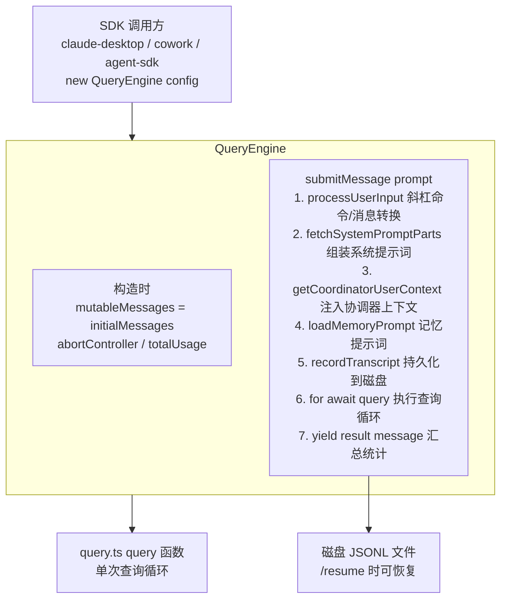
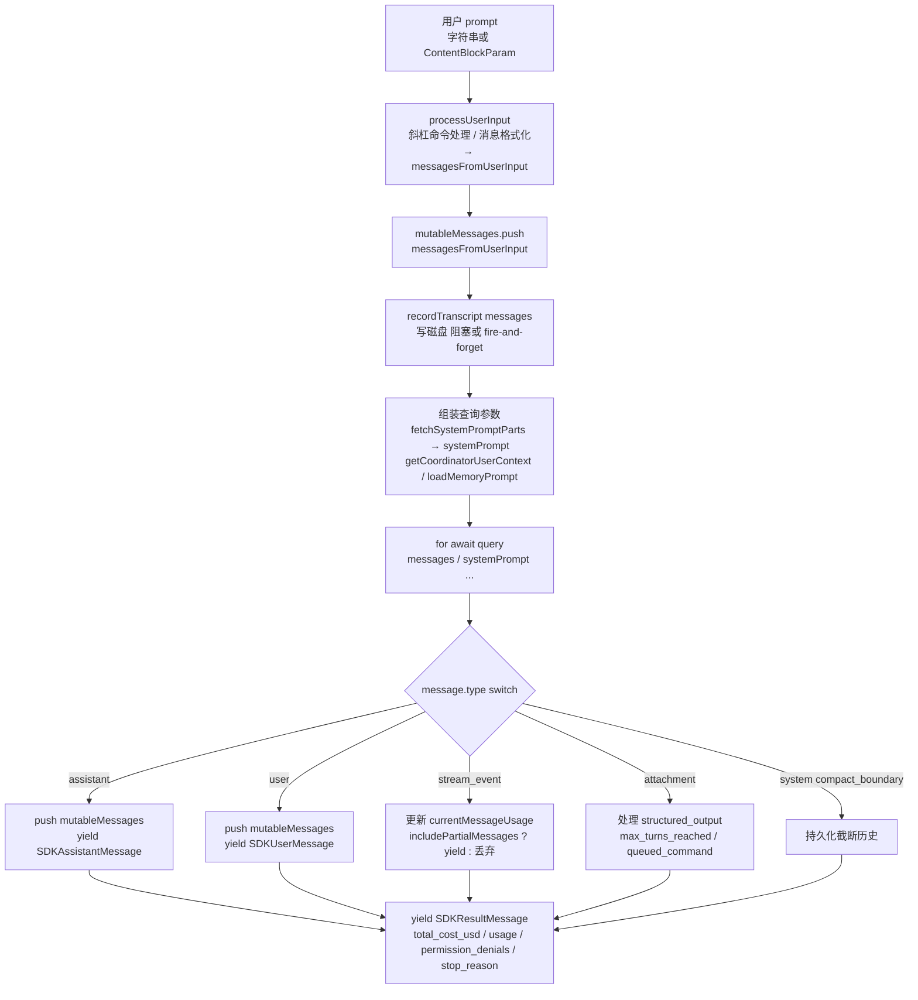

# QueryEngine（查询引擎核心）— Claude Code 源码分析

> 模块路径：`src/QueryEngine.ts`
> 核心职责：管理单个会话的完整生命周期，包括多轮消息历史持久化、系统提示词组装、权限追踪、token 计数，并将用户输入路由到 `query()` 查询循环
> 源码版本：v2.1.88

## 一、模块概述

`QueryEngine` 是 Claude Code SDK 路径（无头模式、Agent SDK、cowork/desktop）的**会话级持久对象**。与 `query.ts` 中的无状态查询循环不同，`QueryEngine` 在多次 `submitMessage()` 调用之间保留完整状态：消息历史（`mutableMessages`）、累计 token 用量（`totalUsage`）、文件状态缓存（`readFileState`）、权限拒绝记录（`permissionDenials`）等。

设计意图来自源码注释：

> "One QueryEngine per conversation. Each submitMessage() call starts a new turn within the same conversation. State (messages, file cache, usage, etc.) persists across turns."

`QueryEngine` 的 `submitMessage()` 是一个异步生成器，输出 `SDKMessage` 类型——这是面向 SDK 消费者的规范化消息格式，包含 `session_id`、`uuid`、时间戳等 SDK 所需的额外字段。内部则调用 `query()` 产生的原始 `Message` 类型，并在 `switch` 分支中转换和过滤。

---

## 二、架构设计

### 2.1 核心类/接口/函数

**`QueryEngine` 类**：会话管理器。关键私有字段：
- `mutableMessages: Message[]`：可变消息历史，跨轮次累积
- `totalUsage: NonNullableUsage`：累计 API 用量（input/output/cache token 计数）
- `readFileState: FileStateCache`：文件内容缓存，避免重复读取
- `permissionDenials: SDKPermissionDenial[]`：本轮被拒绝的工具调用记录
- `discoveredSkillNames: Set<string>`：当前轮次发现的技能名，每次 `submitMessage()` 开始时清空
- `hasHandledOrphanedPermission: boolean`：孤立权限处理的一次性标志

**`QueryEngineConfig`**：构造函数参数类型，包含工作目录、工具集、命令集、MCP 客户端、权限检查函数、自定义系统提示词、模型配置、任务预算等所有会话级配置。

**`submitMessage(prompt, options?)`**：公开方法，每次用户输入触发一次完整查询周期。返回 `AsyncGenerator<SDKMessage>`。

**`wrappedCanUseTool`**：`submitMessage()` 内部构建的权限检查包装器，在原始 `canUseTool` 的基础上拦截所有"拒绝"结果并记录到 `permissionDenials`，用于结果消息中的 `permission_denials` 字段。

**`fetchSystemPromptParts()`**：异步函数，根据工具集、模型、MCP 客户端组装系统提示词各部分，包括默认系统提示词、用户上下文、系统上下文。

### 2.2 模块依赖关系图



### 2.3 关键数据流

**`submitMessage()` 的完整数据流（简化版）：**



---

## 三、核心实现走读

### 3.1 关键流程（编号步骤）

**`submitMessage()` 的 12 个关键步骤**

1. **清空技能发现集合**：`this.discoveredSkillNames.clear()` — 每轮独立追踪，防止跨轮积累
2. **设置工作目录**：`setCwd(cwd)` — 确保工具执行路径正确
3. **包装权限检查**：构建 `wrappedCanUseTool`，拦截拒绝并记录
4. **组装系统提示词**：`fetchSystemPromptParts()` + 协调器上下文 + 记忆提示词 + 追加提示词
5. **结构化输出注册**：若有 JSON Schema 且工具包含 `SyntheticOutputTool`，注册结构化输出强制钩子
6. **孤立权限处理**：`handleOrphanedPermission()` — 仅执行一次（`hasHandledOrphanedPermission` 标志保护）
7. **用户输入处理**：`processUserInput()` — 解析斜杠命令、转换消息格式
8. **预写磁盘记录**：在进入查询循环前写入用户消息，确保进程被杀死时也可 `/resume`
9. **技能与插件预热**：并行加载斜杠命令技能和插件（仅读缓存，不阻塞网络）
10. **构建系统初始化消息**：`buildSystemInitMessage()` — 包含工具清单、模型、权限模式等元信息
11. **执行查询循环**：`for await (message of query(...))`，按消息类型 switch 处理
12. **输出汇总结果**：yield `SDKResultMessage`，包含总费用、用量、权限拒绝、结束原因

### 3.2 重要源码片段（带中文注释）

**构造函数与状态初始化（`src/QueryEngine.ts:200-207`）**

```typescript
constructor(config: QueryEngineConfig) {
  this.config = config
  // 支持外部传入初始消息（用于会话恢复）
  this.mutableMessages = config.initialMessages ?? []
  // 支持外部传入 AbortController（用于主动取消）
  this.abortController = config.abortController ?? createAbortController()
  this.permissionDenials = []
  this.readFileState = config.readFileCache  // 文件内容缓存，跨轮共享
  this.totalUsage = EMPTY_USAGE             // 累计用量归零
}
```

**权限拒绝追踪包装器（`src/QueryEngine.ts:244-271`）**

```typescript
// 包装原始 canUseTool，在结果为拒绝时记录到 permissionDenials
const wrappedCanUseTool: CanUseToolFn = async (tool, input, ...) => {
  const result = await canUseTool(tool, input, ...)

  // 记录所有被拒绝的工具调用（行为不是 'allow'）
  if (result.behavior !== 'allow') {
    this.permissionDenials.push({
      tool_name: sdkCompatToolName(tool.name),  // 转换为 SDK 兼容名称
      tool_use_id: toolUseID,
      tool_input: input,
    })
  }
  return result
}
```

**系统提示词组装（`src/QueryEngine.ts:286-325`）**

```typescript
const { defaultSystemPrompt, userContext: baseUserContext, systemContext } =
  await fetchSystemPromptParts({ tools, mainLoopModel, mcpClients, customSystemPrompt })

// 协调器用户上下文（工作者工具清单）
const userContext = {
  ...baseUserContext,
  ...getCoordinatorUserContext(mcpClients, isScratchpadEnabled() ? getScratchpadDir() : undefined),
}

// 记忆机制提示词：仅在 SDK 调用方提供自定义系统提示词且设置了记忆路径覆盖时注入
const memoryMechanicsPrompt = customPrompt !== undefined && hasAutoMemPathOverride()
  ? await loadMemoryPrompt()
  : null

// 最终系统提示词：[默认提示词] + [记忆机制] + [追加提示词]
const systemPrompt = asSystemPrompt([
  ...(customPrompt !== undefined ? [customPrompt] : defaultSystemPrompt),
  ...(memoryMechanicsPrompt ? [memoryMechanicsPrompt] : []),
  ...(appendSystemPrompt ? [appendSystemPrompt] : []),
])
```

**消息类型分发处理（`src/QueryEngine.ts:757-828`，关键 switch 节选）**

```typescript
switch (message.type) {
  case 'assistant':
    if (message.message.stop_reason != null) lastStopReason = message.message.stop_reason
    this.mutableMessages.push(message)
    yield* normalizeMessage(message)  // 转换为 SDKAssistantMessage 格式
    break

  case 'stream_event':
    if (message.event.type === 'message_start') {
      currentMessageUsage = updateUsage(EMPTY_USAGE, message.event.message.usage)
    }
    if (message.event.type === 'message_delta') {
      currentMessageUsage = updateUsage(currentMessageUsage, message.event.delta.usage)
      if (message.event.delta.stop_reason != null) lastStopReason = message.event.delta.stop_reason
    }
    if (message.event.type === 'message_stop') {
      this.totalUsage = accumulateUsage(this.totalUsage, currentMessageUsage)
    }
    if (includePartialMessages) yield { type: 'stream_event', ...}  // 仅按需转发原始流事件
    break
}
```

**会话持久化策略（`src/QueryEngine.ts:437-463`）**

```typescript
// 在进入 query() 循环前预写用户消息
// 原因：若进程在 API 响应前被杀死（如用户点击 Stop），
// 至少有用户消息可以被 /resume 加载，避免"No conversation found"
if (persistSession && messagesFromUserInput.length > 0) {
  const transcriptPromise = recordTranscript(messages)
  if (isBareMode()) {
    void transcriptPromise  // bare 模式异步写，不阻塞关键路径
  } else {
    await transcriptPromise  // 正常模式等待写完
    // cowork/eager flush 模式额外强制刷盘
    if (isEnvTruthy(process.env.CLAUDE_CODE_EAGER_FLUSH) || isEnvTruthy(process.env.CLAUDE_CODE_IS_COWORK)) {
      await flushSessionStorage()
    }
  }
}
```

**max_turns 终止（`src/QueryEngine.ts:841-873`）**

```typescript
else if (message.attachment.type === 'max_turns_reached') {
  // query() 内部在达到轮次上限时 yield attachment，QueryEngine 转换为 SDK 错误结果
  yield {
    type: 'result',
    subtype: 'error_max_turns',
    is_error: true,
    num_turns: message.attachment.turnCount,
    stop_reason: lastStopReason,
    total_cost_usd: getTotalCost(),
    usage: this.totalUsage,
    errors: [`Reached maximum number of turns (${message.attachment.maxTurns})`],
  }
  return  // 终止生成器
}
```

### 3.3 设计模式分析

**外观模式（Facade Pattern）**：`QueryEngine` 为 SDK 消费者提供简单的 `submitMessage()` 接口，隐藏了 `processUserInput`、`fetchSystemPromptParts`、`query()` 循环、`recordTranscript` 等十余个子系统的协调细节。SDK 调用方只需关心"输入 prompt，处理 SDKMessage 流"，无需了解内部状态机。

**模板方法模式（Template Method）**：`submitMessage()` 定义了查询的骨架流程（准备 → 执行 → 收集 → 报告），其中"执行"步骤委托给 `query()`，各处理细节（系统提示词组装、权限包装等）以私有方法形式注入，子类（理论上）可重写特定步骤。

**双缓冲消息（Dual Message Lists）**：`this.mutableMessages` 是跨轮次持久的完整历史；每次 `submitMessage()` 开始时创建 `const messages = [...this.mutableMessages]` 快照，作为当次查询的不可变输入。查询循环结束后，新消息 push 到 `mutableMessages`。双缓冲防止查询进行中的新消息污染本次查询的上下文。

**累计 Token 追踪（Cumulative Usage Tracking）**：`currentMessageUsage` 在 `message_start` 时重置，在 `message_delta` 时累加，在 `message_stop` 时通过 `accumulateUsage()` 合并到 `totalUsage`。最终 `result` 消息携带完整的跨轮次用量统计，SDK 消费者无需自行汇总每条消息的 usage 字段。

---

## 四、高频面试 Q&A

### 设计决策题

**Q1：`QueryEngine` 与 `query()` 函数的职责边界是如何划分的？**

A：划分原则是**状态持久性**。`query()` 是无状态的查询循环：它接受完整参数，执行一轮完整的"请求→工具→请求"循环，返回 Terminal。它不持有任何跨调用状态，每次调用相互独立，可被测试注入 `deps` 替换依赖。`QueryEngine` 是有状态的会话管理器：它持有 `mutableMessages`（跨轮次累积）、`totalUsage`（累计计费）、`readFileState`（文件缓存）等，并在每次 `submitMessage()` 中将当前状态注入到 `query()` 的参数中。这种分离使 `query()` 可以独立测试（不需要 `QueryEngine` 的存在），也使 `QueryEngine` 的状态管理逻辑与查询循环逻辑互不干扰。

**Q2：为什么用户消息在进入查询循环前就被写入磁盘（预写日志模式）？**

A：这是崩溃恢复设计。若在用户发送消息后、API 响应前进程崩溃，后续 `/resume` 需要加载历史。若消息只在收到 API 响应后才写盘（常见做法），则崩溃窗口期的用户消息丢失，`getLastSessionLog()` 找不到该条消息，`/resume` 失败并提示"No conversation found"——用户会困惑"我明明发了消息"。预写确保即使进程被立即杀死，也有一条"用户消息"作为会话起点，可以从该点恢复。裸模式（`isBareMode()`）使用 fire-and-forget 异步写，因为脚本调用通常不 `/resume`，4-30ms 的写盘延迟被认为不值得阻塞关键路径。

### 原理分析题

**Q3：`stop_reason` 是何时被设置的？为什么在流式响应中无法从 `assistant` 消息直接获取？**

A：Anthropic API 的流式协议将内容块（content block）和元数据分开发送。`content_block_stop` 事件携带 `assistant` 消息（此时 `stop_reason` 为 `null`），`message_delta` 事件携带真正的 `stop_reason`（`"end_turn"`、`"tool_use"` 等）。这两个事件的到达顺序固定，但 Claude Code 在 `content_block_stop` 时就 yield 了 `assistant` 消息（不等 `message_delta`），所以该消息的 `stop_reason` 为 `null`。`QueryEngine` 在 `stream_event` 分支的 `message_delta` 处理中捕获 `stop_reason` 并存入 `lastStopReason`，最终写入 `result` 消息。SDK 消费者应从 `result.stop_reason` 读取，而非 `assistant.message.stop_reason`。

**Q4：`context window` 管理在 `QueryEngine` 和 `query.ts` 中各自承担哪些职责？**

A：**`QueryEngine` 层面**：维护完整的 `mutableMessages` 历史，在 `compact_boundary` 系统消息到来时截断历史记录（通过 `tailUuid` 找到 preserved segment 尾部，只保留该段之后的消息），防止长会话内存无限增长；负责在 `isBareMode` 下 fire-and-forget 写盘，降低长无头会话的 I/O 压力。**`query.ts` 层面**：在每轮循环开始时执行四级压缩（snip / microcompact / contextCollapse / autocompact），确保提交给 API 的 `messagesForQuery` 在 token 上限内；计算 `taskBudgetRemaining`，在超出 `task_budget.total` 时提前终止循环。两者分工：`QueryEngine` 管理"存储在内存的历史长度"，`query.ts` 管理"发给 API 的上下文窗口大小"。

**Q5：`includePartialMessages` 选项的用途是什么？哪类消费者需要它？**

A：`includePartialMessages: true` 时，`QueryEngine` 会将来自 `query.ts` 的 `stream_event`（包括 `message_start`、`content_block_delta`、`message_delta` 等原始流事件）透传给 SDK 消费者，消费者可以实现"逐 token 打字机效果"。默认 `false` 时，这些低层流事件被丢弃，消费者只看到完整的 `assistant` 消息。需要 `true` 的场景：claude-desktop 等 GUI 客户端需要实时渲染流式文本；cowork 需要将流实时转发给浏览器 WebSocket。headless 脚本调用（只关心最终结果）通常设 `false`，减少处理开销。

### 权衡与优化题

**Q6：`discoveredSkillNames` 在每次 `submitMessage()` 开始时清空，这会不会导致某些跨轮次的技能发现信息丢失？**

A：这是有意为之的设计权衡。`discoveredSkillNames` 的用途是追踪"本轮是否首次发现了某个技能"（用于 `was_discovered` 分析指标），而非记录"会话中所有发现过的技能"。若不清空，同一技能在第二轮被调用时仍显示为"already discovered"，`was_discovered: false`——这是分析上的正确语义（技能在第一轮就被发现了）。清空确保每轮的 `was_discovered` 标志只反映**该轮**的发现情况，防止跨轮次"污染"。信息的"丢失"是分析粒度的必要代价，并非 bug。

**Q7：`QueryEngine` 如何处理"孤立权限"（orphaned permission）？为何需要 `hasHandledOrphanedPermission` 标志？**

A：孤立权限是指上一个会话留下的、需要在新会话开始时"补处理"的权限请求（通常是上次会话因 Ctrl+C 中断时未完成的 permission prompt）。`orphanedPermission` 通过 `QueryEngineConfig` 传入，只在进程生命周期中处理一次——因为它来自外部（如 AppState 持久化），不应该在同一进程内重复触发。`hasHandledOrphanedPermission` 标志防止每次 `submitMessage()` 都重新处理同一个孤立权限，避免用户被反复询问相同的权限。这是状态机设计中"一次性初始化"的典型模式。

### 实战应用题

**Q8：如果要在 QueryEngine 中实现"会话成本上限"功能（超过 $X 时拒绝新轮次），最佳接入点在哪里？**

A：最佳接入点是 `submitMessage()` 方法的入口处，在 `processUserInput()` 之前。代码逻辑：读取 `getTotalCost()`（当前累计费用），与 `this.config.maxBudgetUsd` 比较，若超出则不启动查询循环，直接 yield 一条 `error_budget_exceeded` 类型的 result 消息并 `return`。`maxBudgetUsd` 已在 `QueryEngineConfig` 中存在，说明该功能已有部分基础设施。注意：费用在 `totalUsage` 中也有追踪，但 `getTotalCost()` 是进程级别的（包含所有工具调用），而 `this.totalUsage` 是 QueryEngine 实例级别的，应使用哪个取决于是"单会话上限"还是"进程总上限"。

**Q9：SDK 消费者如何区分"正常结束"和"达到 max_turns 限制"的结果消息？**

A：SDK 消费者通过 `result` 消息的 `subtype` 字段区分：正常结束时 `subtype === 'success'`，`is_error: false`；达到 max_turns 时 `subtype === 'error_max_turns'`，`is_error: true`，`errors` 数组包含原因字符串 `"Reached maximum number of turns (N)"`。其他异常退出的 `subtype` 还有 `'error_during_execution'`（工具执行时发生错误）等。实践建议：SDK 消费者不应仅检查 `is_error`，应同时检查 `subtype` 以精确处理不同终止原因——max_turns 通常表示需要用户决定是否继续，而 `error_during_execution` 则可能需要用户报告 bug。

---

> **版权声明**：源码版权归 [Anthropic](https://www.anthropic.com) 所有，本文档基于 Claude Code v2.1.88 source map 还原版本分析，仅供学习研究使用。文档内容采用 [CC BY-NC 4.0](https://creativecommons.org/licenses/by-nc/4.0/) 协议。
