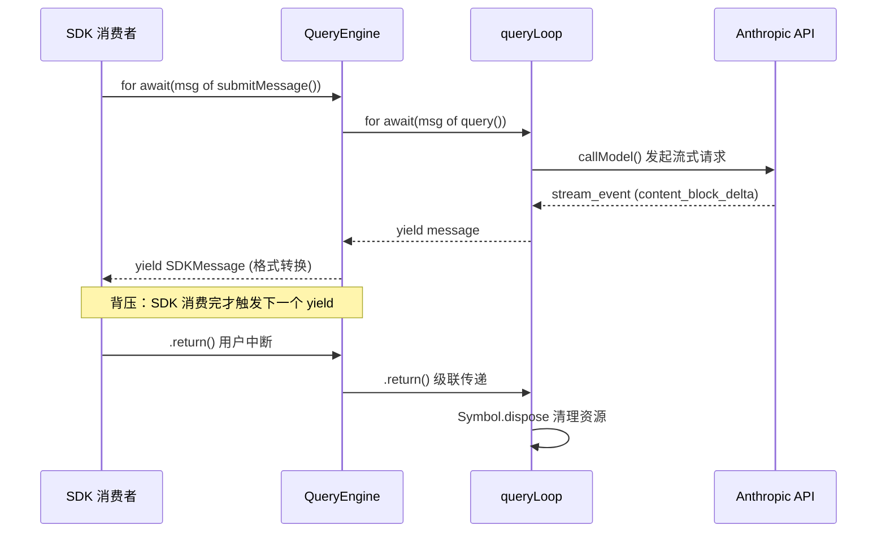
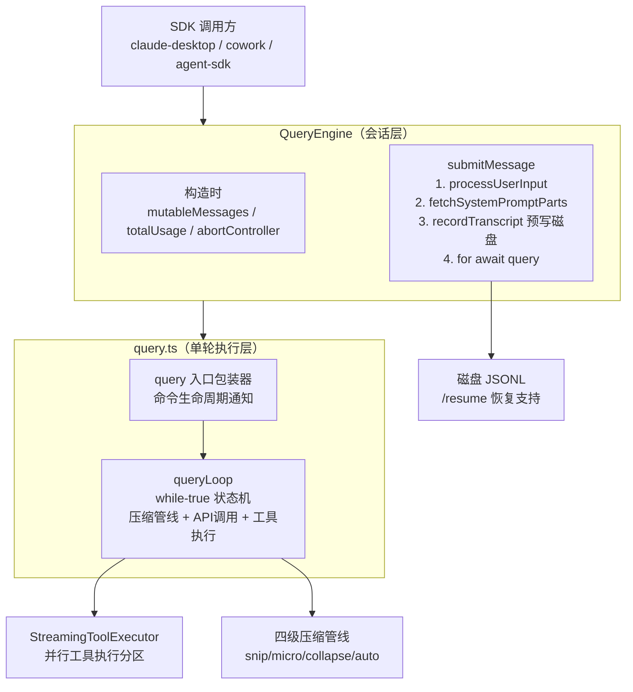
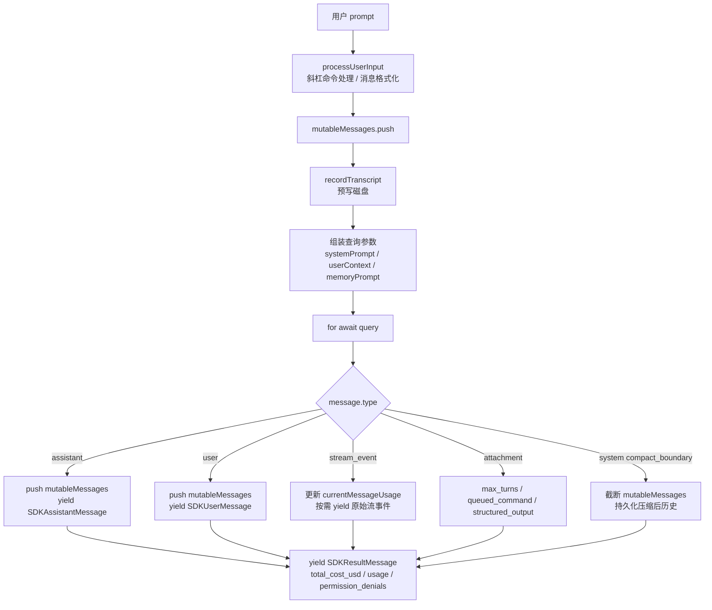

# QueryEngine（查询引擎核心）— Claude Code 源码深度分析

> 模块路径：`src/QueryEngine.ts` + `src/query.ts`
> 核心职责：两层循环模型驱动的会话级状态管理与单轮查询执行
> 源码版本：v2.1.88

---

## 一、模块概述

`QueryEngine` 是 Claude Code SDK 路径（无头模式、Agent SDK、cowork/desktop）的**会话级持久对象**。与 `query.ts` 中的无状态查询循环不同，`QueryEngine` 在多次 `submitMessage()` 调用之间保留完整状态：消息历史（`mutableMessages`）、累计 token 用量（`totalUsage`）、文件状态缓存（`readFileState`）、权限拒绝记录（`permissionDenials`）等。

设计意图来自源码注释：

> "One QueryEngine per conversation. Each submitMessage() call starts a new turn within the same conversation. State (messages, file cache, usage, etc.) persists across turns."

理解这个模块，首先要掌握其**两层循环模型**的分工。这不是随意的分层，而是两个本质不同的关注点的精确拆分：会话连续性（`QueryEngine`）与单轮执行完备性（`queryLoop`）。

---

## 二、两层循环模型

### 2.1 分层动机与职责边界

两层循环模型的核心思想是**按状态生命周期划分职责**：

```
┌─────────────────────────────────────────────────────────┐
│  QueryEngine（会话层）                                   │
│  生命周期：整个对话（多次 submitMessage）               │
│  状态：mutableMessages / totalUsage / readFileState     │
│  职责：SDK 协议适配、transcript 持久化、usage 累积     │
│                                                          │
│  ┌───────────────────────────────────────────────────┐  │
│  │  queryLoop（单轮执行层）                          │  │
│  │  生命周期：一次 submitMessage 内的多轮 API 调用   │  │
│  │  状态：State { messages / toolUseContext / ... }  │  │
│  │  职责：API 调用、工具执行、错误恢复               │  │
│  └───────────────────────────────────────────────────┘  │
└─────────────────────────────────────────────────────────┘
```

**QueryEngine 处理的是"会话管理"问题：**

- **多轮状态持续性**：用户第三次发消息时，历史消息从何而来？答案是 `mutableMessages`，它在每次 `submitMessage()` 之间持久保存。
- **Transcript 持久化**：进程崩溃后如何恢复？消息在进入 API 调用前就预写到磁盘（预写日志模式）。
- **SDK 协议适配**：内部的 `Message` 类型需要转换为 `SDKMessage`（附加 `session_id`、`uuid`、时间戳等字段）。
- **Usage 累积**：`currentMessageUsage` 跨流事件累积，在 `message_stop` 时汇入 `totalUsage`，最终输出单一的计费汇总。

**queryLoop 处理的是"单轮执行"问题：**

- **API 调用**：`deps.callModel()` 发起流式请求。
- **工具执行**：`StreamingToolExecutor` 并行执行 `tool_use` 块。
- **错误恢复**：`prompt_too_long`、`max_output_tokens`、模型回退等可恢复错误的处理。
- **上下文压缩**：四级压缩管线（snip / microcompact / contextCollapse / autocompact）在每轮循环入口处执行。

### 2.2 AsyncGenerator 连接两层

两层通过 `AsyncGenerator` 连接：`queryLoop` 通过 `yield` 产生消息，`QueryEngine` 的 `for await` 循环消费并转发。这不是随机的技术选择，而是 `AsyncGenerator` 三个特性的精确应用：

**特性一：背压（Backpressure）**

`for await...of` 是"拉取"语义。`QueryEngine` 每消费一条消息，`queryLoop` 才继续执行下一步。若 SDK 消费者处理缓慢（如网络发送），背压自然传递到 API 流的消费速度——整个链路不需要额外的缓冲队列。

**特性二：中断语义（`.return()` 级联关闭）**

当调用者调用 `generator.return()` 时（如用户按 Ctrl+C），`yield*` 会将 `.return()` 信号传递到被委托的 `queryLoop`，触发该生成器内部的 `using` 资源清理。这是一个**级联关闭**：外层关闭内层，内层通过 `Symbol.dispose` 清理资源，无需手动协调多个清理逻辑。

**特性三：流式组合（子 Agent 直接嵌套）**

子 Agent 的输出本身也是 `AsyncGenerator`，可以直接 `yield*` 嵌套到父 Agent 的流中，父 Agent 的消费者无感知地看到子 Agent 的消息流——这是 `yield*` 委托语义的自然扩展，无需中间 buffer。



### 2.3 模块依赖关系图



---

## 三、QueryEngine 详解

### 3.1 核心状态字段

**`QueryEngine` 类的关键私有字段：**

| 字段 | 类型 | 生命周期 | 用途 |
|------|------|----------|------|
| `mutableMessages` | `Message[]` | 跨轮次持续 | 完整会话历史，每轮 `submitMessage` 后追加 |
| `totalUsage` | `NonNullableUsage` | 跨轮次累积 | 所有轮次的 token 计费总和 |
| `readFileState` | `FileStateCache` | 跨轮次共享 | 文件内容缓存，避免重复磁盘读取 |
| `permissionDenials` | `SDKPermissionDenial[]` | 每轮清空 | 记录被拒绝的工具调用，写入 result 消息 |
| `discoveredSkillNames` | `Set<string>` | 每轮清空 | 追踪本轮首次发现的技能（分析指标用） |
| `hasHandledOrphanedPermission` | `boolean` | 全局一次性 | 防止孤立权限在多次 submitMessage 中重复处理 |

### 3.2 `submitMessage()` 的 12 个关键步骤

1. **清空技能发现集合**：`this.discoveredSkillNames.clear()` — 每轮独立追踪，防止跨轮累积
2. **设置工作目录**：`setCwd(cwd)` — 确保工具执行路径正确
3. **包装权限检查**：构建 `wrappedCanUseTool`，拦截拒绝并记录
4. **组装系统提示词**：`fetchSystemPromptParts()` + 协调器上下文 + 记忆提示词 + 追加提示词
5. **结构化输出注册**：若有 JSON Schema 且工具包含 `SyntheticOutputTool`，注册结构化输出强制钩子
6. **孤立权限处理**：`handleOrphanedPermission()` — 仅执行一次（`hasHandledOrphanedPermission` 标志保护）
7. **用户输入处理**：`processUserInput()` — 解析斜杠命令、转换消息格式
8. **预写磁盘记录**：在进入查询循环前写入用户消息，确保进程被杀死时也可 `/resume`
9. **技能与插件预热**：并行加载斜杠命令技能和插件（仅读缓存，不阻塞网络）
10. **构建系统初始化消息**：`buildSystemInitMessage()` — 包含工具清单、模型、权限模式等元信息
11. **执行查询循环**：`for await (message of query(...))`, 按消息类型 switch 处理
12. **输出汇总结果**：yield `SDKResultMessage`，包含总费用、用量、权限拒绝、结束原因

### 3.3 关键数据流



### 3.4 关键源码片段

**构造函数与状态初始化（`src/QueryEngine.ts:200-207`）**

```typescript
constructor(config: QueryEngineConfig) {
  this.config = config
  // 支持外部传入初始消息（用于会话恢复）
  this.mutableMessages = config.initialMessages ?? []
  // 支持外部传入 AbortController（用于主动取消）
  this.abortController = config.abortController ?? createAbortController()
  this.permissionDenials = []
  this.readFileState = config.readFileCache  // 文件内容缓存，跨轮共享
  this.totalUsage = EMPTY_USAGE             // 累计用量归零
}
```

**权限拒绝追踪包装器（`src/QueryEngine.ts:244-271`）**

```typescript
// 包装原始 canUseTool，在结果为拒绝时记录到 permissionDenials
const wrappedCanUseTool: CanUseToolFn = async (tool, input, ...) => {
  const result = await canUseTool(tool, input, ...)
  // 记录所有被拒绝的工具调用（行为不是 'allow'）
  if (result.behavior !== 'allow') {
    this.permissionDenials.push({
      tool_name: sdkCompatToolName(tool.name),
      tool_use_id: toolUseID,
      tool_input: input,
    })
  }
  return result
}
```

**系统提示词组装（`src/QueryEngine.ts:286-325`）**

```typescript
// 最终系统提示词：[默认/自定义提示词] + [记忆机制] + [追加提示词]
const systemPrompt = asSystemPrompt([
  ...(customPrompt !== undefined ? [customPrompt] : defaultSystemPrompt),
  ...(memoryMechanicsPrompt ? [memoryMechanicsPrompt] : []),
  ...(appendSystemPrompt ? [appendSystemPrompt] : []),
])
```

**消息类型分发（`src/QueryEngine.ts:757-828`）**

```typescript
switch (message.type) {
  case 'assistant':
    if (message.message.stop_reason != null) lastStopReason = message.message.stop_reason
    this.mutableMessages.push(message)
    yield* normalizeMessage(message)   // 转换为 SDKAssistantMessage
    break

  case 'stream_event':
    if (message.event.type === 'message_stop') {
      // message_stop 时才将本条消息 usage 汇入 totalUsage
      this.totalUsage = accumulateUsage(this.totalUsage, currentMessageUsage)
    }
    if (includePartialMessages) yield { type: 'stream_event', ... }
    break
}
```

**会话持久化策略（`src/QueryEngine.ts:437-463`）**

```typescript
// 预写用户消息：进程崩溃也可 /resume，避免"No conversation found"
if (persistSession && messagesFromUserInput.length > 0) {
  const transcriptPromise = recordTranscript(messages)
  if (isBareMode()) {
    void transcriptPromise          // bare 模式：fire-and-forget
  } else {
    await transcriptPromise         // 正常模式：等待写完
    if (isEnvTruthy(process.env.CLAUDE_CODE_EAGER_FLUSH)) {
      await flushSessionStorage()   // cowork 模式：强制刷盘
    }
  }
}
```

---

## 四、queryLoop 状态机详解

### 4.1 State 结构体

`queryLoop` 的核心设计是：**所有可变状态集中在单一 `State` 对象中**，每个 `continue` 站点通过 `state = { ...next }` 整体替换，而非逐字段赋值。

```typescript
// src/query.ts:268-278
let state: State = {
  messages: params.messages,          // 本轮要发送的消息列表
  toolUseContext: params.toolUseContext, // 工具调用上下文（并发控制等）
  autoCompactTracking: undefined,     // autocompact 状态追踪（consecutive failures）
  maxOutputTokensRecoveryCount: 0,    // max_output_tokens 恢复次数（上限 3）
  hasAttemptedReactiveCompact: false, // 是否已尝试过 reactiveCompact
  pendingToolUseSummary: undefined,   // 等待处理的工具用量摘要
  turnCount: 1,                       // 当前轮次计数
  transition: undefined,              // 上一次 continue 的原因（测试断言用）
}
```

**为什么用完整的 State 赋值替代多个独立变量？**

若使用独立变量（如 `let recoveryCount = 0`），每个 `continue` 站点只更新它关心的变量，其余变量隐式保持不变。这看起来简洁，实则危险——很容易在某个 `continue` 分支忘记重置某个变量，导致状态意外残留。`State` 对象强制每个 `continue` 显式声明所有字段的新值，任何遗漏在 TypeScript 类型检查时就会报错。

### 4.2 Continue 路径（7 种）

每种 `continue` 都对应一个明确的恢复场景：

| 编号 | `transition.reason` | 触发条件 | 状态变更 |
|------|---------------------|----------|----------|
| 1 | `tool_results` | 工具执行完毕，需要继续请求 | `messages` 追加工具结果 |
| 2 | `max_output_tokens_escalate` | 首次触碰输出 token 上限，尝试提升到 64k | `maxOutputTokensOverride` 设为 ESCALATED |
| 3 | `max_output_tokens_recovery` | 输出 token 上限且已尝试提升，注入"接着说"元消息 | `messages` 追加恢复消息，`maxOutputTokensRecoveryCount` +1 |
| 4 | `reactive_compact_retry` | `prompt_too_long` 触发压缩后重试 | `messages` 替换为压缩后版本，`hasAttemptedReactiveCompact: true` |
| 5 | `media_size_retry` | 图片过大被剥离后重试 | `messages` 中过大图片替换为占位符 |
| 6 | `fallback_model` | `FallbackTriggeredError` 切换备用模型 | `toolUseContext` 中模型替换 |
| 7 | `stop_hook_results` | `postSamplingHooks` 触发额外工具执行 | `messages` 追加停止钩子结果 |

### 4.3 Terminal 终止条件（10 种）

`queryLoop` 返回 `Terminal` 时，携带 `reason` 字段标识退出原因：

| 编号 | `reason` | 触发场景 |
|------|----------|----------|
| 1 | `end_turn` | 模型正常结束，无工具调用 |
| 2 | `tool_use_interrupted` | 工具执行被 AbortSignal 中断 |
| 3 | `aborted_streaming` | 流式响应期间 abort |
| 4 | `blocking_limit` | token 超出 `taskBudget.total` |
| 5 | `max_turns` | 达到 `maxTurns` 上限 |
| 6 | `prompt_too_long` | `prompt_too_long` 且已尝试过 reactiveCompact |
| 7 | `max_output_tokens_unrecoverable` | 三次恢复尝试后仍触碰 token 上限 |
| 8 | `error` | 不可恢复的 API 错误 |
| 9 | `api_error_overloaded` | API 过载且超出重试预算 |
| 10 | `task_budget_exceeded` | 任务预算消耗完 |

### 4.4 状态机全图

```
┌─────────────────────────────────────────────────────────┐
│                    while (true)                          │
│  ┌─────────────────────────────────────────────────┐    │
│  │  [入口] 消息预处理管线                          │    │
│  │  ① toolResultBudget → ② snip → ③ micro         │    │
│  │  → ④ contextCollapse → ⑤ autocompact           │    │
│  └──────────────────┬──────────────────────────────┘    │
│                     ↓                                    │
│  ┌──────────────────────────────────────────────────┐   │
│  │  callModel() — 流式 API 请求                     │   │
│  │  ┌─ yield stream events → 上游消费               │   │
│  │  └─ StreamingToolExecutor.addTool()              │   │
│  └──────────────────┬───────────────────────────────┘   │
│                     ↓                                    │
│         ┌───────────┴────────────┐                      │
│    needsFollowUp?              end_turn?                 │
│         │                        │                       │
│    ┌────▼──────────┐      ┌──────▼──────┐               │
│    │ 执行工具      │      │ stop hooks? │               │
│    │ continue ①    │      │ 有: continue⑦│              │
│    └───────────────┘      │ 无: Terminal │              │
│                            └─────────────┘              │
│                                                          │
│    错误处理路径:                                         │
│    prompt_too_long → hasAttempted? → T:Terminal⑥        │
│                    → !hasAttempted → reactiveCompact     │
│                                    → continue ④         │
│    max_output_tokens → canEscalate? → continue②         │
│                     → count<3?    → continue③           │
│                     → else        → Terminal⑦           │
│    media_size      → continue⑤                          │
│    FallbackTriggered → continue⑥                        │
└─────────────────────────────────────────────────────────┘
```

---

## 五、消息预处理管线（四级）

每轮循环开始时，`queryLoop` 在发起 API 调用前执行**从轻到重**的四级消息预处理管线。

### 5.1 管线概览

```
messages (本轮输入)
    │
    ▼
[Level 1] applyToolResultBudget()
    工具结果截断（content replacement state）
    轻量：仅截断字符串，无 API 调用
    │
    ▼
[Level 2] snipCompactIfNeeded()
    图片内联替换 + HISTORY_SNIP 片段压缩
    中轻量：可能需要读取图片文件
    │
    ▼
[Level 3] contextCollapse.applyCollapsesIfNeeded()
    Context Collapse（渐进折叠旧消息为摘要）
    中量：可能需要 API 调用生成摘要
    │
    ▼
[Level 4] autocompact()
    全量摘要（完整历史 → 单条摘要消息）
    重量：必然触发 API 调用
    │
    ▼
messagesForQuery (最终发送给 API)
```

### 5.2 Level 1：工具结果截断

**触发条件**：任何工具结果超过 `maxResultSizeChars` 或总工具结果超过预算。

**工作方式**：遍历消息历史，找到 `tool_result` 类型的内容块，若超出大小限制，将内容替换为截断占位符并记录 `content replacement state`（保留原始 tool_use_id，确保后续 API 调用的 `tool_use` / `tool_result` 配对关系不破坏）。

**不截断的后果**：超大文件内容（如 `cat` 一个 10MB 日志文件）会直接占满 context window，触发更昂贵的 Level 4 压缩甚至请求失败。

### 5.3 Level 2：图片内联替换与片段压缩

**图片内联替换**：将消息中的大型 base64 图片替换为文件路径引用，减少 token 消耗。在提交 API 前，若模型支持视觉，再按需内联回来。

**HISTORY_SNIP（片段压缩）**：保留对话尾部（最近的 N 轮），将中间历史压缩为摘要块，减少 token 占用同时保持近期上下文完整。返回 `snipTokensFreed` — 这个值会传递给 Level 4 的阈值计算，防止 snip 刚降到阈值以下时仍被 autocompact 误触发。

### 5.4 Level 3：Context Collapse（渐进折叠）

`contextCollapse` 比 autocompact 粒度更细：它不替换整个历史，而是识别**可折叠的段落**（如多个连续的工具调用轮次），将这些段落折叠为更紧凑的摘要，保留不可折叠的部分（如最近的对话、用户明确引用的内容）不动。

**与 Level 4 的区别**：

| 维度 | Context Collapse | AutoCompact |
|------|------------------|-------------|
| 信息损失 | 部分（仅折叠选定段落） | 全量（整个历史 → 摘要） |
| API 调用 | 按需（仅对折叠段落） | 必然（一次完整摘要调用） |
| 触发条件 | 渐进式（接近阈值时） | 阈值触发（接近上限时） |
| 恢复路径 | 不影响 compact_boundary | 产生 compact_boundary 事件 |

### 5.5 Level 4：AutoCompact（全量摘要）

**触发阈值计算：**

```
有效上下文窗口 = 模型上下文窗口 - max(max_output_tokens, 20000)
触发阈值       = 有效上下文窗口 - 13000（安全边距）
实际判断       = 当前 token 数 - snipTokensFreed > 触发阈值
```

为什么要减去 `max(max_output_tokens, 20000)`？因为模型需要保留足够的空间生成输出，若输入占满整个 context window，模型就无法输出任何内容。`20000` 是最小保留量，防止 `max_output_tokens` 设置过小时保留量不足。

**执行过程**：fork 出一个独立的 API 调用（`deps.autocompact()`），将整个消息历史压缩为单条摘要消息，替换 `messagesForQuery`，并产生 `compact_boundary` 系统消息通知 `QueryEngine` 截断 `mutableMessages`。

**断路器设计（circuit breaker）**：

若 autocompact 连续失败（API 超时、率限等），断路器在连续失败 3 次后停止重试。源码注释中记录了这一设计的量化依据：

> "1,279 sessions had 50+ consecutive failures, wasting ~250K API calls/day globally"

这是一个典型的**以数据驱动的工程决策**：没有断路器前，一个损坏的 autocompact 会持续触发失败重试，浪费算力；加了断路器后，快速失败让系统退化为"不压缩"模式继续运行，而非无限重试。

```typescript
// src/query.ts — autocompact 断路器逻辑（示意）
const { compactionResult, consecutiveFailures } = await deps.autocompact(...)

if (consecutiveFailures >= AUTOCOMPACT_MAX_CONSECUTIVE_FAILURES) {
  // 断路器打开：跳过 autocompact，继续但上下文可能接近上限
  tracking.circuitBreakerOpen = true
}
```

### 5.6 为什么分层而非单一压缩

**从轻到重**的分层设计来自一个核心原则：**避免不必要的 API 调用**。

Level 1-2 是纯内存操作，几乎零成本。若 Level 2 的 snip 就能把 token 数降到阈值以下，Level 3-4 就不需要运行。autocompact 是最昂贵的操作（需要一次完整的 API 调用，延迟 2-10 秒），应尽量推迟或避免触发。

设想若去掉分层，每次接近上限时直接 autocompact：

- 频繁的自动压缩会显著增加延迟（每次压缩增加 2-10 秒）
- 大量轻微溢出情况（snip 可以解决的）会被过度处理
- 用户体验：明明只是稍微超出一点，却要等待一个额外的 API 调用完成

---

## 六、流式工具执行器（StreamingToolExecutor）

### 6.1 批量执行 vs 流式执行

**传统批量执行模型**：等待流式响应完全结束 → 解析所有 `tool_use` 块 → 批量执行所有工具 → 汇总结果 → 继续请求。

**问题**：假设模型决定执行 3 个工具（读取文件 A、读取文件 B、搜索代码），这 3 个工具在消息开头就已确定，但批量模型必须等待整条消息流完毕才能开始执行。若消息流需要 1 秒，工具执行需要 0.5 秒，总计 1.5 秒。

**流式执行模型**：在流式响应过程中，一旦出现完整的 `tool_use` 块就立即开始执行该工具；其他工具块在后续流中到来时也立即启动执行；流结束时大部分工具可能已经完成。

**延迟对比**：

```
批量执行:  ──── stream(1s) ──── ─ tool A(0.5s) ─ ─ tool B(0.5s) ─ ─ tool C(0.5s) ─
          总计: 2.5 秒

流式执行:  ──── stream(1s) ────
                  ├─ tool A(0.5s) ─┤
                      ├─ tool B(0.5s) ─┤
                          ├─ tool C(0.5s) ─┤
          总计: 1.5 秒（重叠执行）
```

### 6.2 并行分区模型

并非所有工具都可以并行执行。`StreamingToolExecutor` 使用**并行分区**（parallel partition）模型来安全地最大化并行度：

**规则**：
- 连续的并发安全（`isConcurrencySafe()`）工具组成一个分区，分区内并行执行
- 遇到一个非并发安全工具，开启新分区，等待上一个分区完全完成后再执行该工具
- 新分区的后续工具若并发安全，继续并行

```
工具调用顺序: [A:safe] [B:safe] [C:unsafe] [D:safe] [E:safe] [F:unsafe]

分区 1: [A, B] → 并行执行
         ↓ 等待分区 1 完成
单独执行: [C]
         ↓
分区 2: [D, E] → 并行执行
         ↓ 等待分区 2 完成
单独执行: [F]
```

### 6.3 isConcurrencySafe() 的判定逻辑

**为什么 `FileRead` 并发安全，而 `FileEdit` 不是？**

`FileRead` 只读取文件内容，多个并发的 `FileRead` 不会相互影响——无论顺序如何，读取的是同一个文件内容（假设文件在工具执行期间不变）。

`FileEdit` 会修改文件。若两个 `FileEdit` 操作同一文件并发执行：
- Edit A 读取文件并计算补丁
- Edit B 也读取同一文件并计算补丁
- Edit A 先写入 → 文件变更
- Edit B 用旧版本计算的补丁写入 → 基于错误版本的补丁，导致数据损坏

即使操作不同文件，`FileEdit` 也被标记为非并发安全，因为：
1. 编辑顺序在语义上可能重要（依赖关系）
2. 工具实现难以证明操作的独立性

**`fail-closed` 原则**：

若 `isConcurrencySafe()` 在调用工具时**抛出异常**（工具未实现该方法、或内部出错），`StreamingToolExecutor` 将该工具**视为非并发安全**，开启新分区串行执行。这是 fail-closed 设计：宁可多串行（性能损失），不能并行执行可能不安全的工具（数据损坏）。

```typescript
// src/StreamingToolExecutor.ts — 并发安全判断（示意）
function isToolConcurrencySafe(tool: Tool, input: ToolInput): boolean {
  try {
    return tool.isConcurrencySafe(input)  // 工具自报是否并发安全
  } catch {
    return false  // fail-closed：异常时默认不安全
  }
}
```

### 6.4 FallbackTriggeredError 时的处理

当流式响应过程中触发模型回退（`FallbackTriggeredError`），`StreamingToolExecutor` 必须：
1. 调用 `discard()` 放弃所有进行中的工具执行（即便某些工具已完成）
2. 旧的 `tool_use_id` 不会出现在新模型的响应中，若不丢弃会产生"孤儿工具结果"
3. 创建新的 `StreamingToolExecutor` 实例，以新模型重新开始流式请求

这是一个强一致性保证：**要么整个轮次（一次 API 请求 + 其工具执行）成功，要么整体回滚重试**，不存在"部分工具结果"的中间状态。

---

## 七、消息扣留机制

### 7.1 为什么需要"扣留"

在流式响应过程中，API 可能返回错误状态（如 `prompt_too_long`、`max_output_tokens`）。这些错误以特殊消息的形式出现在流中。

**SDK 消费者的问题**：若 `QueryEngine` 直接将这些错误 yield 给 SDK 消费者（如 claude-desktop），消费者看到 `is_error: true` 的消息，通常会**立即终止会话**。但对于 `queryLoop` 来说，这些错误并非真正终止——它们是**可恢复的**，内部有恢复路径（压缩后重试、注入恢复消息等）。

**解决方案**：**扣留（withhold）** 这些错误消息，不 yield 给上游，等待确认：

- 若内部成功恢复 → 扣留的错误消息永远不被释放，消费者感知不到曾经出错
- 若恢复失败（所有路径耗尽）→ 释放扣留的错误消息，作为终止结果的一部分

```
流式响应: [...正常内容...] [ERROR:prompt_too_long]
                               ↑
                        扣留，不 yield
                               ↓
              reactiveCompact() → 压缩后重试
              → 成功：扣留的 ERROR 消息丢弃
              → 失败：释放 ERROR 消息，Terminal
```

### 7.2 三类被扣留消息

| 错误类型 | 扣留原因 | 恢复路径 |
|----------|----------|----------|
| `prompt_too_long` | 消息过长，API 拒绝 | `reactiveCompact()` 压缩历史后重试 |
| `media_size` | 图片/文件过大 | 剥离过大媒体内容后重试 |
| `max_output_tokens` | 模型输出被截断 | 先尝试提升输出上限，再注入"接着说"恢复消息 |

### 7.3 扣留标志的实现

```typescript
// src/query.ts — 扣留机制（节选）
for await (const message of deps.callModel({ ... })) {
  let withheld = false

  // 检查是否需要扣留
  if (reactiveCompact?.isWithheldPromptTooLong(message)) withheld = true
  if (isWithheldMaxOutputTokens(message)) withheld = true

  if (!withheld) {
    yield message  // 正常消息立即透传给上游
  }
  // 扣留的消息保存在局部变量，供后续恢复逻辑使用
}

// 循环结束后，根据扣留消息决定 continue 或 Terminal
if (reactiveCompact?.hasWithheld()) {
  // 有被扣留的 prompt_too_long 消息 → 压缩后 continue
}
```

---

## 八、Token Budget 与递减收益检测

### 8.1 Token Budget 的整体设计

`taskBudget` 是外部调用者（如 orchestrator）注入的预算约束，限制单个子任务可以消耗多少上下文窗口空间。这主要用于**多 Agent 场景**，防止单个子 Agent 无限消耗资源。

```
taskBudget.total = 100,000 tokens
    ↓
每次 autocompact 时：
  taskBudgetRemaining -= preCompactContext（压缩前的上下文大小）
    ↓
当 taskBudgetRemaining <= 0 时：
  Terminal("task_budget_exceeded")
```

**子 Agent 不参与 token budget 的原因**：子 Agent 有自己独立的 `taskBudget`（由协调器分配），若子 Agent 的消耗也算入父 Agent 的预算，则嵌套调用会导致预算快速耗尽，破坏多层 Agent 协作的可行性。

### 8.2 模型自然停止时的 Nudge 消息

当模型自然停止（`end_turn`）但 token 预算尚未用完时，queryLoop 会注入一条 **nudge 消息**，引导模型继续完成任务：

**触发条件**：
- `stop_reason === 'end_turn'`（模型主动停止，不是 token 耗尽）
- `taskBudget` 存在且还有剩余
- 模型响应中没有实质性内容（判断任务未真正完成）

**Nudge 消息内容**（示意）：

```
"Continue — you have remaining capacity. Keep working on the task."
```

**目的**：防止模型"过早停止"。某些模型在不确定是否应该继续时会选择停止，nudge 消息给它明确的信号：预算充足，继续执行。

### 8.3 递减收益检测

持续 nudge 但模型每次增量贡献越来越少，说明任务已趋于完成（或模型陷入低效循环）。**递减收益检测**在连续 3 次 nudge 后的每次增量小于 500 tokens 时停止 nudge。

**判断逻辑**：

```typescript
// 伪代码：递减收益检测
const DIMINISHING_RETURNS_THRESHOLD = 500  // tokens
const CONSECUTIVE_CHECK_COUNT = 3

if (consecutiveLowYieldCount >= CONSECUTIVE_CHECK_COUNT) {
  // 停止 nudge：继续下去也只是在浪费预算
  return Terminal('diminishing_returns')
}

if (lastTurnOutputTokens < DIMINISHING_RETURNS_THRESHOLD) {
  consecutiveLowYieldCount++
} else {
  consecutiveLowYieldCount = 0  // 重置：本轮有实质贡献
}
```

**设计意图**：避免"死循环收费"场景——模型停止后被 nudge，每次只输出几十个 token 的无意义内容，消耗大量预算却没有产出。500 tokens 的阈值是经验值：低于此值通常意味着模型在"凑字"而非真正工作。

---

## 九、设计模式深度分析

### 9.1 外观模式（Facade Pattern）

`QueryEngine` 为 SDK 消费者提供简单的 `submitMessage()` 接口，隐藏了 `processUserInput`、`fetchSystemPromptParts`、`query()` 循环、`recordTranscript` 等十余个子系统的协调细节。SDK 调用方只需关心"输入 prompt，处理 SDKMessage 流"，无需了解内部状态机。

### 9.2 模板方法模式（Template Method）

`submitMessage()` 定义了查询的骨架流程（准备 → 执行 → 收集 → 报告），其中"执行"步骤委托给 `query()`，各处理细节（系统提示词组装、权限包装等）以私有方法形式注入。

### 9.3 双缓冲消息（Dual Message Lists）

`this.mutableMessages` 是跨轮次持久的完整历史；每次 `submitMessage()` 开始时创建 `const messages = [...this.mutableMessages]` 快照，作为当次查询的不可变输入。查询循环结束后，新消息 push 到 `mutableMessages`。双缓冲防止查询进行中的新消息污染本次查询的上下文。

### 9.4 扣留-恢复模式（Withhold-then-Recover）

对可恢复错误，先扣留不透传，尝试恢复路径。恢复成功则消费者无感知；恢复失败才释放错误。这使 SDK 消费者看到的始终是"干净"的消息流，减少消费者的错误处理复杂度。

### 9.5 显式资源管理（`using` 关键字）

`using pendingMemoryPrefetch = ...` 使用 ES2023 显式资源管理协议，保证在**所有退出路径**（正常 return、throw 异常、`.return()` 调用）上都触发 `Symbol.dispose`。传统 `try/finally` 在 `.return()` 调用时不保证执行，`using` 语义更可靠。

---

## 十、高频面试 Q&A

### 设计决策题

**Q1：`QueryEngine` 与 `query()` 函数的职责边界是如何划分的？**

A：划分原则是**状态生命周期**。`query()` 是无状态的查询循环：它接受完整参数，执行一轮完整的"请求→工具→请求"循环，返回 Terminal。它不持有任何跨调用状态。`QueryEngine` 是有状态的会话管理器：它持有 `mutableMessages`（跨轮次累积）、`totalUsage`（累计计费）、`readFileState`（文件缓存）等，并在每次 `submitMessage()` 中将当前状态注入到 `query()` 的参数中。

这种分离产生了两个独立可测试的单元：`query()` 可在不需要 `QueryEngine` 存在的情况下测试（注入 mock `deps`），`QueryEngine` 的状态管理逻辑可在不需要真实 API 调用的情况下测试（mock `query()`）。

**Q2：为什么 AsyncGenerator 是两层循环模型之间最合适的连接方式？而非 EventEmitter 或 callback？**

A：AsyncGenerator 提供了三个 EventEmitter/callback 无法原生提供的特性：

1. **背压**：`for await...of` 的拉取语义自然支持背压——消费者处理完才触发下一个 yield，防止生产者产生消费者处理不完的消息队列。EventEmitter 是推送模型，天然无背压。

2. **中断语义**：`.return()` 调用会通过 `yield*` 级联传递，内层生成器可用 `using` 协议可靠清理资源。EventEmitter 无法可靠传递"停止"信号到所有监听者。

3. **流式组合**：子 Agent 也是 AsyncGenerator，直接 `yield*` 嵌套进父 Agent 流，无需中间缓冲层。这在 EventEmitter 模型中需要手动转发每个事件。

### 原理分析题

**Q3：消息预处理管线为什么必须按 Level 1→4 的顺序执行，能否乱序？**

A：不能乱序，每级都依赖前一级的输出，且存在语义依赖：

- Level 1（truncation）必须先于 Level 2（snip）：snip 的 token 计算基于截断后的内容，若先 snip 再截断，snip 结果可能不准确
- Level 2 产生 `snipTokensFreed` 值，Level 4 的阈值判断必须减去这个值；若乱序，Level 4 会用错误的 token 数判断是否触发
- Level 3（contextCollapse）和 Level 4（autocompact）互斥执行同一段落：若两者都运行，同一历史段落会被重复压缩，信息损失加倍
- 整体原则是"从轻到重"：若轻量操作已足够，重量操作不运行，减少总开销。若乱序先运行重量操作，即使后来发现轻量操作本可解决问题，代价已付出

**Q4：`State.transition` 字段在生产代码中保留（非仅测试）的价值是什么？**

A：`transition.reason` 是语义稳定的枚举字符串（如 `'max_output_tokens_escalate'`、`'reactive_compact_retry'`），与消息内容解耦。保留它的生产价值有三点：

1. **可观测性**：日志/trace 中记录 `transition.reason` 使运维团队可以追溯恢复路径，而无需解析消息内容。"用户报告会话很慢"→ 查日志发现 `consecutive: reactive_compact_retry × 5`，立即定位到 prompt_too_long 反复触发的问题。

2. **测试稳健性**：注释明确说明 "Lets tests assert recovery paths fired without inspecting message contents"——消息文本在版本迭代中经常变化，基于 `transition.reason` 的断言不受此影响。

3. **调试成本趋零**：字段值本身是内存中的字符串，不额外计算，不影响性能，但在出问题时价值极高。

**Q5：autocompact 的断路器设计（连续失败 3 次停止重试）有什么权衡？**

A：这是**可用性**（会话继续运行）vs **上下文质量**（是否压缩）的权衡。

- **无断路器**：autocompact 失败时无限重试，每轮循环都浪费一次 API 调用（~250K calls/day 的全球浪费），且会话在等待重试期间陷入死循环。
- **断路器打开后**：跳过 autocompact，上下文继续增长，可能很快触碰真正的 context window 上限，导致 `prompt_too_long`。
- **3 次阈值**：经验值，balances "偶发性失败应该重试"与"持续性失败应该快速失败"。具体来源于 1,279 sessions × 50+ consecutive failures 的量化分析——这批 session 每个至少浪费了 50 次 API 调用，设置 3 次上限可以将浪费从 50+ 降至 3。

3 次而非 1 次的原因：autocompact API 调用可能因瞬时网络问题失败，1 次失败就打开断路器会过于激进，让太多 session 在短暂网络波动后退化为不压缩模式。

### 权衡与优化题

**Q6：流式工具执行器（StreamingToolExecutor）并行分区模型的性能收益和风险如何量化？**

A：**性能收益**：在典型的"读取多个文件"场景中（3 个 `FileRead` 工具），流式并行执行将工具执行从串行 3×0.5s = 1.5s 缩短到 max(0.5s) = 0.5s，延迟减少约 67%。每轮循环节省的时间在多轮 Agent 任务中累积效果显著（10 轮任务可节省数秒到数十秒）。

**风险**：并发安全判断依赖工具自报（`isConcurrencySafe()`）。若工具实现有误（错误地报告自己是安全的），并发执行可能导致竞态条件。fail-closed 设计（异常时默认不安全）缓解了实现缺陷的影响，但不能完全消除工具故意报告错误的风险。

在实践中，内置工具（`FileRead`、`Bash`、`Search` 等）的并发安全声明经过审查，第三方 MCP 工具的安全性依赖工具开发者的正确实现，这是多 Agent 系统的固有信任边界。

**Q7：`QueryEngine` 在 compact_boundary 到来时如何截断 mutableMessages？截断后已丢弃的历史消息对会话质量有何影响？**

A：`compact_boundary` 事件携带 `tailUuid`，表示压缩后保留段的第一条消息 UUID。`QueryEngine` 在 `mutableMessages` 中找到该 UUID 对应的位置，丢弃其之前的所有消息，只保留该段之后的消息。这确保 `mutableMessages` 的内存占用与上下文窗口保持同步。

**对会话质量的影响**：autocompact 生成的摘要消息替代了原始历史，摘要的质量决定会话继续的质量。摘要会损失：细节（精确的工具参数）、时序信息（消息之间的时间间隔）、情感/语气细节。但摘要保留了：关键发现、决策结果、当前任务状态。

**实践含义**：若用户在压缩后引用"你之前说的第 3 个方案"，模型可能无法准确回忆，因为具体的"第 3 个方案"细节可能在摘要中被泛化了。这是 Claude Code 在长会话中偶尔出现记忆不准确的根本原因。

### 实战应用题

**Q8：如果要给 QueryEngine 添加"会话成本上限"（超过 $X 时拒绝新轮次），最佳实现方式是什么？**

A：最佳接入点是 `submitMessage()` 入口处，在 `processUserInput()` 之前，检查 `this.totalUsage` 对应的费用估算：

```typescript
// 在 submitMessage() 开始处
const currentCost = estimateCost(this.totalUsage)  // token 数 × 单价
if (this.config.maxSessionCostUsd && currentCost >= this.config.maxSessionCostUsd) {
  yield {
    type: 'result',
    subtype: 'error_budget_exceeded',
    is_error: true,
    total_cost_usd: currentCost,
    usage: this.totalUsage,
    errors: [`Session cost $${currentCost.toFixed(4)} exceeds limit $${this.config.maxSessionCostUsd}`],
  }
  return
}
```

注意区分两个费用计数器：`this.totalUsage` 是 `QueryEngine` 实例级别（该会话的费用），`getTotalCost()` 是进程级别（所有会话/工具调用的总费用）。"会话上限"应使用实例级别的 `this.totalUsage`。

**Q9：SDK 消费者如何正确处理各种终止原因，避免遗漏或错误处理？**

A：SDK 消费者应通过 `result` 消息的 `subtype` + `stop_reason` 组合判断：

| `subtype` | `stop_reason` | 含义 | 建议处理 |
|-----------|---------------|------|----------|
| `success` | `end_turn` | 正常完成 | 展示结果 |
| `success` | `tool_use` | 工具执行后完成 | 展示结果 |
| `error_max_turns` | 任意 | 达到轮次上限 | 询问用户是否继续（重新 submitMessage） |
| `error_during_execution` | 任意 | 执行期间发生错误 | 展示错误，建议用户报告 |
| `error_budget_exceeded` | 任意 | 任务预算耗尽 | 询问是否扩大预算 |

注意：**不应仅检查 `is_error`**，不同 `subtype` 对应不同的用户交互策略。`max_turns` 是用户可控的（可以继续）；`error_during_execution` 可能是 bug（需要报告）；`budget_exceeded` 需要显示费用信息。

实践建议：在消费者代码中用 `exhaustive switch` 处理所有 `subtype` 枚举值，利用 TypeScript 的穷举检查确保未来新增 subtype 时编译报错，而非运行时漏处理。

---

> 源码版权归 [Anthropic](https://www.anthropic.com) 所有，本笔记仅供学习研究使用。文档内容采用 [CC BY-NC 4.0](https://creativecommons.org/licenses/by-nc/4.0/) 协议。
