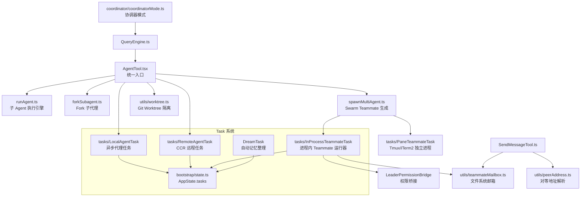
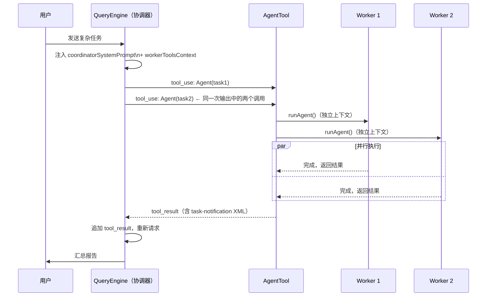

# 多 Agent 协作与 Swarm 系统 — Claude Code 源码分析

> 模块路径：`src/tools/AgentTool/`、`src/utils/swarm/`、`src/coordinator/`、`src/tasks/`
> 核心职责：多 Agent 协作的调度、通信、权限传递与生命周期管理
> 源码版本：v2.1.88

---

## 一、模块概述

Claude Code 的多 Agent 系统是整个产品最复杂的子系统之一。它解决的核心问题是：**如何让多个 AI 实例在同一个任务上安全、有效地协作，同时保证权限边界清晰、资源开销可控？**

系统的设计哲学可以用一句话概括：**通过统一的工具接口（AgentTool）触发多种协作模式，通过文件系统邮箱解耦通信，通过三层权限继承规则保证安全边界**。

本文涵盖：三层协作架构、AgentTool 路由设计、Agent 定义体系、子 Agent 执行引擎、Team/Swarm 后端选择、进程内 Teammate 运行器、Leader Permission Bridge、Coordinator 模式、Task 基础设施，以及多 Agent 场景下的权限传递规则。

---

## 二、架构设计

### 2.1 三层协作架构

Claude Code 将多 Agent 协作组织为三个层次，层次越高，协作越复杂，管控成本越大：

```
┌─────────────────────────────────────────────────────────────┐
│  Layer 3 — Coordinator（协调器）                            │
│  纯编排，不直接操作文件。工具集 ~6 个：                       │
│  TeamCreate / TeamDelete / SendMessage / Agent              │
│  TaskStop / SyntheticOutput                                 │
├─────────────────────────────────────────────────────────────┤
│  Layer 2 — Team / Swarm（蜂群）                             │
│  成员互相通信，有 leader / teammate 角色分工。               │
│  两种后端：Pane-based（独立进程）/ In-process（共享进程）     │
├─────────────────────────────────────────────────────────────┤
│  Layer 1 — Subagent（子代理）                               │
│  最轻量。父 Agent 同步或异步派生子 Agent，                   │
│  子 Agent 运行独立上下文，完成后通知父 Agent                 │
└─────────────────────────────────────────────────────────────┘
```

**为何分三层？** 层次越高的协作模式能力越强，但资源开销、权限复杂度和调试难度也成倍增长。简单并行任务只需 Subagent；需要持续交互和角色分工的长期工作流需要 Team；纯任务分发且不需要直接执行能力的编排者使用 Coordinator。分层设计让调用方按需选择最轻量的协作方式。

### 2.2 AgentTool：统一入口的路由设计

所有多 Agent 协作都通过同一个工具触发——`AgentTool`。这是一个**策略路由器**，通过参数组合决定实际执行路径：

```
AgentTool.call(input)
    │
    ├─ isForkSubagentEnabled() && subagent_type?
    │   └─ forkSubagent()              ← Fork 模式（共享已初始化上下文）
    │
    ├─ isolation === 'remote'?
    │   └─ registerRemoteAgentTask()   ← CCR 远程执行（完全隔离）
    │
    ├─ isolation === 'worktree'?
    │   └─ createAgentWorktree()       ← Git Worktree 文件隔离
    │       └─ runAgent()
    │
    ├─ isAgentSwarmsEnabled() && name?
    │   └─ spawnTeammate()             ← Swarm Teammate 模式
    │
    ├─ run_in_background === true?
    │   └─ registerAsyncAgent()        ← 后台异步代理
    │       └─ return { status: 'async_launched', agentId }
    │
    └─ 同步默认路径
        └─ runAgent()                  ← 等待完成后返回结果
```

**统一入口的好处**：LLM 只需学习一个工具的语义，通过参数组合触发不同行为。对 Claude 而言，"创建子任务"和"启动蜂群成员"是同一个认知动作，降低了提示词工程的复杂度。

### 2.3 Agent 定义体系：三层联合类型

每个 Agent 的行为由 `AgentDefinition` 描述，采用三层联合类型：

```typescript
// src/tools/AgentTool/loadAgentsDir.ts
type AgentDefinition =
  | BuiltInAgentDefinition      // 内置 Agent，代码中硬编码
  | CustomAgentDefinition       // 用户自定义，从 ~/.claude/agents/ 加载
  | PluginAgentDefinition       // 插件提供，通过插件系统注册

// 每个 AgentDefinition 包含以下字段：
interface AgentDefinitionBase {
  type: string                          // 类型标识符（如 'general-purpose'）
  allowedTools?: string[]               // 工具白名单
  disallowedTools?: string[]            // 工具黑名单
  getSystemPrompt: () => string         // 系统 prompt 生成函数
  model?: ModelAlias                    // 模型选择（可为 'inherit'）
  permissionMode?: PermissionMode       // 权限模式覆盖
  memoryScope?: MemoryScope             // 持久记忆范围
  isolationMode?: IsolationMode         // 隔离模式
  hooks?: AgentLifecycleHooks           // 生命周期钩子
}
```

**覆盖优先级**（从低到高）：

```
built-in < plugin < userSettings < projectSettings < flagSettings < policySettings
```

这是典型的策略叠加（Policy Layering）设计：组织策略（`policySettings`）永远能覆盖用户配置，但用户配置能覆盖内置默认值，保证了企业部署场景下的合规管控能力。

### 2.4 内置 Agent 类型的设计哲学

Claude Code 内置了四种 Agent 类型，每种都针对特定场景做了精准优化：

| 类型 | 模型 | 工具集 | 设计意图 |
|------|------|--------|----------|
| `general-purpose` | 继承父 Agent | 全部工具 | 万能工人，最大能力 |
| `Explore` | Haiku（外部） | 只读工具 | 省略 CLAUDE.md 和 gitStatus，减少 token 消耗 |
| `Plan` | 继承父 Agent | 只读工具，无执行能力 | 制定计划，不产生副作用 |
| `verification` | 继承父 Agent | 只读工具 | 专门对抗 LLM 验证逃避模式，总是异步运行 |

**Explore Agent 的成本优化细节**：注释中记录了一个真实数据——"saves ~5-15 Gtok/week across 34M+ Explore spawns"。仅仅省略 CLAUDE.md 和 gitStatus 两项上下文，每周节省数吨 token。这体现了"在正确的地方做减法"的工程哲学。

**verification Agent 的对抗设计**：其系统提示词约 120 行，专门针对 LLM 的验证逃避模式。典型的逃避模式包括：代码看起来正确但实际上有逻辑错误、测试覆盖率高但未覆盖边界条件、改动量小就认为风险低。verification Agent 通过结构化检查清单强制模型逐项验证，而非依赖直觉判断。

### 2.5 模块依赖关系图



### 2.6 关键数据流

**Coordinator 编排一次并行任务的完整流程：**



---

## 三、核心实现走读

### 3.1 子 Agent 执行引擎：runAgent()

`runAgent()` 是所有子 Agent 执行路径的核心，它是一个 `AsyncGenerator`，复用主 Agent 的 `query()` 函数：

```typescript
// src/tools/AgentTool/runAgent.ts（简化）
export async function* runAgent(
  params: RunAgentParams
): AsyncGenerator<AgentEvent> {
  // 1. 解析 Agent 定义（内置 / 自定义 / 插件）
  const agentDef = resolveAgentDefinition(params.subagentType)

  // 2. 构建子 Agent 工具池（三层过滤）
  const tools = filterToolsForAgent(agentDef, params.parentContext)

  // 3. 复用主 Agent 的 query() 函数，传入独立上下文
  for await (const event of query({
    prompt: params.prompt,
    tools,
    systemPrompt: agentDef.getSystemPrompt(),
    model: resolveTeammateModel(params.model, params.leaderModel),
    permissionContext: buildChildPermissionContext(params),
  })) {
    yield event  // 向父 Agent 流式转发事件
  }
}
```

**工具过滤三层规则**（按优先级从高到低）：

1. `ALL_AGENT_DISALLOWED_TOOLS`：所有子 Agent 都不能使用的工具（如 `TeamCreate`、`TeamDelete`，防止工作者递归建立控制结构）
2. `CUSTOM_AGENT_DISALLOWED_TOOLS`：自定义 Agent 额外的黑名单（防止第三方 Agent 定义滥用高权限工具）
3. `ASYNC_AGENT_ALLOWED_TOOLS`：异步 Agent 的白名单（后台 Agent 工具集更保守）
4. MCP 工具（`mcp__` 前缀）始终放行——MCP 工具的权限由 MCP 服务器自身管控

**清理阶段 8 项操作**：Agent 完成后，`finalizeAgentTool()` 依次执行：截断超长输出、提取最终结果、生成进度摘要、更新 AppState.tasks 状态、触发 PostTask 钩子、释放 AbortController、清理 worktree（如有）、记录 token 消耗。

### 3.2 Team/Swarm 两种后端的权衡

Swarm 模式提供两种运行后端，通过运行环境自动选择：

```typescript
// src/shared/spawnMultiAgent.ts（简化选择逻辑）
function selectTeammateBackend(): TeammateBackend {
  if (isSDKMode()) {
    return new InProcessBackend()   // SDK 模式强制进程内运行
  }
  if (hasTmux()) {
    return new TmuxPaneBackend()    // 首选：tmux 独立 pane
  }
  if (hasITerm2()) {
    return new ITerm2PaneBackend()  // 备选：iTerm2 独立窗格
  }
  if (isExternalTmux()) {
    return new TmuxBackend()        // 外部 tmux 会话
  }
  throw new Error('No supported terminal backend for Swarm mode')
}
```

两种后端的核心权衡：

| 维度 | Pane-based（独立进程） | In-process（共享进程） |
|------|----------------------|----------------------|
| 隔离性 | 强（独立进程，崩溃不传播） | 弱（共享堆，异常可能相互影响） |
| 资源开销 | 高（独立 V8 实例 + 内存） | 低（共享 Node.js 进程） |
| 可视化 | 每个 Teammate 独立终端窗格 | 日志聚合到主进程输出 |
| 通信延迟 | 高（文件系统邮箱 + 轮询） | 低（内存直接调用） |
| 适用场景 | 长期交互，需要人工观察 | 短期任务，SDK 集成 |

**统一接口 TeammateExecutor**：两种后端都实现同一接口，调用方无需关心底层实现：

```typescript
interface TeammateExecutor {
  spawn(config: TeammateConfig): Promise<void>
  sendMessage(message: StructuredMessage): Promise<void>
  terminate(): Promise<void>   // 优雅关闭（等待当前轮次完成）
  kill(): Promise<void>        // 强制关闭
  isActive(): boolean
}
```

### 3.3 进程内 Teammate 运行器：最复杂的协作引擎

`InProcessTeammateRunner`（约 1400 行）是整个多 Agent 系统中代码量最大、逻辑最复杂的模块。其复杂性来源于三个方面：权限降级策略、Idle 生命周期管理、内存防护机制。

**Idle 生命周期**：Teammate 完成分配的任务后不退出，而是进入 idle 状态等待新任务。通过 Stop hook 向 leader 发送 idle 通知，Leader 可以分配新任务或发送 shutdown 消息关闭 Teammate。这避免了反复启动新进程的开销。

**内存防护机制**：`TEAMMATE_MESSAGES_UI_CAP = 50`。这个常量背后有真实的生产事故——有用户在 2 分钟内启动了 292 个 Agent，会话达到 36.8GB 内存（被称为"鲸鱼会话"）。通过限制 UI 层保留的消息数量上限，防止单个 Teammate 的消息历史无限增长。

```typescript
// src/tasks/InProcessTeammateTask/InProcessTeammateRunner.ts（简化）
const TEAMMATE_MESSAGES_UI_CAP = 50  // 防止"鲸鱼会话"内存爆炸

// 两个独立的 AbortController，精确控制中止粒度
class InProcessTeammateRunner {
  private killController: AbortController    // 终止整个 Teammate
  private roundController: AbortController   // 仅取消当前对话轮次

  kill() { this.killController.abort() }
  cancelCurrentRound() { this.roundController.abort() }
}
```

### 3.4 Leader Permission Bridge：权限桥接的精妙设计

进程内 Teammate 在执行工具时，有时需要用户确认（如写入文件、执行 shell 命令）。由于 Teammate 没有自己的 UI，它通过 **Leader Permission Bridge** 将权限请求转发给 leader 的 UI：

```
Teammate 请求执行工具
    │
    ├─ 1. hasPermissionsToUseTool() 标准权限检查 → 通过则直接执行
    │
    ├─ 2. classifier 自动审批（bash 命令模式匹配）→ 可信命令自动允许
    │
    ├─ 3. leaderPermissionBridge.requestApproval()
    │       → leader REPL 注册的 setToolUseConfirmQueue 弹框
    │       → 弹框携带 worker badge（显示来源 Teammate 名称）
    │       → 用户在 leader 终端点击 Allow/Deny
    │
    └─ 4. 降级：通过邮箱发送权限请求消息，轮询等待响应
           （当 leader REPL 不可用时的兜底策略）
```

**为何不让 Teammate 直接弹出自己的权限对话框？** 在 Pane-based 模式下，每个 Teammate 有独立窗格，可以自己处理权限；但在 In-process 模式（尤其是 SDK 集成场景），没有多个独立 UI 窗格，所有 Teammate 共享 leader 的 UI 线程。Permission Bridge 将所有子 Agent 的权限请求聚合到同一个 UI 入口，用户不需要同时监看多个窗格。

**REPL 注册机制**：

```typescript
// Leader REPL 启动时注册两个回调
// src/ink/REPL.tsx（简化）
registerLeaderPermissionBridge({
  // 工具确认队列：Teammate 调用此函数触发 leader UI 弹框
  setToolUseConfirmQueue: (queue) => setConfirmQueue(queue),
  // 权限上下文：传递 leader 当前的权限配置给 Teammate
  setToolPermissionContext: (ctx) => setPermCtx(ctx),
})
```

### 3.5 Teammate 通信：文件系统邮箱

所有跨 Agent 消息传递都通过文件系统邮箱实现，路径规则：

```
~/.claude/teams/<teamName>/mailbox/<agentName>/
    ├── inbox/
    │   ├── 1699000000000_msg_abc123.json   ← 待处理消息（时间戳命名）
    │   └── 1699000000001_msg_def456.json
    └── outbox/
        └── ...
```

**消息路由逻辑（SendMessageTool）**：

```typescript
// src/tools/SendMessageTool/SendMessageTool.ts（简化）
async function routeMessage(to: string, message: StructuredMessage) {
  if (to === 'leader') return writeToMailbox(TEAM_LEAD_NAME, message)
  if (to === 'broadcast') {
    for (const mate of getAllTeammates()) {
      await writeToMailbox(mate.agentId, message)
    }
    return
  }
  // peer DM：按名称或 AgentId 路由
  const targetId = to.startsWith('@')
    ? resolveNameToAgentId(to.slice(1))
    : to  // 直接使用 AgentId
  return writeToMailbox(targetId, message)
}
```

**结构化消息类型**（判别联合类型保证类型安全）：

- `shutdown_request`：请求 Teammate 关闭（可附带原因）
- `shutdown_response`：批准或拒绝关闭请求
- `plan_approval_request`：提交计划请求 leader 审批
- `plan_approval_response`：leader 批准或拒绝计划

**为什么选择文件系统邮箱而非内存队列？** 文件系统邮箱的关键优势是**持久性**——进程崩溃后重启，未处理的消息仍然存在。对于可能运行数分钟甚至数小时的 Swarm 任务，这种可靠性至关重要。代价是读写延迟（毫秒级轮询），但对于 AI 对话场景（每轮几秒），这个延迟可以接受。

### 3.6 Coordinator 模式：纯编排者

Coordinator 是一种特殊的运行模式（通过 `CLAUDE_CODE_COORDINATOR_MODE=1` 激活），将 Claude 限制为**纯编排者**：只能创建和管理 Worker，不能直接操作文件或执行命令。

**Coordinator 工具集（约 6 个，刻意受限）**：

```
TeamCreate      — 创建工作者团队
TeamDelete      — 解散工作者团队
SendMessage     — 向工作者发送后续消息
Agent           — 派发任务给新工作者
TaskStop        — 终止偏离方向的工作者
SyntheticOutput — 生成结构化汇总输出
```

**四阶段工作流**（由系统提示词定义）：

```
1. Research（研究）
   → 派发只读 Agent，并行收集信息
   → 多个研究 Agent 可以无限并行

2. Synthesis（综合）
   → Coordinator 自身分析研究结果
   → 制定详细的实施计划

3. Implementation（实施）
   → 派发写操作 Agent，同一文件集串行执行
   → 不同文件区域的 Agent 可并行

4. Verification（验证）
   → 派发 verification Agent 验证结果
   → 可与其他文件区域的实施并行
```

**核心原则：永远不要委派理解**

这是 Coordinator 系统提示词中最重要的规则，值得专门分析：

```
坏的做法（委派理解）：
  Agent({ prompt: "Based on your findings, fix the auth bug" })
  ← Worker 不知道"findings"是什么

好的做法（注入完整上下文）：
  Agent({
    prompt: "Fix the null pointer in src/auth/validate.ts:42.
             The user field on Session is undefined when sessions
             expire due to missing null check in getSessionUser()"
  })
  ← Worker 有足够信息独立完成任务
```

这条规则背后的原因：Worker 的上下文与 Coordinator 完全隔离，Worker 无法访问 Coordinator 的对话历史。每个工作者提示词必须是 self-contained 的完整任务描述。

**Coordinator 与 Fork 互斥的原因**：Fork 机制共享父 Agent 的对话历史和上下文，这与 Coordinator 的"工作者上下文完全独立"原则相矛盾。若 Fork 的子 Agent 能看到 Coordinator 的完整历史，会破坏隔离边界，也会将 Coordinator 的大量上下文（可能包含所有工作者的结果汇总）注入每个工作者，造成巨大的 token 浪费。

**Scratchpad 共享存储**：在 Coordinator 模式下，通过 Feature Gate（`tengu_scratch`）启用的共享目录允许工作者将中间结果写入 Scratchpad，其他工作者可以读取。Coordinator 在系统提示词中注入 Scratchpad 路径，使 LLM 能够指示工作者通过共享目录传递大型中间结果，避免将结果全量传回 Coordinator 再转发。

### 3.7 Task 系统：异步工作的统一基础设施

所有异步工作（shell 命令、Agent 任务、Teammate、记忆整理）都注册到 `AppState.tasks`，形成统一的任务注册表：

```typescript
// src/bootstrap/state.ts（简化）
interface AppState {
  tasks: Map<string, Task>   // 全局任务注册表
  // ...
}

// 所有任务类型实现统一接口
interface Task {
  id: string
  type: 'local-agent' | 'remote-agent' | 'in-process-teammate' | 'dream'
  status: 'running' | 'completed' | 'failed' | 'idle'
  kill(): Promise<void>
}
```

**LocalAgentTask**（本地异步 Agent）追踪以下指标：
- 工具调用次数
- token 消耗（input + output 分别统计）
- 最近 5 个工具调用描述（用于 UI 进度展示）

**InProcessTeammateTask** 持有两个 AbortController：
- `killController`：终止整个 Teammate（包括 kill 所有挂起的工具调用）
- `roundController`：仅取消当前对话轮次（Teammate 进入 idle，等待新任务）

**DreamTask（自动记忆整理）**：

```typescript
// src/tasks/DreamTask（简化）
class DreamTask implements Task {
  kill() {
    this.abortController.abort()
    // 关键：回滚文件锁的 mtime
    // 防止因中途中止导致锁文件 mtime 不一致
    rollbackLockMtime(this.lockPath)
  }
}
```

DreamTask 在进程空闲时运行，对记忆文件进行整理和压缩。由于记忆文件上有基于 mtime 的乐观锁，中途中止必须回滚 mtime，否则下次整理会因为认为文件已被修改而跳过。

### 3.8 多 Agent 场景下的权限传递规则

权限传递是多 Agent 系统中最微妙的安全问题。Claude Code 实现了以下 6 条规则：

**规则 1 — 权限只能向下传递，不能提升**
子 Agent 的权限不能超过父 Agent。父 Agent 只能将自己拥有的权限子集授予子 Agent。

**规则 2 — bypassPermissions 父 Agent 的子 Agent 不自动获得 bypassPermissions**
即使父 Agent 处于 `bypassPermissions` 模式（自动通过所有权限检查），子 Agent 默认在标准权限模式下运行，除非明确在 `AgentTool` 调用中传入 `mode: 'bypassPermissions'`。

**规则 3 — 父 Agent 权限模式的保护性继承**
当父 Agent 处于 `bypassPermissions`、`acceptEdits` 或 `auto` 模式时，子 Agent 不能将父 Agent 降级为更严格的权限模式。这防止了"子 Agent 要求用户确认，打断了自动化工作流"的情况。

**规则 4 — MCP 工具白名单穿透**
`mcp__` 前缀的工具始终从工具过滤中豁免。MCP 工具的权限边界由 MCP 服务器自身定义，AgentTool 不做二次过滤。

**规则 5 — 工具黑名单的合并语义**
子 Agent 的工具黑名单 = `ALL_AGENT_DISALLOWED_TOOLS` ∪ `agentDef.disallowedTools` ∪ `父 Agent 黑名单`。三个集合取并集，而非任何一个单独生效。

**规则 6 — Coordinator 工作者的工具隔离**
在 Coordinator 模式下，工作者工具集由 `ASYNC_AGENT_ALLOWED_TOOLS` 定义，并过滤掉 `INTERNAL_WORKER_TOOLS`（`team_create`、`team_delete`、`send_message`、`synthetic_output`）。工作者无法调用协调器专属的控制平面工具，防止工作者建立新的协调拓扑。

---

## 四、高频面试 Q&A

### 设计决策题

**Q1：为什么 AgentTool 使用统一入口而非多个工具（如 SpawnSubagent、SpawnTeammate、SpawnCoordinator）？**

A：统一入口有两个核心优势。第一是**LLM 认知负担最小化**：LLM 需要记忆的工具名称越少越好，更少的工具意味着更少的提示词 token 用于工具描述，也减少了模型选择工具时的歧义。第二是**向后兼容性**：新的协作模式（如 Fork、Remote）可以作为新参数追加到现有工具，而无需模型学习全新的工具语义。代价是 `AgentTool` 的参数组合复杂，但这种复杂性被封装在工具内部，不暴露给 LLM。

**Q2：Coordinator 为何要与 Fork 机制互斥？**

A：Fork 机制通过共享父 Agent 的已初始化上下文（对话历史、工具池快照）来加速子 Agent 启动，子 Agent 可以"看到"父 Agent 的对话历史。但 Coordinator 的核心安全假设是"Worker 上下文完全独立，无法看到 Coordinator 的历史"。若两者结合，Forked Worker 将看到 Coordinator 的完整历史，包括其他所有 Worker 的结果汇总，这会：1）破坏隔离边界（Worker 可能根据其他 Worker 的结果做出不一致的决策）；2）将大量不相关上下文注入每个 Worker，token 浪费严重；3）在 Coordinator 历史包含敏感中间结果时，可能导致信息泄露（如一个 Worker 的凭证被另一个 Worker 看到）。

### 原理分析题

**Q3：进程内 Teammate 如何实现"权限请求转发给 leader"？这中间经历了哪些步骤？**

A：完整路径有四级降级：1）`hasPermissionsToUseTool()` 标准检查，若工具在 Teammate 的权限模式下本就允许，直接执行，无需转发；2）bash 命令模式匹配（`classifier` 自动审批），对已知安全的命令模式（如只读的 `ls`、`cat` 等）自动批准，无需用户介入；3）`leaderPermissionBridge.requestApproval()` 触发 leader REPL 注册的 `setToolUseConfirmQueue` 回调，在 leader 的终端 UI 中弹出带有 worker badge（显示来源 Teammate 名称）的确认对话框，等待用户点击 Allow/Deny；4）若 leader REPL 不可用（如 headless SDK 模式），降级为通过文件系统邮箱发送 `plan_approval_request` 消息，Teammate 轮询等待 `plan_approval_response`。

**Q4：文件系统邮箱如何保证消息不丢失？其原子性是如何实现的？**

A：原子性通过写临时文件 + rename 实现。发送方先将消息序列化写入同目录的 `.tmp` 临时文件，再通过 `fs.rename()` 重命名为最终文件名（时间戳命名的 `.json`）。rename 在同一文件系统内是原子操作（POSIX 保证），接收方要么看到完整的消息文件，要么看不到该文件，不会看到半写状态。消息文件在接收方处理后删除，若 Agent 崩溃重启，未删除的消息文件会在重启后继续被处理，保证了 at-least-once 投递语义。接收方通过 `request_id` 字段实现幂等性检查。

**Q5：verification Agent 的系统提示词为什么要专门对抗"LLM 验证逃避模式"？这些逃避模式是什么？**

A：LLM 在验证自己或他人生成的代码时，存在系统性的"确认偏误"——倾向于认为代码是正确的，因为代码在语法和表面逻辑上看起来合理。典型的逃避模式包括：1）**外观正确性陷阱**：代码结构合理、命名规范，但存在偏差一的边界错误；2）**测试覆盖幻觉**：测试用例存在且通过，但未覆盖关键边界条件（如空指针、溢出、并发竞态）；3）**改动量最小化偏见**：认为"改动少 = 风险低"，忽视了小改动也可能破坏全局不变量；4）**成功路径偏见**：只验证正常路径，忽略错误处理和回滚路径。verification Agent 的系统提示词通过结构化检查清单，强制模型逐项验证这些易被忽略的维度，而非依赖整体直觉判断。

**Q6：Task 系统中 InProcessTeammateTask 持有两个 AbortController，分别在什么场景下使用？**

A：`killController` 和 `roundController` 对应两种不同的中止语义。`kill()` 调用 `killController.abort()`，终止整个 Teammate 的生命周期：停止当前轮次的 API 调用、取消所有挂起的工具执行、触发清理钩子并从 `AppState.tasks` 中移除。这是不可恢复的终止。`cancelCurrentRound()` 调用 `roundController.abort()`，仅中止当前对话轮次：终止当前 API 流和工具执行，但 Teammate 本身不退出，而是回到 idle 状态，等待下一条消息。典型场景：用户修改了对 Teammate 的任务描述，需要取消正在执行的过时任务，但不想销毁 Teammate 进程（避免重启开销）。

### 权衡与优化题

**Q7：Pane-based 和 In-process 两种 Swarm 后端的选择标准是什么？在什么场景下每种后端会成为瓶颈？**

A：选择标准由运行环境决定（SDK 模式强制 In-process，交互式终端按 tmux/iTerm2 可用性决定），但理解各自瓶颈有助于架构决策。**Pane-based 的瓶颈**：每个 Teammate 是独立的 Node.js 进程，持有独立的 V8 堆、事件循环和 Anthropic API 连接池。10 个 Teammate 意味着 10 个独立进程，内存开销约 10× 单进程，且文件系统邮箱的轮询延迟会随 Teammate 数量线性增长（每个 Teammate 独立轮询自己的邮箱）。**In-process 的瓶颈**：所有 Teammate 共享同一个 Node.js 事件循环。CPU 密集的工具执行（如大文件读写、正则匹配）会阻塞其他 Teammate 的 Promise 执行。极端情况（292 个 Agent，36.8GB 内存）说明 In-process 在 Teammate 数量爆炸时内存问题同样严峻，需要 `TEAMMATE_MESSAGES_UI_CAP` 等机制限制每个 Teammate 的内存上限。

**Q8：如果要将多 Agent 系统扩展到支持跨机器的分布式协作，当前架构的哪些部分需要改造？**

A：当前架构有四个核心假设需要打破：1）**文件系统邮箱**（`~/.claude/teams/`）假设所有 Agent 在同一台机器上，跨机器需要将邮箱替换为网络消息队列（如 Redis Pub/Sub 或 NATS）；2）**AppState.tasks**（内存 Map）假设所有 Task 在同一进程内可见，跨机器需要持久化任务注册表（如 Redis 或 PostgreSQL）；3）**Leader Permission Bridge**（内存回调注册）假设 Teammate 和 Leader 在同一进程，跨机器需要通过网络协议转发权限请求（如 WebSocket）；4）**AbortController 级联中止**（内存引用传递）需要替换为分布式取消令牌（通过消息队列广播 abort 信号）。`TeammateExecutor` 接口的统一设计为这种替换提供了良好的抽象边界——上层调用方无需修改，只需替换后端实现。

### 实战应用题

**Q9：如何使用 Coordinator 模式正确实现一个并行代码审查任务？给出关键设计决策。**

A：关键在于遵循"永远不要委派理解"原则。设计流程：1）**Research 阶段**：并行派发只读 Agent 分别读取各模块的代码，每个 Agent 输出结构化分析报告（安全问题、性能问题、可维护性问题各一份）；2）**Synthesis 阶段**：Coordinator 自身分析所有报告，制定修复优先级列表和每个问题的精确定位（文件路径 + 行号 + 具体原因）；3）**Implementation 阶段**：为每个问题分别派发独立的 Worker，每个 Worker 的 prompt 必须包含：目标文件路径、具体行号、问题的完整描述、期望的修复方式。**绝不能**写"根据报告修复安全问题"。4）**Verification 阶段**：派发 verification Agent 对每个修复进行独立验证，不能由做修复的 Worker 自我验证。此外，同一文件的多个修复必须串行派发（避免并发写入冲突），不同文件的修复可以并行。

**Q10：一个用户反馈"Swarm 任务中某个 Teammate 卡住不响应，但其他 Teammate 仍在正常工作"，如何诊断和恢复？**

A：诊断路径：1）检查 `AppState.tasks` 中该 Teammate 的状态（`isActive()` 是否为 true，最近工具调用时间戳是否更新）；2）检查该 Teammate 的邮箱目录（`~/.claude/teams/<team>/mailbox/<name>/inbox/`），看是否有积压的未处理消息（可能是消息处理逻辑崩溃但进程仍存活）；3）查看 Teammate 的消息日志，确认最后一次工具调用是什么（若是阻塞式 bash 命令则可能是命令本身卡住）。恢复选项：若 Teammate 可以 `cancelCurrentRound()`（取消当前轮次，保留 Teammate），则尝试发送新消息重置任务；若彻底无响应，调用 `kill()` 强制终止后由 leader 派发新 Teammate 接手剩余工作。根本修复：在 Bash 工具调用中设置合理的超时（`timeout` 参数），防止长时间阻塞。

---

> 源码版权归 [Anthropic](https://www.anthropic.com) 所有，本笔记仅供学习研究使用。文档内容采用 [CC BY-NC 4.0](https://creativecommons.org/licenses/by-nc/4.0/) 协议。
