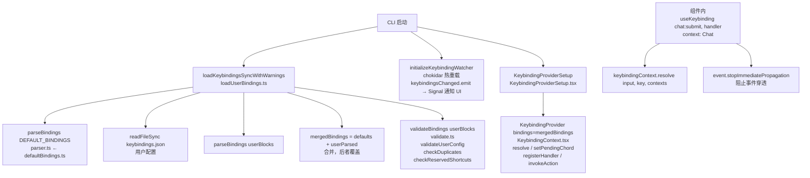
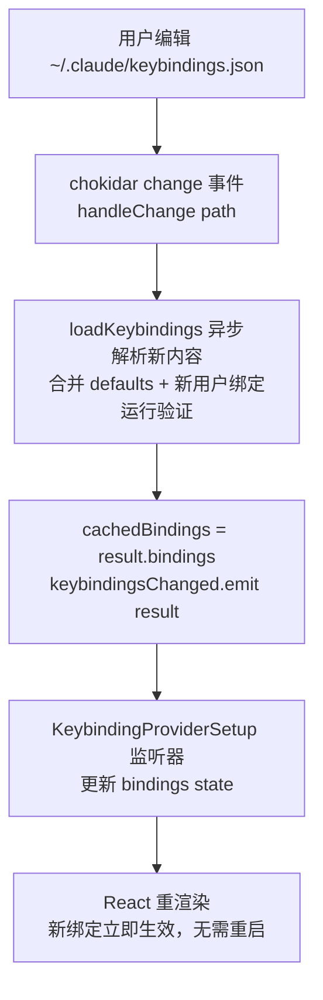

# 键位绑定系统（Keybindings System）— Claude Code 源码分析

> 模块路径：`src/keybindings/`
> 核心职责：管理键盘快捷键的定义、解析、冲突检测、动态加载与热重载，将按键事件路由到对应动作
> 源码版本：v2.1.88

## 一、模块概述

Claude Code 是基于 Ink（React for terminal）构建的 TUI 应用，键位绑定系统负责将原始按键输入转换为语义化动作（如 `chat:submit`、`app:toggleTodos`），并支持用户通过 `~/.claude/keybindings.json` 自定义快捷键。

`src/keybindings/` 目录包含 10 个文件，职责划分清晰：

| 文件 | 职责 |
|------|------|
| `schema.ts` | Zod schema：17 个上下文、60+ 个动作的类型定义 |
| `defaultBindings.ts` | 默认键位表（数组形式，按上下文分组） |
| `parser.ts` | 字符串解析：`"ctrl+shift+k"` → `ParsedKeystroke` |
| `match.ts` | 运行时匹配：Ink 的 `Key` 对象与 `ParsedKeystroke` 的比对 |
| `resolver.ts` | 解析引擎：支持和弦序列、最后一条覆盖、`null` 解绑 |
| `validate.ts` | 验证：格式检查、重复键检测、保留快捷键检测 |
| `reservedShortcuts.ts` | 不可重绑定键（`ctrl+c`/`ctrl+d`）和平台保留键 |
| `loadUserBindings.ts` | 用户配置文件加载、合并、热重载（chokidar） |
| `KeybindingContext.tsx` | React Context：将绑定表和状态注入组件树 |
| `useKeybinding.ts` | React Hooks：组件内声明式绑定动作处理器 |

## 二、架构设计

### 2.1 核心类 / 接口 / 函数

**`KeybindingBlock`**（schema/types）
单个上下文的键位绑定块，结构为：
```
{ context: KeybindingContextName, bindings: Record<string, ActionOrNull> }
```
`KeybindingContextName` 是 17 个枚举值之一（`Global`/`Chat`/`Autocomplete` 等）。

**`ParsedBinding`**（types）
运行时已解析的绑定单元：
```
{ chord: ParsedKeystroke[], action: string | null, context: KeybindingContextName }
```
`chord` 是和弦序列（多个按键步骤）；`action: null` 表示显式解绑。

**`ParsedKeystroke`**（types）
单个按键的结构化表示：
```
{ key: string, ctrl: boolean, alt: boolean, shift: boolean, meta: boolean, super: boolean }
```
其中 `alt` 和 `meta` 在终端中通常等价（历史遗留问题，`match.ts` 中合并处理）。

**`resolveKeyWithChordState`**（`resolver.ts`）
核心解析函数，支持和弦序列状态机：
- 输入：当前按键、活跃上下文列表、所有已解析绑定、当前待定和弦状态
- 输出：`match` / `none` / `unbound` / `chord_started` / `chord_cancelled`
- 采用"最后一条绑定覆盖"策略，允许用户配置覆盖默认值

**`validateBindings`**（`validate.ts`）
验证入口函数，组合调用：`validateUserConfig()` + `checkDuplicates()` + `checkReservedShortcuts()`，返回去重后的 `KeybindingWarning[]`。

**`initializeKeybindingWatcher`**（`loadUserBindings.ts`）
初始化 chokidar 文件监听器，监听 `~/.claude/keybindings.json` 的变化，变化时自动重新加载并通过 Signal 通知所有订阅者。

### 2.2 模块依赖关系图



### 2.3 关键数据流

**按键到动作的完整路径**

```mermaid
flowchart TD
    A[用户按下 Ctrl+Enter 终端 TUI] --> B[Ink useInput 回调\ninput='', key={ctrl:true, return:true}]
    B --> C[useKeybinding/useKeybindings hook]
    C --> D[keybindingContext.resolve\ninput, key, Chat/Global]
    D --> E[resolveKeyWithChordState\nbuildKeystroke → key: enter, ctrl:true\ntestChord = [{key:enter, ctrl:true}]\n过滤 contextBindings\n返回 type: match, action: chat:submit]
    E --> F[action === chat:submit → handler]
    F --> G[event.stopImmediatePropagation\n阻止事件穿透]
```

**热重载数据流**



## 三、核心实现走读

### 3.1 关键流程

1. **解析**：`parseKeystroke("ctrl+shift+k")` 将字符串拆分，映射修饰符关键字（`ctrl`/`control` → `ctrl: true`，`cmd`/`command`/`super`/`win` → `super: true`），最后一个非修饰词作为 `key`。支持 Unicode 箭头（`↑↓←→`）作为 `up/down/left/right` 的别名。

2. **合并（后者覆盖）**：`loadUserBindings.ts` 将默认绑定和用户绑定按顺序拼接为一个数组 `[...defaults, ...userParsed]`。解析器遍历时"最后匹配覆盖（last-wins）"——同一按键/上下文的用户绑定天然覆盖默认绑定。

3. **和弦状态机**：`resolveKeyWithChordState` 维护 `pending: ParsedKeystroke[] | null` 状态。收到第一个按键时，若存在以此为前缀的更长绑定，返回 `chord_started`（暂存按键）；下次按键时附加到 `testChord` 继续匹配；Escape 取消当前和弦。

4. **冲突检测（重复键）**：`checkDuplicates()` 通过 `normalizeKeyForComparison()` 标准化按键字符串（排序修饰符、统一别名），在同一上下文内检测相同按键映射到不同动作的情况。注意跨上下文的重复是允许的（如 `enter` 在 `Chat` 和 `Confirmation` 中各有含义）。

5. **保留键检测**：`getReservedShortcuts()` 根据当前平台返回不可绑定键列表：`ctrl+c`/`ctrl+d`/`ctrl+m` 是硬编码（`error` 级别）；`ctrl+z`/`ctrl+\` 是终端信号保留（`warning`/`error`）；macOS 上 `cmd+c`/`cmd+v` 等系统快捷键也会产生 `error` 警告。

6. **Feature Gate**：用户自定义功能由 GrowthBook 特征标志 `tengu_keybinding_customization_release` 控制，外部用户（非 Anthropic 员工）目前只使用默认绑定，文件监听器也不会启动。

### 3.2 重要源码片段

**片段一：和弦前缀匹配与状态机**（`src/keybindings/resolver.ts`）
```typescript
// 使用 chordWinners Map 处理 null 覆盖：
// 若用户将 ctrl+x ctrl+k 设为 null（解绑），ctrl+x 不应再进入和弦等待
const chordWinners = new Map<string, string | null>()
for (const binding of contextBindings) {
  if (binding.chord.length > testChord.length &&
      chordPrefixMatches(testChord, binding)) {
    chordWinners.set(chordToString(binding.chord), binding.action)
  }
}
// 只有存在非 null 的更长和弦时，才进入 chord_started 状态
let hasLongerChords = false
for (const action of chordWinners.values()) {
  if (action !== null) { hasLongerChords = true; break }
}
```

**片段二：alt/meta 在终端中的等价处理**（`src/keybindings/match.ts`）
```typescript
// 终端无法区分 Alt 和 Meta（历史遗留，均发送 ESC 前缀序列）
// config 中的 meta 和 alt 都映射到 key.meta === true
const targetNeedsMeta = target.alt || target.meta
if (inkMods.meta !== targetNeedsMeta) return false
// Super（cmd/win）通过 kitty keyboard protocol 独立传输，与 alt/meta 不同
if (inkMods.super !== target.super) return false
```

**片段三：平台相关的默认绑定**（`src/keybindings/defaultBindings.ts`）
```typescript
// Windows 无法可靠检测 VT 模式时，shift+tab 可能失效
// 根据运行时检测选择 MODE_CYCLE_KEY
const SUPPORTS_TERMINAL_VT_MODE =
  getPlatform() !== 'windows' ||
  (isRunningWithBun()
    ? satisfies(process.versions.bun, '>=1.2.23')
    : satisfies(process.versions.node, '>=22.17.0 <23.0.0 || >=24.2.0'))
const MODE_CYCLE_KEY = SUPPORTS_TERMINAL_VT_MODE ? 'shift+tab' : 'meta+m'
```

**片段四：JSON 重复键检测（JSON.parse 会静默丢弃）**（`src/keybindings/validate.ts`）
```typescript
// JSON.parse 遇到同名键取最后一个值，早期值被静默丢弃
// 需在原始字符串上做文本分析才能发现重复
export function checkDuplicateKeysInJson(jsonString: string): KeybindingWarning[] {
  const bindingsBlockPattern =
    /"bindings"\s*:\s*\{([^{}]*(?:\{[^{}]*\}[^{}]*)*)\}/g
  // 在每个 bindings 块内统计键名出现次数，第二次出现时发出警告
}
```

### 3.3 设计模式分析

**命令模式（Command Pattern）**：将按键输入转换为字符串动作名称（如 `chat:submit`），组件订阅动作名称而不是具体按键，使按键方案可替换而无需修改组件代码。

**观察者模式（Observer Pattern）**：`keybindingsChanged` 是一个自定义 Signal，文件监听器写入方，UI 层订阅方。热重载通过 Signal 解耦，loadUserBindings.ts 无需知道谁在消费更新。

**上下文分层（Context Hierarchy）**：17 个命名上下文按 UI 状态分层，`Global` 上下文在任何状态下都激活。`useKeybinding` 在解析时将 `[...activeContexts, thisContext, 'Global']` 去重后传入，确保更具体的上下文（如 `Chat` 内的自定义绑定）优先于全局绑定。

**防御性验证（Defensive Validation）**：验证层（`validate.ts`）和加载层（`loadUserBindings.ts`）解耦：加载层只负责读取和合并，验证层负责产生警告，两者都不会因用户配置错误而崩溃——始终回退到默认绑定并显示警告。

## 四、高频面试 Q&A

### 设计决策题

**Q1：为什么键位绑定使用"最后一条覆盖（last-wins）"而非"第一条获胜（first-wins）"的合并策略？**

默认绑定在数组前部，用户绑定在后部。`last-wins` 策略自然地实现了"用户配置覆盖默认值"：不需要特殊的优先级字段，也不需要区分哪些来自默认、哪些来自用户。同时，用户配置文件内部若有两个相同按键的绑定，也会取最后一个——这是 JSON 对象字段名重复的同等行为，用户可预期。相应地，`checkDuplicateKeysInJson()` 会发出警告提示用户注意。

**Q2：`action: null` 解绑机制的设计意图是什么？`unbound` 和 `none` 的区别是什么？**

`action: null` 允许用户显式解绑默认快捷键（如不想让 `ctrl+o` 打开 Transcript）。`resolver.ts` 返回 `{ type: 'unbound' }` 表示"我找到了绑定，但它被设为 null"，此时 `useKeybinding` 会调用 `stopImmediatePropagation()` 阻止其他处理器。`{ type: 'none' }` 则表示"根本没有绑定"，事件会继续传播到其他 `useInput` 处理器。这个区别保证了解绑的语义：解绑不是"没有绑定"，而是"被明确禁用"。

### 原理分析题

**Q3：和弦序列（如 `ctrl+x ctrl+k`）是如何实现的？状态机如何管理？**

`resolveKeyWithChordState` 接受 `pending: ParsedKeystroke[] | null`，null 表示没有进行中的和弦。收到按键时：
1. 构建 `testChord = pending ? [...pending, current] : [current]`
2. 查找所有以 `testChord` 为前缀且长度更长的绑定（通过 `chordWinners` Map 并过滤 null 解绑）
3. 若存在，返回 `chord_started`，UI 层更新 `pendingChord` 状态
4. 若不存在，查找精确匹配；若有则返回 `match`，否则返回 `chord_cancelled`
5. 按下 Escape 直接取消当前和弦

`pendingChordRef`（`useRef`）用于在 Ink 的 `useInput` 回调中即时读取状态（避免 React 闭包陈旧值），`pendingChord`（`useState`）用于触发 React 重渲染（如显示"等待下一个按键"的 UI 提示）。

**Q4：为什么 Escape 按键在终端中会触发 `key.meta = true`？match.ts 如何处理这个历史遗留问题？**

在 VT100/ANSI 终端协议中，Alt 键通过发送 ESC 前缀字节实现（如 `Alt+k` 发送 `ESC k`）。Ink 的 input-event.ts 解析按键序列时，对 ESC 本身会设置 `key.meta = true`（历史实现）。若不处理这个 quirk，以 `"escape"` 为目标的绑定（不含 meta 修饰符）将永远匹配失败。`matchesKeystroke()` 的处理方式是：若 `key.escape` 为 true，在比对修饰符时将 `inkMods.meta` 强制为 false，即"忽略 escape 键上的假 meta 修饰符"。`resolver.ts` 中的 `buildKeystroke()` 也做了同样处理。

**Q5：文件热重载是如何实现的？为什么不直接监听文件而要用 `awaitWriteFinish`？**

使用 `chokidar` 库监听 `~/.claude/keybindings.json`，配置了 `awaitWriteFinish: { stabilityThreshold: 500, pollInterval: 200 }`。原因在于：编辑器（如 VS Code）保存文件时可能分多次写入（先截断再写入），如果在写入未完成时就触发 `change` 事件，读取到的是不完整的 JSON，导致解析失败。`awaitWriteFinish` 会等到文件大小在 500ms 内不再变化才触发事件，保证读取到完整文件。同时，`atomic: true` 支持原子替换（编辑器写入临时文件再 rename），`ignoreInitial: true` 避免启动时误触发。

### 权衡与优化题

**Q6：键位绑定自定义功能通过 GrowthBook 特征标志控制，而不是直接向所有用户开放，这个权衡合理吗？**

合理。从注释来看这是"仅对 Anthropic 员工开放"的功能门控，理由可能包括：验证配置格式是否稳定、检测是否有用户遭遇终端兼容性问题、评估功能文档是否充分。缺点是外部用户无法体验，但文件加载路径（`loadKeybindings`）、验证（`validateBindings`）、热重载（`initializeKeybindingWatcher`）全部代码已就绪，解除门控只需翻转特征标志，工程风险极低。

**Q7：使用 `normalizeKeyForComparison()` 标准化按键字符串做比较，而不是直接比较 `ParsedKeystroke` 对象，有什么利弊？**

利：可以在未解析阶段做字符串去重（如 `checkDuplicates()` 操作原始字符串），避免对所有按键做完整解析；支持 `"ctrl+k"` 和 `"control+k"` 被识别为同一键。弊：字符串标准化必须和解析器 `parseKeystroke()` 的别名映射保持同步，若两处别名列表不一致会产生误报。目前 `normalizeKeyForComparison()` 维护了自己的别名表（`control`→`ctrl`、`option/opt`→`alt`、`command/cmd`→`cmd`），与 `parser.ts` 中的 switch 分支是独立维护的，存在潜在的同步风险。

### 实战应用题

**Q8：用户想将 `ctrl+enter` 设为换行（newline）而非提交，应如何编写 `keybindings.json`？**

```json
{
  "$schema": "...",
  "bindings": [
    {
      "context": "Chat",
      "bindings": {
        "enter": "chat:submit",
        "ctrl+enter": "chat:newline"
      }
    }
  ]
}
```
注意：`enter` 的原有绑定（`chat:submit`）可以保留，也可以通过 `"enter": null` 解绑，将提交改为其他按键。

**Q9：如何为新的 UI 组件添加专属的键位绑定上下文？**

1. 在 `src/keybindings/schema.ts` 的 `KEYBINDING_CONTEXTS` 数组中添加新上下文名称（如 `'MyDialog'`）
2. 在 `KEYBINDING_CONTEXT_DESCRIPTIONS` 中添加描述文字
3. 在 `defaultBindings.ts` 中添加该上下文的默认绑定块
4. 在 `validate.ts` 的 `VALID_CONTEXTS` 数组中同步添加
5. 在组件中调用 `keybindingContext.registerActiveContext('MyDialog')` 注册为活跃上下文
6. 使用 `useKeybinding('action:name', handler, { context: 'MyDialog' })` 注册处理器

---
> **版权声明**：源码版权归 [Anthropic](https://www.anthropic.com) 所有，本文档基于 Claude Code v2.1.88 source map 还原版本分析，仅供学习研究使用。文档内容采用 [CC BY-NC 4.0](https://creativecommons.org/licenses/by-nc/4.0/) 协议。
