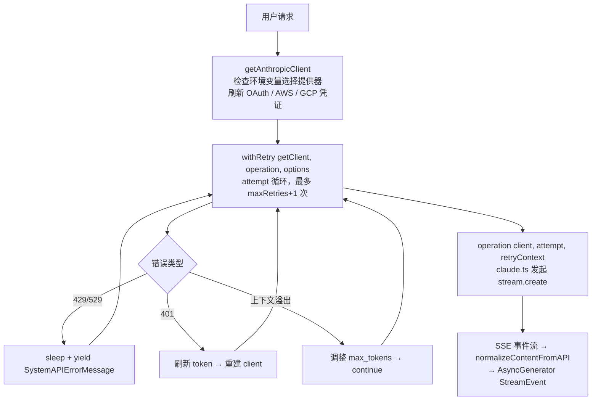

# API服务层 — Claude Code 源码分析

> 模块路径：`src/services/api/`
> 核心职责：封装所有对 Anthropic 及多云提供器的 HTTP 通信，含鉴权、重试、SSE 流式处理
> 源码版本：v2.1.88

## 一、模块概述

`src/services/api/` 是 Claude Code 与外部 AI 接口交互的唯一出口。该层负责：

1. 根据环境变量动态构建 Anthropic / Bedrock / Vertex / Foundry 客户端
2. 为每次请求注入鉴权头（Bearer token / OAuth / AWS 签名 / GCP 令牌）
3. 将 API 调用包裹在指数退避重试循环中，应对 429/529/5xx 等瞬态故障
4. 将 SSE（Server-Sent Events）流式事件转换为内部 `StreamEvent` 类型

该层对调用方透明——上层的 `QueryEngine` 只关心异步生成器接口，不感知底层是哪家云提供器。

## 二、架构设计

### 2.1 核心类/接口/函数

| 名称 | 位置 | 类型 | 说明 |
|---|---|---|---|
| `getAnthropicClient` | `client.ts` | async 函数 | 工厂函数，根据环境变量返回不同提供器客户端 |
| `withRetry` | `withRetry.ts` | async generator | 带重试逻辑的请求包装器，可 yield 系统错误消息 |
| `getRetryDelay` | `withRetry.ts` | 纯函数 | 指数退避 + 抖动 + Retry-After 头解析 |
| `CannotRetryError` | `withRetry.ts` | Error 类 | 超出最大重试次数后抛出，携带原始错误与重试上下文 |
| `FallbackTriggeredError` | `withRetry.ts` | Error 类 | 连续 529 达到阈值时触发模型降级信号 |

### 2.2 模块依赖关系图

```mermaid
graph TD
    A[QueryEngine / 上层调用] --> B[services/api/claude.ts\n请求构建、SSE 流解析]
    B --> C[withRetry.ts\n重试循环、快速模式降级]
    C --> D[sleep.ts / fastMode.ts]
    B --> E[client.ts\n客户端工厂]
    E --> E1[Anthropic SDK 直连]
    E --> E2[@anthropic-ai/bedrock-sdk AWS]
    E --> E3[@anthropic-ai/vertex-sdk GCP]
    E --> E4[@anthropic-ai/foundry-sdk Azure]
    F[utils/auth.ts\nOAuth token 刷新] --> E
    G[utils/proxy.ts\n代理配置] --> E
```

### 2.3 关键数据流



## 三、核心实现走读

### 3.1 关键流程

1. **客户端工厂**：`getAnthropicClient` 按优先级检测 `CLAUDE_CODE_USE_BEDROCK` → `CLAUDE_CODE_USE_FOUNDRY` → `CLAUDE_CODE_USE_VERTEX` → 默认直连，动态 import 对应 SDK 以实现 tree-shaking。

2. **请求头注入**：每次创建客户端时构造 `defaultHeaders`，包含 `x-app: cli`、`User-Agent`、会话 ID、以及可选的 Bearer token（`configureApiKeyHeaders`）。

3. **自定义 fetch 包装**：`buildFetch` 函数在 `fetch` 之上注入 `x-client-request-id`（UUID），用于关联超时请求与服务器日志。

4. **重试循环**：`withRetry` 使用 for 循环而非递归，维护 `consecutive529Errors` 计数器；当达到 `MAX_529_RETRIES`（3次）且存在 fallback 模型时，抛出 `FallbackTriggeredError`。

5. **持久重试模式**：当 `CLAUDE_CODE_UNATTENDED_RETRY` 开启时，429/529 以 30s 心跳间隔无限重试，每次 yield `SystemAPIErrorMessage` 以保持主机活跃度。

6. **快速模式降级**：若 Fast Mode 下遇到 429/529，根据 `Retry-After` 时长决定原地重试（<20s）还是进入冷却（切换到标准速度模型）。

### 3.2 重要源码片段

**`client.ts` — 多云客户端工厂核心逻辑**
```typescript
// src/services/api/client.ts
export async function getAnthropicClient({ apiKey, maxRetries, model, fetchOverride, source }) {
  // 刷新 OAuth token（如果需要）
  await checkAndRefreshOAuthTokenIfNeeded()

  // 非订阅用户注入 API key 到请求头
  if (!isClaudeAISubscriber()) {
    await configureApiKeyHeaders(defaultHeaders, getIsNonInteractiveSession())
  }

  // 按环境变量选择提供器
  if (isEnvTruthy(process.env.CLAUDE_CODE_USE_BEDROCK)) {
    const { AnthropicBedrock } = await import('@anthropic-ai/bedrock-sdk')
    return new AnthropicBedrock({ ...ARGS, awsRegion }) as unknown as Anthropic
  }
  // ... Foundry / Vertex 分支类似
  return new Anthropic({ apiKey, authToken, ...ARGS })
}
```

**`withRetry.ts` — 指数退避延迟计算**
```typescript
// src/services/api/withRetry.ts
export function getRetryDelay(attempt, retryAfterHeader?, maxDelayMs = 32000): number {
  if (retryAfterHeader) {
    const seconds = parseInt(retryAfterHeader, 10)
    if (!isNaN(seconds)) return seconds * 1000  // 尊重服务器指定等待时间
  }
  // 指数退避：BASE_DELAY_MS(500) * 2^(attempt-1)，上限 32s
  const baseDelay = Math.min(BASE_DELAY_MS * Math.pow(2, attempt - 1), maxDelayMs)
  const jitter = Math.random() * 0.25 * baseDelay  // 25% 抖动防止惊群
  return baseDelay + jitter
}
```

**`withRetry.ts` — 上下文溢出自动调整**
```typescript
// src/services/api/withRetry.ts（重试循环内部）
const overflowData = parseMaxTokensContextOverflowError(error)
if (overflowData) {
  const { inputTokens, contextLimit } = overflowData
  const availableContext = Math.max(0, contextLimit - inputTokens - 1000)
  // 调整 max_tokens 并重试，而不是抛出错误
  retryContext.maxTokensOverride = Math.max(FLOOR_OUTPUT_TOKENS, availableContext)
  continue
}
```

**`client.ts` — 请求 ID 注入**
```typescript
// src/services/api/client.ts
function buildFetch(fetchOverride, source): ClientOptions['fetch'] {
  return (input, init) => {
    const headers = new Headers(init?.headers)
    if (injectClientRequestId && !headers.has(CLIENT_REQUEST_ID_HEADER)) {
      headers.set(CLIENT_REQUEST_ID_HEADER, randomUUID())  // 关联超时日志
    }
    return inner(input, { ...init, headers })
  }
}
```

### 3.3 设计模式分析

- **工厂模式**：`getAnthropicClient` 根据环境配置决定实例化哪个 SDK，调用方无需了解多云差异。
- **生成器模式（迭代器）**：`withRetry` 是 `AsyncGenerator`，在等待重试期间 yield `SystemAPIErrorMessage`，实现无阻塞的进度反馈。
- **策略模式**：重试判断（`shouldRetry`、`shouldRetry529`）通过查询源（`querySource`）区分前台/后台任务的重试策略。
- **装饰器模式**：`buildFetch` 包装全局 `fetch`，透明注入追踪头。

## 四、高频面试 Q&A

### 设计决策题

**Q1：为什么 `withRetry` 设计为 `AsyncGenerator` 而不是普通 Promise？**

> 重试等待期间（最长 32 秒）若函数静默 await，用户界面会冻结无反馈。通过 `yield createSystemAPIErrorMessage(error, delayMs, ...)` 可在等待时向 UI 推送进度信息（当前重试次数、剩余等待时间），而不需要额外的回调机制。持久重试模式（`UNATTENDED_RETRY`）更进一步，每 30 秒 yield 一次心跳，防止主机进程因无 stdout 输出而被标记为空闲。

**Q2：多云客户端为什么使用动态 `import()` 而非顶层静态导入？**

> 各云 SDK（Bedrock、Vertex、Foundry）体积较大，且用户通常只使用其中一种。静态导入会让所有 SDK 进入 bundle，即使从未被调用。动态 import 配合 bun 的 tree-shaking，使外部构建（非 ant 用户）的包体积最小化。注释中明确说明 "we have always been lying about the return type — this doesn't support batching or models"，表明这是有意识的类型妥协以换取架构一致性。

### 原理分析题

**Q3：529 错误与 429 错误在重试策略上有何区别？**

> - **429（Rate Limit）**：通常来自用量配额，携带 `Retry-After` 头和 `anthropic-ratelimit-unified-reset` 重置时间戳。对 Claude.ai 订阅用户（非 Enterprise）不重试。
> - **529（Overloaded）**：服务器过载，不携带精确重置时间。连续 3 次 529 时（`MAX_529_RETRIES`）触发模型降级（`FallbackTriggeredError`）。部分场景（非前台请求，如标题生成、建议）立即放弃重试以避免容量级联放大（"retry amplification"）。

**Q4：OAuth token 过期与 API key 失效分别如何处理？**

> - **OAuth 过期（401）**：`withRetry` 捕获 401 错误，提取当前 `accessToken`，调用 `handleOAuth401Error` 强制刷新，然后 `await getClient()` 重建客户端（携带新 token）再重试。
> - **OAuth 撤销（403 "token revoked"）**：通过 `isOAuthTokenRevokedError` 检测，走相同刷新路径。
> - **API key 失效（401）**：调用 `clearApiKeyHelperCache()` 清除缓存，SDK 在下次请求时重新拉取。

**Q5：`parseMaxTokensContextOverflowError` 的作用是什么？何时会触发？**

> 当请求的 `input_tokens + max_tokens > context_limit` 时，API 返回 HTTP 400 并携带错误消息如 `"input length and max_tokens exceed context limit: 188059 + 20000 > 200000"`。该函数用正则解析三个数字，计算可用上下文（`contextLimit - inputTokens - 1000`缓冲），更新 `retryContext.maxTokensOverride`，并 `continue` 重试。注释指出：开启 `extended-context-window` beta 后，API 改为返回 `model_context_window_exceeded` 停止原因而非 400，此函数为向后兼容保留。

### 权衡与优化题

**Q6：指数退避的最大延迟为 32 秒，这个值如何取舍？**

> 32 秒（2^6 × 500ms）是用户体验与服务保护的平衡点：太短会在高负载时加剧服务器压力；太长则用户等待时间过长。持久模式（`UNATTENDED_RETRY`）上调为 5 分钟，且会等待 `anthropic-ratelimit-unified-reset` 时间戳以避免无效轮询。每次引入 25% 随机抖动（`jitter`）以分散多客户端同步重试。

**Q7：后台任务（如标题生成）遇到 529 时立即放弃重试的原因是什么？**

> 代码注释写明："during a capacity cascade each retry is 3-10× gateway amplification"。后台任务失败用户无感知，但重试会以 3-10 倍放大服务器压力。`shouldRetry529` 通过 `FOREGROUND_529_RETRY_SOURCES` 白名单区分前台/后台，后台直接抛出 `CannotRetryError`，保护整体集群稳定性。

### 实战应用题

**Q8：如何为新增的第三方云提供器（如 IBM）扩展 `getAnthropicClient`？**

> 参照现有 Bedrock/Vertex 模式：1) 添加环境变量 `CLAUDE_CODE_USE_IBM`；2) 在 `client.ts` 新增 `if (isEnvTruthy(process.env.CLAUDE_CODE_USE_IBM))` 分支；3) 动态 import 对应 SDK；4) 在 `isBedrockAuthError`/`isVertexAuthError` 类似位置添加 `isIBMAuthError`；5) 在 `src/utils/model/providers.ts` 注册新提供器名称。关键约束：返回类型必须 cast 为 `Anthropic` 以维持统一接口。

**Q9：如何复现和调试「连续 529 触发模型降级」这个行为？**

> 对于 `ant` 用户，可使用 `/mock-limits` 命令配合 `MOCK_RATE_LIMIT_ERROR` 环境变量注入模拟错误（`checkMockRateLimitError` 在重试循环开始处被调用）。设置 `FALLBACK_FOR_ALL_PRIMARY_MODELS=1` 可让任意模型（而非仅 Opus）触发降级逻辑。观察 `tengu_api_opus_fallback_triggered` 分析事件确认降级发生。

---
> **版权声明**：源码版权归 [Anthropic](https://www.anthropic.com) 所有，本文档基于 Claude Code v2.1.88 source map 还原版本分析，仅供学习研究使用。文档内容采用 [CC BY-NC 4.0](https://creativecommons.org/licenses/by-nc/4.0/) 协议。
