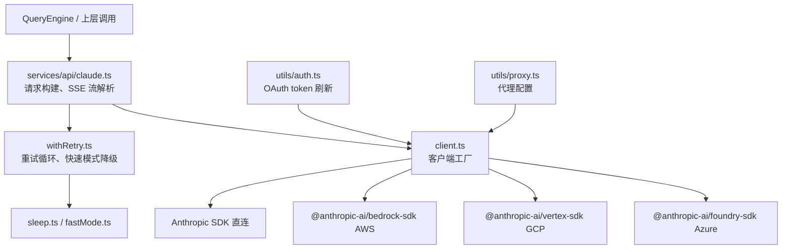
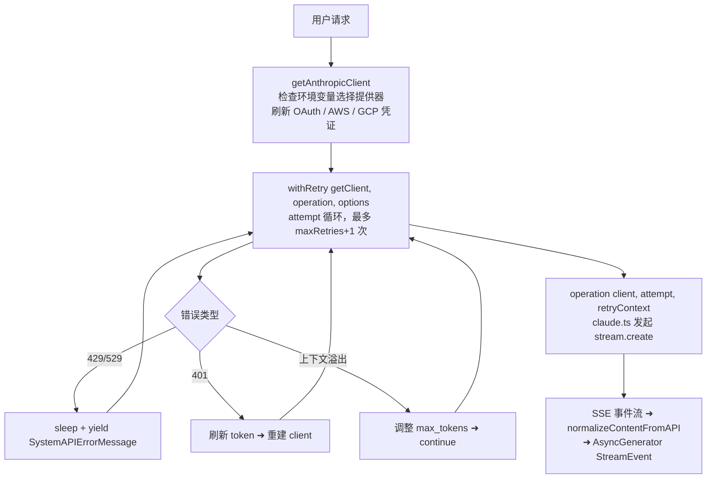
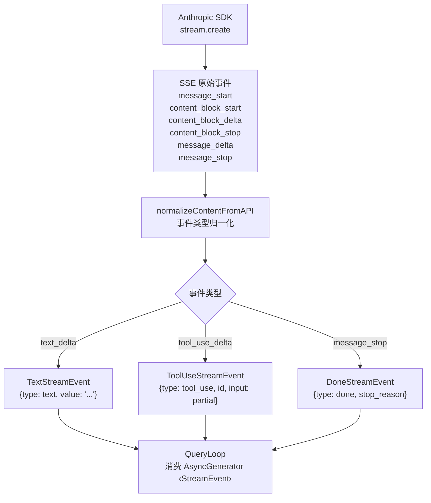

# API服务层 — Claude Code 源码分析

> 模块路径：`src/services/api/`
> 核心职责：封装所有对 Anthropic 及多云提供器的 HTTP 通信，含鉴权、重试、SSE 流式处理
> 源码版本：v2.1.88

## 一、模块概述

`src/services/api/` 是 Claude Code 与外部 AI 接口交互的唯一出口。该层负责：

1. 根据环境变量动态构建 Anthropic / Bedrock / Vertex / Foundry 客户端
2. 为每次请求注入鉴权头（Bearer token / OAuth / AWS 签名 / GCP 令牌）
3. 将 API 调用包裹在指数退避重试循环中，应对 429/529/5xx 等瞬态故障
4. 将 SSE（Server-Sent Events）流式事件转换为内部 `StreamEvent` 类型

该层对调用方透明——上层的 `QueryEngine` 只关心异步生成器接口，不感知底层是哪家云提供器。

## 二、架构设计

### 2.1 核心类/接口/函数

| 名称 | 位置 | 类型 | 说明 |
|---|---|---|---|
| `getAnthropicClient` | `client.ts` | async 函数 | 工厂函数，根据环境变量返回不同提供器客户端 |
| `withRetry` | `withRetry.ts` | async generator | 带重试逻辑的请求包装器，可 yield 系统错误消息 |
| `getRetryDelay` | `withRetry.ts` | 纯函数 | 指数退避 + 抖动 + Retry-After 头解析 |
| `CannotRetryError` | `withRetry.ts` | Error 类 | 超出最大重试次数后抛出，携带原始错误与重试上下文 |
| `FallbackTriggeredError` | `withRetry.ts` | Error 类 | 连续 529 达到阈值时触发模型降级信号 |

### 2.2 模块依赖关系图



### 2.3 关键数据流



## 三、核心实现走读

### 3.1 关键流程

1. **客户端工厂**：`getAnthropicClient` 按优先级检测 `CLAUDE_CODE_USE_BEDROCK` → `CLAUDE_CODE_USE_FOUNDRY` → `CLAUDE_CODE_USE_VERTEX` → 默认直连，动态 import 对应 SDK 以实现 tree-shaking。

2. **请求头注入**：每次创建客户端时构造 `defaultHeaders`，包含 `x-app: cli`、`User-Agent`、会话 ID、以及可选的 Bearer token（`configureApiKeyHeaders`）。

3. **自定义 fetch 包装**：`buildFetch` 函数在 `fetch` 之上注入 `x-client-request-id`（UUID），用于关联超时请求与服务器日志。

4. **重试循环**：`withRetry` 使用 for 循环而非递归，维护 `consecutive529Errors` 计数器；当达到 `MAX_529_RETRIES`（3次）且存在 fallback 模型时，抛出 `FallbackTriggeredError`。

5. **持久重试模式**：当 `CLAUDE_CODE_UNATTENDED_RETRY` 开启时，429/529 以 30s 心跳间隔无限重试，每次 yield `SystemAPIErrorMessage` 以保持主机活跃度。

6. **快速模式降级**：若 Fast Mode 下遇到 429/529，根据 `Retry-After` 时长决定原地重试（<20s）还是进入冷却（切换到标准速度模型）。

### 3.2 重要源码片段

**`client.ts` — 多云客户端工厂核心逻辑**
```typescript
// src/services/api/client.ts
export async function getAnthropicClient({ apiKey, maxRetries, model, fetchOverride, source }) {
  // 刷新 OAuth token（如果需要）
  await checkAndRefreshOAuthTokenIfNeeded()

  // 非订阅用户注入 API key 到请求头
  if (!isClaudeAISubscriber()) {
    await configureApiKeyHeaders(defaultHeaders, getIsNonInteractiveSession())
  }

  // 按环境变量选择提供器
  if (isEnvTruthy(process.env.CLAUDE_CODE_USE_BEDROCK)) {
    const { AnthropicBedrock } = await import('@anthropic-ai/bedrock-sdk')
    return new AnthropicBedrock({ ...ARGS, awsRegion }) as unknown as Anthropic
  }
  // ... Foundry / Vertex 分支类似
  return new Anthropic({ apiKey, authToken, ...ARGS })
}
```

**`withRetry.ts` — 指数退避延迟计算**
```typescript
// src/services/api/withRetry.ts
export function getRetryDelay(attempt, retryAfterHeader?, maxDelayMs = 32000): number {
  if (retryAfterHeader) {
    const seconds = parseInt(retryAfterHeader, 10)
    if (!isNaN(seconds)) return seconds * 1000  // 尊重服务器指定等待时间
  }
  // 指数退避：BASE_DELAY_MS(500) * 2^(attempt-1)，上限 32s
  const baseDelay = Math.min(BASE_DELAY_MS * Math.pow(2, attempt - 1), maxDelayMs)
  const jitter = Math.random() * 0.25 * baseDelay  // 25% 抖动防止惊群
  return baseDelay + jitter
}
```

**`withRetry.ts` — 上下文溢出自动调整**
```typescript
// src/services/api/withRetry.ts（重试循环内部）
const overflowData = parseMaxTokensContextOverflowError(error)
if (overflowData) {
  const { inputTokens, contextLimit } = overflowData
  const availableContext = Math.max(0, contextLimit - inputTokens - 1000)
  // 调整 max_tokens 并重试，而不是抛出错误
  retryContext.maxTokensOverride = Math.max(FLOOR_OUTPUT_TOKENS, availableContext)
  continue
}
```

**`client.ts` — 请求 ID 注入**
```typescript
// src/services/api/client.ts
function buildFetch(fetchOverride, source): ClientOptions['fetch'] {
  return (input, init) => {
    const headers = new Headers(init?.headers)
    if (injectClientRequestId && !headers.has(CLIENT_REQUEST_ID_HEADER)) {
      headers.set(CLIENT_REQUEST_ID_HEADER, randomUUID())  // 关联超时日志
    }
    return inner(input, { ...init, headers })
  }
}
```

### 3.4 流式响应处理（SSE 管道）详解

`services/api/claude.ts` 是将 Anthropic API 的 SSE 事件流转换为内部 `StreamEvent` 的核心。理解这条管道是排查流式输出问题的基础。

**SSE 到 StreamEvent 的转换流程：**



**关键实现细节：工具输入的流式拼接**

工具调用的 `input` 字段（JSON 对象）以分片流式到达，需要拼接后再解析：

```typescript
// src/services/api/claude.ts（简化）
// 工具输入 JSON 分片累积
const toolInputAccumulator = new Map<string, string>()

for await (const event of stream) {
  if (event.type === 'content_block_delta' && event.delta.type === 'input_json_delta') {
    // 累积分片：每个 delta 是完整 JSON 的一部分
    const existing = toolInputAccumulator.get(event.index) ?? ''
    toolInputAccumulator.set(event.index, existing + event.delta.partial_json)
  }
  if (event.type === 'content_block_stop') {
    // 分片完成，解析完整 JSON
    const fullInput = JSON.parse(toolInputAccumulator.get(event.index)!)
    yield { type: 'tool_use', id: currentToolId, input: fullInput }
  }
}
```

**流式错误的中途处理**

若 SSE 流在传输中途断开（网络错误）：
1. `stream[Symbol.asyncIterator]` 抛出 `TypeError: network error`
2. `withRetry` 捕获此错误，判断是否属于可重试类别（`isRetryableNetworkError`）
3. 若可重试，`messages` 中当前这轮 `tool_use` 块的内容可能只有部分输入 JSON
4. 重试时 `QueryLoop` 从上一条完整的 `assistant` 消息重新开始（丢弃损坏的分片），保证消息历史的一致性

### 3.5 身份验证流程（鉴权三模式）

`getAnthropicClient` 支持三种鉴权模式，按优先级依次检测：

**模式一：OAuth（Claude.ai 订阅用户）**

```typescript
// src/services/api/client.ts:55-72（简化）
// OAuth 用户使用 Bearer token，存储在系统 Keychain
await checkAndRefreshOAuthTokenIfNeeded()  // 刷新即将过期的 token
const authToken = await getOAuthToken()    // 从 Keychain 读取

if (authToken) {
  // Bearer token 注入 authToken 字段，而非 apiKey
  return new Anthropic({ authToken, ...ARGS })
}
```

OAuth token 刷新逻辑：
- Token 剩余有效期 < 5 分钟时触发静默刷新
- 刷新失败（网络错误）：使用旧 token 继续，直到 401 响应触发强制刷新
- 刷新失败（revoke）：清除 Keychain 存储，提示用户重新登录

**模式二：API Key（直接用户）**

```typescript
// src/services/api/client.ts:78-90（简化）
// 非订阅用户通过 ANTHROPIC_API_KEY 环境变量或 ~/.claude/credentials 文件
if (!isClaudeAISubscriber()) {
  await configureApiKeyHeaders(defaultHeaders, isNonInteractive)
  // configureApiKeyHeaders 从多个来源按优先级读取：
  // 1. process.env.ANTHROPIC_API_KEY
  // 2. ~/.anthropic/credentials（AWS 风格 INI 文件）
  // 3. ~/.claude/credentials（Claude Code 专用）
}
```

**模式三：云提供器凭证（Bedrock / Vertex / Foundry）**

云提供器凭证的刷新由各自 SDK 管理：
- **Bedrock**：使用 `@aws-sdk/credential-providers` 链，支持 IAM Role、EC2 IMDS、ECS Task Role 自动轮换
- **Vertex**：使用 Google Application Default Credentials（`gcloud auth application-default login` 或 Workload Identity）
- **Foundry**：使用 Azure Managed Identity 或 Service Principal

Claude Code 不直接管理云提供器的 token 刷新——这是"职责外包"给 SDK 的设计决策。

### 3.6 错误分类与处理策略

`withRetry` 对 API 错误的分类决定了系统的弹性行为：

**错误分类表：**

| HTTP 状态 / 错误类型 | 分类 | 处理策略 |
|---------------------|------|---------|
| `429 Too Many Requests` | 速率限制 | 指数退避重试，尊重 `Retry-After` 头 |
| `529 Overloaded` | 服务器过载 | 退避重试；连续 3 次触发模型降级 |
| `401 Unauthorized` | 鉴权失效 | 刷新 token → 重建 client → 重试（最多 1 次）|
| `403 Forbidden (token revoked)` | 凭证撤销 | 清除存储 → 提示重新登录 → 不重试 |
| `400 context_length_exceeded` | 上下文溢出 | 调整 `max_tokens` → 重试（不计入重试次数）|
| `500 Internal Server Error` | 服务器内部错误 | 短暂退避后重试（通常瞬态）|
| `502/503/504` | 网关/代理错误 | 指数退避重试 |
| `TypeError: network error` | 网络层断开 | 检查 `isRetryableNetworkError` → 选择性重试 |
| `AbortError` | 用户中止 | 立即停止，不重试 |

**`shouldRetry` 决策链（`querySource` 影响）：**

```typescript
// src/services/api/withRetry.ts（概念实现）
function shouldRetry(error, attempt, querySource): boolean {
  if (isUserAbort(error)) return false  // 用户主动中止，永不重试

  if (isContextOverflow(error)) return true  // 总是重试（调整 token 上限）

  if (is429(error)) {
    // Claude.ai 订阅用户（非 Enterprise）的 429 不重试
    // 原因：订阅用户有固定配额，重试只会浪费时间
    if (isClaudeAIPersonal(querySource)) return false
    return attempt < maxRetries
  }

  if (is529(error)) {
    // 后台低优先级任务（标题生成、建议等）不重试 529
    // 原因：防止容量级联放大
    if (BACKGROUND_SOURCES.has(querySource)) return false
    return attempt < maxRetries
  }

  return attempt < maxRetries
}
```

### 3.7 Prompt Cache 与请求头注入

`client.ts` 在每次创建请求时注入多个自定义头，其中 Prompt Cache 相关头直接影响成本和延迟：

**Prompt Caching 头：**

```typescript
// src/services/api/client.ts（defaultHeaders 构建）
const headers = {
  'x-app': 'cli',                           // 标识客户端类型
  'User-Agent': `ClaudeCode/${version}`,    // 版本追踪
  'x-session-id': sessionId,               // 服务端关联日志
  'anthropic-beta': [
    'prompt-caching-2024-07-31',           // 启用 Prompt Cache
    'interleaved-thinking-2025-05-14',     // 启用交叉思考（若模型支持）
  ].join(','),
}
```

**Prompt Cache 的工作原理（对 API 服务层的影响）：**

系统提示词（`systemPrompt`）和工具定义在会话期间几乎不变，但每次请求都需要重新发送（API 是无状态的）。`prompt-caching-2024-07-31` beta 头允许服务端缓存这些内容：
- 第一次请求：全量 token 计费（写入缓存）
- 后续请求：相同内容以 `cache_read_input_tokens` 计费，约为写入价格的 1/10
- 缓存键：`systemPrompt` + `tools` 数组的哈希，任何改动都会使缓存失效

API 服务层通过在请求参数中设置 `cache_control: { type: 'ephemeral' }` 标记可缓存的内容块，具体位置在 `claude.ts` 构建 `messages` 数组时处理。

### 3.8 持久重试模式（UNATTENDED_RETRY）

`CLAUDE_CODE_UNATTENDED_RETRY` 环境变量开启"无人值守重试模式"，专为长时间自动化任务设计：

**普通重试 vs 持久重试对比：**

| 特性 | 普通模式 | 持久重试模式（`UNATTENDED_RETRY`）|
|------|---------|----------------------------------|
| 最大重试次数 | `MAX_RETRIES`（约 3-5 次）| 无限次 |
| 重试间隔 | 指数退避，最大 32s | 固定 30s 心跳间隔 |
| 等待策略 | 根据 `Retry-After` 或退避公式 | 等待 `anthropic-ratelimit-unified-reset` 时间戳 |
| UI 反馈 | 每次重试 yield 错误消息 | 每 30s yield 一条心跳消息（防止主机判活超时）|
| 使用场景 | 交互式会话 | CI/CD 管道、脚本自动化 |

心跳消息的设计目的：某些 CI 环境（GitHub Actions、Jenkins）会在进程无输出超过特定时间（如 10 分钟）时判定任务超时并杀死进程。每 30s 输出一条"Waiting for API rate limit to reset..."消息，维持输出流活跃，防止误判超时。

### 3.9 设计模式分析

- **工厂模式**：`getAnthropicClient` 根据环境配置决定实例化哪个 SDK，调用方无需了解多云差异。
- **生成器模式（迭代器）**：`withRetry` 是 `AsyncGenerator`，在等待重试期间 yield `SystemAPIErrorMessage`，实现无阻塞的进度反馈。
- **策略模式**：重试判断（`shouldRetry`、`shouldRetry529`）通过查询源（`querySource`）区分前台/后台任务的重试策略。
- **装饰器模式**：`buildFetch` 包装全局 `fetch`，透明注入追踪头。

## 四、高频面试 Q&A

### 设计决策题

**Q1：为什么 `withRetry` 设计为 `AsyncGenerator` 而不是普通 Promise？**

> 重试等待期间（最长 32 秒）若函数静默 await，用户界面会冻结无反馈。通过 `yield createSystemAPIErrorMessage(error, delayMs, ...)` 可在等待时向 UI 推送进度信息（当前重试次数、剩余等待时间），而不需要额外的回调机制。持久重试模式（`UNATTENDED_RETRY`）更进一步，每 30 秒 yield 一次心跳，防止主机进程因无 stdout 输出而被标记为空闲。

**Q2：多云客户端为什么使用动态 `import()` 而非顶层静态导入？**

> 各云 SDK（Bedrock、Vertex、Foundry）体积较大，且用户通常只使用其中一种。静态导入会让所有 SDK 进入 bundle，即使从未被调用。动态 import 配合 bun 的 tree-shaking，使外部构建（非 ant 用户）的包体积最小化。注释中明确说明 "we have always been lying about the return type — this doesn't support batching or models"，表明这是有意识的类型妥协以换取架构一致性。

### 原理分析题

**Q3：529 错误与 429 错误在重试策略上有何区别？**

> - **429（Rate Limit）**：通常来自用量配额，携带 `Retry-After` 头和 `anthropic-ratelimit-unified-reset` 重置时间戳。对 Claude.ai 订阅用户（非 Enterprise）不重试。
> - **529（Overloaded）**：服务器过载，不携带精确重置时间。连续 3 次 529 时（`MAX_529_RETRIES`）触发模型降级（`FallbackTriggeredError`）。部分场景（非前台请求，如标题生成、建议）立即放弃重试以避免容量级联放大（"retry amplification"）。

**Q4：OAuth token 过期与 API key 失效分别如何处理？**

> - **OAuth 过期（401）**：`withRetry` 捕获 401 错误，提取当前 `accessToken`，调用 `handleOAuth401Error` 强制刷新，然后 `await getClient()` 重建客户端（携带新 token）再重试。
> - **OAuth 撤销（403 "token revoked"）**：通过 `isOAuthTokenRevokedError` 检测，走相同刷新路径。
> - **API key 失效（401）**：调用 `clearApiKeyHelperCache()` 清除缓存，SDK 在下次请求时重新拉取。

**Q5：`parseMaxTokensContextOverflowError` 的作用是什么？何时会触发？**

> 当请求的 `input_tokens + max_tokens > context_limit` 时，API 返回 HTTP 400 并携带错误消息如 `"input length and max_tokens exceed context limit: 188059 + 20000 > 200000"`。该函数用正则解析三个数字，计算可用上下文（`contextLimit - inputTokens - 1000`缓冲），更新 `retryContext.maxTokensOverride`，并 `continue` 重试。注释指出：开启 `extended-context-window` beta 后，API 改为返回 `model_context_window_exceeded` 停止原因而非 400，此函数为向后兼容保留。

### 权衡与优化题

**Q6：指数退避的最大延迟为 32 秒，这个值如何取舍？**

> 32 秒（2^6 × 500ms）是用户体验与服务保护的平衡点：太短会在高负载时加剧服务器压力；太长则用户等待时间过长。持久模式（`UNATTENDED_RETRY`）上调为 5 分钟，且会等待 `anthropic-ratelimit-unified-reset` 时间戳以避免无效轮询。每次引入 25% 随机抖动（`jitter`）以分散多客户端同步重试。

**Q7：后台任务（如标题生成）遇到 529 时立即放弃重试的原因是什么？**

> 代码注释写明："during a capacity cascade each retry is 3-10× gateway amplification"。后台任务失败用户无感知，但重试会以 3-10 倍放大服务器压力。`shouldRetry529` 通过 `FOREGROUND_529_RETRY_SOURCES` 白名单区分前台/后台，后台直接抛出 `CannotRetryError`，保护整体集群稳定性。

### 实战应用题

**Q8：如何为新增的第三方云提供器（如 IBM）扩展 `getAnthropicClient`？**

> 参照现有 Bedrock/Vertex 模式：1) 添加环境变量 `CLAUDE_CODE_USE_IBM`；2) 在 `client.ts` 新增 `if (isEnvTruthy(process.env.CLAUDE_CODE_USE_IBM))` 分支；3) 动态 import 对应 SDK；4) 在 `isBedrockAuthError`/`isVertexAuthError` 类似位置添加 `isIBMAuthError`；5) 在 `src/utils/model/providers.ts` 注册新提供器名称。关键约束：返回类型必须 cast 为 `Anthropic` 以维持统一接口。

**Q9：如何复现和调试「连续 529 触发模型降级」这个行为？**

> 对于 `ant` 用户，可使用 `/mock-limits` 命令配合 `MOCK_RATE_LIMIT_ERROR` 环境变量注入模拟错误（`checkMockRateLimitError` 在重试循环开始处被调用）。设置 `FALLBACK_FOR_ALL_PRIMARY_MODELS=1` 可让任意模型（而非仅 Opus）触发降级逻辑。观察 `tengu_api_opus_fallback_triggered` 分析事件确认降级发生。

**Q10：SSE 流式响应在中途发生网络断开时，`messages` 数组是否会产生"残缺"的工具调用记录？**

A：这是一个实际存在的边界情况。当 SSE 流在 `content_block_delta`（工具输入分片）阶段断开时，`toolInputAccumulator` 中的分片不完整，无法解析为有效 JSON。`withRetry` 重试时，`QueryLoop` 不会将这个残缺的 `tool_use` 块追加到 `messages`——因为流未到达 `content_block_stop` 事件，工具调用从未被确认为"完整输出"。QueryLoop 的设计原则是：只有完整接收到 `message_stop` 或 `error` 事件，才会将本轮 `assistant` 消息追加到 `messages`。中途断开的情况会丢弃当前响应，从上一条完整的 `user` 消息重新发起请求。

**Q11：`configureApiKeyHeaders` 从多个来源读取 API Key，如何处理多来源冲突？**

A：优先级从高到低：
1. `process.env.ANTHROPIC_API_KEY`（环境变量，最高优先级）
2. 函数参数传入的 `apiKey`（编程式调用）
3. `~/.anthropic/credentials` INI 文件（工具链兼容格式）
4. `~/.claude/credentials` 文件（Claude Code 专用格式）

高优先级来源有值时，低优先级来源被忽略。实践中，大多数用户通过环境变量配置，credentials 文件主要用于多账号切换（通过 `AWS_PROFILE` 风格的 `[profile]` 区分）。注意：当 OAuth token 存在（Claude.ai 订阅用户）时，`configureApiKeyHeaders` 不会被调用，两套鉴权体系完全互斥。

**Q12：`x-client-request-id` 请求头在实际故障排查中如何使用？**

A：`x-client-request-id` 是每次 HTTP 请求的唯一 UUID，由 `buildFetch` 注入。它的作用是关联客户端视角的请求（Claude Code 日志）与服务端视角的请求（Anthropic 后端日志）。当用户报告"请求卡住/超时但没有错误消息"时，技术支持可以通过以下步骤排查：
1. 用户在 `CLAUDE_CODE_DEBUG=1` 模式下复现问题，日志中记录每个请求的 `x-client-request-id`
2. 将该 UUID 提供给 Anthropic 支持团队，在服务端日志中查询对应请求的处理状态
3. 确认请求是否到达服务器、在哪个处理阶段失败（鉴权、路由、模型推理、响应编码等）

这是分布式系统中"trace ID"模式的简化实现，专门解决"客户端超时但不知道服务端发生了什么"的黑盒问题。

**Q13：指数退避中的 25% 随机抖动是否足够防止多客户端同步重试（"雷鸣群效应"）？**

A：25% 抖动在大多数场景下足够，但在极端场景（数千个 Claude Code 实例同时遭遇 429）下可能不够。完整的雷鸣群防御需要：
1. **全随机抖动（Full Jitter）**：`delay = random(0, baseDelay)`，分散效果最好但平均延迟最高
2. **等比随机抖动（Equal Jitter）**：`delay = baseDelay/2 + random(0, baseDelay/2)`，当前实现接近此模式
3. **令牌桶/漏桶**：在客户端实现速率限制，主动控制请求频率

Claude Code 的 25% 抖动是在"用户等待时间"和"分散效果"之间的工程权衡。对于单用户工具（每次只有 1-2 个并发请求），当前实现已足够；企业规模部署（Bedrock/Vertex）需考虑在网关层添加速率控制。

---
> 源码版权归 [Anthropic](https://www.anthropic.com) 所有，本笔记仅供学习研究使用。文档内容采用 [CC BY-NC 4.0](https://creativecommons.org/licenses/by-nc/4.0/) 协议。
