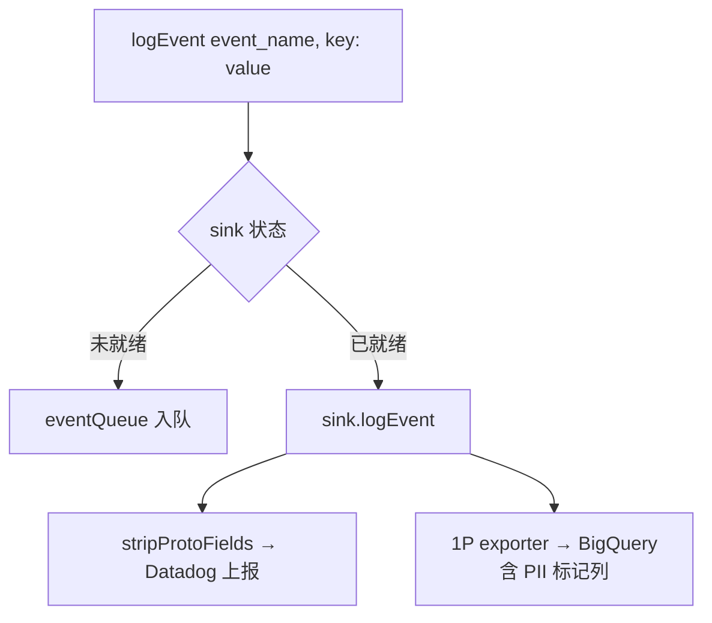
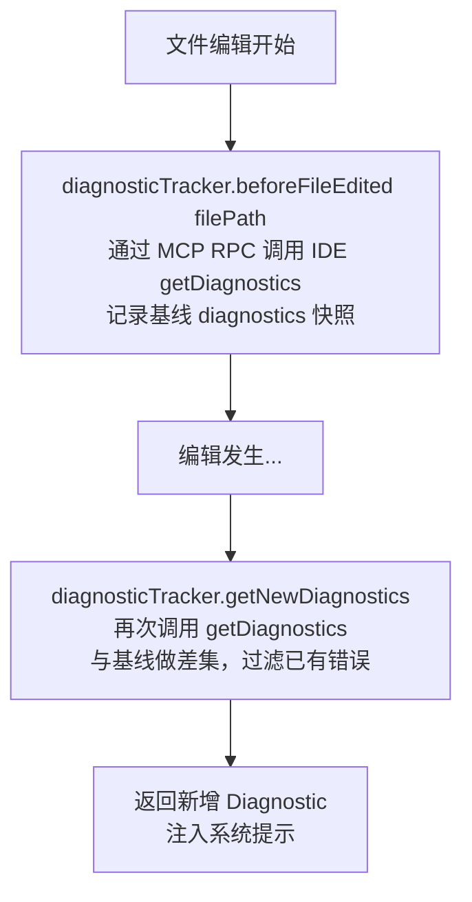

# 其他服务层 — Claude Code 源码分析

> 模块路径：`src/services/`（非 API 子目录）
> 核心职责：提供遥测分析、错误上报、诊断追踪等横切基础设施服务
> 源码版本：v2.1.88

## 一、模块概述

`src/services/` 目录除 `api/` 子目录外，还包含多个横切关注点（cross-cutting concern）服务模块：

- **analytics/**：事件队列、汇聚器（sink）、GrowthBook 功能开关、Datadog/1P 事件导出
- **diagnosticTracking.ts**：IDE 诊断基线追踪，感知文件编辑前后的错误变化
- **internalLogging.ts**：Anthropic 内部 Kubernetes 命名空间与容器 ID 采集
- **oauth/**：OAuth 2.0 授权流程、token 刷新与 Claude.ai 订阅验证
- **tokenEstimation.ts**：离线 token 数量估算（用于进度显示）
- **rateLimitMocking.ts**：仅 ant 用户可用的限流模拟工具

这些服务以「可选注入」模式设计——大部分模块在启动时不强制初始化，通过懒加载或注册回调的方式接入主流程。

## 二、架构设计

### 2.1 核心类/接口/函数

| 名称 | 位置 | 类型 | 说明 |
|---|---|---|---|
| `logEvent` / `logEventAsync` | `analytics/index.ts` | 函数 | 统一事件日志入口，汇聚器未就绪时进入队列 |
| `attachAnalyticsSink` | `analytics/index.ts` | 函数 | 应用启动时注册分析汇聚器，幂等操作 |
| `DiagnosticTrackingService` | `diagnosticTracking.ts` | 单例类 | 追踪文件编辑前后的 IDE 诊断差异 |
| `logPermissionContextForAnts` | `internalLogging.ts` | async 函数 | 采集 K8s 命名空间与容器 ID，仅限 ant 用户 |
| `stripProtoFields` | `analytics/index.ts` | 纯函数 | 在写入 Datadog 前剥离 `_PROTO_*` PII 字段 |

### 2.2 模块依赖关系图

```mermaid
graph TD
    A[应用启动\nsetup.ts / main.tsx] --> B[attachAnalyticsSink sink\n注册汇聚器]
    B --> C[analytics/sink.ts]
    C --> D[Datadog 上报\n剥离 _PROTO_ 字段]
    C --> E[firstPartyEventLoggingExporter\n1P 事件，含 PII 列]
    A --> F[DiagnosticTrackingService.getInstance]
    F --> G[services/mcp/client.ts\ncallIdeRpc]
    G --> H[IDE LSP 诊断接口]
    A --> I[internalLogging.ts]
    I --> J[/proc/self/mountinfo\n容器 ID 解析]
    I --> K[/var/run/secrets/kubernetes.io\n命名空间]
```

### 2.3 关键数据流

**分析事件流**：



**诊断追踪流**：



## 三、核心实现走读

### 3.1 关键流程

1. **分析服务队列机制**：模块加载时 `sink` 为 `null`，所有 `logEvent` 调用进入 `eventQueue`。`attachAnalyticsSink` 注册汇聚器后，通过 `queueMicrotask` 异步消费队列，避免阻塞应用启动路径。

2. **PII 数据保护**：`_PROTO_*` 前缀的键名表示 PII 数据（如用户名）。`stripProtoFields` 在 Datadog 上报路径强制剥离，仅 1P exporter 可读取并映射到 BigQuery 的特权列。

3. **诊断基线机制**：`beforeFileEdited` 在每次工具修改文件前调用，记录当前 IDE 诊断快照；`getNewDiagnostics` 返回编辑后新增的错误/警告，用于向模型反馈副作用。

4. **`_claude_fs_right` 差异视图**：IDE diff 视图中，`_claude_fs_right:` 前缀表示修改后的右侧版本。诊断服务优先使用右侧视图的最新诊断，与左侧 `file://` 协议视图去重后返回。

5. **内部日志采集**：`getContainerId` 通过解析 `/proc/self/mountinfo` 中 Docker/containerd 容器 ID 模式（64 位十六进制），仅在 `USER_TYPE === 'ant'` 时执行，结果缓存（`memoize`）以避免重复文件读取。

### 3.2 重要源码片段

**`analytics/index.ts` — 事件队列与汇聚器注册**
```typescript
// src/services/analytics/index.ts
export function attachAnalyticsSink(newSink: AnalyticsSink): void {
  if (sink !== null) return  // 幂等：已注册则忽略

  sink = newSink
  if (eventQueue.length > 0) {
    const queuedEvents = [...eventQueue]
    eventQueue.length = 0
    // 异步消费，不阻塞启动路径
    queueMicrotask(() => {
      for (const event of queuedEvents) {
        event.async
          ? void sink!.logEventAsync(event.eventName, event.metadata)
          : sink!.logEvent(event.eventName, event.metadata)
      }
    })
  }
}
```

**`analytics/index.ts` — PII 字段剥离**
```typescript
// src/services/analytics/index.ts
export function stripProtoFields<V>(metadata: Record<string, V>): Record<string, V> {
  let result: Record<string, V> | undefined
  for (const key in metadata) {
    if (key.startsWith('_PROTO_')) {
      if (result === undefined) result = { ...metadata }  // 延迟创建副本
      delete result[key]
    }
  }
  return result ?? metadata  // 无 PII 字段时返回原引用（零拷贝优化）
}
```

**`diagnosticTracking.ts` — 差异诊断获取**
```typescript
// src/services/diagnosticTracking.ts（简化）
async getNewDiagnostics(): Promise<DiagnosticFile[]> {
  const allDiagnosticFiles = await callIdeRpc('getDiagnostics', {}, this.mcpClient)

  // 过滤：只处理有基线的文件
  const filesWithBaselines = allDiagnosticFiles
    .filter(f => this.baseline.has(this.normalizeFileUri(f.uri)))

  // 对比基线，返回新增诊断
  return filesWithBaselines
    .map(file => ({
      uri: file.uri,
      diagnostics: file.diagnostics.filter(
        d => !baseline.some(b => this.areDiagnosticsEqual(d, b))
      )
    }))
    .filter(f => f.diagnostics.length > 0)
}
```

**`internalLogging.ts` — 容器 ID 解析**
```typescript
// src/services/internalLogging.ts
export const getContainerId = memoize(async (): Promise<string | null> => {
  if (process.env.USER_TYPE !== 'ant') return null
  // 匹配 Docker 与 containerd 两种格式
  const containerIdPattern = /(?:\/docker\/containers\/|\/sandboxes\/)([0-9a-f]{64})/
  const mountinfo = await readFile('/proc/self/mountinfo', 'utf8')
  for (const line of mountinfo.split('\n')) {
    const match = line.match(containerIdPattern)
    if (match?.[1]) return match[1]
  }
  return 'container ID not found in mountinfo'
})
```

### 3.3 设计模式分析

- **观察者模式**：`attachAnalyticsSink` 实现了一个简化的 pub-sub，事件生产者（`logEvent`）与消费者（sink）解耦，支持延迟绑定。
- **空对象模式**：`sink === null` 时，队列充当缓冲层，生产者无需做空检查即可安全调用 `logEvent`。
- **单例模式**：`DiagnosticTrackingService.getInstance()` 确保全局只有一个诊断追踪器实例，避免基线状态分裂。
- **策略模式（PII 路由）**：`_PROTO_` 前缀约定将 PII 路由策略编码到字段命名中，`stripProtoFields` 作为通用过滤器，无需每个 sink 单独实现过滤逻辑。

## 四、高频面试 Q&A

### 设计决策题

**Q1：分析事件为什么不直接同步写入 Datadog，而要引入队列和汇聚器？**

> 分析模块在模块图最顶层（叶节点），若直接依赖 Datadog SDK 或网络客户端，会引入循环依赖。队列+汇聚器模式让 `analytics/index.ts` 做到零依赖，任何模块（包括工具、服务）都可以安全 import 并调用 `logEvent`，而汇聚器的具体实现（Datadog/1P）在应用启动后异步注册。注释明确写道："This module has NO dependencies to avoid import cycles."

**Q2：DiagnosticTrackingService 为什么在 `getNewDiagnostics` 中同时处理 `file://` 和 `_claude_fs_right:` 两种协议的诊断？**

> IDE diff 视图会同时打开修改前（左侧 `_claude_fs_left:`）和修改后（右侧 `_claude_fs_right:`）的虚拟文件。语言服务可能会对右侧文件单独生成诊断（反映编辑后的实际错误），比 `file://` 的磁盘快照更及时。服务优先选用右侧诊断，且仅在右侧诊断发生变化时才切换，避免重复上报相同错误。

### 原理分析题

**Q3：`stripProtoFields` 在无 PII 字段时为何返回原引用而非副本？**

> 这是一个零拷贝优化。绝大多数事件不含 PII 字段，若每次都 `{ ...metadata }` 创建副本，会产生大量短暂对象，加重 GC 压力。通过延迟创建副本（`if (result === undefined) result = { ...metadata }`），只有存在 `_PROTO_*` 键时才复制，正常路径返回原引用，引用相等性成立。

**Q4：分析事件中为什么使用 `AnalyticsMetadata_I_VERIFIED_THIS_IS_NOT_CODE_OR_FILEPATHS` 类型而不是普通 `string`？**

> 该类型在 TypeScript 中定义为 `never`（永远无法赋值），通过 `as` 强制转换作为"类型契约声明"——开发者必须显式用 `as AnalyticsMetadata_...` 转换，这是一个强迫审查的编译时机制：只有开发者确认该字符串不包含代码片段或文件路径（可能是用户隐私数据）时，才会进行这个转换。直接传入 `string` 类型会编译报错，防止误记录敏感信息到 Datadog。

**Q5：`diagnosticTracker.handleQueryStart` 什么时候重置状态，什么时候初始化？**

> 首次调用时（`!this.initialized`），从 MCP 客户端列表中寻找已连接的 IDE 客户端并调用 `initialize`。后续每次新查询调用时（已初始化），调用 `reset` 清空基线和时间戳记录，确保每个查询周期都有干净的起点，不会把上一个查询的诊断基线带入新查询。

### 权衡与优化题

**Q6：`beforeFileEdited` 和 `getNewDiagnostics` 都通过 MCP RPC 调用 IDE，这会引入多少延迟？**

> 每次 MCP RPC 调用走本地 Unix socket（或 stdio pipe），延迟通常在 5-20ms 量级。`beforeFileEdited` 在文件编辑前调用，不在关键路径上。`getNewDiagnostics` 在工具执行结束后的提示构建阶段调用，即便延迟 30ms 也不影响用户感知。相比之下，诊断信息帮助模型立即感知编辑副作用，减少"修复循环"的轮次，整体是正收益。如果 IDE 不支持 `getDiagnostics`，`catch` 块静默失败，不影响正常流程。

**Q7：GrowthBook 功能开关（feature flags）与分析服务如何耦合？**

> `analytics/growthbook.ts` 提供 `getFeatureValue_CACHED_MAY_BE_STALE` 函数，名称刻意标注 `_CACHED_MAY_BE_STALE` 警告：功能开关值缓存在内存中，不保证实时更新。这是有意的性能权衡——每次功能判断若都走网络查询 GrowthBook，会引入数百毫秒延迟。缓存策略通过分析事件采集来补偿：实验分配结果会上报，离线可精确重建各用户在各时刻的功能状态。

### 实战应用题

**Q8：如果需要新增一个「用户反馈」事件类型，需要修改哪些文件？**

> 1. 在 `analytics/index.ts` 的 `logEvent` 文档中无需修改（接口已通用）；2. 若需要 PII 字段（如用户标识），在 metadata key 加 `_PROTO_` 前缀；3. 若是新事件上报到 Datadog 的自定义指标，需在 `analytics/sink.ts` 的 Datadog 路由规则中增加事件名映射；4. 若需在 BigQuery 有专用列，需要修改 1P exporter 的 schema 映射（`firstPartyEventLoggingExporter`）。应用侧调用只需：`logEvent('user_feedback_submitted', { rating: 5 })`。

**Q9：如何验证诊断追踪服务在特定 IDE 版本下是否正常工作？**

> 1. 开启 `--debug` 模式，检查 `DiagnosticsTrackingError` 日志（路径不匹配时触发）；2. 观察 `beforeFileEdited` 是否在工具调用前被触发（可在工具执行日志中搜索 `getDiagnostics`）；3. 若 IDE 不支持 `getDiagnostics` RPC，服务会在 `catch` 中静默忽略，无错误输出——可通过检查 `diagnosticTracker.initialized` 属性确认初始化状态；4. 利用 `DiagnosticTrackingService.formatDiagnosticsSummary` 格式化输出验证诊断内容正确性。

---
> **版权声明**：源码版权归 [Anthropic](https://www.anthropic.com) 所有，本文档基于 Claude Code v2.1.88 source map 还原版本分析，仅供学习研究使用。文档内容采用 [CC BY-NC 4.0](https://creativecommons.org/licenses/by-nc/4.0/) 协议。
