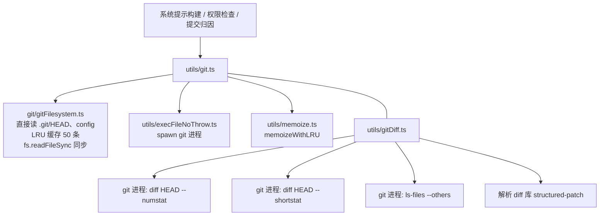
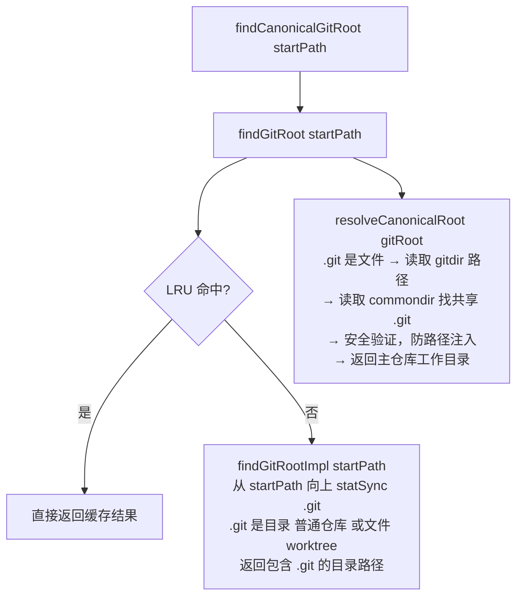
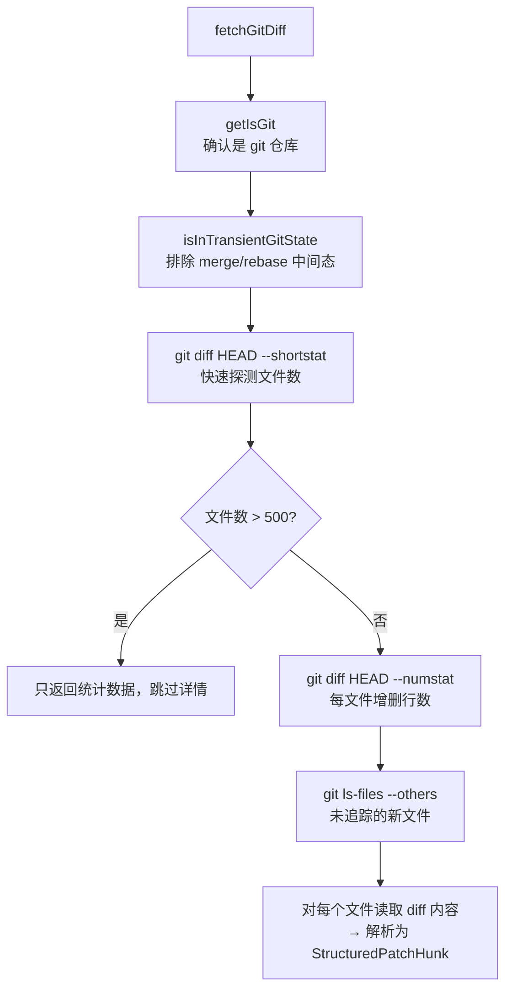

# Git工具函数 — Claude Code 源码分析

> 模块路径：`src/utils/git.ts`、`src/utils/gitDiff.ts`、`src/utils/git/`
> 核心职责：封装所有 Git 操作，提供仓库根目录发现、分支/HEAD查询、差异分析等能力
> 源码版本：v2.1.88

## 一、模块概述

Claude Code 在生成上下文感知提示时高度依赖 Git 信息——当前分支、工作区变更、默认分支等都会影响系统提示内容和权限检查。`src/utils/git.ts` 是这一能力的核心，分为两个层次：

1. **同步文件系统层**（`git/gitFilesystem.ts`）：直接读取 `.git/` 文件，无需启动 git 进程，零延迟
2. **异步进程层**（`git.ts`、`gitDiff.ts`）：通过 `execFileNoThrow` 调用 git 可执行文件，支持完整 git 命令

两层通过缓存协作：文件系统层结果被 LRU 缓存（最多 50 条），进程层结果被 `memoize` 缓存（会话级别），避免重复的 I/O 和进程启动开销。

## 二、架构设计

### 2.1 核心类/接口/函数

| 名称 | 位置 | 类型 | 说明 |
|---|---|---|---|
| `findGitRoot` | `git.ts` | 函数（LRU缓存） | 向上遍历目录树找 `.git`，支持 worktree 文件 |
| `findCanonicalGitRoot` | `git.ts` | 函数（LRU缓存） | 穿透 worktree `.git` 文件找主仓库根目录 |
| `fetchGitDiff` | `gitDiff.ts` | async 函数 | 获取工作区相对 HEAD 的完整差异统计和 hunks |
| `normalizeGitRemoteUrl` | `git.ts` | 纯函数 | 规范化 SSH/HTTPS 远程 URL 为统一格式 |
| `GitDiffResult` | `gitDiff.ts` | 类型 | 差异统计 + 每文件变更行数 + hunk 结构 |

### 2.2 模块依赖关系图



### 2.3 关键数据流

**仓库根目录发现**：



**差异获取流程**：



## 三、核心实现走读

### 3.1 关键流程

1. **向上遍历算法**：`findGitRootImpl` 从 `startPath` 开始，每次调用 `dirname` 向上一级，`statSync('.git')` 检查是否存在——可以是目录（普通仓库）或文件（worktree/子模块）。到达文件系统根目录时结束，记录 `stat_count` 和耗时用于诊断。

2. **Worktree 安全验证**：`resolveCanonicalRoot` 在解析 worktree 的 `commondir` 时有两项验证：（1）worktree 的 git 目录必须是 `<commonDir>/worktrees/` 的直接子项；（2）`gitdir` 文件必须回指当前 `gitRoot/.git`。两者同时满足才认为是合法的 worktree，否则回退到原始路径。注释明确标注这是防止「路径注入」攻击——恶意仓库可能通过伪造 commondir 指向用户信任的仓库。

3. **差异大文件保护**：`fetchGitDiff` 先用 `--shortstat` 快速获取变更文件数，若超过 `MAX_FILES_FOR_DETAILS`（500），立即返回汇总统计跳过详细 diff，避免加载数百 MB 内容。

4. **未追踪文件处理**：`git ls-files --others --exclude-standard` 获取新创建但未 `git add` 的文件，将其合并到 `perFileStats`（标记 `isUntracked: true`），确保新文件出现在差异摘要中。

5. **transient git 状态检测**：在 merge/rebase/cherry-pick/revert 进行时，工作区包含来自其他分支的变更，此时不应将这些变更呈现给模型，`isInTransientGitState` 检测这些中间状态并返回 `null`。

### 3.2 重要源码片段

**`git.ts` — LRU 缓存的 Git 根目录查找**
```typescript
// src/utils/git.ts
const findGitRootImpl = memoizeWithLRU(
  (startPath: string): string | typeof GIT_ROOT_NOT_FOUND => {
    let current = resolve(startPath)
    const root = current.substring(0, current.indexOf(sep) + 1) || sep

    while (current !== root) {
      try {
        const stat = statSync(join(current, '.git'))
        // .git 可以是目录（普通仓库）或文件（worktree/子模块）
        if (stat.isDirectory() || stat.isFile()) {
          return current.normalize('NFC')  // macOS 路径 NFC 规范化
        }
      } catch { /* .git 不存在，继续向上 */ }
      const parent = dirname(current)
      if (parent === current) break  // 到达文件系统根
      current = parent
    }
    return GIT_ROOT_NOT_FOUND
  },
  path => path,  // 缓存 key 函数
  50,            // LRU 最大容量
)
```

**`git.ts` — Worktree 路径遍历安全验证**
```typescript
// src/utils/git.ts（resolveCanonicalRoot 内部）
// 验证 worktreeGitDir 是 <commonDir>/worktrees/ 的直接子项
if (resolve(dirname(worktreeGitDir)) !== join(commonDir, 'worktrees')) {
  return gitRoot  // 验证失败，回退到原始路径
}
// 验证 gitdir 文件回指当前仓库的 .git
const backlink = realpathSync(readFileSync(join(worktreeGitDir, 'gitdir'), 'utf-8').trim())
if (backlink !== join(realpathSync(gitRoot), '.git')) {
  return gitRoot  // 防止攻击者借用受信任的 worktree 条目
}
```

**`gitDiff.ts` — 大规模差异保护**
```typescript
// src/utils/gitDiff.ts
const { stdout: shortstatOut } = await execFileNoThrow(
  gitExe(), ['--no-optional-locks', 'diff', 'HEAD', '--shortstat'],
  { timeout: GIT_TIMEOUT_MS }
)
const quickStats = parseShortstat(shortstatOut)
if (quickStats && quickStats.filesCount > MAX_FILES_FOR_DETAILS) {
  // 超过 500 文件只返回统计，不加载详情（避免数百 MB 内存占用）
  return { stats: quickStats, perFileStats: new Map(), hunks: new Map() }
}
```

**`git.ts` — 远程 URL 规范化**
```typescript
// src/utils/git.ts
export function normalizeGitRemoteUrl(url: string): string | null {
  // SSH 格式：git@github.com:owner/repo.git
  const sshMatch = url.match(/^git@([^:]+):(.+?)(?:\.git)?$/)
  if (sshMatch) return `${sshMatch[1]}/${sshMatch[2]}`.toLowerCase()

  // HTTPS/SSH URL 格式：https://github.com/owner/repo.git
  const urlMatch = url.match(/^(?:https?|ssh):\/\/(?:[^@]+@)?([^/]+)\/(.+?)(?:\.git)?$/)
  if (urlMatch) return `${urlMatch[1]}/${urlMatch[2]}`.toLowerCase()

  return null
}
```

### 3.3 设计模式分析

- **备忘录模式（Memoization）**：`memoizeWithLRU` 实现带容量上限的记忆化，`memoize`（无界）用于进程级单次查询。LRU 防止大型 monorepo 中编辑多个不同目录下文件时缓存无限增长。
- **防腐层（Anti-Corruption Layer）**：`git.ts` 将原始 git 命令输出解析为类型化 TypeScript 对象（`GitDiffResult`、`PerFileStats`），上层代码不直接操作字符串。
- **空对象模式**：`findGitRoot` 返回 `string | null`（而非抛出异常），调用方通过 `if (!gitRoot)` 优雅降级到非 git 行为。
- **防御性编程**：`GIT_TIMEOUT_MS`（5秒）防止挂起的 git 操作阻塞主线程；`--no-optional-locks` 避免 git 在并发访问时创建不必要的锁文件。

## 四、高频面试 Q&A

### 设计决策题

**Q1：为什么 `findGitRoot` 使用同步 `statSync` 而不是异步 `stat`？**

> `findGitRoot` 被权限检查、系统提示构建等多个同步路径调用，强制使用异步会导致整个调用链变成异步，破坏现有架构。通过 LRU 缓存（50条）将昂贵的 `statSync` 调用降频到首次查询，后续调用命中缓存无 I/O 开销。在实践中，Claude Code 通常在固定的几个目录下工作，50 条容量足以覆盖正常使用场景（编辑多个目录的文件）。

**Q2：`findGitRoot` 和 `findCanonicalGitRoot` 的使用场景分别是什么？**

> `findGitRoot` 返回包含 `.git` 文件/目录的实际目录（可能是 worktree 目录）；`findCanonicalGitRoot` 穿透 worktree 指向主仓库工作目录。使用场景：
> - 权限检查（文件是否在仓库内）→ 用 `findGitRoot`（就近原则）
> - 项目标识（auto-memory、项目配置）→ 用 `findCanonicalGitRoot`（同一仓库的所有 worktree 共享同一个内存目录）
> - 提交归因、代理内存 → 用 `findCanonicalGitRoot`（保证跨 worktree 数据一致性）

### 原理分析题

**Q3：`git --no-optional-locks` 参数的作用是什么？Claude Code 为什么需要它？**

> 正常 git 操作会创建 `.git/index.lock` 等锁文件来防止并发写入。Claude Code 频繁调用 `git diff`、`git status` 等只读命令，如果用户同时在运行 IDE 的 git 集成，多个进程争抢锁会导致一方失败。`--no-optional-locks` 告知 git 跳过非必要的锁创建（只读操作本就不需要），允许并发读取，避免误报锁文件错误。

**Q4：`fetchGitDiff` 为什么要排除 `isInTransientGitState` 状态？**

> 在 `git merge`、`git rebase`、`git cherry-pick`、`git revert` 等操作进行中，工作区同时包含「用户有意修改」和「merge 操作带入的变更」，`diff HEAD` 会把两者混在一起。若将这种混合状态的 diff 注入上下文，模型可能会将 merge 冲突标记当作需要修复的代码错误，或将即将废弃的文件当作当前文件处理，产生错误建议。返回 `null` 让上层逻辑以「无差异」状态处理，更安全。

**Q5：`normalizeGitRemoteUrl` 的规范化逻辑有什么业务用途？**

> 规范化输出用于 URL 的哈希（`createHash` + 规范化 URL），生成稳定的项目唯一标识符。同一个仓库可能有多种访问方式（`git@github.com:org/repo.git`、`https://github.com/org/repo`、SSH tunnel URL），若不规范化，相同仓库会产生不同哈希，导致项目配置、auto-memory、agent 记忆等跨会话无法共享。规范化消除协议差异、大小写差异和 `.git` 后缀，确保同一物理仓库始终映射到同一标识符。

### 权衡与优化题

**Q6：差异获取中设置 `MAX_DIFF_SIZE_BYTES = 1MB` 和 `MAX_LINES_PER_FILE = 400` 的原因？**

> Claude 的上下文窗口有限，大型 diff 会挤占可用于真正问题分析的空间。400 行是 GitHub PR 界面自动折叠的阈值（注释中明确引用），超过这个限制时用户/模型都需要额外点击才能看到完整内容，说明这是一个普遍认可的「可读性边界」。1MB 字节限制防止加载二进制文件或大型生成文件的变更内容到内存（如 lock 文件变更数百 KB）。

**Q7：LRU 缓存容量设为 50 的依据是什么？**

> 注释说明：`gitDiff` 以 `dirname(file)` 调用 `findGitRoot`，在大型代码库中编辑分散在不同目录的文件会积累大量不同路径的缓存条目。无上限的 `memoize` 会导致内存无限增长。50 条覆盖了「一个用户在一个会话里合理编辑的不同目录数量」，超过 50 时淘汰最近最少使用的条目。实践中大多数项目的源文件目录结构不超过 20-30 层深度，50 条绰绰有余。

### 实战应用题

**Q8：如何为 Claude Code 新增「获取 git log 最近 10 条提交」的工具函数？**

> 参照 `gitDiff.ts` 的模式：1) 调用 `getIsGit()` 确认在仓库内；2) 使用 `execFileNoThrow(gitExe(), ['log', '--oneline', '-10'], { timeout: GIT_TIMEOUT_MS })` 执行命令；3) 检查返回码（非 0 时返回 null）；4) 解析 stdout 为 `{ hash: string, message: string }[]`；5) 若需要跨调用缓存，用 `memoize`（会话级）或 `memoizeWithLRU`（多路径）包装。注意使用 `--no-optional-locks` 参数。

**Q9：如果用户的 git 版本较旧不支持某个命令参数，如何保证 Claude Code 的健壮性？**

> 参照已有模式：`execFileNoThrow` 返回 `{ stdout, stderr, code }`，`code !== 0` 时返回 null/空值而不抛出异常；调用方在 `if (code !== 0) return null` 后优雅降级。此外 `gitExe()` 用 `memoize` 缓存 `which('git')` 的结果，若 git 不在 PATH 中返回 fallback 字符串 `'git'`，子进程启动失败时 `execFileNoThrow` 也同样不抛出。整个 git 工具层均遵循「失败返回空」的设计契约。

---
> **版权声明**：源码版权归 [Anthropic](https://www.anthropic.com) 所有，本文档基于 Claude Code v2.1.88 source map 还原版本分析，仅供学习研究使用。文档内容采用 [CC BY-NC 4.0](https://creativecommons.org/licenses/by-nc/4.0/) 协议。
