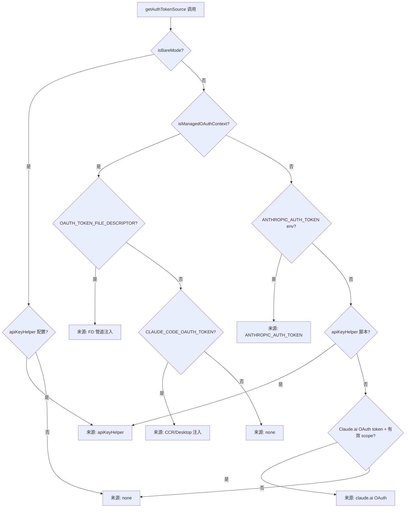
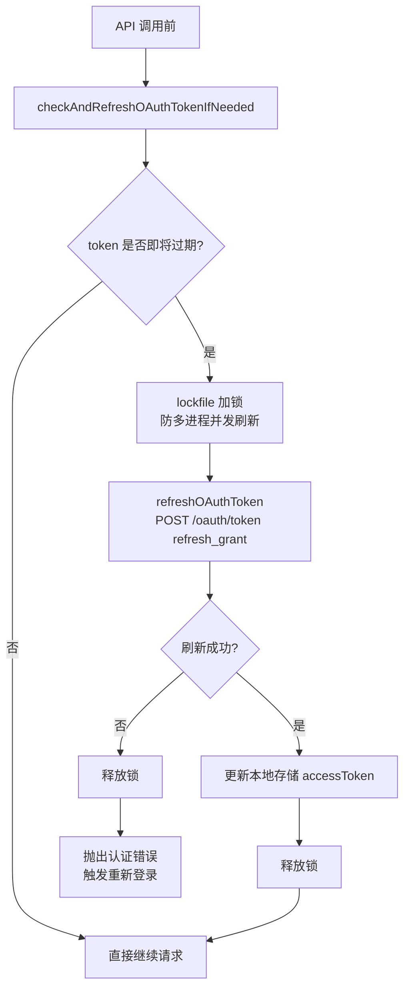

# 模型选择与认证 — Claude Code 源码分析

> 模块路径：`src/utils/auth.ts`、`src/utils/model/`、`src/services/oauth/`
> 核心职责：管理 API Key / OAuth token 生命周期，提供多来源认证优先级解析与模型选择逻辑
> 源码版本：v2.1.88

## 一、模块概述

Claude Code 的认证体系远比「传入 API Key」复杂——它需要同时支持直连 API Key、Claude.ai OAuth、企业订阅、AWS Bedrock IAM、GCP Vertex ADC、Azure Foundry AAD 等多种认证模式，且每种模式都有不同的 token 刷新策略。

`src/utils/auth.ts` 是这一复杂性的统一协调器：
- 通过 `getAuthTokenSource()` 按优先级解析当前应用的认证方式
- 通过 `isClaudeAISubscriber()` / `isMaxSubscriber()` 区分用户订阅层级
- 通过 `checkAndRefreshOAuthTokenIfNeeded()` 在 API 调用前自动刷新过期 OAuth token

模型选择层（`src/utils/model/`）将模型名称别名（`sonnet`、`haiku`）解析为具体版本，并根据提供器和订阅类型返回可用模型列表。

## 二、架构设计

### 2.1 核心类/接口/函数

| 名称 | 位置 | 类型 | 说明 |
|---|---|---|---|
| `getAuthTokenSource` | `auth.ts` | 函数 | 按优先级返回当前认证来源（OAuth / API Key / none） |
| `isAnthropicAuthEnabled` | `auth.ts` | 函数 | 判断是否应启用 Anthropic 第一方 OAuth 认证 |
| `getAnthropicApiKey` | `auth.ts` | 函数 | 获取当前有效的 API Key（支持多来源） |
| `checkAndRefreshOAuthTokenIfNeeded` | `auth.ts` | async 函数 | 检查并在过期前自动刷新 OAuth token |
| `getSmallFastModel` / `getDefaultMainLoopModel` | `model/model.ts` | 函数 | 获取当前配置下的快速辅助模型 / 主循环模型 |

### 2.2 模块依赖关系图

```
services/api/client.ts (getAnthropicClient)
        │
        ├─► utils/auth.ts
        │     │
        │     ├─► isClaudeAISubscriber() ──► services/oauth/client.ts
        │     │                                    │
        │     │                                    └─► shouldUseClaudeAIAuth(scopes)
        │     │
        │     ├─► getAnthropicApiKey() ──► utils/config.ts (全局配置)
        │     │                       └─► utils/secureStorage/ (macOS Keychain)
        │     │
        │     ├─► checkAndRefreshOAuthTokenIfNeeded()
        │     │         └─► services/oauth/client.ts (refreshOAuthToken)
        │     │
        │     └─► refreshAndGetAwsCredentials()
        │               └─► utils/aws.ts (STS CredentialsProvider)
        │
        └─► utils/model/
              ├─► model.ts (getSmallFastModel, getCanonicalName)
              ├─► providers.ts (getAPIProvider)
              └─► configs.ts (CLAUDE_SONNET_4_6_CONFIG 等)
```

### 2.3 关键数据流

**认证来源解析（优先级从高到低）**：
```
getAuthTokenSource()
    │
    ├─[1] isBareMode() → only apiKeyHelper
    ├─[2] ANTHROPIC_AUTH_TOKEN env var (非 managed 上下文)
    ├─[3] CLAUDE_CODE_OAUTH_TOKEN env var (CCR/Desktop 注入)
    ├─[4] CLAUDE_CODE_OAUTH_TOKEN_FILE_DESCRIPTOR (管道传递)
    ├─[5] apiKeyHelper 脚本（从配置文件读取）
    └─[6] Claude.ai OAuth tokens（本地存储的 accessToken）
```



**OAuth token 刷新流程**：
```
API 请求前：checkAndRefreshOAuthTokenIfNeeded()
    │
    ├─[token 未过期]─► 直接继续
    │
    └─[token 即将过期或已过期]
            │
            └─► lockfile 加锁（防止多进程同时刷新）
                    │
                    └─► refreshOAuthToken(currentTokens)
                            │  POST /oauth/token (refresh_grant)
                            │
                            └─► 更新本地存储
                                    │
                                    └─► 释放锁
```



## 三、核心实现走读

### 3.1 关键流程

1. **OAuth 优先级树**：`getAuthTokenSource` 按 7 个条件依次检查。关键设计：`isManagedOAuthContext()`（CCR 或 Claude Desktop 启动的子进程）会屏蔽用户本地的 `ANTHROPIC_AUTH_TOKEN` 和 `apiKeyHelper`，防止用户 terminal 配置的 key 干扰远程会话的认证。

2. **`isAnthropicAuthEnabled` 逻辑**：不是简单的「有没有 OAuth token」——它需要排除三种情况：使用第三方云（Bedrock/Vertex/Foundry）、用户有外部 API key、用户有外部 auth token。只有三者都排除才返回 true（启用 1P OAuth）。

3. **Managed OAuth 上下文**：`isManagedOAuthContext` 检测 `CLAUDE_CODE_REMOTE` 或 `CLAUDE_AGENT_SDK_CLIENT_APP === 'claude-desktop'`。在这种上下文下，OAuth token 来自父进程注入（文件描述符或 env var），而非用户本地的 `~/.claude` 配置。

4. **多提供器 token 缓存清除**：`onChangeAppState` 在 settings 变更时同时调用 `clearApiKeyHelperCache()`、`clearAwsCredentialsCache()`、`clearGcpCredentialsCache()`，确保认证配置变更立即生效，不需要重启会话。

5. **模型别名解析**：`getCanonicalName` 将 `'sonnet'`、`'claude-sonnet-4-6'`、`'claude-sonnet-4-6-20251101'` 等各种形式统一映射到内部短名称（`ModelShortName`），用于成本计算和功能判断的一致性。

### 3.2 重要源码片段

**`auth.ts` — 认证来源优先级解析**
```typescript
// src/utils/auth.ts
export function getAuthTokenSource() {
  if (isBareMode()) {
    // --bare 模式：只允许 apiKeyHelper，禁止 OAuth
    return getConfiguredApiKeyHelper()
      ? { source: 'apiKeyHelper', hasToken: true }
      : { source: 'none', hasToken: false }
  }

  // 管道注入的 OAuth token（CCR 子进程通过文件描述符继承）
  const oauthTokenFromFd = getOAuthTokenFromFileDescriptor()
  if (oauthTokenFromFd) {
    return process.env.CLAUDE_CODE_OAUTH_TOKEN_FILE_DESCRIPTOR
      ? { source: 'CLAUDE_CODE_OAUTH_TOKEN_FILE_DESCRIPTOR', hasToken: true }
      : { source: 'CCR_OAUTH_TOKEN_FILE', hasToken: true }
  }

  // 本地 Claude.ai 订阅 OAuth（最终回退）
  const oauthTokens = getClaudeAIOAuthTokens()
  if (shouldUseClaudeAIAuth(oauthTokens?.scopes) && oauthTokens?.accessToken) {
    return { source: 'claude.ai', hasToken: true }
  }

  return { source: 'none', hasToken: false }
}
```

**`auth.ts` — 是否启用第一方认证的决策**
```typescript
// src/utils/auth.ts
export function isAnthropicAuthEnabled(): boolean {
  if (isBareMode()) return false  // --bare 强制禁用 OAuth

  const is3P =
    isEnvTruthy(process.env.CLAUDE_CODE_USE_BEDROCK) ||
    isEnvTruthy(process.env.CLAUDE_CODE_USE_VERTEX) ||
    isEnvTruthy(process.env.CLAUDE_CODE_USE_FOUNDRY)

  const hasExternalAuthToken =
    process.env.ANTHROPIC_AUTH_TOKEN ||
    getSettings_DEPRECATED()?.apiKeyHelper ||
    process.env.CLAUDE_CODE_API_KEY_FILE_DESCRIPTOR

  // 三种情况任一满足则禁用 Anthropic OAuth
  const shouldDisableAuth =
    is3P ||
    (hasExternalAuthToken && !isManagedOAuthContext()) ||
    (hasExternalApiKey && !isManagedOAuthContext())

  return !shouldDisableAuth
}
```

**`client.ts` — 多提供器 token 注入**
```typescript
// src/services/api/client.ts（多云 Bedrock 分支）
if (process.env.AWS_BEARER_TOKEN_BEDROCK) {
  // Bedrock API Key 认证（Bearer token 模式）
  bedrockArgs.skipAuth = true
  bedrockArgs.defaultHeaders = {
    ...bedrockArgs.defaultHeaders,
    Authorization: `Bearer ${process.env.AWS_BEARER_TOKEN_BEDROCK}`,
  }
} else if (!isEnvTruthy(process.env.CLAUDE_CODE_SKIP_BEDROCK_AUTH)) {
  // 标准 IAM 凭证（STS 刷新）
  const cachedCredentials = await refreshAndGetAwsCredentials()
  if (cachedCredentials) {
    bedrockArgs.awsAccessKey = cachedCredentials.accessKeyId
    // ...
  }
}
```

**`auth.ts` — API key 来源枚举**
```typescript
// src/utils/auth.ts
export type ApiKeySource =
  | 'ANTHROPIC_API_KEY'   // 环境变量直接设置
  | 'apiKeyHelper'        // 配置文件中的 helper 脚本
  | '/login managed key'  // /login 命令管理的 keychain key
  | 'none'
```

### 3.3 设计模式分析

- **责任链模式**：`getAuthTokenSource` 的 7 步优先级检查是责任链的线性实现，每步检查失败则传递给下一步。
- **门卫模式（Guard Clause）**：`isManagedOAuthContext()` 作为门卫，在远程/桌面上下文中屏蔽本地配置，防止「漏桶」式配置污染。
- **缓存+TTL 模式**：`memoizeWithTTLAsync` 用于 `getApiKeyFromApiKeyHelper`，默认 5 分钟 TTL（`DEFAULT_API_KEY_HELPER_TTL`），状态变更时通过 `clearApiKeyHelperCache()` 主动失效，避免旧 key 残留。
- **策略模式（认证策略）**：每种提供器（Bedrock/Vertex/Foundry/直连）有独立的认证构造逻辑，由 `getAnthropicClient` 根据环境变量选择策略，认证细节不泄漏到上层。

## 四、高频面试 Q&A

### 设计决策题

**Q1：为什么 CCR（Claude Code Remote）场景下需要屏蔽用户本地的 API key 配置？**

> 在 `claude ssh` 远程场景下，API 调用通过本地的 `ANTHROPIC_UNIX_SOCKET` 代理隧道，代理负责注入正确的认证头。如果允许远程子进程读取 `~/.claude/settings.json` 中的 API key，就会产生头部冲突：代理注入的 OAuth 头 + 本地读取的 API key 头会同时存在，导致 API 返回「invalid x-api-key」错误。注释说明："The launcher sets CLAUDE_CODE_OAUTH_TOKEN as a placeholder iff the local side is a subscriber so the remote includes the oauth-2025 beta header to match what the proxy will inject." `isManagedOAuthContext()` 正是为了防止这个问题。

**Q2：`getApiKeyFromApiKeyHelper` 使用 TTL 缓存而非永久缓存的原因是什么？**

> `apiKeyHelper` 是用户在 `settings.json` 中配置的可执行脚本（如 `aws secretsmanager get-secret-value ...`），每次执行都有时间开销（可能几百毫秒）。永久缓存会让密钥轮换（rotation）不生效；不缓存则每次 API 调用都要执行脚本。5 分钟 TTL 是折中方案：对应 AWS Secrets Manager 等短期凭证的最小轮换周期，既支持轮换又不频繁执行。

### 原理分析题

**Q3：`shouldUseClaudeAIAuth(scopes)` 中的 `scopes` 参数如何决定是否启用 Claude.ai 认证？**

> OAuth token 在 `scopes` 字段中携带授权范围（如 `claude.ai.profile`）。`CLAUDE_AI_PROFILE_SCOPE` 常量是判断依据——只有当 scopes 中包含这个特定范围时，才认为该 token 是有效的 Claude.ai 订阅 token。这个检查防止将第三方 OAuth token 或过期作用域的 token 错误地当作 Claude.ai 订阅使用。

**Q4：Vertex AI 的 `GoogleAuth` 实例为什么每次 `getAnthropicClient` 都重新创建，而不缓存？**

> 源码注释明确指出这是一个 TODO："TODO: Cache either GoogleAuth instance or AuthClient to improve performance"，并列出了不缓存的理由：凭证刷新/过期、`GOOGLE_APPLICATION_CREDENTIALS` 等环境变量可能在两次调用之间变化、跨请求 auth 状态管理复杂。当前选择是「正确性优先」——每次重新创建 GoogleAuth 实例保证凭证始终是最新的，即使有轻微性能开销。

**Q5：`--bare` 模式与普通模式的认证差异是什么？**

> `--bare` 模式（`isBareMode()`）是 API-key-only 模式，设计给无 UI 的服务器部署：完全禁用 OAuth（不从 keychain 读取，不刷新 token），只接受 `apiKeyHelper` 配置或直接环境变量。这确保 bare 模式下的认证行为完全可预测、无交互提示，适合 CI/CD 环境和无人值守批处理。

### 权衡与优化题

**Q6：如何在不重启 Claude Code 会话的情况下更换 API Key？**

> 通过 `onChangeAppState` 监听到 settings 变更后调用 `clearApiKeyHelperCache()`，下次 API 调用时 `getApiKeyFromApiKeyHelper` 重新执行 helper 脚本获取新 key。如果是直接修改 `ANTHROPIC_API_KEY` 环境变量，则需要通过 `settings.json` 的 `env` 字段修改（`applyConfigEnvironmentVariables`）来触发 `onChangeAppState` 链路。`clearAwsCredentialsCache()` 和 `clearGcpCredentialsCache()` 同理，适用于需要轮换云凭证的场景。

**Q7：模型别名系统（`sonnet` → `claude-sonnet-4-6-20251101`）的优势是什么？潜在问题是什么？**

> **优势**：迁移脚本（如 `migrateSonnet45ToSonnet46`）无需向每个用户推送变更——只需修改别名映射，所有使用 `sonnet` 别名的用户自动升级到新版本。成本计算（`getModelCosts`）、功能判断（`isNonCustomOpusModel`）等都基于规范化后的短名称，与具体版本解耦。**潜在问题**：别名解析不透明，用户可能不清楚 `sonnet` 当前指向哪个版本；在功能开关影响模型可用性时，别名与实际模型的映射需要与 GrowthBook 功能开关同步更新，否则会出现配置漂移。

### 实战应用题

**Q8：如何为企业 SSO 添加新的认证来源？**

> 参照现有模式：1) 在 `getAuthTokenSource` 的优先级链中添加新来源检查（如 `process.env.ENTERPRISE_SSO_TOKEN`）；2) 在 `ApiKeySource` 类型联合中添加新值；3) 在 `getAnthropicClient` 中的 `configureApiKeyHeaders` 路径中处理新 token 格式（设置 `Authorization: Bearer <token>`）；4) 在 `withRetry` 的 `shouldRetry` 中考虑 SSO token 过期时的重试行为（类比 OAuth 的 401 处理）；5) 如果 SSO token 有过期时间，参照 `checkAndRefreshOAuthTokenIfNeeded` 实现刷新逻辑并配合 lockfile 防并发。

**Q9：调试「为什么 Claude Code 没有使用我配置的 API key」的步骤是什么？**

> 1. 开启 `--debug` 模式，检查 `[API:auth]` 前缀的调试日志；2. 调用 `getAuthTokenSource()` 返回值（在调试模式下会记录）来确认认证来源；3. 检查是否处于 `isManagedOAuthContext()` 状态（远程/桌面启动），该状态会屏蔽本地 key；4. 确认 `isAnthropicAuthEnabled()` 是否为 false（存在外部 API key 且非 managed 上下文会阻止 OAuth，但不影响 API key 读取）；5. 检查 `ANTHROPIC_API_KEY` 环境变量是否被 `settings.json` 中的 `env.ANTHROPIC_API_KEY` 覆盖（后者通过 `applyConfigEnvironmentVariables` 在 settings 加载时写入 `process.env`）。

---
> **版权声明**：源码版权归 [Anthropic](https://www.anthropic.com) 所有，本文档基于 Claude Code v2.1.88 source map 还原版本分析，仅供学习研究使用。文档内容采用 [CC BY-NC 4.0](https://creativecommons.org/licenses/by-nc/4.0/) 协议。
