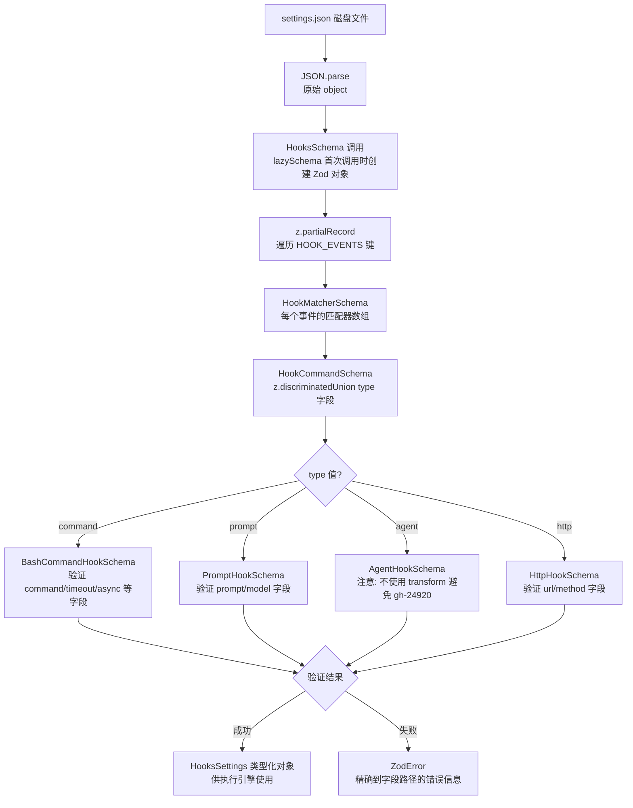
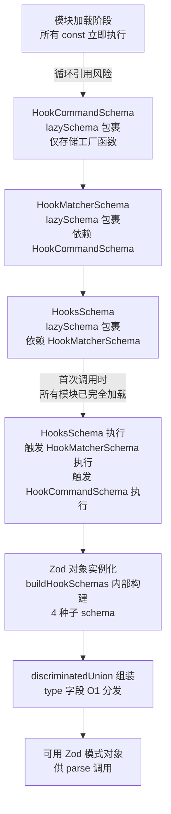

# 结构定义层 — Claude Code 源码分析

> 模块路径：`src/schemas/`
> 核心职责：用 Zod v4 定义运行时可验证的结构模式，为工具输入、钩子配置、权限规则提供类型安全保障
> 源码版本：v2.1.88

## 一、模块概述

`src/schemas/` 目录是 Claude Code 中 Zod 模式定义的集中存放处。它的存在主要是为了**打破循环依赖**——原本分散在 `utils/settings/types.ts` 和 `plugins/schemas.ts` 中的模式定义会造成相互 import，提取到独立的 `schemas/` 目录后，两者都可以安全地从此处 import。

目录内容：
- `hooks.ts`：钩子（Hook）配置的 Zod 模式，支持 4 种类型（command/prompt/http/agent）
- `ids.ts`：ID 类型的模式（待验证）
- `logs.ts`：日志结构模式
- `permissions.ts`：权限规则的模式
- `plugin.ts`：插件配置模式
- `command.ts`：命令配置模式
- `generated/`：从 protobuf 自动生成的事件类型

钩子（`hooks.ts`）是最复杂、最值得深入分析的模式定义。

## 二、架构设计

### 2.1 核心类/接口/函数

| 名称 | 位置 | 类型 | 说明 |
|---|---|---|---|
| `HookCommandSchema` | `hooks.ts` | Zod 判别联合 | 4 种钩子类型的模式，通过 `type` 字段区分 |
| `HookMatcherSchema` | `hooks.ts` | Zod 对象 | 钩子匹配器，含 `matcher`（工具名模式）和 `hooks` 数组 |
| `HooksSchema` | `hooks.ts` | Zod 部分记录 | 完整钩子配置，按事件类型索引 |
| `lazySchema` | `utils/lazySchema.ts` | 工厂函数 | 延迟创建 Zod 模式，解决模块间递归引用 |
| `IfConditionSchema` | `hooks.ts`（内部） | Zod 字符串 | 钩子的条件过滤字段（权限规则语法） |

### 2.2 模块依赖关系图

```
utils/settings/types.ts ──► schemas/hooks.ts ◄── plugins/schemas.ts
                                │
                                ├─► utils/lazySchema.ts（解决递归）
                                ├─► utils/shell/shellProvider.ts（SHELL_TYPES）
                                └─► entrypoints/agentSdkTypes.ts（HOOK_EVENTS）

工具 Tool.ts ──► schemas/permissions.ts ──► types/permissions.ts
                        │
                        └─► 权限规则验证

应用启动 ──► settings 解析 ──► HooksSchema.parse(rawSettings.hooks)
                                     │
                                     └─► BashCommandHook | PromptHook | AgentHook | HttpHook
```

### 2.3 关键数据流



**钩子配置解析与验证**：
```
settings.json (磁盘)
    │
    ▼
JSON.parse → raw object
    │
    ▼
HooksSchema().parse(rawHooks)  ← Zod v4 运行时验证
    │
    ├─[验证成功]─► HooksSettings {
    │               PreToolUse: [{ matcher: "Bash(*)", hooks: [...] }],
    │               PostToolUse: [...],
    │               ...
    │             }
    │
    └─[验证失败]─► ZodError → 显示用户友好错误信息

工具执行时：
    tool.name = "BashTool"
        │
        ▼
    HookMatcherSchema.matcher 匹配 "BashTool" ？
        │
        ├─[匹配]─► 执行 hooks[] 中的每个钩子
        └─[不匹配]─► 跳过
```

## 三、核心实现走读

### 3.1 关键流程

1. **判别联合（Discriminated Union）**：`HookCommandSchema` 使用 `z.discriminatedUnion('type', [...])` 根据 `type` 字段选择对应模式。Zod 在解析时先读取 `type` 值，然后只用匹配的子模式验证剩余字段，性能优于 `z.union`（逐个尝试）。

2. **懒模式（lazySchema）**：`HookCommandSchema`、`HookMatcherSchema`、`HooksSchema` 都用 `lazySchema(() => ...)` 包裹。`lazySchema` 是一个工厂函数，每次调用 `HookCommandSchema()` 才真正执行 Zod 模式创建。这有两个作用：（a）在 settings 解析之前不创建 Zod 对象（节省启动时间）；（b）支持模式间的递归引用（A 引用 B，B 引用 A，只要执行时的调用顺序没有循环即可）。

3. **`if` 条件字段**：每种钩子都有可选的 `if` 字段，使用与权限规则相同的语法（如 `"Bash(git *)"`)，在执行钩子之前先做匹配过滤，避免无关命令触发钩子的进程开销。

4. **`async`/`asyncRewake` 字段的语义差异**：
   - `async: true`：钩子在后台运行，不阻塞工具执行
   - `asyncRewake: true`：钩子在后台运行，但若退出码为 2，会唤醒模型（blocking error），隐含 `async: true`

5. **`.transform()` 的刻意缺失**：`AgentHookSchema` 的注释明确说明**不使用** `.transform()`。历史上曾用 transform 将 `prompt` 字符串包装为函数，但 `updateSettingsForSource` 会 `JSON.stringify` 解析后的模式值再写回磁盘，transform 产生的函数值会被 silently 丢弃，导致用户的 `prompt` 字段从 settings.json 中消失（bug gh-24920）。这是一个典型的「序列化/反序列化与 Zod transform 不兼容」的陷阱。

### 3.2 重要源码片段

**`hooks.ts` — 四类钩子的判别联合**
```typescript
// src/schemas/hooks.ts
export const HookCommandSchema = lazySchema(() => {
  const { BashCommandHookSchema, PromptHookSchema, AgentHookSchema, HttpHookSchema }
    = buildHookSchemas()
  return z.discriminatedUnion('type', [
    BashCommandHookSchema,  // type: 'command' — 执行 shell 命令
    PromptHookSchema,       // type: 'prompt'  — 调用 LLM 评估
    AgentHookSchema,        // type: 'agent'   — 启动子代理验证
    HttpHookSchema,         // type: 'http'    — POST 到 URL
  ])
})
```

**`hooks.ts` — BashCommandHookSchema 完整字段**
```typescript
// src/schemas/hooks.ts（buildHookSchemas 内部）
const BashCommandHookSchema = z.object({
  type: z.literal('command'),
  command: z.string(),                    // 要执行的 shell 命令
  if: IfConditionSchema(),               // 可选：执行条件（权限规则语法）
  shell: z.enum(SHELL_TYPES).optional(), // bash / powershell（默认 bash）
  timeout: z.number().positive().optional(),  // 超时秒数
  statusMessage: z.string().optional(),  // spinner 展示文本
  once: z.boolean().optional(),          // true = 执行一次后自动移除
  async: z.boolean().optional(),         // true = 后台执行
  asyncRewake: z.boolean().optional(),   // true = 后台执行，退出码 2 时唤醒模型
})
```

**`hooks.ts` — AgentHookSchema 中刻意不用 transform**
```typescript
// src/schemas/hooks.ts
const AgentHookSchema = z.object({
  type: z.literal('agent'),
  // DO NOT add .transform() here. updateSettingsForSource round-trips through
  // JSON.stringify — a transformed function value is silently dropped,
  // deleting the user's prompt from settings.json (gh-24920, CC-79).
  prompt: z.string().describe('Prompt describing what to verify...'),
  if: IfConditionSchema(),
  timeout: z.number().positive().optional(),
  model: z.string().optional(),
  statusMessage: z.string().optional(),
  once: z.boolean().optional(),
})
```

**`hooks.ts` — 完整 HooksSchema 定义**
```typescript
// src/schemas/hooks.ts
export const HooksSchema = lazySchema(() =>
  z.partialRecord(
    z.enum(HOOK_EVENTS),   // PreToolUse | PostToolUse | Stop | ...
    z.array(HookMatcherSchema())  // 每个事件可有多个匹配器
  ),
)
// 使用：HooksSchema().parse(rawSettingsHooks)
```

### 3.3 设计模式分析

- **判别联合（Tagged Union）**：通过 `type` 字段标记区分 4 种钩子，Zod 的 `discriminatedUnion` 比 `union` 更高效（O(1) 而非 O(n) 匹配）。TypeScript 的联合类型推断也更精确，`Extract<HookCommand, { type: 'agent' }>` 可精确获取 `AgentHook` 类型。
- **工厂方法模式（lazySchema）**：`lazySchema` 将模式对象的创建推迟到首次调用时，类似于依赖注入容器的懒初始化，解决了模块加载顺序导致的循环引用问题。


- **防御式 schema 设计**：`optional()` + 描述性 `describe()` 字符串双重保障——前者保证向后兼容（旧配置不含新字段不会解析失败），后者在 schema 导出为 JSON Schema（用于工具 `inputSchema`）时提供文档。
- **约定优于配置**：`_PROTO_*` 字段命名约定（分析服务中）与 `IfConditionSchema` 的权限规则语法（钩子中）都是「语义编码到命名约定」的例子，减少显式配置。

## 四、高频面试 Q&A

### 设计决策题

**Q1：为什么使用 `lazySchema` 包装而不是直接定义 Zod 模式常量？**

> 两个原因：**性能**——Zod 模式对象在创建时会做一定的初始化工作，用 `lazySchema` 推迟到第一次 `HookCommandSchema()` 调用，避免在 settings 不含钩子时白白初始化；**循环引用**——`HookMatcherSchema` 依赖 `HookCommandSchema`，`HooksSchema` 依赖 `HookMatcherSchema`，三者形成引用链。若用 `const` 立即执行，JavaScript 模块加载时可能因顺序问题遇到 `undefined`。`lazySchema` 本质上是闭包延迟，调用时再从已完全加载的模块中读取依赖。

**Q2：`z.partialRecord` 相比 `z.record` 有什么区别？为什么 `HooksSchema` 要用它？**

> `z.record(K, V)` 要求所有可能的 key 都必须存在（或在 output 中存在）；`z.partialRecord(K, V)` 允许 key 缺失（等价于 `Partial<Record<K, V>>`）。`HooksSchema` 使用 `partialRecord(HOOK_EVENTS, ...)` 是因为用户的 settings.json 通常只配置几个钩子事件（如只有 `PreToolUse`），不应要求所有事件类型都存在。若用 `z.record`，未配置的事件类型会触发解析错误。

### 原理分析题

**Q3：`z.discriminatedUnion('type', [...])` 相比 `z.union([...])` 在性能上的优势是什么？**

> `z.union` 逐个尝试每个子模式直到找到匹配的（O(n)）；`z.discriminatedUnion` 先读取判别字段（`type`）的值，通过 Map 直接定位对应子模式（O(1)）。对于 4 种钩子类型，`discriminatedUnion` 比 `union` 快约 4 倍。更重要的是错误信息：`union` 失败时会报告所有子模式的错误（难以阅读）；`discriminatedUnion` 只报告匹配到的子模式的错误，明确指向问题字段。

**Q4：`once: true` 钩子的执行语义是什么？在 schema 层如何体现？**

> `once: true` 是字段级声明，schema 层仅做类型验证（`z.boolean().optional()`），实际的「执行后移除」逻辑在钩子执行引擎（`utils/hooks/`）中实现：执行完后从内存中的钩子列表移除该条目。schema 保证这个字段被正确解析为布尔值，但不定义行为语义——这是 schema（数据契约）与执行逻辑（行为）分离的体现。

**Q5：`IfConditionSchema` 使用「权限规则语法」，这意味着什么？**

> 权限规则语法如 `"Bash(git *)"` 表示「工具名为 Bash，且命令参数匹配 `git *` 通配符」。`IfConditionSchema` 在 schema 层只验证字段是 string 类型（不做语法检查），实际的模式匹配（glob 展开、工具名比较）在钩子执行前的过滤步骤中进行。这样 schema 保持简单，运行时的模式匹配逻辑可以独立演进而无需改变 schema。

### 权衡与优化题

**Q6：Zod v4 相比 Zod v3 有哪些影响 Claude Code 使用方式的变化？**

> `src/schemas/hooks.ts` 使用 `from 'zod/v4'` 显式指定版本。Zod v4 的关键变化影响此处：`z.partialRecord` 是 v4 新增的 API（v3 需要 `z.record(K, z.optional(V))` 变通）；v4 的错误格式和 `describe()` 与 JSON Schema 生成的对接方式也有所改善。使用 `zod/v4` 子路径 import 表明这是有意识的版本锁定，避免 v3→v4 迁移时的 API 破坏。

**Q7：schema 中的 `describe()` 字符串有什么实际作用，不只是文档注释？**

> `describe()` 字符串在通过 `zodToJsonSchema` 转换时会变成 JSON Schema 的 `description` 字段。Claude Code 中工具的 `inputSchema` 是从 Zod 模式生成的 JSON Schema，`description` 字段被包含在发送给模型的工具定义中——模型据此理解每个参数的含义。例如 `statusMessage` 字段的描述 `"Custom status message to display in spinner while hook runs"` 会出现在工具描述中，帮助模型生成更准确的钩子配置。注释中也有 `// @[MODEL LAUNCH]: Update the example model ID in the .describe() strings below`，说明 `describe` 字符串在模型上线时需要同步更新。

### 实战应用题

**Q8：如何为新增的 `mcp` 类型钩子扩展 HookCommandSchema？**

> 1. 在 `buildHookSchemas` 函数中新增 `McpHookSchema = z.object({ type: z.literal('mcp'), server: z.string(), tool: z.string(), ... })`；2. 将 `McpHookSchema` 加入 `HookCommandSchema` 的 `discriminatedUnion` 数组；3. 在推断类型中添加 `export type McpHook = Extract<HookCommand, { type: 'mcp' }>`；4. 在 `src/utils/hooks/` 的执行引擎中添加 `mcp` 分支处理；5. 由于使用 `lazySchema`，模式在首次调用时才初始化，新增的 `McpHookSchema` 不影响加载性能。

**Q9：如何调试「hooks 配置解析失败」的问题？**

> Zod 的 `parse` 方法在失败时抛出包含详细路径的 `ZodError`，`safeParse` 则返回 `{ success: false, error: ZodError }`。在 settings 解析的 try-catch 中可以通过 `error.flatten()` 或 `error.format()` 获取结构化错误信息（精确到字段路径）。常见问题：1) `type` 字段拼写错误（`discriminatedUnion` 会明确报告「invalid_union_discriminator」）；2) `timeout` 传了字符串而非数字；3) `asyncRewake: true` 但同时设置了 `async: false`（逻辑冲突，schema 不检查但执行引擎会处理）。运行 `claude --debug` 可以看到完整的配置解析日志。

---
> **版权声明**：源码版权归 [Anthropic](https://www.anthropic.com) 所有，本文档基于 Claude Code v2.1.88 source map 还原版本分析，仅供学习研究使用。文档内容采用 [CC BY-NC 4.0](https://creativecommons.org/licenses/by-nc/4.0/) 协议。
