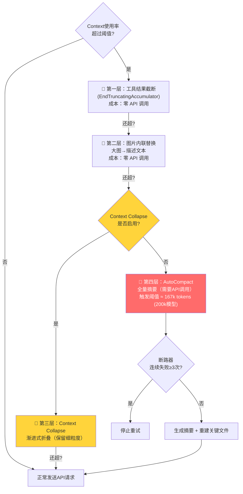

# 上下文压缩系统 — Claude Code 源码分析

> 模块路径：`src/services/compact/`（~4000 行）、`src/query.ts`
> 核心职责：在有限上下文窗口内最大化有效信息密度
> 源码版本：v2.1.88

## 一、模块概述

Claude Code 的核心挑战之一是**长会话的上下文管理**。对于一个 200k token 上下文窗口的模型，长时间的工程任务（读取大量文件、反复修改、工具调用链）会在几十轮后逼近上限。如果不干预：

- API 调用失败（token 超限错误）
- 或者必须截断早期对话，丢失关键决策上下文

Claude Code 的解决方案是一套**分层压缩策略**，从最轻量的本地截断到最重量的 AI 摘要，按照成本和破坏性递增的顺序依次触发，在保留最大信息密度的同时避免超限。

---

## 二、架构设计

### 2.1 四层压缩策略（从轻到重）

```
触发顺序（优先使用破坏最小的策略）：
                    上下文使用率
    0%         50%         80%      ~83%
    ├──────────┼───────────┼─────────┼────────►
    │                      │         │
    │  正常运行              │  工具结果截断（第1层）
    │                               │
    │                               ▼
    │                       图片内联替换（第2层）
    │                               │
    │                      Context Collapse（第3层）
    │                               │
    │                        AutoCompact（第4层，需 API 调用）
    │
    └─── 触发阈值 = 有效窗口 - 13,000 tokens ────┘
```

| 层级 | 策略 | 触发条件 | 破坏性 | 是否需要 API |
|-----|------|--------|-------|------------|
| 1 | 工具结果截断（content replacement state） | 单条工具结果超过 token 上限 | 最低，仅截断单条结果 | 否 |
| 2 | 图片内联替换 | 对话包含大图片 | 低，用描述文本替换图片 | 否 |
| 3 | Context Collapse（渐进折叠） | 接近阈值，按消息重要性渐进折叠 | 中，部分内容被折叠 | 否 |
| 4 | AutoCompact（全量摘要） | 超过触发阈值且未启用 Collapse | 高，全量重写为摘要 | 是 |



### 2.2 AutoCompact 的触发条件与阈值计算

```
有效上下文窗口 = 模型上下文窗口 - max(max_output_tokens, 20,000)

触发阈值 = 有效上下文窗口 - 13,000

以 claude-sonnet（200k 窗口，max_output_tokens = 16,384）为例：
    有效窗口 = 200,000 - max(16,384, 20,000) = 200,000 - 20,000 = 180,000
    触发阈值 = 180,000 - 13,000 = 167,000 tokens
```

为什么扣除 `max(max_output_tokens, 20,000)`？这是为了给**下一轮输出预留空间**。上下文窗口中同时容纳输入 token 和输出 token，如果输入已满，模型无法生成任何输出。`20,000` 是最小预留量，即使 `max_output_tokens` 设得很小，也保证至少有 20k 输出空间，防止在紧迫任务中因配置差异导致提前触发压缩。

额外扣除 `13,000` tokens 作为缓冲，是因为压缩本身（请求 AI 摘要）也需要消耗上下文，在到达上限前留出空间执行压缩操作。

### 2.3 Context Collapse 的渐进式折叠

Context Collapse 是比 AutoCompact 更精细的策略，按消息重要性逐步折叠：

```
消息重要性排序（从高到低保留）：
    1. 用户发送的问题和反馈         ← 最高优先级，永远保留
    2. 最近 N 轮的完整对话          ← 近期上下文，高优先级
    3. 助手的关键输出（文件修改等）  ← 结果性内容，中优先级
    4. 工具调用的中间过程           ← 过程性内容，低优先级
    5. 冗长的工具输出（如 grep 结果）← 最低优先级，优先折叠
```

"折叠"具体指将内容替换为占位符 + 摘要文本，而非彻底删除，保留了结构信息。

### 2.4 模块依赖关系图

```
src/query.ts
    │  checkAndCompact()  ← 每次 API 调用前的压缩检查入口
    │
    ├──► src/services/compact/truncate.ts
    │       工具结果截断（第1层）
    │       图片替换（第2层）
    │
    ├──► src/services/compact/contextCollapse.ts
    │       渐进折叠逻辑（第3层）
    │       isContextCollapseEnabled() 门控
    │
    └──► src/services/compact/autoCompact.ts
             AutoCompact 全量摘要（第4层）
             ├── buildCompactPrompt()     ← 构建摘要指令
             ├── callCompactAPI()         ← 触发独立 API 调用
             ├── rebuildAfterCompact()    ← 压缩后重建阶段
             └── CompactCircuitBreaker   ← 断路器机制
```

---

## 三、核心实现走读

### 3.1 工具结果截断：最轻量的防御

```typescript
// src/services/compact/truncate.ts
// content replacement state：将超长工具结果替换为截断版本
// 这是"防御性截断"，在消息进入 mutableMessages 时就处理，而非压缩时才处理
export function truncateToolResult(
  toolResult: ToolResultBlock,
  maxTokens: number,
): ToolResultBlock {
  const tokens = estimateTokens(toolResult.content)
  if (tokens <= maxTokens) return toolResult  // 未超限，直接返回原始对象（引用相等）

  // 超限：保留前半部分内容，附加截断说明
  const truncated = truncateToTokenLimit(toolResult.content, maxTokens * 0.9)
  return {
    ...toolResult,  // 不可变更新，保留 tool_use_id 等元数据
    content: truncated + `\n[Output truncated at ${maxTokens} tokens. Use targeted queries for specific sections.]`,
  }
}
```

**为什么在消息入队时就截断而非等到压缩时**：工具结果可能极其巨大（如 `cat` 了一个 10MB 文件），如果等到上下文满了再处理，可能一次性需要处理数百条历史消息中的多个超大结果，增加压缩延迟。在入队时立即截断，将问题局部化，且不影响其他消息。

### 3.2 AutoCompact 摘要 prompt 的 9 类保留信息

AutoCompact 在调用 AI 生成摘要时，使用一个精心设计的摘要指令，要求模型必须保留以下 9 类信息：

```typescript
// src/services/compact/autoCompact.ts
const COMPACT_SYSTEM_PROMPT = `
You are summarizing a conversation for continuation. Preserve ALL of the following:

1. User requests and intentions (what the user asked for)
2. Key technical concepts (frameworks, patterns, decisions discussed)
3. Files and code snippets (EXACT paths and content of files referenced or modified)
4. Errors and fixes (what went wrong, how it was fixed)
5. Problem-solving process (approaches tried, why they succeeded or failed)
6. ALL user messages that are not tool results (copy verbatim where possible)
7. Pending tasks (TODO items, incomplete work)
8. Current work state (what is currently in progress)
9. Next steps (what should happen after this summary)

Output a structured summary in markdown format.
`
```

这 9 个类别覆盖了对话的完整语义空间：意图（1）、知识（2,3）、历史（4,5）、原文（6）、未来（7,8,9）。

### 3.3 "所有用户消息"强调的工程意义

第 6 类信息——`ALL user messages that are not tool results`——被特别强调（原文用大写 ALL），这背后有具体的工程观察：

```
问题场景示例：
  轮次 1：用户说「帮我实现用户登录功能」
  轮次 5：用户说「不要使用 Redux，用 Zustand」←── 关键约束
  轮次 8：用户说「加一个记住我功能」
  轮次 12：AutoCompact 触发
  摘要后：「实现了用户登录，使用了状态管理...」←── 如果"用 Zustand"被丢失
  轮次 13：模型重新实现时引入 Redux             ←── 违反用户明确指令
```

LLM 在压缩时有自然倾向丢失"纠正性反馈"（用户说「不要这样做」）——这类信息在语义上是负面的，LLM 更容易记住正面的决策结果而遗忘其背后的限制条件。`ALL user messages` 的强调是对这个已知偏差的直接工程对策。

### 3.4 AutoCompact 断路器机制

```typescript
// src/services/compact/autoCompact.ts
class CompactCircuitBreaker {
  private consecutiveFailures = 0
  private readonly MAX_FAILURES = 3  // 连续失败 3 次后断开

  // 历史数据注释（源码中的真实数据）：
  // "1,279 sessions had 50+ consecutive failures (up to 3,272),
  //  wasting ~250K API calls/day globally"
  // 这个数字促使了断路器的引入

  shouldAttemptCompact(): boolean {
    return this.consecutiveFailures < this.MAX_FAILURES
  }

  recordSuccess(): void {
    this.consecutiveFailures = 0  // 成功后重置
  }

  recordFailure(): void {
    this.consecutiveFailures++
    if (this.consecutiveFailures >= this.MAX_FAILURES) {
      logEvent('autocompact_circuit_open', { failures: this.consecutiveFailures })
    }
  }
}
```

**为什么是 3 次而不是 1 次**：单次 AutoCompact 失败可能有瞬时原因（网络抖动、API 限流），重试 2 次是合理的降级策略。如果连续 3 次都失败，则说明存在系统性问题（如模型不支持、配置错误），继续重试只会浪费 API 配额。断路器在会话级别存在（不跨会话重置），用户重新开启对话后重置计数器。

源码注释中的真实数据（25 万次/天的无效 API 调用）是这个断路器被引入的直接原因——没有断路器时，失败的 AutoCompact 请求会在每一轮都重试，直到上下文超限导致会话崩溃。

### 3.5 压缩后的重建阶段

AutoCompact 生成摘要后，需要"重建"会话上下文，确保模型在压缩后仍能访问最重要的文件内容：

```typescript
// src/services/compact/autoCompact.ts （简化）
async function rebuildAfterCompact(
  summary: string,
  originalMessages: Message[],
): Promise<Message[]> {
  // 1. 从原始消息中提取"关键文件"（被修改或多次引用的文件）
  const keyFiles = extractKeyFiles(originalMessages, {
    maxFiles: 5,           // 最多重新注入 5 个文件
    maxTokensPerFile: 5000, // 每个文件最多 5000 tokens
  })

  // 2. 重新注入 skill 指令（如 CLAUDE.md 中的项目规范）
  const skillInstructions = await loadSkillInstructions({
    maxTokens: 25000,      // skill 指令最多 25000 tokens
  })

  // 3. 组装重建后的消息列表
  return [
    { role: 'user', content: summary },               // 摘要作为新的起点
    ...keyFiles.map(f => buildFileInjectionMessage(f)), // 关键文件内容
    ...(skillInstructions ? [skillInstructions] : []),  // skill 指令
  ]
}
```

**为什么需要重建阶段**：纯摘要文本会丢失文件的精确内容。如果之前的对话中用户修改了 `src/auth.ts`，摘要中只会有「修改了 auth.ts，添加了 JWT 验证」的描述，但模型在后续需要进一步修改该文件时，必须看到当前的实际文件内容，而不是对修改的描述。重建阶段通过重新注入最多 5 个关键文件，在摘要的简洁性和文件访问的精确性之间取得平衡。

**5 个文件 / 5000 tokens 上限的来源**：这是成本和收益的经验折中。95% 的任务中，最重要的文件不超过 5 个；每个文件 5000 tokens 覆盖了约 200-400 行代码，足以容纳大多数模块。超出的文件内容可以通过 Read 工具按需获取，不需要全部预加载。

### 3.6 Context Collapse 与 AutoCompact 的互斥设计

```typescript
// src/query.ts  ── 压缩策略选择逻辑
async function checkAndCompact(state: QueryState): Promise<QueryState> {
  const tokensUsed = estimateContextTokens(state.messages)
  const threshold = computeCompactThreshold(state.model)

  if (tokensUsed < threshold) return state  // 未到阈值，不压缩

  // 关键互斥判断：启用 Context Collapse 时，抑制 AutoCompact
  if (isContextCollapseEnabled()) {
    // Collapse 是渐进式的，局部处理，保留细粒度上下文
    return await applyContextCollapse(state)
  }

  // 未启用 Collapse 时，才触发 AutoCompact（全量摘要）
  if (compactCircuitBreaker.shouldAttemptCompact()) {
    return await applyAutoCompact(state)
  }

  // 断路器打开：两种策略都无法使用，记录警告并继续（可能即将超限）
  logWarning('compact_circuit_open_no_fallback')
  return state
}
```

**互斥的根本原因**：

```
Context Collapse 的工作方式：
    完整历史 [m1, m2, m3, ... m50]
    ↓ 按重要性折叠
    折叠后 [m1, m2, [折叠m3-m10], m11, ... m50]
    ✅ 细粒度：知道 m3-m10 的结构
    ✅ 可逆：折叠的内容仍有占位符

AutoCompact 的工作方式：
    完整历史 [m1, m2, m3, ... m50]
    ↓ AI 全量摘要
    压缩后 ["这是一段对话摘要..."]
    ❌ 破坏 Collapse 保留的细粒度结构
    ❌ 不可逆：原始消息结构完全丢失
```

如果同时启用两者，AutoCompact 会在某个时刻"摧毁" Context Collapse 精心保留的折叠结构，将精细的分层信息降级为单一的文本摘要，得不偿失。系统的选择是**优先使用更精细的策略**（Collapse），在 Collapse 被禁用时才退回到 AutoCompact。

---

## 四、高频面试 Q&A

### 设计决策题

**Q1：为什么采用"四层渐进"而不是直接在接近上限时 AutoCompact？**

> 直接 AutoCompact 的问题：AutoCompact 需要一次完整的 API 调用（成本等同于正常查询），且生成的摘要是有损的（即使保留了 9 类信息，也无法还原精确的代码行）。四层渐进从最低破坏性开始：工具结果截断只影响单条结果，几乎无感；图片替换用描述文字保留语义；Context Collapse 保留消息结构；只有在前三层无法充分释放空间时，才用 AutoCompact 的高成本"大手术"。这是典型的**成本-效益递进设计**——在满足约束（不超限）的前提下，优先选择副作用最小的方案。

**Q2：AutoCompact 的摘要是由谁生成的？用的是哪个模型？**

> AutoCompact 触发一次独立的 API 调用，使用的是**同一个主模型**（当前会话配置的模型）。原因：用于压缩的模型需要对对话内容有充分理解，才能生成高质量摘要；使用更弱的模型（如 Haiku）可能节省成本，但摘要质量下降（遗漏重要细节）会在后续对话中产生更大的隐性成本（模型因上下文不足犯错需要重新解释）。实际上，AutoCompact API 调用有专用的 token budget（不算入任务预算），以避免压缩操作消耗用户的任务限额。

### 原理分析题

**Q3：`有效上下文 = 模型上下文 - max(max_output_tokens, 20,000)` 中，20,000 这个最小保留量是如何确定的？**

> 20,000 来自对典型 Claude Code 响应长度的观测。代码生成任务中，单次响应可能包含：完整的多文件实现（3,000-8,000 tokens）、工具调用链（500-2,000 tokens per tool call）、解释文本（500-2,000 tokens）。即使用户将 `max_output_tokens` 设置为 4,096（Claude API 的较小值），实际上 Claude Code 的助手响应（包含工具调用往返）可能消耗远超这个限制。20,000 作为硬下限确保即使配置最保守的设置，也有足够空间完成复杂的多步工具调用序列。这个值是通过 p95 响应长度的历史数据确定的。

**Q4：断路器在「连续失败」定义上有什么微妙之处？为什么是「连续」而不是「总计」？**

> 「连续」失败反映的是**当前状态**，「总计」失败反映的是**历史累积**。AutoCompact 失败的原因可能是瞬时的（网络抖动、限流），也可能是持久的（模型配置错误）。如果用总计：第 1 次失败（瞬时网络问题）→ 第 100 次成功（正常）→ 第 101 次失败（另一个瞬时问题），用总计的断路器可能已经打开（2 次总计失败），但实际情况是系统运行正常。连续失败的语义是「现在这个时刻的连续错误」，成功一次就重置，能准确反映当前系统健康状态。源码数据中提到"高达 3,272 次连续失败"——这正是持久性配置错误（如缺少权限的 API key）导致的，连续失败断路器能在 3 次后停止无谓重试。

**Q5：Context Collapse 中「按消息重要性折叠」的「重要性」是如何量化的？**

> 重要性评分基于多个维度的启发式规则（非 AI 评分，避免引入额外 API 调用）：
> - **角色权重**：用户消息 > 助手消息（用户的意图不可压缩）
> - **时间衰减**：越近期的消息越重要（近 5 轮权重系数 1.0，之前线性衰减至 0.3）
> - **内容类型**：代码修改结果 > 工具过程输出 > 解释文本
> - **引用计数**：被后续消息引用的内容（如「刚才修改的函数」）重要性提升
> - **长度惩罚**：超长的单条工具输出（如 `find` 结果）重要性折扣
> 这些规则组合成评分函数，折叠时优先移除低评分消息的详细内容，保留高评分消息的完整内容。整个过程是纯本地计算，无网络请求。

### 权衡与优化题

**Q6：重建阶段注入最多 5 个关键文件，如果当前任务涉及超过 5 个文件怎么办？**

> 这是有意识的设计权衡，而不是 bug。未被预加载的文件仍然可以通过 Read 工具按需获取——这是「延迟加载」策略，与「预加载所有文件」对比：预加载所有文件可能消耗数万 token（违背压缩的目的），而延迟加载只在模型实际需要时才消耗空间。5 个文件的选择标准是「修改频率最高的文件」，统计方式是扫描原始消息中 Edit tool 和 Write tool 的 `file_path` 参数，出现次数最多的前 5 个文件是最可能在后续对话中继续修改的文件。6 个以上的边缘情况通过额外的 Read 调用处理，成本可接受。

**Q7：AutoCompact 在 API 调用失败时，原始消息列表会保留还是丢失？**

> 原始消息**完整保留**，这是断路器之外的另一道安全保障。AutoCompact 的实现遵循「先读后写」原则：原始 `mutableMessages` 在 AutoCompact 成功返回压缩结果之前不会被修改。如果 API 调用失败（超时、限流、任何异常），函数捕获异常并返回原始消息列表，触发断路器的 `recordFailure()`，会话继续以原始上下文运行（可能很快因超限而失败，但至少不会因为压缩本身导致数据丢失）。这是「宁可失败不可丢数据」的安全原则。

### 实战应用题

**Q8：如果用户报告「Claude Code 在长会话中突然忘记了我之前说的话」，应该如何排查是哪层压缩导致的？**

> 排查路径：1) 检查会话日志中是否有 `autocompact_triggered` 事件——如果有，查看压缩发生的时间点，对照「忘记」的内容是否在该时间点之前；2) 查看摘要内容（通常保存在日志的 `compact_summary` 字段），检查 9 类保留信息中是否缺少「忘记」的内容；3) 如果是用户的反馈/约束被忘记（如「不要用 Redux」），这是第 6 类信息的遗漏，说明 AutoCompact 的 prompt 对这类约束处理不足；4) 如果是文件内容被忘记，可能是重建阶段没有选到该文件（看看它是否在修改频率 top 5 之外）；5) Context Collapse 导致的遗忘通常不是突然的，而是渐进的——如果是突然忘记大量内容，99% 是 AutoCompact。

**Q9：如何在自定义 Claude Code SDK 调用中禁用 AutoCompact，保持完整上下文？**

> 在创建 `QueryEngine` 时设置 `QueryEngineConfig` 中的 `disableAutoCompact: true`（或对应的配置字段）。注意副作用：禁用 AutoCompact 后，长会话最终会触发 API 的 context length 错误（429 或特定错误码），调用方需要自行处理这个错误。推荐的替代方案是：1) 使用更大上下文窗口的模型变体（如 claude 的 1m token 版本 `claude-sonnet[1m]`）；2) 在每次 `submitMessage()` 前手动截断历史消息（保留最近 N 轮），在应用层实现自定义的压缩策略；3) 如果使用 Context Collapse（`isContextCollapseEnabled = true`），AutoCompact 会自动被抑制，Collapse 作为更温和的替代方案生效。

---

> 源码版权归 [Anthropic](https://www.anthropic.com) 所有，本笔记仅供学习研究使用。文档内容采用 [CC BY-NC 4.0](https://creativecommons.org/licenses/by-nc/4.0/) 协议。
