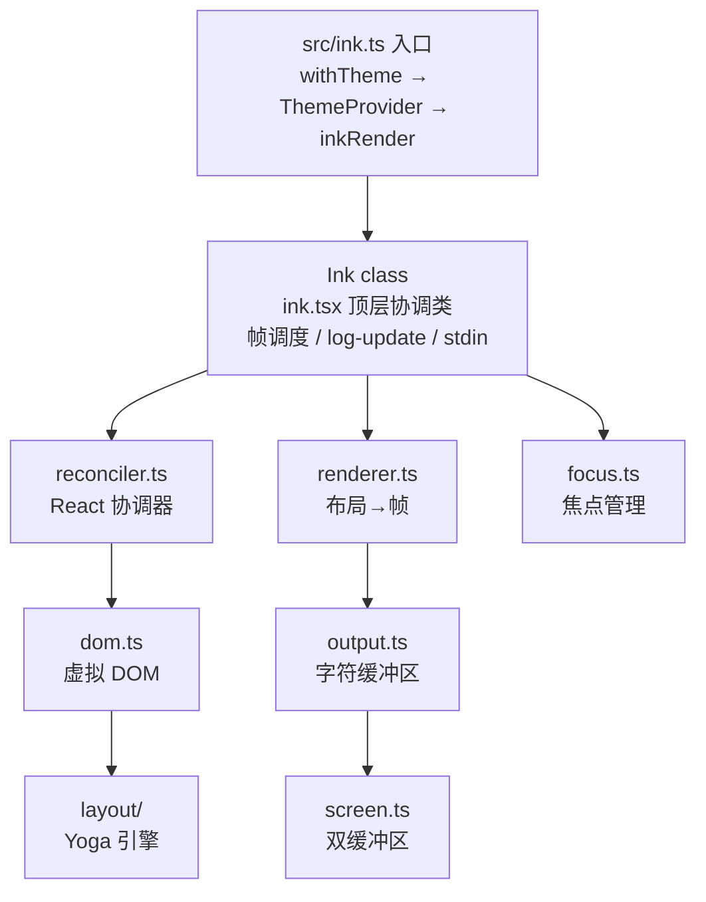
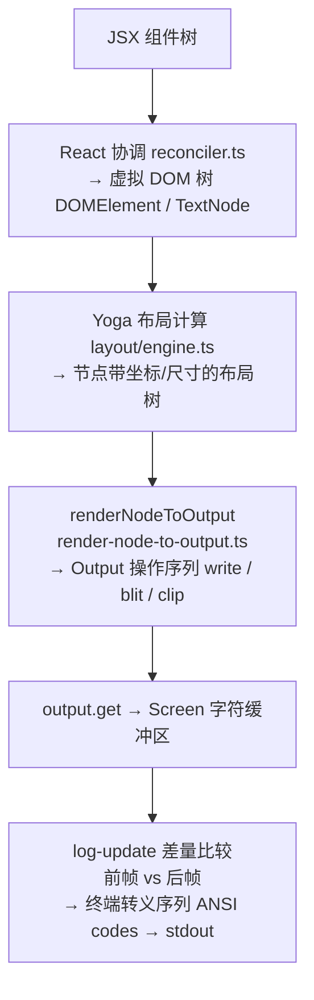

# Ink 渲染引擎 — Claude Code 源码分析

> 模块路径：`src/ink/`
> 核心职责：将 React 组件树通过自定义协调器渲染为终端字符输出
> 源码版本：v2.1.88

## 一、模块概述

Claude Code 的 UI 层并非直接操作终端转义序列，而是借助 **Ink** —— 一套将 React 组件模型移植到 CLI 环境的渲染引擎。`src/ink/` 目录包含 50 余个文件，实现了从 React 组件树到终端字符帧的完整渲染管线：自定义 React 协调器（`reconciler.ts`）、虚拟 DOM（`dom.ts`）、基于 Yoga 布局引擎的 Flexbox 排版（`layout/`）、字符输出缓冲（`output.ts`）以及终端差量渲染（`renderer.ts`）。

这一设计让开发者能够用熟悉的 JSX 语法声明式地构建终端界面，同时享受 React 的状态管理、钩子系统和差量更新机制。

---

## 二、架构设计

### 2.1 核心类/接口/函数

| 名称 | 文件 | 职责 |
|------|------|------|
| `reconciler`（`createReconciler` 实例）| `reconciler.ts` | React 19 自定义协调器，实现宿主环境桥接接口 |
| `DOMElement` / `TextNode` | `dom.ts` | 虚拟 DOM 节点类型，对应终端元素（box/text/link 等） |
| `createRenderer` | `renderer.ts` | 每帧将 DOM 树计算布局并输出到字符屏幕缓冲区 |
| `Output` | `output.ts` | 将写操作、裁剪、块拷贝等操作收集后应用到 `Screen` |
| `Ink`（`ink.js`） | `ink.tsx` | 整个引擎的顶层协调类，管理帧调度与终端 I/O |

### 2.2 模块依赖关系图



### 2.3 关键数据流



---

## 三、核心实现走读

### 3.1 关键流程

1. **应用启动**：`src/ink.ts` 的 `render()` 函数将根节点包裹在 `ThemeProvider` 中，调用 `inkRender`（`root.ts`）创建 `Ink` 实例。
2. **协调器挂载**：`reconciler.ts` 通过 `createReconciler<ElementNames, Props, DOMElement, ...>()` 创建 React 19 兼容的自定义协调器，`createInstance` 方法将每个 JSX 元素映射为 `DOMElement` 节点并分配 Yoga 布局节点。
3. **脏标记传播**：任何属性变化调用 `markDirty(node)`，沿 `parentNode` 链向根节点冒泡，确保下一帧能精准找到需要重新计算的子树。
4. **帧渲染**：React 提交（`resetAfterCommit`）触发 `rootNode.onComputeLayout()`，Yoga 重新计算受影响节点的位置尺寸；随后 `rootNode.onRender()` 触发 `createRenderer` 返回的渲染函数，生成新的 `Screen` 帧。
5. **差量输出**：`Screen` 双缓冲机制（`frontFrame` / `backFrame`）对比前后帧，仅输出发生变化的终端行，避免全屏刷新闪烁。
6. **Blit 优化**：未变化的节点通过 `blitRegion` 直接从上一帧复制字符块，跳过重新渲染，将稳态帧的渲染开销降至 O(变化行数)。

### 3.2 重要源码片段

**片段一：协调器创建（`reconciler.ts`）**
```typescript
// 使用 react-reconciler 创建自定义宿主协调器
// 泛型参数依次为：元素类型、Props、容器、实例、文本实例、...
const reconciler = createReconciler<
  ElementNames, Props, DOMElement, DOMElement, TextNode, ...
>({
  // 每个 JSX 元素在此被创建为虚拟 DOM 节点
  createInstance(originalType, newProps, _root, hostContext) {
    const node = createNode(type)       // 分配 DOMElement + Yoga 节点
    for (const [key, value] of Object.entries(newProps)) {
      applyProp(node, key, value)       // 应用样式/属性
    }
    return node
  },
  // React 提交后触发布局计算与帧渲染
  resetAfterCommit(rootNode) {
    rootNode.onComputeLayout?.()        // Yoga 布局
    rootNode.onRender?.()               // 输出到终端
  },
})
```

**片段二：脏标记冒泡（`dom.ts`）**
```typescript
// 节点属性变化时沿父链向上标记 dirty
// 确保 Yoga 只对叶子文本节点调用 markDirty（触发文本重测量）
export const markDirty = (node?: DOMNode): void => {
  let current: DOMNode | undefined = node
  while (current) {
    if (current.nodeName !== '#text') {
      (current as DOMElement).dirty = true
      if (!markedYoga && current.nodeName === 'ink-text' && current.yogaNode) {
        current.yogaNode.markDirty() // 通知 Yoga 重新测量文本尺寸
        markedYoga = true
      }
    }
    current = current.parentNode
  }
}
```

**片段三：渲染器双缓冲（`renderer.ts`）**
```typescript
// 每帧复用 Output 实例（保留 charCache 热字符缓存）
// prevFrameContaminated 标志决定是否启用 blit 复用
export default function createRenderer(node, stylePool) {
  let output: Output | undefined
  return options => {
    const { frontFrame, backFrame } = options
    // 绝对定位节点被移除时禁用 blit（避免跨子树像素污染）
    const absoluteRemoved = consumeAbsoluteRemovedFlag()
    renderNodeToOutput(node, output, {
      prevScreen: absoluteRemoved || options.prevFrameContaminated
        ? undefined : prevScreen,
    })
    return { screen: output.get(), ... }
  }
}
```

### 3.3 设计模式分析

- **宿主协调器模式（Host Renderer Pattern）**：`reconciler.ts` 实现 `react-reconciler` 的宿主接口，将 React 的抽象操作（createInstance / commitUpdate / removeChild）映射到 Ink 的虚拟 DOM 操作，与 `react-dom`、`react-native` 的架构完全平行。
- **双缓冲模式（Double Buffering）**：`frontFrame` 持有当前显示帧，`backFrame` 为下一帧写入缓冲，渲染完成后交换指针，消除撕裂和闪烁。
- **脏检查 + 增量更新（Dirty Checking + Incremental Rendering）**：节点级脏标记结合 blit 复用，实现细粒度增量渲染，避免全屏重绘。
- **观察者模式（Observer）**：`onRender` / `onComputeLayout` 回调由 `DOMElement` 根节点持有，协调器提交后触发，解耦渲染调度与 React 生命周期。

---

## 四、高频面试 Q&A

### 设计决策题

**Q1：Claude Code 为什么选择 React + Ink 而不是直接用 `process.stdout.write` 操控终端？**

直接操作终端需要手动管理状态：哪些行已输出、光标位置、ANSI 转义序列的开关顺序。随着 UI 复杂度增长，这类命令式代码极难维护。React 的声明式模型让 UI = f(state)，引擎自动计算最小差量更新，开发者只需描述"界面应该长什么样"。具体收益包括：
- **组件复用**：`PromptInput`、`Spinner`、`PermissionRequest` 等都是标准 React 组件，可独立测试。
- **状态管理**：`useState` / `useReducer` / Context 管理 REPL 状态，无需自建观察者机制。
- **差量渲染**：Ink 的双缓冲 + blit 机制自动处理增量更新，避免整屏闪烁。
- **生态复用**：React DevTools、React 19 并发特性、自定义钩子体系均可直接复用。

**Q2：Yoga 布局引擎为什么能在 CLI 中实现 Flexbox？它与浏览器 Flexbox 的本质区别是什么？**

Yoga 是 Meta 开源的跨平台 Flexbox 实现（C++，编译为 WASM），Claude Code 通过 `src/native-ts/yoga-layout/` 调用。它实现了 CSS Flexbox 规范的子集，在终端中的主要差异在于：
- **离散坐标**：浏览器使用浮点像素，终端使用整数字符格（列/行），Yoga 计算结果经 `Math.floor` 取整。
- **等宽字体假设**：每个字符格固定为 1 列（CJK 字符为 2 列），没有 CSS `letter-spacing` 等概念。
- **无滚动原语**：滚动逻辑由 `scrollTop` / `pendingScrollDelta` 手动实现，而非浏览器原生滚动。
- **测量回调**：文本节点通过 `setMeasureFunc` 注册测量回调，Yoga 在布局计算时调用，动态确定文本行数/宽度。

---

### 原理分析题

**Q3：`DOMElement` 的 `dirty` 标记与 Yoga 的 `markDirty()` 有什么区别？为什么需要两套机制？**

两者针对不同的失效域：
- `DOMElement.dirty`：Ink 渲染层的脏标记，告知 `render-node-to-output` 该节点需要重新绘制字符。
- `yogaNode.markDirty()`：布局层的脏标记，告知 Yoga 该文本节点的测量缓存失效，下次 `calculateLayout()` 时需重新调用 `measureFunc`。

只有 `ink-text` 和 `ink-raw-ansi` 节点才会触发 Yoga 的 `markDirty()`，因为只有这两类节点有动态测量函数。普通 `ink-box` 的尺寸完全由子节点和 flex 属性决定，无需单独标记。

**Q4：`resetAfterCommit` 在渲染管线中扮演什么角色？**

`resetAfterCommit` 是 react-reconciler 协调器接口的核心回调，在 React 完成所有 DOM 变更（创建/更新/删除节点）后同步调用。Claude Code 在此处执行两步操作：
1. `rootNode.onComputeLayout()` —— 调用 Yoga 的 `calculateLayout()`，基于脏标记重新计算受影响子树的位置和尺寸。
2. `rootNode.onRender()` —— 触发帧渲染，将布局结果转换为字符并写入终端。

这一时序保证了每次 React 状态更新后，布局与渲染严格按顺序完成，不会出现布局未计算就渲染的中间态。

**Q5：Ink 的 `charCache` 是如何提升渲染性能的？**

`Output` 类内部维护 `charCache`，以文本行字符串为键，缓存已解析的 `ClusteredChar[]`（含字符值、终端宽度、样式 ID、超链接）。每帧渲染时，未变化的行直接从缓存读取预处理结果，跳过 ANSI tokenize、grapheme clustering 和 `stringWidth` 计算。`Output` 实例在帧间复用（不随每帧重建），因此缓存在整个会话中持续有效。对于稳态帧（如用户输入时只有光标行变化），绝大多数行均命中缓存，渲染开销接近 O(1)。

---

### 权衡与优化题

**Q6：blit 优化在什么情况下会被禁用？为什么这是必要的权衡？**

以下情况禁用 blit，回退到全量重新渲染：
1. `prevFrameContaminated = true`：上一帧的 `Screen` 缓冲区被选区高亮等操作污染，直接复用会复制错误的反色字符。
2. `absoluteRemoved = true`：有绝对定位节点被移除。绝对定位元素可以覆盖任意其他节点，其移除可能导致被遮挡节点需要重新暴露，普通的兄弟节点脏检查无法处理跨子树的像素重叠问题。
3. 窗口大小变化 / SIGCONT 恢复：终端物理缓冲区已被操作系统清空，必须全量重绘。

禁用 blit 会导致一帧的渲染开销上升，但正确性优先于性能——错误的像素复用会产生视觉脏字符，比短暂的性能抖动更不可接受。

**Q7：Claude Code 如何处理 Alt Screen（全屏模式）与普通滚动模式的差异？**

`renderer.ts` 通过 `options.altScreen` 标志分支处理：
- **高度裁剪**：Alt Screen 的内容高度强制钳制为 `terminalRows`，防止 Yoga 超高内容导致虚拟/物理光标坐标失同步。
- **视口高度 +1 hack**：Alt Screen 的 `viewport.height` 设为 `terminalRows + 1`，规避 log-update 把"内容恰好填满"误判为"需要滚动"。
- **光标位置**：Alt Screen 中光标 Y 坐标钳制为 `terminalRows - 1`，避免最后一行触发终端自动换行（LF）把 alt buffer 内容滚出。

---

### 实战应用题

**Q8：如果要在 Ink 组件中实现虚拟滚动（只渲染可视区域的行），需要在哪些层次做工作？**

需要协同三个层次：
1. **React 层**：`useVirtualScroll` 钩子（`src/hooks/useVirtualScroll.ts`）根据 `scrollTop` 和视口高度计算当前应渲染的子项范围，只将可视区域的 React 元素传给渲染树。
2. **DOM 层**：`DOMElement` 的 `scrollClampMin` / `scrollClampMax` 字段记录当前已挂载子项的覆盖范围，防止 `scrollTo` 的直接写操作超过 React 异步渲染追上之前的空白区域（blank screen）。
3. **渲染层**：`render-node-to-output.ts` 读取 `scrollTop` 并在绘制时偏移子节点坐标，`pendingScrollDelta` 的逐帧漏斗（SCROLL_MAX_PER_FRAME）确保快速滑动时显示中间帧而非直接跳到终点。

**Q9：CLAUDE_CODE_DEBUG_REPAINTS 环境变量开启后，引擎如何定位导致全屏刷新（full reset）的组件？**

开启后，协调器的 `createInstance` 会通过 `getOwnerChain(internalHandle)` 读取 React Fiber 的 `_debugOwner` 链路，将组件调用栈（如 `['ToolUseLoader', 'Messages', 'REPL']`）存入节点的 `debugOwnerChain` 字段。当 log-update 触发全屏 reset 时，引擎调用 `findOwnerChainAtRow(root, y)` 深度优先遍历 DOM 树，通过 Yoga 计算的 `getComputedTop()` + `getComputedHeight()` 定位 `y` 行所属节点，返回该节点的 `debugOwnerChain`，即可精确归因到触发重绘的 React 组件。

---

> **版权声明**：源码版权归 [Anthropic](https://www.anthropic.com) 所有，本文档基于 Claude Code v2.1.88 source map 还原版本分析，仅供学习研究使用。文档内容采用 [CC BY-NC 4.0](https://creativecommons.org/licenses/by-nc/4.0/) 协议。
