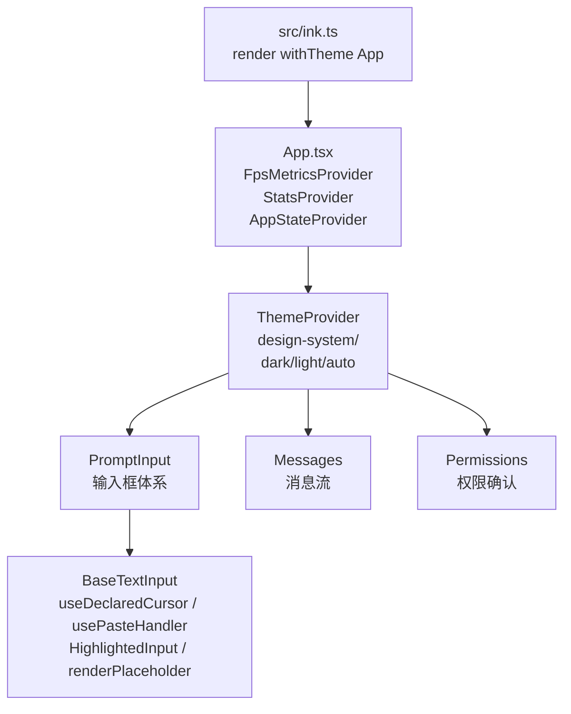
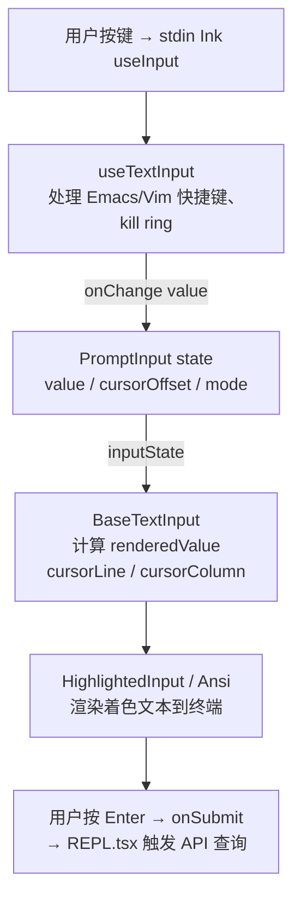

# 核心组件 — Claude Code 源码分析

> 模块路径：`src/components/`
> 核心职责：提供 REPL 界面所需的全套 React UI 组件，包括输入框、消息渲染、主题系统等
> 源码版本：v2.1.88

## 一、模块概述

`src/components/` 目录包含 60+ 个组件文件，构成了 Claude Code 的完整用户界面。组件体系分为三个层次：

1. **基础设施层**：`design-system/`（主题/ThemedBox/ThemedText）、`App.tsx`（顶层状态提供器）
2. **交互层**：`PromptInput/`（输入框体系）、`BaseTextInput.tsx`（文本输入基础组件）、`permissions/`（权限确认对话框）
3. **内容层**：消息渲染（`VirtualMessageList`、`CompactSummary`）、差异显示（`diff/`）、工具结果展示（`FileEditToolDiff`、`AgentProgressLine` 等）

所有组件均经过 **React Compiler**（`react/compiler-runtime`）自动记忆化处理，生成的代码使用 `_c()` 缓存槽替代手写的 `useMemo` / `useCallback`。

---

## 二、架构设计

### 2.1 核心类/接口/函数

| 组件/模块 | 文件 | 职责 |
|-----------|------|------|
| `App` | `App.tsx` | 顶层状态提供器，挂载 FpsMetricsProvider / StatsProvider / AppStateProvider |
| `ThemeProvider` | `design-system/ThemeProvider.tsx` | 主题上下文，支持 dark/light/auto（OSC 11 监听系统主题） |
| `PromptInput` | `PromptInput/PromptInput.tsx` | REPL 主输入框，集成历史、补全、Vim 模式、语音等 |
| `BaseTextInput` | `BaseTextInput.tsx` | 文本渲染基础，处理光标位置、粘贴检测、占位符 |
| `useTextInput` | `hooks/useTextInput.ts` | 输入框核心逻辑钩子，处理 Emacs 快捷键、kill ring、多行输入 |

### 2.2 模块依赖关系图



### 2.3 关键数据流



---

## 三、核心实现走读

### 3.1 关键流程

1. **启动挂载**：`src/ink.ts` 的 `render()` 自动为所有组件注入 `ThemeProvider`，无需每个调用点手动添加。
2. **主题解析**：`ThemeProvider` 初始从 `getGlobalConfig().theme` 读取偏好。`auto` 模式下通过 OSC 11 终端查询协议实时监听系统明/暗主题变化并更新 `currentTheme`。
3. **React Compiler 记忆化**：`App.tsx` 中的 `_c(9)` 表示分配 9 个缓存槽，每次渲染时比较 `$[0] !== children` 等条件，仅在依赖变化时重新创建 JSX 节点，等效于精细化的 `useMemo`。
4. **输入框状态管理**：`PromptInput` 将 `value` 状态传给 `useTextInput` 钩子，后者返回处理过的 `inputState`（含 `renderedValue` 渲染字符串、`cursorLine/Column` 坐标），再传递给 `BaseTextInput` 进行渲染。
5. **光标声明**：`BaseTextInput` 通过 `useDeclaredCursor({ line, column, active })` 向 Ink 渲染系统声明当前光标位置，由 Ink 统一管理终端光标移动，避免多组件竞争光标。
6. **粘贴检测**：`usePasteHandler` 通过检测连续输入事件的时间间隔来识别粘贴（vs 正常打字），粘贴内容超过阈值时显示 `[Pasted X lines]` 引用而非内联展示。

### 3.2 重要源码片段

**片段一：App 顶层状态提供器（`App.tsx`）**
```typescript
// React Compiler 自动生成的记忆化代码
// _c(9) 分配 9 个缓存槽，避免每次渲染重建 Provider 树
export function App(t0) {
  const $ = _c(9)
  const { getFpsMetrics, stats, initialState, children } = t0

  // 仅当 children 或 initialState 变化时重建 AppStateProvider
  let t1
  if ($[0] !== children || $[1] !== initialState) {
    t1 = <AppStateProvider initialState={initialState} ...>
           {children}
         </AppStateProvider>
    $[0] = children; $[1] = initialState; $[2] = t1
  } else { t1 = $[2] }  // 命中缓存，直接复用

  return <FpsMetricsProvider>
           <StatsProvider store={stats}>{t1}</StatsProvider>
         </FpsMetricsProvider>
}
```

**片段二：主题自动跟踪（`ThemeProvider.tsx`）**
```typescript
// 'auto' 模式：通过 OSC 11 协议查询终端背景色
// 动态 import 确保外部构建时 dead-code-elimination 移除此代码
useEffect(() => {
  if (feature('AUTO_THEME')) {
    if (activeSetting !== 'auto' || !internal_querier) return
    void import('../../utils/systemThemeWatcher.js').then(
      ({ watchSystemTheme }) => {
        cleanup = watchSystemTheme(internal_querier, setSystemTheme)
      }
    )
    return () => { cancelled = true; cleanup?.() }
  }
}, [activeSetting, internal_querier])
```

**片段三：BaseTextInput 光标声明（`BaseTextInput.tsx`）**
```typescript
// 向 Ink 渲染引擎声明光标位置，统一管理终端光标
const t1 = Boolean(props.focus && props.showCursor && terminalFocus)
const cursorRef = useDeclaredCursor({
  line: cursorLine,
  column: cursorColumn,
  active: t1   // 仅终端聚焦且 focus=true 时激活光标
})
```

### 3.3 设计模式分析

- **提供器模式（Provider Pattern）**：`App` 通过三层 Provider（FpsMetrics / Stats / AppState）为整个组件树注入横切关注点，避免 prop drilling。
- **外观模式（Facade Pattern）**：`PromptInput` 是一个大型外观组件，内部集成了 20+ 个钩子（历史搜索、补全、Vim 模式、语音、双击检测等），对外提供简洁的 `onSubmit` 接口。
- **策略模式（Strategy Pattern）**：`useTextInput` 通过 `inputFilter` 回调注入自定义输入转换策略（如 Vim 模式下的 `i/a/d/c` 等按键），钩子本身保持对模式无关。
- **React Compiler 自动记忆化**：替代手写 `memo` / `useMemo`，编译期静态分析依赖关系，生成槽缓存代码，消除运行时的 Hook 开销。

---

## 四、高频面试 Q&A

### 设计决策题

**Q1：PromptInput 为什么设计为单一巨型组件而不拆分为多个小组件？**

PromptInput 的 80+ 个 `import` 语句和 20+ 个 `useXxx` 钩子初看违反"小组件"原则，但这一设计有充分的工程理由：

1. **状态耦合**：历史搜索、Vim 模式、语音输入、AI 补全等功能都需要访问相同的 `value` / `cursorOffset` 状态，任何拆分都会导致状态提升或复杂的上下文传递。
2. **键盘事件竞争**：所有输入处理必须在同一个 `useInput` 处理函数中统一协调优先级（如 Vim 模式下 `i` 进入插入模式不能被历史搜索拦截），多组件分散处理难以保证正确的事件消费顺序。
3. **Dead Code Elimination**：通过 `feature('VOICE_MODE')` 等条件引入，构建时按功能开关裁剪，大型单文件便于构建工具分析依赖边界。

**Q2：ThemeProvider 的 `auto` 模式是如何知道终端明暗主题的？**

通过 **OSC 11** 终端查询协议（`ESC]11;?BEL`），向终端查询当前背景色。终端返回颜色值后，`systemThemeWatcher.js` 解析 RGB 亮度判断明/暗，更新 `systemTheme` 状态，`ThemeProvider` 据此将 `auto` 解析为 `dark` 或 `light`。这一过程异步进行：初始时从 `$COLORFGBG` 环境变量快速读取（约 0ms），OSC 11 响应到达后校正（约 50ms）。

---

### 原理分析题

**Q3：React Compiler 生成的 `_c()` 缓存机制与手写 `useMemo` 有什么本质区别？**

`_c(n)` 分配 n 个"记忆化槽"（memoization slots），每个槽存储上一次的输入值和输出值。React Compiler 通过静态分析自动确定每个子表达式的依赖集合，生成精确的槽比较代码（`$[i] !== dep`）。与手写 `useMemo` 的区别在于：
- **粒度更细**：Compiler 可以对组件内任意子表达式记忆化，而 `useMemo` 只能对开发者显式标注的值记忆化。
- **无 Hook 规则限制**：槽比较是普通 JS 条件判断，不受 Hook 调用规则约束，可以在循环和条件分支中使用。
- **零运行时开销**：不需要维护依赖数组对象，槽比较是最小化的引用相等检查。

**Q4：`useInputBuffer` 的防抖机制为什么使用"延迟推入"而不是"延迟提交"？**

`useInputBuffer` 实现的是撤销历史（undo buffer），不是表单提交防抖。它对快速连续的击键进行防抖，将短时间内的多次 `onChange` 合并为一条历史记录，避免撤销时需要逐字回退。实现上采用"延迟推入"：当两次 `pushToBuffer` 调用间隔小于 `debounceMs` 时，清除之前的延迟定时器并重新计时，直到停顿超过阈值才真正写入缓冲区。这样用户一次连续输入（单词）只占一条历史记录。

**Q5：`useDeclaredCursor` 钩子为什么需要存在？Ink 不是已经有光标位置概念了吗？**

终端只有一个物理光标，但 Ink 组件树中可能同时存在多个"希望控制光标"的输入框（例如权限确认对话框叠加在 PromptInput 上方）。`useDeclaredCursor` 通过 Context 向上级协调器声明"我是当前活跃的光标"，协调器在帧渲染时只将最顶层的活跃光标声明转换为终端光标移动序列，其他非活跃输入框的光标声明被忽略，解决了多组件的光标竞争问题。

---

### 权衡与优化题

**Q6：组件树中为什么选择三个独立的 Provider（FpsMetrics / Stats / AppState）而不是一个统一的 GlobalProvider？**

关注点分离与更新隔离。三个 Context 的更新频率截然不同：
- `FpsMetrics`：每帧更新（~60Hz），只有依赖 FPS 数据的 DevBar 组件订阅。
- `Stats`：统计事件触发时更新（低频），只有性能监控组件订阅。
- `AppState`：用户交互时更新（中频），REPL 中大多数组件订阅。

合并为一个 Provider 会导致 `FpsMetrics` 每帧更新时触发所有订阅组件重渲染，即使它们不使用 FPS 数据。分离 Context 确保每次更新只传播到真正依赖该数据的组件子树。

**Q7：PromptInput 中的 `useTypeahead` 补全建议是如何避免阻塞主输入响应的？**

补全建议通过 `useDeferredValue` 延迟处理：用户每次击键后，主输入的 `value` 状态立即更新（保持输入响应性），补全请求则以低优先级调度。React 的并发特性允许在新的补全计算完成之前继续处理后续击键，旧补全结果会被丢弃。`abortSpeculation()` 在用户输入时立即取消未完成的推测性补全请求，避免过期结果覆盖用户的当前输入。

---

### 实战应用题

**Q8：如果要在 Claude Code 中添加一个新的 UI 对话框，应该在哪个层次注入？遵循什么规范？**

参考现有的 `CostThresholdDialog`、`BypassPermissionsModeDialog` 等对话框：
1. 在 `src/components/` 创建对话框组件，接收 `onDone/onCancel` 回调。
2. 在 REPL.tsx 或相关状态中添加显示条件状态（`useState<boolean>`）。
3. 使用 Ink 的 `Box` 组件实现绝对定位覆盖层（`style={{ position: 'absolute' }}`）或通过 `overlayContext` 注册。
4. 确保对话框组件处理 `Escape` 键关闭，避免光标锁死。
5. 遵循 `design-system/` 的 `ThemedBox` / `ThemedText` 使用主题颜色，不硬编码 ANSI 颜色代码。

**Q9：React Compiler 处理后的组件如何调试？_c() 槽的内容能在 DevTools 中查看吗？**

React Compiler 生成的槽数组是普通 JS 数组，存储在组件的 Hook 状态中。在 React DevTools（Ink 开发模式下连接 `react-devtools-core`）中，可以看到组件 Hooks 列表中一个 `State: Array(n)` 条目，即为缓存槽数组。每个槽交替存储"上次的依赖值"和"上次的输出值"。由于 Compiler 会为每个子表达式插入注释（`// 缓存槽 i`），Source Map 还原后可以对应到原始代码。实际调试时，更推荐在 `.env` 中设置 `CLAUDE_CODE_DEBUG_REPAINTS=1` 并借助引擎的重绘追踪来定位性能问题。

---

> **版权声明**：源码版权归 [Anthropic](https://www.anthropic.com) 所有，本文档基于 Claude Code v2.1.88 source map 还原版本分析，仅供学习研究使用。文档内容采用 [CC BY-NC 4.0](https://creativecommons.org/licenses/by-nc/4.0/) 协议。
