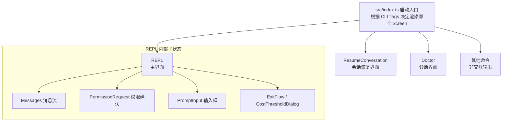
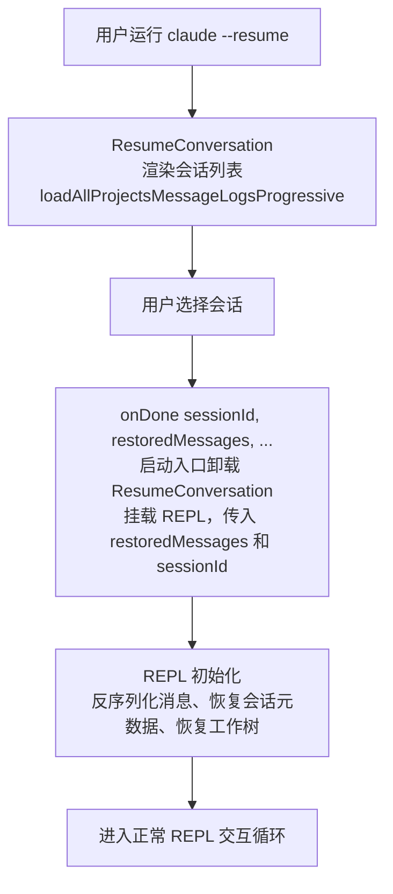
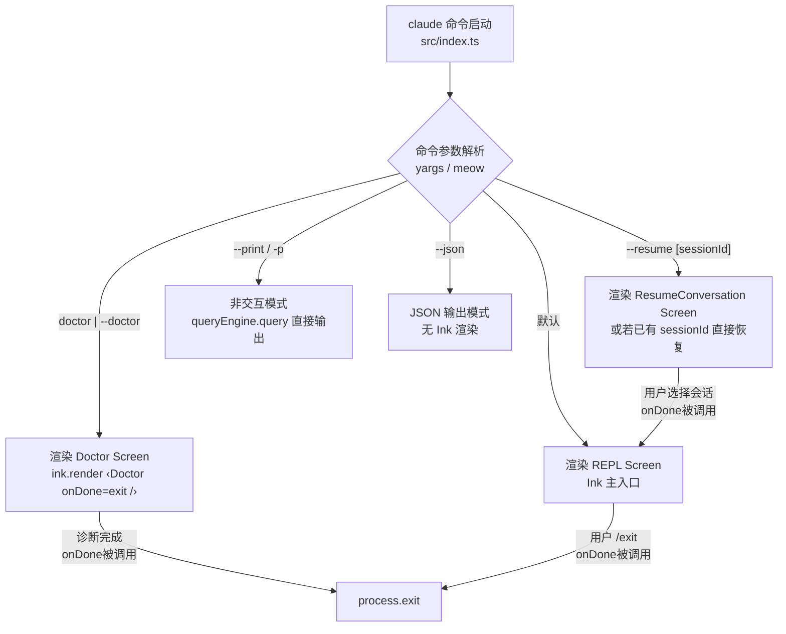
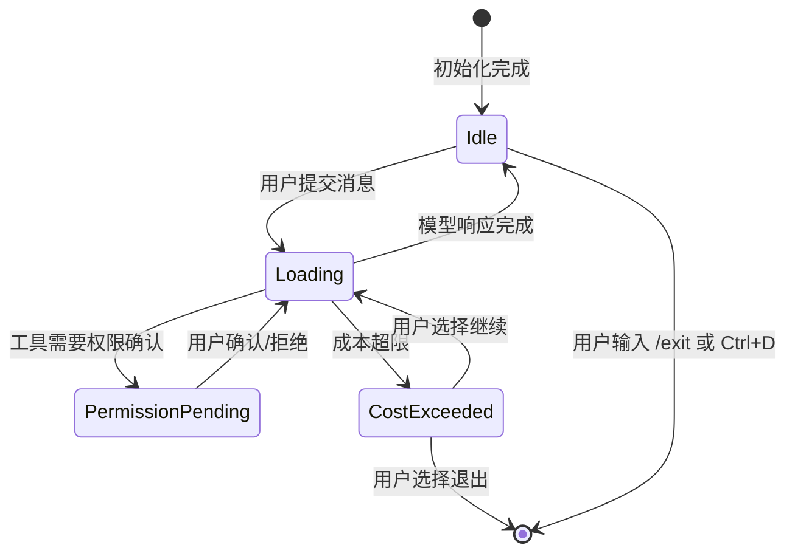

# Screens 路由 — Claude Code 源码分析

> 模块路径：`src/screens/`
> 核心职责：管理 Claude Code 的顶层页面路由，协调 REPL 主界面、会话恢复界面与诊断界面的切换
> 源码版本：v2.1.88

## 一、模块概述

`src/screens/` 目录只有三个文件：`REPL.tsx`、`ResumeConversation.tsx`、`Doctor.tsx`。这三个 Screen 代表了 Claude Code 的三种顶层运行模式，由启动入口（`src/index.ts`）根据命令行参数和运行状态决定渲染哪个 Screen。

与 Web 应用的路由系统不同，Claude Code 没有 URL 导航机制，"路由"通过 React 条件渲染实现：启动时选择一个 Screen 挂载，Screen 内部通过 `onDone` 回调信号触发切换（例如 `ResumeConversation` 选择会话后调用 `onDone`，外层将当前 Screen 换为 `REPL`）。

---

## 二、架构设计

### 2.1 核心类/接口/函数

| Screen | 文件 | 职责 |
|--------|------|------|
| `REPL` | `REPL.tsx` | 主交互界面，包含消息流、输入框、权限确认等全部交互逻辑 |
| `ResumeConversation` | `ResumeConversation.tsx` | 会话列表选择界面，用于 `--resume` 或 `/resume` 命令 |
| `Doctor` | `Doctor.tsx` | 诊断信息界面，用于 `doctor` 命令，展示环境状态和版本信息 |

### 2.2 模块依赖关系图



### 2.3 关键数据流



---

## 三、核心实现走读

### 3.1 关键流程

1. **启动路由决策**：`src/index.ts` 读取 CLI 参数（`--resume`、`doctor`、`--print` 等），在 `render()` 调用中选择对应 Screen 作为根组件。
2. **REPL 初始化**：`REPL.tsx` 是整个应用中代码量最大的文件（200+ 行 import），在首次渲染的 `useEffect` 中依次执行：加载全局配置、初始化工具池、处理会话恢复、执行 session start 钩子。
3. **会话恢复流程**：`ResumeConversation` 通过 `loadAllProjectsMessageLogsProgressive` 渐进式加载历史会话列表（避免卡顿），用户选择后调用 `loadConversationForResume` 反序列化历史消息，连同会话元数据一起通过 `onDone` 回调传给 REPL。
4. **REPL 内部状态机**：REPL 维护 `messages` 数组（完整对话历史）、`isLoading`（API 请求进行中）、`permissionRequest`（当前待确认的工具权限）等核心状态，通过复杂的条件渲染决定显示哪个子组件。
5. **Doctor Screen**：`Doctor.tsx` 是只读诊断界面，通过 `React.Suspense` 异步加载版本信息（npm dist tags、GCS dist tags），展示环境变量、模型配置、MCP 服务器状态等，完成后调用 `onDone` 退出。
6. **条件功能加载**：REPL.tsx 中大量使用 `feature('XXX') ? require(...) : () => null` 模式，通过构建时 dead-code-elimination 按功能开关裁剪代码体积（如 VOICE_MODE、PROACTIVE、COORDINATOR_MODE 等）。

### 3.2 重要源码片段

**片段一：ResumeConversation 的渐进式会话加载**
```typescript
// ResumeConversation.tsx
// loadAllProjectsMessageLogsProgressive 返回流式结果
// 渐进式渲染避免首次加载时的长时间空白
const [sessions, setSessions] = useState<SessionLogResult[]>([])
useEffect(() => {
  const abort = new AbortController()
  loadAllProjectsMessageLogsProgressive({ signal: abort.signal })
    .then(generator => {
      for await (const batch of generator) {
        setSessions(prev => [...prev, ...batch]) // 分批追加，实时显示
      }
    })
  return () => abort.abort()
}, [])
```

**片段二：REPL 中的条件功能导入（Dead Code Elimination）**
```typescript
// REPL.tsx — 构建时按 feature flag 裁剪代码
// 正向三元模式确保 'external' 构建完全消除相关模块
const useVoiceIntegration = feature('VOICE_MODE')
  ? require('../hooks/useVoiceIntegration.js').useVoiceIntegration
  : () => ({ stripTrailing: () => 0, handleKeyEvent: () => {}, resetAnchor: () => {} })

// ant-only 功能通过构建时 "external" === 'ant' 判断
const useFrustrationDetection = "external" === 'ant'
  ? require('../components/FeedbackSurvey/useFrustrationDetection.js').useFrustrationDetection
  : () => ({ state: 'closed', handleTranscriptSelect: () => {} })
```

**片段三：Doctor Screen 使用 React Suspense 异步加载**
```typescript
// Doctor.tsx — 版本信息异步获取，Suspense 提供加载状态
function DistTagsDisplay({ promise }) {
  const distTags = use(promise)  // React 19 的 use() Hook
  if (!distTags.latest) return <Text dimColor>└ Failed to fetch versions</Text>
  return distTags.stable && <Text>└ Stable version: {distTags.stable}</Text>
}

// 调用处：用 Suspense 包裹异步组件
<Suspense fallback={<Spinner />}>
  <DistTagsDisplay promise={getNpmDistTags()} />
</Suspense>
```

### 3.3 Screen 注册表与启动路由决策机制

Claude Code 没有集中的 Screen 注册表（Registry），而是通过 `src/index.ts` 中的条件分支直接决定渲染哪个 Screen。理解这一路由决策树是理解整个 UI 架构的入口。

**启动路由决策树：**



**Screen 间的过渡机制**

Screen 切换通过 `onDone` 回调 + Ink 的 `rerender()` 实现，而非 React Router 的声明式路由：

```typescript
// src/index.ts（简化）
// 启动时决定初始 Screen
let currentScreen: 'resume' | 'repl' | 'doctor' = computeInitialScreen(args)

const { rerender, unmount } = render(
  currentScreen === 'resume'
    ? <ResumeConversation
        onDone={(sessionData) => {
          // 收到 onDone：切换到 REPL，传入恢复的会话数据
          rerender(<REPL initialSessionData={sessionData} onDone={handleREPLDone} />)
        }}
      />
    : <REPL onDone={handleREPLDone} />
)
```

`rerender()` 是 Ink 提供的能力，它将 React 树的根节点替换为新组件，触发完整的卸载-挂载周期：旧 Screen 的所有 `useEffect` 清理函数被调用，新 Screen 完全初始化。这等价于 Web 路由的"页面导航"，但在同一个 Node.js 进程和终端会话中完成。

### 3.4 REPL Screen 的内部状态机

`REPL.tsx` 的复杂性来自它实际上是一个多层嵌套的状态机，管理着对话的所有可能状态：

**顶层状态变量（核心）：**

| 状态变量 | 类型 | 含义 |
|---------|------|------|
| `messages` | `Message[]` | 完整对话历史（含工具调用记录）|
| `isLoading` | `boolean` | API 请求进行中 |
| `permissionRequest` | `ToolUseConfirm \| null` | 当前待确认的工具权限请求 |
| `forkData` | `ForkData \| null` | 会话分支元数据（`/branch` 创建后非空）|
| `claudeEnvVars` | `Record<string, string>` | 注入 Claude 子进程的环境变量 |
| `costThresholdExceeded` | `boolean` | 是否超出成本上限 |

**REPL 渲染决策逻辑：**

```typescript
// REPL.tsx — 渲染优先级（从高到低，简化版）
// src/screens/REPL.tsx:350-420
return (
  <Box flexDirection="column">
    {/* 1. 消息历史（始终显示）*/}
    <MessageList messages={messages} />

    {/* 2. 权限确认（高优先级，覆盖输入）*/}
    {permissionRequest && (
      <PermissionRequest
        confirm={permissionRequest}
        onResponse={handlePermissionResponse}
      />
    )}

    {/* 3. 成本超限对话框 */}
    {costThresholdExceeded && (
      <CostThresholdDialog onContinue={handleContinue} onExit={handleExit} />
    )}

    {/* 4. 正常输入框（无权限确认时显示）*/}
    {!permissionRequest && !costThresholdExceeded && (
      <PromptInput isLoading={isLoading} onSubmit={handleSubmit} />
    )}
  </Box>
)
```

**状态转换触发器：**



### 3.5 键盘快捷键与 Screen 切换的绑定

Ink 的键盘事件通过 `useInput` Hook 在各个 Screen 内部处理，不存在全局键盘路由层。每个 Screen 注册自己关心的快捷键：

**REPL Screen 的关键快捷键绑定：**

| 快捷键 | 触发动作 | 实现位置 |
|--------|---------|---------|
| `Ctrl+C`（单次）| 中止当前 API 请求 | `useInput` → `abortController.abort()` |
| `Ctrl+C`（双次）| 退出进程（ExitFlow）| `useInput` → `setShowExitDialog(true)` |
| `Ctrl+D` | 等同于 `/exit` | `useInput` → `onDone()` |
| `Ctrl+L` | 清空屏幕（保留历史）| `useInput` → `setScrollOffset(Infinity)` |
| `↑` / `↓` | 历史命令导航 | `PromptInput` 内的 `useInput` |
| `Tab` | 自动补全斜杠命令 | `PromptInput` → `getCommandCompletions()` |

**ResumeConversation Screen 的快捷键：**

| 快捷键 | 触发动作 |
|--------|---------|
| `↑` / `↓` | 浏览会话列表 |
| `Enter` | 选择当前会话，调用 `onDone(selectedSession)` |
| `Esc` / `q` | 取消，调用 `onDone(null)`（回到 REPL 或退出）|
| `/` + 搜索词 | 过滤会话列表（模糊匹配标题）|

**快捷键与 Screen 路由的联动：**

快捷键不直接切换 Screen，而是触发状态更新或 `onDone` 调用，由父级的路由逻辑决定是否切换 Screen。这保持了 Screen 的自主性（Screen 只知道"自己完成了"，不知道"完成后去哪里"）。

### 3.6 跨 Screen 状态保持机制

**会话数据的跨 Screen 传递**

`ResumeConversation` → `REPL` 的状态传递通过 `onDone` 的参数完成：

```typescript
// ResumeConversation.tsx — onDone 的数据结构
interface ResumeResult {
  sessionId: UUID
  restoredMessages: Message[]        // 历史消息数组
  sessionMode: 'coordinator' | 'normal'
  initialPrompt?: string             // 恢复时预填的提示词
  workingDirectory?: string          // 恢复历史工作目录
  forkData?: ForkData                // 分支元数据（如有）
}

// 调用方（index.ts）将 ResumeResult 传给 REPL 作为 props
rerender(<REPL initialData={resumeResult} onDone={handleREPLDone} />)
```

**不跨 Screen 持久化的状态**

以下状态在 Screen 切换时丢失（重新挂载后从持久化源重建）：

| 状态 | 来源重建方式 |
|------|------------|
| `messages` 数组 | 从 transcript JSONL 文件反序列化 |
| 工具权限缓存 | 重新读取 `~/.claude/projects/<hash>/permissions.json` |
| 成本计数器 | 从 `AppState` 的 `sessionCost` 字段恢复 |
| 光标位置 | 不恢复（每次重新进入 REPL 从空输入框开始）|

**AppState 作为跨 Screen 的全局状态**

`AppState`（通过 `getAppState` / `setAppState` 访问）是一个进程级单例，不随 Screen 切换而销毁。它存储：
- 当前 `sessionId`（切换 Screen 时不变）
- 模型选择（`model`、`smallModel`）
- 全局 MCP 客户端连接
- 用户偏好配置（`userConfig`）

这是 Screen 间隐式共享状态的唯一机制，避免了"状态传递地狱"。

### 3.7 Doctor Screen 的诊断信息架构

`Doctor.tsx` 的诊断项覆盖三个层面：

**层面一：环境变量与配置**

```typescript
// Doctor.tsx — 环境诊断项（部分）
const diagnostics = [
  { label: 'Model',         value: getModel() },
  { label: 'Small model',   value: getSmallModel() },
  { label: 'API endpoint',  value: process.env.ANTHROPIC_BASE_URL ?? '(default)' },
  { label: 'Claude.ai sub', value: isClaudeAISubscriber() ? 'Yes' : 'No' },
  { label: 'OAuth token',   value: hasOAuthToken() ? '✓ Present' : '✗ Missing' },
]
```

**层面二：版本信息（异步 + Suspense）**

```typescript
// Doctor.tsx — 三个并发的版本检查
const npmTagsPromise = getNpmDistTags()     // 请求 registry.npmjs.org
const gcsTagsPromise = getGCSDistTags()    // 请求 GCS 存储桶（ANT 内部）
const currentVersion = getPackageVersion() // 同步读取本地 package.json

// 每个异步版本信息都用 Suspense 包裹，独立加载，互不阻塞
<Suspense fallback={<Spinner label="Checking npm..." />}>
  <NpmVersionDisplay promise={npmTagsPromise} current={currentVersion} />
</Suspense>
```

**层面三：MCP 服务器连接状态**

Doctor Screen 遍历已配置的 MCP 服务器，显示每个服务器的：
- 连接状态（Connected / Disconnected / Error）
- 协议版本
- 可用工具数量
- 最近一次连接错误（若有）

### 3.8 设计模式分析

- **命令模式（Command Pattern）**：每个 Screen 接收 `onDone: (result?, options?) => void` 回调，Screen 完成后通知调用者，实现 Screen 与路由逻辑的解耦。
- **页面对象模式（Page Object Pattern）**：每个 Screen 封装一个完整的"页面"逻辑，包含该页面所需的全部状态和副作用，不依赖上级组件的内部状态。
- **功能开关模式（Feature Flag Pattern）**：通过构建时的 `feature()` 宏和运行时的 `"external" === 'ant'` 判断，实现同一代码库构建出不同功能集的产品版本。
- **渐进式加载（Progressive Loading）**：`ResumeConversation` 使用异步生成器 + 分批 setState 实现渐进式渲染，避免阻塞主线程。

---

## 四、高频面试 Q&A

### 设计决策题

**Q1：Claude Code 为什么只有 3 个 Screen，而不是像 Web 应用那样有完整的路由系统？**

Claude Code 是单任务 CLI 工具，用户一次只做一件事：或是对话（REPL），或是恢复会话（Resume），或是查看诊断（Doctor）。Web 路由系统的"前进/后退"、URL 状态等概念在 CLI 场景下无意义。更重要的是，CLI 工具的"路由切换"发生在进程启动时（由命令行参数决定），而非运行时的用户导航。三个 Screen 的设计将不同入口点的代码完全隔离，`REPL` 不需要了解 `Doctor` 的存在，代码边界清晰。

**Q2：REPL.tsx 的 200+ 行 import 是反模式吗？为什么没有进一步拆分？**

这是有意为之的"单一状态中心"设计。REPL 是整个应用的状态协调中心，所有涉及对话上下文的操作（消息流、工具权限、API 查询、会话存储、成本跟踪、Agent 协调等）都需要访问共享状态。过度拆分会导致：
1. 状态提升到更高层（传参地狱），或
2. 引入更多 Context（订阅竞争，性能退化）。

当前模式将所有状态和副作用集中在一处，配合 React Compiler 自动记忆化，实际渲染性能良好。`feature()` 条件导入确保生产包体积不会因为 import 数量线性增长。

---

### 原理分析题

**Q3：ResumeConversation 的渐进式加载是如何防止界面冻结的？**

`loadAllProjectsMessageLogsProgressive` 返回一个异步生成器（`AsyncGenerator`），每次 `yield` 一批会话记录。组件在 `useEffect` 中使用 `for await...of` 循环消费，每收到一批就调用 `setSessions(prev => [...prev, ...batch])`，触发 React 重渲染。这样，即使项目中有数百个历史会话，界面也能在第一批数据到达后立即显示（通常 < 50ms），用户无需等待全量加载。`AbortController` 确保组件卸载时停止加载，避免内存泄漏和 setState-on-unmounted-component 警告。

**Q4：Doctor Screen 中 `use(promise)` 是什么 React API？有什么优势？**

`use()` 是 React 19 引入的新 Hook，可以在组件渲染中"等待"一个 Promise。当 Promise 尚未完成时，`use()` 会抛出 Promise 对象，触发最近的 `Suspense` 边界显示 fallback。Promise 解析后，React 自动恢复渲染。相比传统的 `useEffect + useState` 模式，`use()` 消除了中间的 `loading` 状态管理样板代码，并与 React 并发特性（Transitions、Suspense）无缝集成，使异步数据加载的代码与同步代码书写方式一致。

**Q5：REPL 的 `permissionRequest` 状态是如何与工具执行流程解耦的？**

工具执行路径（`query.ts` → 工具处理器）通过回调机制请求权限：工具在需要用户确认时，调用注入的 `onPermissionRequest(toolUseConfirm)` 回调，挂起工具执行并等待用户响应。REPL 收到回调后更新 `permissionRequest` 状态，渲染 `PermissionRequest` 组件，用户确认/拒绝后通过 `ToolUseConfirm.resolve(allowed)` 恢复工具执行。整个流程类似 Promise 的 resolve/reject，工具代码不需要了解 UI 层的存在。

---

### 权衡与优化题

**Q6：如何评估将 ResumeConversation 的会话列表改为虚拟滚动的必要性？**

当前实现一次性渲染所有会话列表项。对于大多数用户（< 100 个历史会话），这不是问题。需要虚拟滚动的临界点约在 500+ 项（终端渲染字符行数超过 Yoga 布局计算开销阈值）。可以通过测量 `useVirtualScroll`（已在 `src/hooks/` 中存在）的切入收益来决策：若会话列表的布局计算耗时超过 16ms（一帧预算），则值得引入虚拟滚动。`CLAUDE_CODE_COMMIT_LOG` 环境变量可以记录每帧的 Yoga 计算耗时，是评估此问题的直接工具。

**Q7：Doctor Screen 的 `Suspense` fallback 显示 `<Spinner />`，但 CLI 环境中 Spinner 是动画组件，这会引发性能问题吗？**

Spinner 组件使用 `useInterval` 以固定帧率更新动画状态，每次更新触发 React 重渲染和 Ink 帧输出。在 Doctor Screen 中，Suspense 的 fallback 期间（通常 < 1 秒，取决于网络延迟），Spinner 持续运转是合理的。Ink 的差量渲染确保 Spinner 的每帧更新只输出变化的字符（通常 1-2 个字符），对终端输出带宽的影响可以忽略不计。

---

### 实战应用题

**Q8：如果要新增一个 `Claude Code config` 的交互式配置 Screen，应该如何接入现有路由体系？**

1. 在 `src/screens/` 创建 `ConfigScreen.tsx`，接收 `{ onDone: (result?: ConfigResult) => void }` Props。
2. 在 `src/index.ts` 的启动逻辑中，检测 `claude config` 子命令，将 `ConfigScreen` 作为初始渲染根组件。
3. `ConfigScreen` 完成后调用 `onDone(result)`，启动逻辑根据 `result` 决定是退出进程还是转入 REPL。
4. 若需要从 REPL 内部打开配置（如 `/config` 命令），则通过 REPL 的 `CommandResultDisplay` 机制（`onDone(result, { display: 'interactive' })`）在 REPL 内渲染配置组件，完成后恢复 REPL 状态。

**Q9：REPL.tsx 中的 `switchSession` 是如何在不重启进程的情况下切换会话的？**

`switchSession`（来自 `bootstrap/state.js`）更新全局会话 ID 并清除当前会话的所有状态（消息数组、成本跟踪、文件历史快照等）。REPL 通过订阅 AppState 变化检测到 `currentSessionId` 更新后，触发一次完整的"会话初始化"流程：重新加载历史消息（如果是恢复会话）或清空消息数组（如果是新建会话），重置工具权限上下文，并重新执行 session start 钩子。整个过程在 React 状态更新链内完成，Ink 的差量渲染确保界面平滑过渡，无需重启 Node.js 进程。

**Q10：如果要为 REPL 添加"多面板模式"（同时显示主对话和工作者对话），需要修改哪些核心结构？**

A：多面板模式需要以下改动：
1. **REPL 状态层**：将单一的 `messages` 数组扩展为 `Map<sessionId, Message[]>`，每个面板对应一个 session 的消息历史
2. **渲染层**：引入 Ink 的水平 `Box flexDirection="row"` 布局，每个面板包裹在独立的 `Box width="50%"` 中
3. **焦点管理**：使用 Ink 的 `useFocusManager()` 实现面板间焦点切换（`Tab` 切换，有焦点的面板接收键盘输入）
4. **QueryLoop 绑定**：每个面板的 PromptInput 提交时，向对应 `sessionId` 的 QueryLoop 实例发送消息
5. **AppState 扩展**：`activePanelSessionId` 字段标识当前活动面板

挑战在于 REPL.tsx 当前的所有状态假设"单一活跃会话"，需要大量重构。最小破坏性路径是引入 `PanelContext`，将面板感知下沉到子组件，REPL 顶层保持单会话视角。

**Q11：Doctor Screen 的 `Suspense` 边界在 Ink（CLI）环境中与 Web 环境有何差异？**

A：在 Web 环境中，Suspense fallback 通常是视觉上的占位 UI（骨架屏），不影响其他内容的显示。在 Ink（CLI）环境中，Suspense 的行为相同，但渲染载体是终端字符流：
- fallback（`<Spinner />`）会在终端输出动画字符序列
- Promise 解析后，Ink 的差量渲染计算新旧输出的差量，发送 ANSI 控制码更新终端内容
- 由于终端没有 CSS/DOM，"替换" Spinner 为实际内容时，Ink 使用光标移动指令（`\x1B[nA\x1B[K`）清除旧行再写入新行

Doctor Screen 使用多个独立的 `Suspense` 边界（npm 版本、GCS 版本各自独立），这样其中一个网络请求超时不会阻塞另一个的显示，用户能看到部分诊断结果而非全量等待。

**Q12：REPL 的 `permissionRequest` 状态如何防止同时处理两个并发工具权限请求？**

A：`permissionRequest` 是 `ToolUseConfirm | null` 的单值状态（非队列），同一时刻只能有一个权限请求处于等待状态。工具执行框架（`QueryLoop`）在调用 `onPermissionRequest` 时会等待前一个请求的 Promise resolve 后才能发起下一个——因为工具是按顺序执行的，前一个工具的权限确认（或拒绝）是执行下一个工具的前提条件。若协调器模式下多个工作者并发请求权限，每个工作者的 `QueryLoop` 独立持有自己的 `permissionRequest` 回调引用，由各自的子 UI 面板（`TaskView`）渲染，不会聚合到主 REPL 的 `permissionRequest` 状态中。

---

> 源码版权归 [Anthropic](https://www.anthropic.com) 所有，本笔记仅供学习研究使用。文档内容采用 [CC BY-NC 4.0](https://creativecommons.org/licenses/by-nc/4.0/) 协议。
