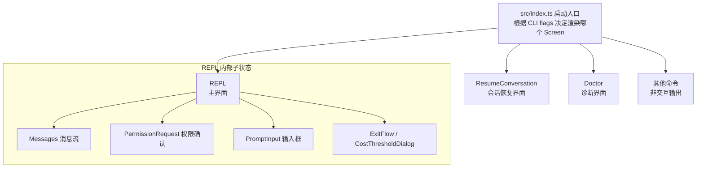
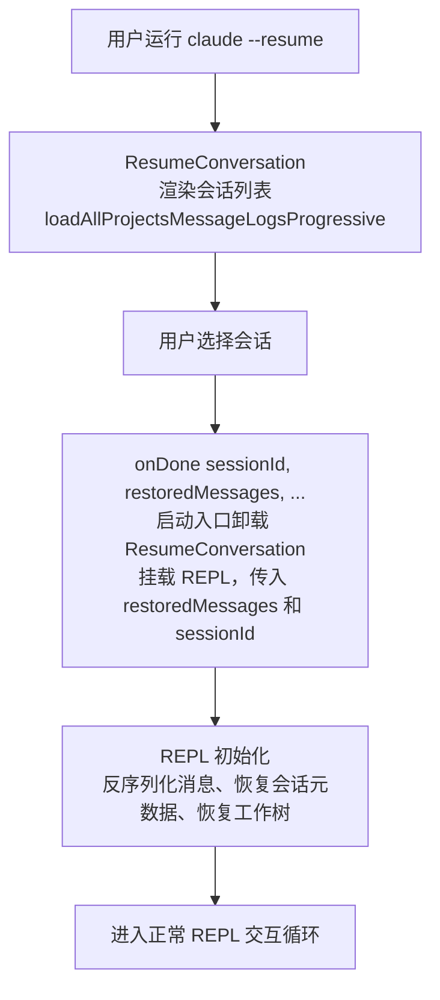

# Screens 路由 — Claude Code 源码分析

> 模块路径：`src/screens/`
> 核心职责：管理 Claude Code 的顶层页面路由，协调 REPL 主界面、会话恢复界面与诊断界面的切换
> 源码版本：v2.1.88

## 一、模块概述

`src/screens/` 目录只有三个文件：`REPL.tsx`、`ResumeConversation.tsx`、`Doctor.tsx`。这三个 Screen 代表了 Claude Code 的三种顶层运行模式，由启动入口（`src/index.ts`）根据命令行参数和运行状态决定渲染哪个 Screen。

与 Web 应用的路由系统不同，Claude Code 没有 URL 导航机制，"路由"通过 React 条件渲染实现：启动时选择一个 Screen 挂载，Screen 内部通过 `onDone` 回调信号触发切换（例如 `ResumeConversation` 选择会话后调用 `onDone`，外层将当前 Screen 换为 `REPL`）。

---

## 二、架构设计

### 2.1 核心类/接口/函数

| Screen | 文件 | 职责 |
|--------|------|------|
| `REPL` | `REPL.tsx` | 主交互界面，包含消息流、输入框、权限确认等全部交互逻辑 |
| `ResumeConversation` | `ResumeConversation.tsx` | 会话列表选择界面，用于 `--resume` 或 `/resume` 命令 |
| `Doctor` | `Doctor.tsx` | 诊断信息界面，用于 `doctor` 命令，展示环境状态和版本信息 |

### 2.2 模块依赖关系图



### 2.3 关键数据流



---

## 三、核心实现走读

### 3.1 关键流程

1. **启动路由决策**：`src/index.ts` 读取 CLI 参数（`--resume`、`doctor`、`--print` 等），在 `render()` 调用中选择对应 Screen 作为根组件。
2. **REPL 初始化**：`REPL.tsx` 是整个应用中代码量最大的文件（200+ 行 import），在首次渲染的 `useEffect` 中依次执行：加载全局配置、初始化工具池、处理会话恢复、执行 session start 钩子。
3. **会话恢复流程**：`ResumeConversation` 通过 `loadAllProjectsMessageLogsProgressive` 渐进式加载历史会话列表（避免卡顿），用户选择后调用 `loadConversationForResume` 反序列化历史消息，连同会话元数据一起通过 `onDone` 回调传给 REPL。
4. **REPL 内部状态机**：REPL 维护 `messages` 数组（完整对话历史）、`isLoading`（API 请求进行中）、`permissionRequest`（当前待确认的工具权限）等核心状态，通过复杂的条件渲染决定显示哪个子组件。
5. **Doctor Screen**：`Doctor.tsx` 是只读诊断界面，通过 `React.Suspense` 异步加载版本信息（npm dist tags、GCS dist tags），展示环境变量、模型配置、MCP 服务器状态等，完成后调用 `onDone` 退出。
6. **条件功能加载**：REPL.tsx 中大量使用 `feature('XXX') ? require(...) : () => null` 模式，通过构建时 dead-code-elimination 按功能开关裁剪代码体积（如 VOICE_MODE、PROACTIVE、COORDINATOR_MODE 等）。

### 3.2 重要源码片段

**片段一：ResumeConversation 的渐进式会话加载**
```typescript
// ResumeConversation.tsx
// loadAllProjectsMessageLogsProgressive 返回流式结果
// 渐进式渲染避免首次加载时的长时间空白
const [sessions, setSessions] = useState<SessionLogResult[]>([])
useEffect(() => {
  const abort = new AbortController()
  loadAllProjectsMessageLogsProgressive({ signal: abort.signal })
    .then(generator => {
      for await (const batch of generator) {
        setSessions(prev => [...prev, ...batch]) // 分批追加，实时显示
      }
    })
  return () => abort.abort()
}, [])
```

**片段二：REPL 中的条件功能导入（Dead Code Elimination）**
```typescript
// REPL.tsx — 构建时按 feature flag 裁剪代码
// 正向三元模式确保 'external' 构建完全消除相关模块
const useVoiceIntegration = feature('VOICE_MODE')
  ? require('../hooks/useVoiceIntegration.js').useVoiceIntegration
  : () => ({ stripTrailing: () => 0, handleKeyEvent: () => {}, resetAnchor: () => {} })

// ant-only 功能通过构建时 "external" === 'ant' 判断
const useFrustrationDetection = "external" === 'ant'
  ? require('../components/FeedbackSurvey/useFrustrationDetection.js').useFrustrationDetection
  : () => ({ state: 'closed', handleTranscriptSelect: () => {} })
```

**片段三：Doctor Screen 使用 React Suspense 异步加载**
```typescript
// Doctor.tsx — 版本信息异步获取，Suspense 提供加载状态
function DistTagsDisplay({ promise }) {
  const distTags = use(promise)  // React 19 的 use() Hook
  if (!distTags.latest) return <Text dimColor>└ Failed to fetch versions</Text>
  return distTags.stable && <Text>└ Stable version: {distTags.stable}</Text>
}

// 调用处：用 Suspense 包裹异步组件
<Suspense fallback={<Spinner />}>
  <DistTagsDisplay promise={getNpmDistTags()} />
</Suspense>
```

### 3.3 设计模式分析

- **命令模式（Command Pattern）**：每个 Screen 接收 `onDone: (result?, options?) => void` 回调，Screen 完成后通知调用者，实现 Screen 与路由逻辑的解耦。
- **页面对象模式（Page Object Pattern）**：每个 Screen 封装一个完整的"页面"逻辑，包含该页面所需的全部状态和副作用，不依赖上级组件的内部状态。
- **功能开关模式（Feature Flag Pattern）**：通过构建时的 `feature()` 宏和运行时的 `"external" === 'ant'` 判断，实现同一代码库构建出不同功能集的产品版本。
- **渐进式加载（Progressive Loading）**：`ResumeConversation` 使用异步生成器 + 分批 setState 实现渐进式渲染，避免阻塞主线程。

---

## 四、高频面试 Q&A

### 设计决策题

**Q1：Claude Code 为什么只有 3 个 Screen，而不是像 Web 应用那样有完整的路由系统？**

Claude Code 是单任务 CLI 工具，用户一次只做一件事：或是对话（REPL），或是恢复会话（Resume），或是查看诊断（Doctor）。Web 路由系统的"前进/后退"、URL 状态等概念在 CLI 场景下无意义。更重要的是，CLI 工具的"路由切换"发生在进程启动时（由命令行参数决定），而非运行时的用户导航。三个 Screen 的设计将不同入口点的代码完全隔离，`REPL` 不需要了解 `Doctor` 的存在，代码边界清晰。

**Q2：REPL.tsx 的 200+ 行 import 是反模式吗？为什么没有进一步拆分？**

这是有意为之的"单一状态中心"设计。REPL 是整个应用的状态协调中心，所有涉及对话上下文的操作（消息流、工具权限、API 查询、会话存储、成本跟踪、Agent 协调等）都需要访问共享状态。过度拆分会导致：
1. 状态提升到更高层（传参地狱），或
2. 引入更多 Context（订阅竞争，性能退化）。

当前模式将所有状态和副作用集中在一处，配合 React Compiler 自动记忆化，实际渲染性能良好。`feature()` 条件导入确保生产包体积不会因为 import 数量线性增长。

---

### 原理分析题

**Q3：ResumeConversation 的渐进式加载是如何防止界面冻结的？**

`loadAllProjectsMessageLogsProgressive` 返回一个异步生成器（`AsyncGenerator`），每次 `yield` 一批会话记录。组件在 `useEffect` 中使用 `for await...of` 循环消费，每收到一批就调用 `setSessions(prev => [...prev, ...batch])`，触发 React 重渲染。这样，即使项目中有数百个历史会话，界面也能在第一批数据到达后立即显示（通常 < 50ms），用户无需等待全量加载。`AbortController` 确保组件卸载时停止加载，避免内存泄漏和 setState-on-unmounted-component 警告。

**Q4：Doctor Screen 中 `use(promise)` 是什么 React API？有什么优势？**

`use()` 是 React 19 引入的新 Hook，可以在组件渲染中"等待"一个 Promise。当 Promise 尚未完成时，`use()` 会抛出 Promise 对象，触发最近的 `Suspense` 边界显示 fallback。Promise 解析后，React 自动恢复渲染。相比传统的 `useEffect + useState` 模式，`use()` 消除了中间的 `loading` 状态管理样板代码，并与 React 并发特性（Transitions、Suspense）无缝集成，使异步数据加载的代码与同步代码书写方式一致。

**Q5：REPL 的 `permissionRequest` 状态是如何与工具执行流程解耦的？**

工具执行路径（`query.ts` → 工具处理器）通过回调机制请求权限：工具在需要用户确认时，调用注入的 `onPermissionRequest(toolUseConfirm)` 回调，挂起工具执行并等待用户响应。REPL 收到回调后更新 `permissionRequest` 状态，渲染 `PermissionRequest` 组件，用户确认/拒绝后通过 `ToolUseConfirm.resolve(allowed)` 恢复工具执行。整个流程类似 Promise 的 resolve/reject，工具代码不需要了解 UI 层的存在。

---

### 权衡与优化题

**Q6：如何评估将 ResumeConversation 的会话列表改为虚拟滚动的必要性？**

当前实现一次性渲染所有会话列表项。对于大多数用户（< 100 个历史会话），这不是问题。需要虚拟滚动的临界点约在 500+ 项（终端渲染字符行数超过 Yoga 布局计算开销阈值）。可以通过测量 `useVirtualScroll`（已在 `src/hooks/` 中存在）的切入收益来决策：若会话列表的布局计算耗时超过 16ms（一帧预算），则值得引入虚拟滚动。`CLAUDE_CODE_COMMIT_LOG` 环境变量可以记录每帧的 Yoga 计算耗时，是评估此问题的直接工具。

**Q7：Doctor Screen 的 `Suspense` fallback 显示 `<Spinner />`，但 CLI 环境中 Spinner 是动画组件，这会引发性能问题吗？**

Spinner 组件使用 `useInterval` 以固定帧率更新动画状态，每次更新触发 React 重渲染和 Ink 帧输出。在 Doctor Screen 中，Suspense 的 fallback 期间（通常 < 1 秒，取决于网络延迟），Spinner 持续运转是合理的。Ink 的差量渲染确保 Spinner 的每帧更新只输出变化的字符（通常 1-2 个字符），对终端输出带宽的影响可以忽略不计。

---

### 实战应用题

**Q8：如果要新增一个 `Claude Code config` 的交互式配置 Screen，应该如何接入现有路由体系？**

1. 在 `src/screens/` 创建 `ConfigScreen.tsx`，接收 `{ onDone: (result?: ConfigResult) => void }` Props。
2. 在 `src/index.ts` 的启动逻辑中，检测 `claude config` 子命令，将 `ConfigScreen` 作为初始渲染根组件。
3. `ConfigScreen` 完成后调用 `onDone(result)`，启动逻辑根据 `result` 决定是退出进程还是转入 REPL。
4. 若需要从 REPL 内部打开配置（如 `/config` 命令），则通过 REPL 的 `CommandResultDisplay` 机制（`onDone(result, { display: 'interactive' })`）在 REPL 内渲染配置组件，完成后恢复 REPL 状态。

**Q9：REPL.tsx 中的 `switchSession` 是如何在不重启进程的情况下切换会话的？**

`switchSession`（来自 `bootstrap/state.js`）更新全局会话 ID 并清除当前会话的所有状态（消息数组、成本跟踪、文件历史快照等）。REPL 通过订阅 AppState 变化检测到 `currentSessionId` 更新后，触发一次完整的"会话初始化"流程：重新加载历史消息（如果是恢复会话）或清空消息数组（如果是新建会话），重置工具权限上下文，并重新执行 session start 钩子。整个过程在 React 状态更新链内完成，Ink 的差量渲染确保界面平滑过渡，无需重启 Node.js 进程。

---

> **版权声明**：源码版权归 [Anthropic](https://www.anthropic.com) 所有，本文档基于 Claude Code v2.1.88 source map 还原版本分析，仅供学习研究使用。文档内容采用 [CC BY-NC 4.0](https://creativecommons.org/licenses/by-nc/4.0/) 协议。
