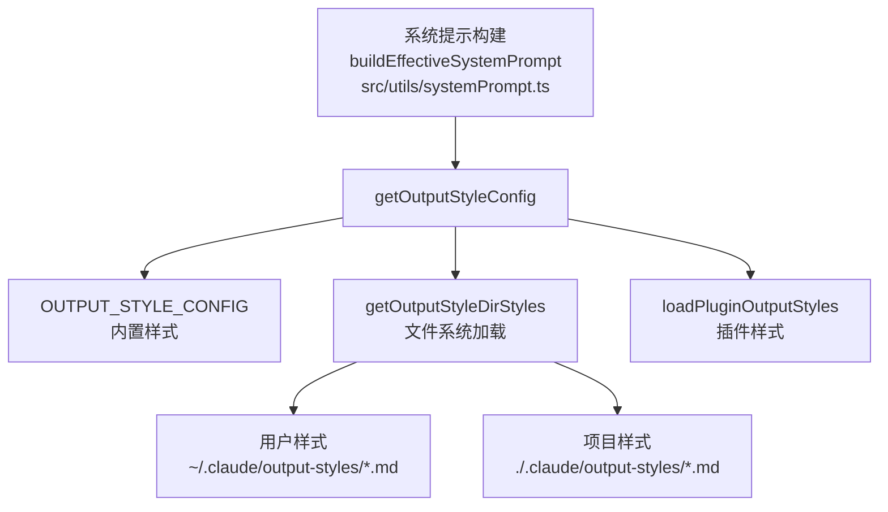
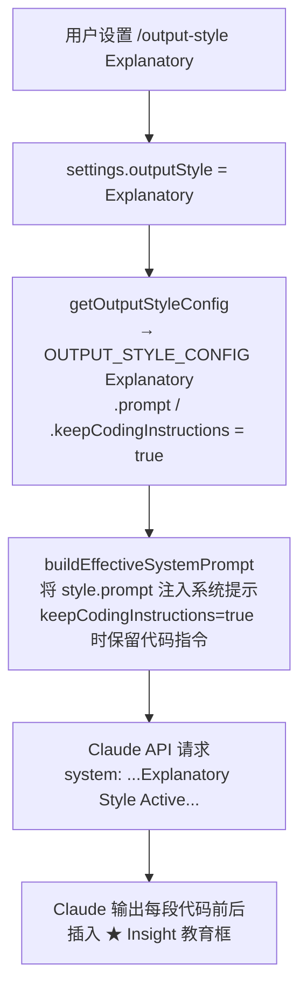

# OutputStyles 输出样式系统 — Claude Code 源码分析

> 模块路径：`src/outputStyles/`、`src/constants/outputStyles.ts`
> 核心职责：管理 Claude 回复的输出风格配置，通过系统提示注入控制 AI 输出格式和教育性内容
> 源码版本：v2.1.88

## 一、模块概述

Claude Code 的"输出样式系统"（Output Styles）是一套通过**系统提示工程**控制 AI 回复风格的机制，与前端 Markdown 渲染或代码高亮无直接关系。其核心思路是：在发送给 Claude API 的系统提示中注入不同的"风格指令"，使 Claude 以不同方式组织输出内容。

`src/outputStyles/` 目录只有一个文件 `loadOutputStylesDir.ts`，负责从文件系统加载用户/项目自定义的输出样式。样式配置本身集中在 `src/constants/outputStyles.ts`，包含内置样式和聚合所有样式来源的 `getAllOutputStyles` 函数。

**系统的三个层次**：
1. **内置样式**：`default`（无额外提示）、`Explanatory`（解释模式）、`Learning`（学习模式）
2. **自定义样式**：用户 `~/.claude/output-styles/*.md` 或项目 `.claude/output-styles/*.md`
3. **插件样式**：插件通过 `loadPluginOutputStyles.ts` 注入，可设置 `forceForPlugin` 强制激活

---

## 二、架构设计

### 2.1 核心类/接口/函数

| 名称 | 文件 | 职责 |
|------|------|------|
| `OutputStyleConfig` | `constants/outputStyles.ts` | 样式配置类型：name / description / prompt / source / keepCodingInstructions |
| `getAllOutputStyles` | `constants/outputStyles.ts` | 聚合所有来源的样式，按优先级合并（内置 < 插件 < 用户 < 项目 < 管理策略） |
| `getOutputStyleConfig` | `constants/outputStyles.ts` | 获取当前激活的样式配置，处理插件强制覆盖逻辑 |
| `getOutputStyleDirStyles` | `outputStyles/loadOutputStylesDir.ts` | 从文件系统加载 `.claude/output-styles/*.md`，解析 frontmatter |
| `OUTPUT_STYLE_CONFIG` | `constants/outputStyles.ts` | 内置样式注册表（default / Explanatory / Learning） |

### 2.2 模块依赖关系图



### 2.3 关键数据流



---

## 三、核心实现走读

### 3.1 关键流程

1. **内置样式注册**：`OUTPUT_STYLE_CONFIG` 对象以样式名为键注册内置样式，`default` 值为 `null`（表示不添加任何样式提示）。
2. **文件系统加载**：`getOutputStyleDirStyles(cwd)` 使用 `loadMarkdownFilesForSubdir('output-styles', cwd)` 扫描项目和用户目录，每个 `.md` 文件的 frontmatter 提供 `name` 和 `description`，文件正文成为 `prompt`。
3. **优先级合并**：`getAllOutputStyles` 按 `[pluginStyles, userStyles, projectStyles, managedStyles]` 顺序覆盖内置样式，后者优先级更高。这允许项目强制覆盖用户设置，企业管理策略（`policySettings`）最终拍板。
4. **插件强制激活**：若任何插件的样式设置了 `forceForPlugin: true`，`getOutputStyleConfig` 会忽略用户设置，直接返回插件指定的样式（多个插件竞争时取第一个并记录警告）。
5. **系统提示注入**：`buildEffectiveSystemPrompt()`（`src/utils/systemPrompt.ts`）调用 `getOutputStyleConfig()` 获取当前样式，将 `style.prompt` 追加到系统提示末尾。`keepCodingInstructions` 标志控制是否保留默认代码生成指令（`Explanatory` 和 `Learning` 模式都需要保留，因为用户仍然需要 Claude 写代码）。
6. **缓存机制**：`getAllOutputStyles` 和 `getOutputStyleDirStyles` 都使用 `lodash-es/memoize` 按 `cwd` 参数缓存。文件系统变化后通过 `clearOutputStyleCaches()` 清除缓存（在 `/reload` 命令或插件变更时触发）。

### 3.2 重要源码片段

**片段一：内置样式的教育提示格式（`outputStyles.ts`）**
```typescript
// Explanatory 模式：在代码前后插入 "★ Insight" 教育框
const EXPLANATORY_FEATURE_PROMPT = `
## Insights
In order to encourage learning, before and after writing code, always provide
brief educational explanations using (with backticks):
"\`${figures.star} Insight ──────────────────────────────────────\`
[2-3 key educational points]
\`───────────────────────────────────────────────────────\`"

These insights should be included in the conversation,
not in the codebase.`
```

**片段二：优先级合并逻辑（`outputStyles.ts`）**
```typescript
// 按优先级从低到高覆盖：内置 → 插件 → 用户 → 项目 → 管理策略
const styleGroups = [pluginStyles, userStyles, projectStyles, managedStyles]
for (const styles of styleGroups) {
  for (const style of styles) {
    allStyles[style.name] = { ...style }  // 同名样式后者覆盖前者
  }
}
```

**片段三：从 Markdown 文件加载自定义样式（`loadOutputStylesDir.ts`）**
```typescript
// 每个 .md 文件 = 一个自定义样式
// frontmatter 提供 name/description，文件内容成为 prompt
export const getOutputStyleDirStyles = memoize(
  async (cwd: string): Promise<OutputStyleConfig[]> => {
    const markdownFiles = await loadMarkdownFilesForSubdir('output-styles', cwd)
    return markdownFiles.map(({ filePath, frontmatter, content, source }) => {
      const styleName = basename(filePath).replace(/\.md$/, '')
      return {
        name: frontmatter['name'] || styleName,
        description: frontmatter['description'] ?? `Custom ${styleName} output style`,
        prompt: content.trim(),  // 文件正文直接作为系统提示片段
        source,
        keepCodingInstructions: frontmatter['keep-coding-instructions'] === true,
      }
    })
  }
)
```

### 3.3 设计模式分析

- **策略模式（Strategy Pattern）**：不同的 `OutputStyleConfig` 是不同的"输出策略"，通过将 `prompt` 注入系统提示来切换 Claude 的行为模式，无需修改 API 调用逻辑。
- **责任链（优先级覆盖）**：样式来源形成优先级链，高优先级来源的同名样式覆盖低优先级来源，实现企业策略 > 项目配置 > 用户偏好的治理结构。
- **约定优于配置（Convention over Configuration）**：目录名 `output-styles`、frontmatter 字段 `name/description/keep-coding-instructions` 是约定，无需额外注册即可被系统识别。
- **延迟加载 + 记忆化**：`memoize(cwd)` 确保同一目录的样式文件只被扫描一次，在长时间运行的 REPL 会话中避免重复 I/O。

---

## 四、高频面试 Q&A

### 设计决策题

**Q1：为什么输出样式通过"系统提示注入"而不是通过后处理（如 Markdown 渲染层）实现？**

后处理方式（在渲染时格式化输出）只能控制视觉呈现，无法改变 AI 的推理过程和内容生成逻辑。`Explanatory` 模式要求 Claude "在编写代码之前先分析为什么选择这种实现"，`Learning` 模式要求 Claude "在关键决策点暂停并请求用户实现"——这些都是 AI 的行为逻辑，必须在提示层面告知模型。系统提示注入的好处是：不需要任何后处理解析器，利用 Claude 的指令遵循能力来保证格式，并且可以通过调整提示文本来精细控制行为，无需修改前端渲染代码。

**Q2：`keepCodingInstructions` 标志的存在说明什么设计权衡？**

默认系统提示中包含一批"代码质量指令"（如"保持代码简洁"、"优先使用现有依赖"等），这些指令对 `Explanatory` 和 `Learning` 模式依然有价值（用户仍然需要 Claude 写好代码）。但某些未来可能添加的输出样式（如"只回答问题，不写代码"）可能需要覆盖或移除代码指令。`keepCodingInstructions` 为每个样式提供声明式控制，避免在系统提示构建逻辑中硬编码"哪些样式需要代码指令"的判断。

---

### 原理分析题

**Q3：自定义输出样式的 `prompt` 内容是如何被注入到与 Claude 的对话中的？**

`buildEffectiveSystemPrompt()`（`src/utils/systemPrompt.ts`）在每次 API 请求前调用 `getOutputStyleConfig()`。若返回非 null 的样式配置，将 `style.prompt` 追加到系统提示的末尾。Claude API 的 `system` 参数接收这个完整的系统提示字符串，Claude 在处理每条消息时都会考虑其中的指令。对话中后续的消息不会重复注入（系统提示只在请求的 `system` 字段中出现一次），但 Claude 在整个对话上下文中都会维持该样式的行为。

**Q4：多个插件同时设置 `forceForPlugin: true` 时系统是怎么处理的？**

`getOutputStyleConfig()` 过滤出所有 `forceForPlugin === true` 的插件样式，取 `forcedStyles[0]`（按数组顺序，即插件加载顺序）。若 `forcedStyles.length > 1`，调用 `logForDebugging(警告信息, { level: 'warn' })`，记录哪些插件在竞争但不会抛出错误（降级处理）。最终使用第一个强制样式。这是一个"第一个赢"的简单策略，实际上强制样式通常只应由一个专用插件设置，多插件竞争是配置错误，日志警告是给插件开发者的调试信息。

**Q5：`getOutputStyleDirStyles` 使用 `memoize(cwd)` 缓存，这在什么情况下会导致问题？**

缓存的键是 `cwd`（当前工作目录），同一目录在同一进程中只扫描一次。问题场景：
1. 用户在 REPL 会话中修改了 `output-styles/*.md` 文件，新文件不会被自动感知，直到调用 `clearOutputStyleCaches()` 清除缓存。
2. 用户使用 `/reload` 命令刷新配置时，系统正确调用 `clearAllOutputStylesCache()`，缓存被清除。
3. 若用户通过外部工具（如文本编辑器）修改样式文件，只有重启 Claude Code 或执行 `/reload` 才能生效——这是设计上的 trade-off，用确定性换取性能。

---

### 权衡与优化题

**Q6：为什么 `Learning` 模式的提示词有数百行，而 `Explanatory` 模式只有几十行？**

`Learning` 模式的行为更复杂，需要更精细的指令来确保一致性：Claude 必须知道何时暂停、如何格式化"Learn by Doing"请求、如何在 TodoList 中追踪待人工实现的任务、如何处理用户提交后的反馈。每个细节点的模糊性都可能导致 Claude 在不同上下文中产生不一致的行为（有时暂停，有时不暂停）。`Explanatory` 模式只需要"插入教育性注释框"，行为本质上简单，少量指令足以约束。长提示词的代价是：每次 API 请求的 token 消耗增加（约 300 tokens），在频繁对话时会累积为可感知的成本。

**Q7：如何评估一个新的内置输出样式的必要性？**

评估标准应包括：
1. **系统提示层必要性**：行为变化是否必须在 AI 推理层实现，还是可以通过渲染层后处理解决？
2. **通用性**：是否适用于足够多的用户场景（特定行业/任务类型的需求更适合作为插件样式而非内置）？
3. **与现有样式的差异**：与 `Explanatory`/`Learning` 的功能重叠度如何？
4. **提示词稳定性**：能否编写出在不同编程语言、代码库规模下都能一致产生预期行为的提示词？

---

### 实战应用题

**Q8：如何为团队创建一个强制所有成员使用 "code-review" 风格的输出样式？**

1. 在项目仓库根目录创建 `.claude/output-styles/code-review.md`：
   ```markdown
   ---
   name: Code Review
   description: Claude reviews code in detail before suggesting changes
   keep-coding-instructions: true
   ---
   Before writing any code changes, always:
   1. Analyze the existing code structure and patterns
   2. Identify potential issues in the current implementation
   3. Explain your proposed changes and why they improve the code
   ```
2. 在 `.claude/settings.json`（项目级配置）中设置：`{ "outputStyle": "Code Review" }`
3. 提交这两个文件到仓库，团队成员在项目目录下运行 Claude Code 时会自动使用该样式。

若需要强制覆盖（即使用户本地设置了其他样式），则需要通过插件机制设置 `forceForPlugin: true`，但这会影响所有使用该插件的用户，应谨慎使用。

**Q9：`getAllOutputStyles` 使用 `memoize` 缓存在测试环境中有什么潜在问题？**

Jest/Vitest 等测试框架在单个测试文件内共享同一个模块实例，`memoize` 缓存跨测试用例持久化。若测试 A 调用 `getAllOutputStyles('/project-a')` 后测试 B 也用同样的 `cwd`，测试 B 会读到测试 A 的缓存结果（即使测试 B mock 了文件系统）。解决方法是在每个测试的 `beforeEach` 中调用 `clearAllOutputStylesCache()`，或在 `jest.mock` 中 mock 整个 `getAllOutputStyles` 函数。源码中 `clearOutputStyleCaches` 函数的存在正是为了解决这类测试隔离问题。

---

> **版权声明**：源码版权归 [Anthropic](https://www.anthropic.com) 所有，本文档基于 Claude Code v2.1.88 source map 还原版本分析，仅供学习研究使用。文档内容采用 [CC BY-NC 4.0](https://creativecommons.org/licenses/by-nc/4.0/) 协议。
