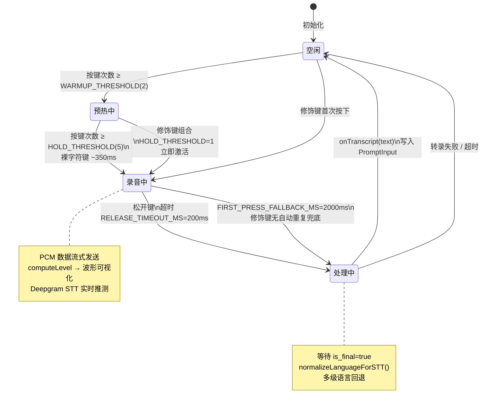
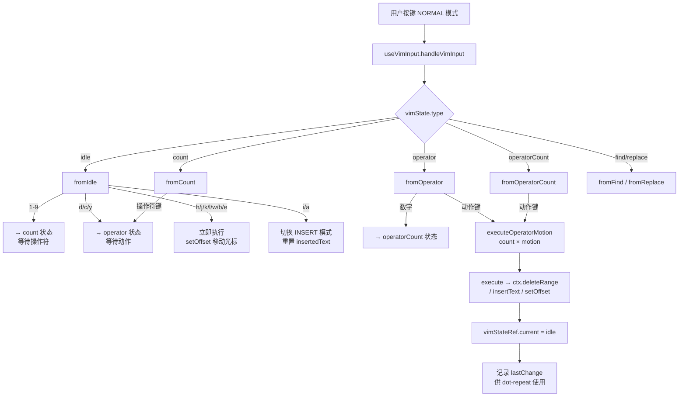

# Voice 语音输入与 Vim 模式 — Claude Code 源码分析

> 模块路径：`src/voice/`、`src/vim/`、`src/hooks/useVoice.ts`、`src/hooks/useVimInput.ts`
> 核心职责：为终端输入框提供语音录制识别（STT）和完整的 Vim Normal 模式键位状态机
> 源码版本：v2.1.88

## 一、模块概述

### 语音输入（Voice）

Claude Code 的语音输入功能（功能开关 `VOICE_MODE`）采用"按住说话"（push-to-talk）模式：用户按住快捷键录音，松开后提交音频。实现链路为：

1. `src/voice/voiceModeEnabled.ts`：GrowthBook kill-switch 检查 + OAuth token 鉴权
2. `src/hooks/useVoice.ts`：核心 React 钩子，管理录音状态机、WebSocket 流、自动重复键检测
3. `src/hooks/useVoiceIntegration.tsx`：与 Ink 键盘事件系统的桥接层，处理按键检测和 UI 反馈
4. 后端服务：`src/services/voiceStreamSTT.ts`（Anthropic `voice_stream` WebSocket 端点）

### Vim 模式（Vim）

`src/vim/` 实现了一个用于终端输入框的完整 Vim Normal 模式子集，以**有限状态机**设计，状态类型是穷举的 TypeScript 联合类型，确保编译时穷举检查。

---

## 二、架构设计

### 2.1 核心类/接口/函数

| 名称 | 文件 | 职责 |
|------|------|------|
| `useVoice` | `hooks/useVoice.ts` | 录音状态机（idle/recording/processing）、音量可视化、WebSocket STT |
| `useVoiceIntegration` | `hooks/useVoiceIntegration.tsx` | 按键检测（hold-threshold）、快捷键绑定、UI 通知 |
| `isVoiceModeEnabled` | `voice/voiceModeEnabled.ts` | 运行时权限检查：OAuth token + GrowthBook kill-switch |
| `transition` | `vim/transitions.ts` | Vim 状态机主函数，根据当前状态和输入返回下一状态或执行动作 |
| `VimState` / `CommandState` | `vim/types.ts` | 完整的 Vim 状态类型定义，包含 INSERT/NORMAL 模式及所有子状态 |

### 2.2 模块依赖关系图

```
语音输入链路：
PromptInput → useVoiceIntegration → useVoice → voiceStreamSTT (WebSocket)
                    │                    │
             KeybindingContext    native audio (macOS)
             （快捷键解析）          SoX (Linux)

Vim 模式链路：
PromptInput → useVimInput → useTextInput（字符串操作）
                  │
             vim/transitions（状态机）
                  │
        vim/operators（删除/修改/复制执行）
        vim/motions（光标移动）
        vim/textObjects（文本对象 aw/iw/"" 等）
```

### 2.3 关键数据流





**语音输入数据流：**
```
用户按住 Space（或自定义键）
    │ HOLD_THRESHOLD = 5 次自动重复键事件后激活
    ▼
useVoice.handleKeyEvent() → voiceState = 'recording'
    │ 建立 WebSocket 连接 voice_stream 端点
    │ 调用 native audio 模块开始采集 PCM 数据
    ▼
PCM 数据块流式发送 → Deepgram STT → 中间转录结果
    │ computeLevel(chunk) → 音量电平 → WaveformVisualizer
    ▼
用户松开键（RELEASE_TIMEOUT_MS = 200ms 超时检测）
    │ voiceState = 'processing'
    ▼
收到最终转录文本 → onTranscript(text) → PromptInput.onChange
    │ voiceState = 'idle'
```

**Vim 模式数据流：**
```
用户按键（NORMAL 模式）
    │
    ▼
useVimInput.handleVimInput(input, key)
    │ inputFilter 应用（若存在）
    ▼
transition(vimStateRef.current, input, ctx) → TransitionResult
    │ .next = 下一个 CommandState（等待更多输入）
    │ .execute = 立即执行的操作函数
    ▼
execute?.() → 调用 ctx 中的 setOffset / deleteRange / insertText
    │ → useTextInput 的底层字符串操作
    ▼
vimStateRef.current = next ?? { type: 'idle' }
```

---

## 三、核心实现走读

### 3.1 关键流程（语音）

1. **鉴权门控**：`isVoiceModeEnabled()` 在命令注册和 UI 显示时调用，要求：① 使用 Anthropic OAuth 登录（非 API Key/Bedrock/Vertex）；② GrowthBook `tengu_amber_quartz_disabled` flag 未开启（kill-switch）。
2. **懒加载原生模块**：`useVoice.ts` 中的 `voiceModule` 在首次激活录音前才 `import('../services/voice.js')`，避免应用启动时触发 macOS TCC 麦克风权限请求弹窗。
3. **按键松开检测**：终端不提供 `keyup` 事件，通过检测自动重复键事件的间隔来模拟：若两次 `handleKeyEvent` 调用间隔超过 `RELEASE_TIMEOUT_MS = 200ms`，认为用户已松开键，停止录音。
4. **修饰键特殊处理**：修饰键组合（Ctrl+S、Alt+V 等）第一次按下时无自动重复，`FIRST_PRESS_FALLBACK_MS = 2000ms` 超时定时器确保即使没有自动重复也能在用户松手后停止录音。
5. **语言规范化**：`normalizeLanguageForSTT()` 支持多语言名称到 BCP-47 代码的映射（如"日本語"→"ja"、"español"→"es"），若语言不在服务端允许列表中，回退到 `'en'`（默认）并通过 `fellBackFrom` 字段提供回退提示。

### 3.1.1 关键流程（Vim）

1. **双模式架构**：`VimState` 是 `{ mode: 'INSERT'; insertedText: string } | { mode: 'NORMAL'; command: CommandState }` 的联合类型。`insertedText` 在 INSERT 模式下累积用户输入，用于 dot-repeat（`.` 命令）。
2. **状态机分派**：`transition()` 函数根据 `state.type` 分派到对应的 `fromXxx()` 函数（`fromIdle`、`fromOperator`、`fromCount` 等），每个函数只处理对应状态的逻辑，结构清晰。
3. **操作符-动作组合**：`d`（删除）、`c`（修改）、`y`（复制）是操作符，需要后接动作（motion）或文本对象。按下 `d` 进入 `operator` 状态，再按 `w` 执行 `deleteWord`。`dd`/`cc`/`yy` 是同键重复，触发行操作。
4. **点重复（Dot Repeat）**：每次操作完成后，将操作记录为 `RecordedChange`（操作类型/参数）存入 `PersistentState.lastChange`。按 `.` 时，`onDotRepeat` 回调重新执行 `lastChange` 的操作。
5. **kill ring 整合**：`y`（yank）操作将文本写入 `PersistentState.register`（终端内 Vim 寄存器），`p`/`P` 从寄存器粘贴。这与系统剪贴板独立，保持纯终端环境的一致性。

### 3.2 重要源码片段

**片段一：语音松开检测（`useVoice.ts`）**
```typescript
// 终端无 keyup 事件，通过自动重复超时检测松开
// RELEASE_TIMEOUT_MS = 200ms：覆盖正常自动重复抖动（30-80ms）
const RELEASE_TIMEOUT_MS = 200
// FIRST_PRESS_FALLBACK_MS = 2000ms：修饰键第一次按下后无重复
// 需要等待更长时间确认用户是否持续按住
export const FIRST_PRESS_FALLBACK_MS = 2000

// handleKeyEvent 每次自动重复键事件被调用
// clearTimeout + setTimeout 实现"最后一次事件后超时"检测
export function useVoice({ enabled, onTranscript }) {
  const releaseTimerRef = useRef<NodeJS.Timeout | null>(null)
  const handleKeyEvent = useCallback((fallbackMs = REPEAT_FALLBACK_MS) => {
    if (releaseTimerRef.current) clearTimeout(releaseTimerRef.current)
    releaseTimerRef.current = setTimeout(stopRecording, fallbackMs)
    if (voiceState !== 'recording') startRecording()
  }, [...])
}
```

**片段二：音量电平计算（`useVoice.ts`）**
```typescript
// 从 16-bit PCM 缓冲区计算 RMS 振幅，用于可视化波形
// sqrt 曲线扩展安静声音的视觉范围，使波形使用全部高度
export function computeLevel(chunk: Buffer): number {
  const samples = chunk.length >> 1  // 16-bit = 2 bytes per sample
  let sumSq = 0
  for (let i = 0; i < chunk.length - 1; i += 2) {
    const sample = ((chunk[i]! | (chunk[i + 1]! << 8)) << 16) >> 16
    sumSq += sample * sample
  }
  const rms = Math.sqrt(sumSq / samples)
  return Math.sqrt(Math.min(rms / 2000, 1))  // sqrt 曲线：平方根拉伸
}
```

**片段三：Vim 状态机主入口（`vim/transitions.ts`）**
```typescript
// 主转换函数：按状态类型分派，TypeScript exhaustive check 保证完整性
export function transition(
  state: CommandState, input: string, ctx: TransitionContext,
): TransitionResult {
  switch (state.type) {
    case 'idle':          return fromIdle(input, ctx)
    case 'count':         return fromCount(state, input, ctx)
    case 'operator':      return fromOperator(state, input, ctx)
    case 'operatorCount': return fromOperatorCount(state, input, ctx)
    case 'find':          return fromFind(state, input, ctx)
    case 'replace':       return fromReplace(state, input, ctx)
    // ... 其他状态
  }
}
// fromIdle: '1-9' → count 状态，操作符键 → operator 状态，
//           移动键 → 立即执行 setOffset，'i/a' → 切回 INSERT 模式
```

### 3.3 设计模式分析

**语音模块：**
- **状态机（State Machine）**：`VoiceState = 'idle' | 'recording' | 'processing'` 严格控制状态转换，避免并发操作（如在 processing 时再次触发 recording）。
- **懒加载（Lazy Loading）**：原生音频模块在首次使用前不加载，符合最小权限原则（不在未使用功能时触发系统权限请求）。
- **适配器模式（Adapter Pattern）**：`useVoiceIntegration` 将 Ink 的原始键盘事件适配为 `useVoice` 期望的 `handleKeyEvent` 调用，隔离两个系统的接口差异。

**Vim 模式：**
- **有限状态机（FSM）**：完全纯函数的状态转换（`transition(state, input) → TransitionResult`），无副作用。所有副作用（文本操作）通过 `execute()` 函数异步执行。
- **命令对象模式（Command Pattern）**：`TransitionResult.execute` 是一个待执行的操作闭包，将"决定执行什么"（状态机）和"实际执行"（操作上下文）解耦。
- **分离持久化状态**：`PersistentState`（寄存器/lastFind/lastChange）与 `CommandState`（当前命令解析进度）分离，前者跨命令持久化，后者每次命令执行后重置为 `idle`。

---

## 四、高频面试 Q&A

### 设计决策题

**Q1：语音输入为什么需要 Anthropic OAuth 而不支持 API Key 鉴权？**

语音功能使用 `voice_stream` 端点，该端点托管在 `claude.ai`（Anthropic 的消费者产品），不在 API 网关中。API Key 是面向 Anthropic API（`api.anthropic.com`）的凭证，无法访问 `claude.ai` 的服务端点。Bedrock 和 Vertex 用户使用云厂商的身份体系，同样无法访问 Anthropic 自有服务。因此，语音功能仅对通过 `claude.ai` OAuth 登录的用户开放，这是架构约束而非主动限制。

**Q2：Vim 状态机为什么使用纯函数设计（`transition(state, input) → TransitionResult`）而不是有副作用的事件处理器？**

纯函数状态机的优势：
1. **可测试性**：只需提供 `(state, input)` 就能预测输出，无需 mock 任何副作用。测试用例就是状态转换表的文档。
2. **可组合性**：`useVimInput` 可以在 `transition` 返回结果后选择何时执行 `execute()`，例如在执行前先应用 `inputFilter`。
3. **调试友好**：状态快照（`vimStateRef.current`）是完整的当前解析进度，可以直接打印/记录，不依赖闭包捕获的外部变量。
4. **TypeScript 穷举**：`switch(state.type)` + TypeScript 联合类型确保新增状态时编译器提醒开发者添加对应的处理分支。

---

### 原理分析题

**Q3：`HOLD_THRESHOLD = 5` 次按键事件才激活语音，这是为了解决什么问题？**

对于裸字符键绑定（如 Space、`v` 等），单次按键可能是用户的正常输入（输入空格或字母 v），不应立即触发录音。`HOLD_THRESHOLD = 5` 要求在 `RAPID_KEY_GAP_MS = 120ms` 内连续接收到 5 次自动重复事件后才激活录音，这需要用户持续按住键约 350ms（5 × 70ms 自动重复间隔）。普通字符输入（打一个字母后手指抬起）不会产生 5 次自动重复。对于修饰键组合（Ctrl+S 等），第一次按下就激活（`HOLD_THRESHOLD = 1`），因为这类组合键不会被误触发为普通输入。`WARMUP_THRESHOLD = 2` 在达到 `HOLD_THRESHOLD` 之前显示预热反馈（UI 上显示"准备录音中"），给用户视觉确认。

**Q4：Vim 的 `count-operator-motion` 语法（如 `3d2w` = 删除 6 个词）是如何通过状态机实现的？**

`3d2w` 的解析步骤：
1. `3` → `fromIdle`: 进入 `{ type: 'count', digits: '3' }` 状态
2. `d` → `fromCount`: 识别为操作符，进入 `{ type: 'operator', op: 'delete', count: 3 }` 状态
3. `2` → `fromOperator`: 识别为数字，进入 `{ type: 'operatorCount', op: 'delete', count: 3, digits: '2' }` 状态
4. `w` → `fromOperatorCount`: `motionCount = parseInt('2') = 2`，`effectiveCount = count * motionCount = 3 * 2 = 6`，执行 `executeOperatorMotion('delete', 'w', 6, ctx)`

`operatorCount` 状态的设计使操作符前的计数（重复整个命令）和动作前的计数（重复动作范围）能够相乘，实现 Vim 的标准 `[count]operator[count]motion` 语法。

**Q5：语音转录的中间结果（partial transcript）和最终结果如何区分处理？**

`connectVoiceStream` 返回的 WebSocket 流会推送两种事件：
- **中间结果**（`is_final: false`）：Deepgram 的实时推测性识别，随时可能被更新。Claude Code 在录音进行中将这些结果显示为幽灵文字（ghost text），不实际写入输入框。
- **最终结果**（`is_final: true` 或流关闭时）：稳定的识别结果，通过 `onTranscript(text)` 回调写入 `PromptInput` 的 value。

`FinalizeSource` 类型区分了"用户主动停止录音"和"流超时结束"，前者立即使用最后一个最终结果，后者等待 WebSocket 推送完整的 final 结果后再关闭连接。

---

### 权衡与优化题

**Q6：Vim 模式的 `vimStateRef.current` 用 `useRef` 而不是 `useState` 存储，这对用户体验有什么影响？**

`vimStateRef.current` 存储命令解析的中间状态（如 `{ type: 'operator', op: 'delete', count: 3 }`）。若用 `useState`，每次按键都触发 React 重渲染 + Ink 帧渲染。对于 `3d2w` 需要 4 次按键，每次按键触发一次重渲染，4 次渲染仅更新模式指示器（`d` 的模式指示仍为 NORMAL，不变）——纯属浪费。使用 `useRef` 将状态机变更完全隐藏在渲染循环外，只有 `setMode('INSERT')` 和 `setMode('NORMAL')` 才触发重渲染，将 Vim 操作的渲染成本降至最低。

**Q7：语音的 `normalizeLanguageForSTT()` 采用多级回退策略而不是严格拒绝，这有什么用户体验考量？**

严格拒绝（用户设置了不支持的语言就报错）会导致：用户可能在设置了母语（如泰语 `th`）后发现语音功能完全不可用，即使用英语也无法使用，体验极差。多级回退策略（不支持 → 尝试 BCP-47 基础码 → 回退英语 + 提供警告）确保功能总是可用的：用英语识别虽然对非英语用户是降级，但比完全不可用好。`fellBackFrom` 字段让调用者能够向用户显示"你的语言设置 X 不受支持，已切换到英语"的通知，保持透明度。

---

### 实战应用题

**Q8：如何为 Claude Code 添加一个新的 Vim 动作，例如 `gd`（跳转到定义）？**

1. 在 `vim/transitions.ts` 的 `fromG()` 函数中添加 `d` 键的处理：
   ```typescript
   if (input === 'd') {
     return { execute: () => ctx.gotoDefinition?.() }
   }
   ```
2. 在 `TransitionContext` 类型（`vim/transitions.ts`）中添加 `gotoDefinition?: () => void` 可选函数。
3. 在 `useVimInput` 的 `ctx` 对象中注入 `gotoDefinition` 实现（调用 IDE 集成的跳转逻辑）。
4. 由于 `gd` 不修改文本，不需要更新 `PersistentState.lastChange`（`.` 命令不应重复 `gd`）。
5. 添加测试：`transition({ type: 'g', count: 1 }, 'd', ctx)` 应返回 `{ execute: fn }`。

**Q9：如果要将语音输入扩展为支持"连续对话"（录音结束后自动提交），应该修改哪个层次？**

"连续对话"模式（类似 Siri 的对话流）需要在 `useVoiceIntegration` 层（非 `useVoice` 层）添加逻辑：

1. 检测 `voiceState` 从 `'processing'` 回到 `'idle'` 且 `transcript` 非空时，自动调用 `onSubmit(transcript)`（而非仅 `onChange(transcript)`）。
2. 在 `AppState` 中添加 `voiceContinuousMode: boolean` 状态，用户通过设置开启。
3. `useVoice` 本身不感知"连续模式"，它只负责录音和转录，保持单一职责。
4. 注意：需要在提交后立即重新激活录音等待下一句话，或添加静默检测（`FOCUS_SILENCE_TIMEOUT_MS = 5000ms` 已存在，可复用）来决定何时结束对话流。

---

> **版权声明**：源码版权归 [Anthropic](https://www.anthropic.com) 所有，本文档基于 Claude Code v2.1.88 source map 还原版本分析，仅供学习研究使用。文档内容采用 [CC BY-NC 4.0](https://creativecommons.org/licenses/by-nc/4.0/) 协议。
