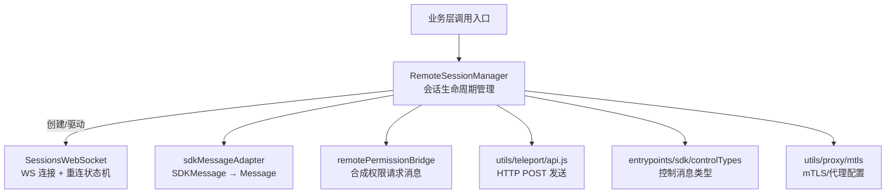
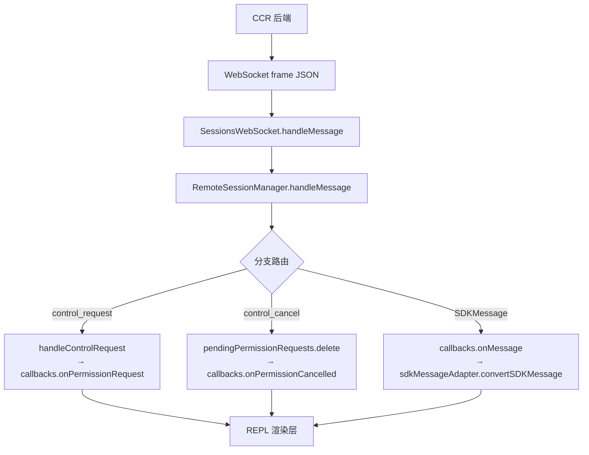
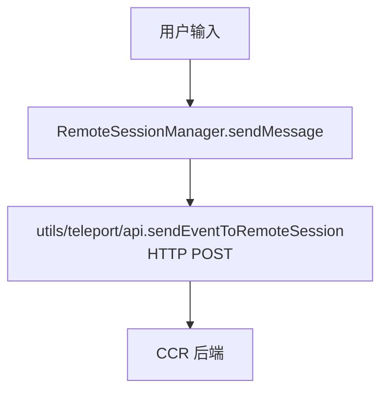
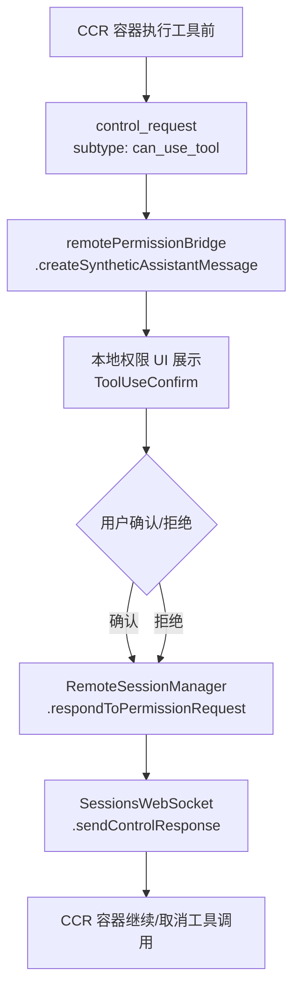

# remote（远程会话） — Claude Code 源码分析

> 模块路径：`src/remote/`
> 核心职责：管理与 CCR（Claude Code Remote）后端的 WebSocket 会话连接，处理消息协议的序列化/反序列化与权限请求流转
> 源码版本：v2.1.88

## 一、模块概述

`src/remote/` 模块是 Claude Code 远程会话功能的客户端核心，负责将本地 CLI 与云端 CCR 容器打通。它通过 WebSocket 订阅会话消息流，经由 HTTP POST 向远程会话发送用户输入，并处理权限审批（`can_use_tool`）的往返交互。

模块由 4 个文件构成：
- `RemoteSessionManager.ts`：会话生命周期管理器
- `SessionsWebSocket.ts`：底层 WebSocket 连接与重连逻辑
- `sdkMessageAdapter.ts`：SDK 消息格式 → REPL 内部格式适配器
- `remotePermissionBridge.ts`：远程权限请求的合成消息构造

---

## 二、架构设计

### 2.1 核心类/接口/函数

| 名称 | 类型 | 职责 |
|---|---|---|
| `RemoteSessionManager` | 类 | 会话生命周期管理，协调 WebSocket 订阅与 HTTP POST 发送 |
| `SessionsWebSocket` | 类 | WebSocket 连接状态机，含指数退避重连与心跳保活 |
| `convertSDKMessage()` | 函数 | 将 CCR 的 `SDKMessage` 转换为 REPL 可渲染的 `Message` 类型 |
| `createSyntheticAssistantMessage()` | 函数 | 为远程权限请求构造合成的 `AssistantMessage`，使本地权限组件可直接处理 |
| `RemoteSessionConfig` | 接口 | 会话连接配置，包含 `viewerOnly` 纯观察者模式标志 |

### 2.2 模块依赖关系图



### 2.3 关键数据流

**接收消息流：**


**发送消息流：**


**权限审批流：**


---

## 三、核心实现走读

### 3.1 关键流程（编号步骤）

**连接建立流程：**
1. 调用 `RemoteSessionManager.connect()`，构造 `SessionsWebSocketCallbacks`
2. 创建 `SessionsWebSocket` 实例，传入 `sessionId`、`orgUuid` 与 `getAccessToken` 工厂函数
3. WebSocket 连接至 `wss://api.anthropic.com/v1/sessions/ws/{sessionId}/subscribe?organization_uuid=...`
4. 连接建立后每次通过 Header 中的 `Authorization: Bearer <token>` 鉴权（Bun/Node 均支持）
5. 启动 30 秒心跳 ping 保持连接活跃
6. 触发 `onConnected` 回调通知上层

**断线重连机制：**
1. WebSocket 关闭时进入 `handleClose(closeCode)`
2. 关闭码 `4003`（unauthorized）→ 永久终止，不重连
3. 关闭码 `4001`（session not found）→ 限制重试 3 次，处理压缩期间临时 404
4. 其他正常断开 → 最多重试 5 次，间隔 2000ms（固定，非指数退避）
5. 超出重试预算 → 调用 `onClose` 通知上层会话终止

### 3.2 重要源码片段（带中文注释）

**WebSocket 关闭码处理（`src/remote/SessionsWebSocket.ts`）：**
```typescript
private handleClose(closeCode: number): void {
  this.stopPingInterval()
  if (this.state === 'closed') return  // 防止重复处理
  this.ws = null
  this.state = 'closed'

  // 永久关闭码：服务端明确拒绝，停止重连
  if (PERMANENT_CLOSE_CODES.has(closeCode)) {
    this.callbacks.onClose?.()
    return
  }

  // 4001 可能是压缩期间的短暂状态，有限重试
  if (closeCode === 4001) {
    this.sessionNotFoundRetries++
    if (this.sessionNotFoundRetries > MAX_SESSION_NOT_FOUND_RETRIES) {
      this.callbacks.onClose?.()
      return
    }
    this.scheduleReconnect(
      RECONNECT_DELAY_MS * this.sessionNotFoundRetries, `4001 attempt`
    )
    return
  }
  // 正常断开，按次数重连
  if (previousState === 'connected' && this.reconnectAttempts < MAX_RECONNECT_ATTEMPTS) {
    this.reconnectAttempts++
    this.scheduleReconnect(RECONNECT_DELAY_MS, `attempt ${this.reconnectAttempts}`)
  } else {
    this.callbacks.onClose?.()
  }
}
```

**消息类型适配（`src/remote/sdkMessageAdapter.ts`）：**
```typescript
export function convertSDKMessage(msg: SDKMessage, opts?: ConvertOptions): ConvertedMessage {
  switch (msg.type) {
    case 'assistant':
      return { type: 'message', message: convertAssistantMessage(msg) }
    case 'result':
      // 只在错误时展示结果消息，成功结果是噪音
      if (msg.subtype !== 'success') {
        return { type: 'message', message: convertResultMessage(msg) }
      }
      return { type: 'ignored' }
    default:
      // 向前兼容：未知类型不崩溃，只记录调试日志
      logForDebugging(`[sdkMessageAdapter] Unknown message type: ${msg.type}`)
      return { type: 'ignored' }
  }
}
```

**合成权限请求消息（`src/remote/remotePermissionBridge.ts`）：**
```typescript
// CCR 侧工具调用在容器中运行，本地没有真实 AssistantMessage
// 通过构造合成消息复用本地权限 UI 组件
export function createSyntheticAssistantMessage(
  request: SDKControlPermissionRequest,
  requestId: string,
): AssistantMessage {
  return {
    type: 'assistant',
    uuid: randomUUID(),
    message: {
      id: `remote-${requestId}`,
      content: [{ type: 'tool_use', id: request.tool_use_id,
                   name: request.tool_name, input: request.input }],
      // 远程模式没有 token 计数，填零值占位
      usage: { input_tokens: 0, output_tokens: 0, ... },
    } as AssistantMessage['message'],
  }
}
```

### 3.3 设计模式分析

- **观察者模式**：`RemoteSessionCallbacks` 将 WebSocket 事件以回调方式解耦到调用层，避免模块间直接依赖
- **适配器模式**：`sdkMessageAdapter` 将 CCR 的 SDK 格式适配为 REPL 内部的 `Message` 类型，隔离外部协议变化
- **状态机模式**：`SessionsWebSocket` 中的 `WebSocketState`（connecting/connected/closed）严格管理连接生命周期，防止并发重连

---

## 四、高频面试 Q&A

### 设计决策题

**Q1：为什么用户消息通过 HTTP POST 而非 WebSocket 发送？**

WebSocket 在 CCR 架构中是单向订阅通道（server-push），服务端将会话的 SDK 消息流推送给客户端。用户输入走独立的 HTTP POST（`sendEventToRemoteSession`）是因为：① POST 语义更清晰，支持重试和幂等性校验；② WebSocket 连接可能因断线重连处于临时不可用状态，而 HTTP POST 可独立重试；③ 与 CCR 后端的 REST API 设计一致，避免一个 WS 通道承载双向业务逻辑。

**Q2：为什么 `viewerOnly` 模式下不发送中断信号？**

`viewerOnly` 用于 `claude assistant` 命令的纯观察场景（只看会话内容）。此模式下发 Ctrl+C 中断会意外打断正在运行的远程任务，而用户只是想退出观察。此外，纯观察者无操作权，向服务端发送 interrupt 可能引发权限错误。

### 原理分析题

**Q3：4001 关闭码为什么只重试 3 次而不是永久重试？**

4001（session not found）通常发生在 CCR 容器进行对话压缩（compaction）期间，服务端暂时认为该会话已过期。重试 3 次（间隔依次 2s/4s/6s 共约 12s）足以覆盖压缩窗口。若无限重试，反而会在会话真正结束后持续尝试，浪费资源且延迟错误上报。

**Q4：心跳 ping 间隔为什么是 30 秒？**

CCR 的 WebSocket 网关通常配置 60 秒空闲超时。30 秒 ping 确保在超时一半时保活，留出一次 ping 失败的容错空间。同时避免过于频繁（如 10 秒）造成不必要的网络流量。

**Q5：`isSessionsMessage()` 为何采用宽松的类型校验（只验证 `type` 字段为字符串）？**

硬编码允许的 `type` 枚举会在后端新增消息类型时静默丢弃，导致难以诊断的功能缺失。宽松校验将未知类型转发给下游（`sdkMessageAdapter`），由其记录日志并返回 `{ type: 'ignored' }`，既保持向前兼容，又不丢失调试信息。

### 权衡与优化题

**Q6：`createToolStub()` 为什么不加载真实工具定义？**

远程 CCR 容器可能运行 MCP 工具，本地 CLI 并不知道它们的 schema。加载真实定义会要求本地与远端的工具集完全同步，引入强耦合。工具桩（stub）仅实现权限渲染所需的最小接口（`name`、`renderToolUseMessage`、`needsPermissions`），路由到 `FallbackPermissionRequest` 组件显示原始输入，既不崩溃，又给用户足够信息做决策。

**Q7：`BoundedUUIDSet` 的环形缓冲区设计有什么优势？**

（见 `bridgeMessaging.ts` 的 echo 去重机制）相比无限增长的 `Set`，容量固定的环形缓冲区确保内存恒为 O(capacity)。对于 UUID 去重场景，历史消息超出窗口后不再可能重复，淘汰最老条目不影响正确性。

### 实战应用题

**Q8：如何扩展 remote 模块支持多会话并发观察？**

当前 `RemoteSessionManager` 是单会话设计。扩展思路：① 创建 `MultiSessionManager` 持有 `Map<sessionId, RemoteSessionManager>`；② 每个实例独立维护 WebSocket 连接与权限请求队列；③ 上层通过事件总线（如 `EventEmitter`）统一接收各会话消息，按 `sessionId` 路由到对应的 REPL 渲染上下文。

**Q9：当 CCR 后端发布新消息类型时，升级路径是什么？**

1. 后端先上线新类型，旧客户端通过 `sdkMessageAdapter` 的 `default` 分支返回 `{ type: 'ignored' }` 安全降级；
2. 客户端在 `convertSDKMessage` 的 `switch` 中新增 `case`，实现转换逻辑；
3. 若需要 UI 渲染，在 REPL 消息列表组件中添加对应渲染分支；
4. 全程无破坏性变更，新旧客户端均可与同一后端协作。

---
> **版权声明**：源码版权归 [Anthropic](https://www.anthropic.com) 所有，本文档基于 Claude Code v2.1.88 source map 还原版本分析，仅供学习研究使用。文档内容采用 [CC BY-NC 4.0](https://creativecommons.org/licenses/by-nc/4.0/) 协议。
