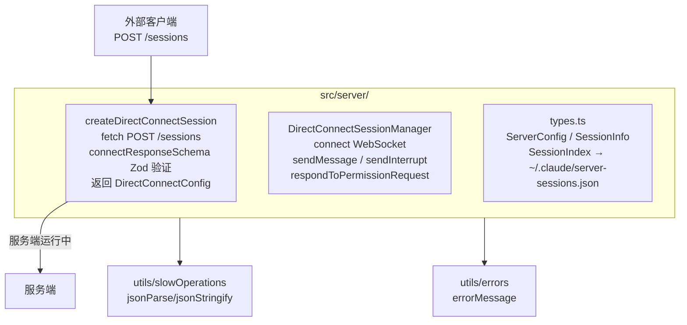
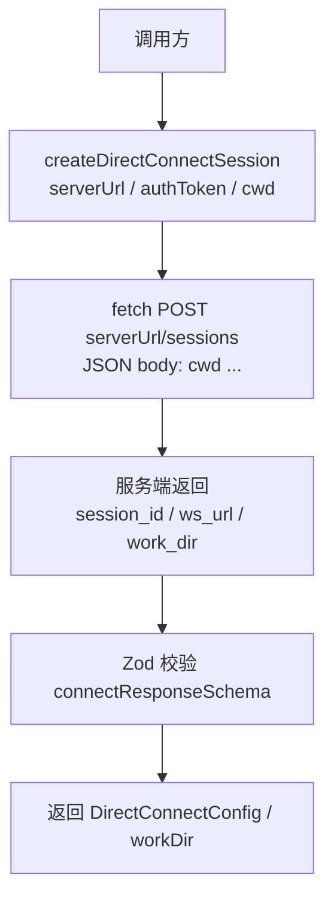
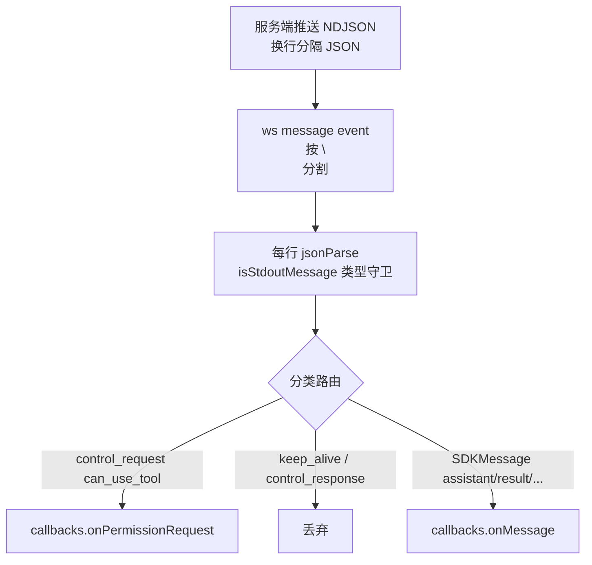

# server（HTTP 服务器） — Claude Code 源码分析

> 模块路径：`src/server/`
> 核心职责：提供 Direct Connect 模式下的本地 HTTP + WebSocket 服务器，使外部客户端（IDE 插件、CI 系统）可通过标准协议连接 Claude Code 会话
> 源码版本：v2.1.88

## 一、模块概述

`src/server/` 模块实现了 Claude Code 的 **Direct Connect** 服务端逻辑。与 CCR 远程模式不同，Direct Connect 允许在本地机器或同网络内建立一个轻量级 HTTP/WebSocket 服务器，外部客户端通过 `POST /sessions` 创建会话并获取 WebSocket URL，随后通过 WebSocket 接收 SDK 消息流并发送用户输入。

该模块由 3 个文件构成：
- `types.ts`：数据类型定义（`ServerConfig`、`SessionInfo`、`SessionIndex` 等）
- `createDirectConnectSession.ts`：客户端侧的会话创建请求封装
- `directConnectManager.ts`：客户端侧的 WebSocket 会话管理器

---

## 二、架构设计

### 2.1 核心类/接口/函数

| 名称 | 类型 | 职责 |
|---|---|---|
| `createDirectConnectSession()` | 函数 | 向 Direct Connect 服务器发送 `POST /sessions`，获取 `sessionId` 和 `wsUrl` |
| `DirectConnectSessionManager` | 类 | 管理客户端到 Direct Connect 服务器的 WebSocket 连接及消息处理 |
| `DirectConnectError` | 类 | 连接失败时的专用错误类型，携带详细的用户友好错误信息 |
| `ServerConfig` | 接口 | 服务器配置：端口、认证令牌、Unix Socket、最大会话数、超时等 |
| `connectResponseSchema` | Zod Schema | 用 Zod 验证 `POST /sessions` 响应（`session_id`、`ws_url`、`work_dir`） |

### 2.2 模块依赖关系图



### 2.3 关键数据流

**会话创建流程：**


**消息接收流程（WebSocket 侧）：**


**消息发送格式：**
```typescript
// 必须匹配 --input-format stream-json 期望的 SDKUserMessage 格式
{
  type: 'user',
  message: { role: 'user', content: <RemoteMessageContent> },
  parent_tool_use_id: null,
  session_id: ''
}
```

---

## 三、核心实现走读

### 3.1 关键流程（编号步骤）

**Direct Connect 会话建立（客户端侧）：**
1. 调用 `createDirectConnectSession({ serverUrl, authToken, cwd })`
2. 构造请求头：`Content-Type: application/json`，若有 `authToken` 则加 `Authorization: Bearer ...`
3. `fetch POST ${serverUrl}/sessions`，body 含工作目录及可选的 `dangerously_skip_permissions` 标志
4. HTTP 非 2xx → 抛出 `DirectConnectError`（携带状态码和文本）
5. 响应 JSON 经 `connectResponseSchema().safeParse()` 校验，校验失败再次抛出 `DirectConnectError`
6. 返回 `{ config: { serverUrl, sessionId, wsUrl, authToken }, workDir }`

**WebSocket 消息处理（DirectConnectSessionManager）：**
1. `connect()` 使用 Bun 原生 WebSocket（含 headers 选项传递 authToken）
2. `message` 事件中将 data 按 `\n` 分割，处理每行 NDJSON
3. 过滤 `control_response`、`keep_alive`、`streamlined_*`、`post_turn_summary` 等内部类型
4. `control_request` 类型路由到 `onPermissionRequest` 回调
5. 其余 SDK 消息转发至 `onMessage` 回调

### 3.2 重要源码片段（带中文注释）

**会话创建请求封装（`src/server/createDirectConnectSession.ts`）：**
```typescript
export async function createDirectConnectSession({
  serverUrl, authToken, cwd, dangerouslySkipPermissions,
}: { ... }): Promise<{ config: DirectConnectConfig; workDir?: string }> {
  let resp: Response
  try {
    resp = await fetch(`${serverUrl}/sessions`, {
      method: 'POST',
      headers: { 'content-type': 'application/json',
                 ...(authToken && { 'authorization': `Bearer ${authToken}` }) },
      body: jsonStringify({ cwd,
        ...(dangerouslySkipPermissions && { dangerously_skip_permissions: true }) }),
    })
  } catch (err) {
    // 网络层错误（DNS 解析失败、连接超时等）
    throw new DirectConnectError(`Failed to connect to server at ${serverUrl}: ${errorMessage(err)}`)
  }
  // 用 Zod 验证响应结构，确保 session_id 和 ws_url 存在
  const result = connectResponseSchema().safeParse(await resp.json())
  if (!result.success) {
    throw new DirectConnectError(`Invalid session response: ${result.error.message}`)
  }
  return { config: { serverUrl, sessionId: result.data.session_id,
                     wsUrl: result.data.ws_url, authToken },
           workDir: result.data.work_dir }
}
```

**NDJSON 消息处理（`src/server/directConnectManager.ts`）：**
```typescript
this.ws.addEventListener('message', event => {
  const data = typeof event.data === 'string' ? event.data : ''
  // 服务端以换行分隔的 NDJSON 格式推送多条消息
  const lines = data.split('\n').filter((l: string) => l.trim())

  for (const line of lines) {
    let raw: unknown
    try { raw = jsonParse(line) } catch { continue }
    if (!isStdoutMessage(raw)) continue

    if (parsed.type === 'control_request') {
      // 工具权限请求，转发给上层回调处理
      if (parsed.request.subtype === 'can_use_tool') {
        this.callbacks.onPermissionRequest(parsed.request, parsed.request_id)
      }
      continue
    }
    // 过滤协议内部消息，只转发业务消息
    if (parsed.type !== 'control_response' && parsed.type !== 'keep_alive' && ...) {
      this.callbacks.onMessage(parsed)
    }
  }
})
```

**类型定义（`src/server/types.ts`）：**
```typescript
// 服务器核心配置
export type ServerConfig = {
  port: number
  host: string
  authToken: string       // Bearer 认证令牌
  unix?: string           // 可选 Unix Domain Socket 路径
  idleTimeoutMs?: number  // 空闲会话超时（0 = 永不过期）
  maxSessions?: number    // 最大并发会话数
  workspace?: string      // 默认工作目录
}

// 会话持久化索引（跨重启恢复用）
export type SessionIndexEntry = {
  sessionId: string
  transcriptSessionId: string   // 用于 --resume 的会话 ID
  cwd: string
  permissionMode?: string
  createdAt: number
  lastActiveAt: number
}
```

### 3.3 设计模式分析

- **工厂函数模式**：`createDirectConnectSession()` 封装了创建会话的全部细节（请求、校验、错误处理），返回一个随时可用的 `DirectConnectConfig`，符合简单工厂的思路
- **Schema 优先设计**：用 Zod 的 `lazySchema` 延迟构造校验器，避免在未实际调用时就初始化 Zod schema 的开销，同时保持强类型验证
- **策略模式（回调）**：`DirectConnectCallbacks` 将业务逻辑（如权限决策）委托给调用方，使 `DirectConnectSessionManager` 保持协议无关性

---

## 四、高频面试 Q&A

### 设计决策题

**Q1：Direct Connect 模式与 CCR 远程模式有何本质区别？**

CCR 远程模式下，Claude Code 的实际执行发生在 Anthropic 云端容器中，本地 CLI 是纯展示/控制端，通过 claude.ai OAuth 鉴权；Direct Connect 模式下，Claude Code 在本地机器（或 CI 容器）中实际运行，Direct Connect 服务器只是将其包装成 HTTP+WebSocket API 供外部客户端消费（如 IDE 插件）。前者是"远程执行+本地显示"，后者是"本地执行+远程访问"。

**Q2：服务端为什么用 NDJSON 而不是纯 JSON 或 MessagePack 格式推送消息？**

NDJSON（换行分隔 JSON）在流式场景中易于解析，每行独立是一条完整消息，无需实现帧边界检测（WebSocket 本身有帧，但 NDJSON 允许服务端在一个 WebSocket 帧中批量发送多条消息）。纯 JSON 需要完整缓冲后才能解析，MessagePack 在工具生态上不如 JSON 通用。

### 原理分析题

**Q3：`connectResponseSchema` 使用 `lazySchema` 的原因是什么？**

Zod schema 的构造函数会在模块加载时执行，若 schema 较复杂则产生不必要的启动开销。`lazySchema` 用 `memoize` 包装，首次调用时才真正构造 Zod 对象，后续复用缓存。对于 CLI 这种启动延迟敏感的程序，延迟初始化是优化手段之一。

**Q4：`SessionIndex` 持久化到 `~/.claude/server-sessions.json` 的目的是什么？**

在服务器重启后（如 `claude server` 崩溃恢复），通过 `SessionIndexEntry.transcriptSessionId` 可向子进程传递 `--resume` 参数，恢复之前的对话上下文。`lastActiveAt` 字段支持按最近活跃时间清理过期会话，避免索引文件无限增长。

**Q5：`dangerously_skip_permissions` 通过 POST body 而非 Header 传递，为什么？**

该标志是会话级配置，属于创建会话时的初始化参数，与其他会话属性（`cwd`）一起构成会话的构造参数，语义上属于请求体。作为 Header 则意味着该行为是请求级别的认证/路由策略，语义不准确。同时请求体参数可被服务端日志、监控记录为会话属性，便于审计哪些会话跳过了权限检查。

### 权衡与优化题

**Q6：Direct Connect 的 Bearer Token 鉴权与 CCR 的 OAuth 相比，有哪些安全权衡？**

Bearer Token 是服务端启动时生成的随机密钥，适合本地/内网场景，简单但有固定令牌被截获的风险。CCR OAuth 是基于 claude.ai 账号的短期访问令牌（约 4 小时有效），带有账号级别的权限控制，适合多租户云端场景。Direct Connect 适合本地受信网络（如 localhost、VPN 内网），CCR 模式适合公网访问需求。

**Q7：为什么 `isStdoutMessage()` 只检查 `type` 是字符串而不做完整校验？**

完整校验意味着需要为每种 `StdoutMessage` 的联合类型维护校验逻辑，而且会在后端新增类型时导致校验失败（需要同步更新客户端）。轻量守卫（只验 `type` 存在且为字符串）加上 `switch/if` 分支路由，在性能和向前兼容性之间取得平衡。

### 实战应用题

**Q8：如何为 Direct Connect 服务器实现会话级速率限制？**

在 `ServerConfig` 中增加 `rateLimit` 字段（如每秒最大消息数）；在 WebSocket message handler 中维护每个 `sessionId` 的令牌桶（Token Bucket），超出限制时返回 `control_response { subtype: 'error', error: 'rate_limit_exceeded' }`；同时在 `SessionInfo` 中记录 `messagesPerSecond` 指标用于监控。

**Q9：在 CI 环境中使用 Direct Connect 时，如何安全传递 `authToken`？**

推荐通过环境变量注入（如 `CLAUDE_SERVER_TOKEN`），服务端启动时从环境读取；CI 系统（GitHub Actions、GitLab CI）通过 Secret 机制注入，不写入代码仓库。避免将 token 放入 URL 参数（会出现在日志中）或 git 历史中。客户端在请求时通过 `Authorization: Bearer` Header 传递，Header 在 TLS 加密下传输。

---
> **版权声明**：源码版权归 [Anthropic](https://www.anthropic.com) 所有，本文档基于 Claude Code v2.1.88 source map 还原版本分析，仅供学习研究使用。文档内容采用 [CC BY-NC 4.0](https://creativecommons.org/licenses/by-nc/4.0/) 协议。
