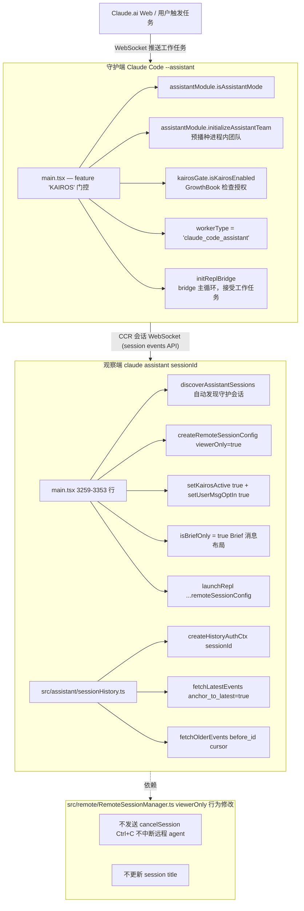
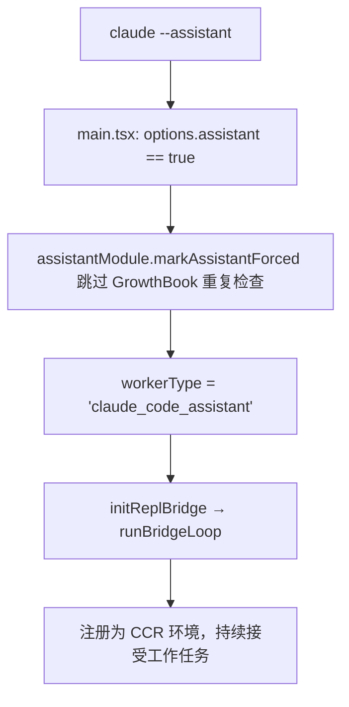
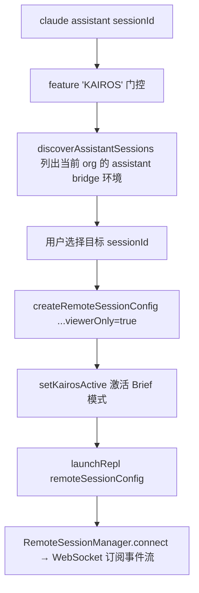
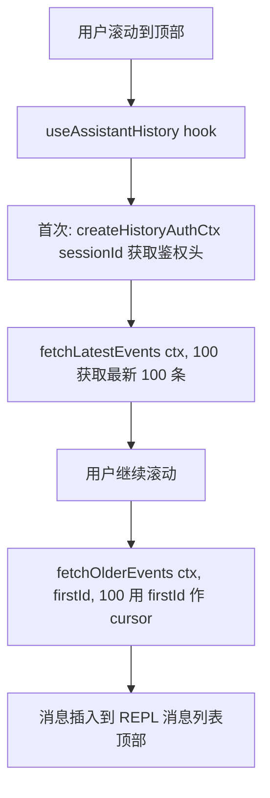

# assistant（KAIROS 助手模式） — Claude Code 源码分析

> 模块路径：`src/assistant/`
> 核心职责：实现 KAIROS 助手模式（`claude assistant` 命令），将 Claude Code 变为后台守护 Agent，支持纯观察者客户端通过 `viewerOnly` 模式连接远程会话并懒加载历史消息
> 源码版本：v2.1.88

## 一、模块概述

KAIROS（内部代号）是 Claude Code 的**助手守护模式**，区别于普通对话模式：

- **守护端**：运行 `claude --assistant` 的进程在后台持续运行，作为 `claude_code_assistant` 类型的 Worker 注册到 CCR 平台，接受来自 claude.ai 的任务
- **观察端**：运行 `claude assistant [sessionId]` 的 CLI 进程以 `viewerOnly=true` 模式连接守护会话，只接收消息流，不发送中断，不更新会话标题，不设置 60 秒重连超时

`src/assistant/` 目录仅包含 `sessionHistory.ts` 一个文件，功能是分页加载远程会话的历史消息。KAIROS 的主要调度逻辑位于 `src/main.tsx` 中通过 `feature('KAIROS')` 条件编译引入，并通过 `require('./assistant/index.js')` 懒加载助手模块。

---

## 二、架构设计

### 2.1 核心类/接口/函数

| 名称 | 类型 | 职责 |
|---|---|---|
| `fetchLatestEvents()` | 函数 | 获取最新一页历史消息（最近 100 条，降序排列） |
| `fetchOlderEvents()` | 函数 | 获取指定 cursor（`before_id`）之前的更早消息 |
| `createHistoryAuthCtx()` | 函数 | 准备历史记录 API 的鉴权上下文（一次性初始化，跨分页复用） |
| `viewerOnly`（配置字段） | `RemoteSessionConfig` 字段 | 标记纯观察模式：禁用中断、标题更新和 60s 重连超时 |
| `feature('KAIROS')` | 构建时门控 | 死代码消除，外部构建中 KAIROS 相关代码不打入产物 |

### 2.2 模块依赖关系图



### 2.3 关键数据流

**守护端启动：**


**观察端连接：**


**历史消息懒加载（分页）：**


---

## 三、核心实现走读

### 3.1 关键流程（编号步骤）

**KAIROS 激活与权限检查：**
1. 检测 `.claude/settings.json` 中的 `assistant: true` 或命令行 `--assistant`
2. 通过 `checkHasTrustDialogAccepted()` 验证目录已被信任（防止恶意仓库的 `settings.json` 自动激活）
3. 调用 `kairosGate.isKairosEnabled()`，先读磁盘缓存（GrowthBook），缓存缺失时发起一次 API 请求（最多等 5 秒）
4. 激活后调用 `assistantModule.initializeAssistantTeam()`，预播种进程内团队上下文
5. 设置 `brief=true` 使输出使用 Brief 消息布局（只展示关键内容）

**observerOnly 模式下的行为差异：**

| 行为 | 普通远程模式 | viewerOnly 模式（KAIROS 观察端） |
|---|---|---|
| Ctrl+C / Escape | 发送 interrupt 到远程 agent | 不发送，仅退出本地观察 |
| 60 秒重连超时 | 启用 | 禁用（长期观察） |
| 会话标题更新 | 更新 | 不更新 |
| 接收消息流 | 是 | 是 |
| 发送用户消息 | 是 | 是（通过 HTTP POST） |

### 3.2 重要源码片段（带中文注释）

**历史消息分页 API（`src/assistant/sessionHistory.ts`）：**
```typescript
// 鉴权上下文：一次性创建，跨所有分页请求复用，避免重复 OAuth 握手
export async function createHistoryAuthCtx(sessionId: string): Promise<HistoryAuthCtx> {
  const { accessToken, orgUUID } = await prepareApiRequest()
  return {
    baseUrl: `${getOauthConfig().BASE_API_URL}/v1/sessions/${sessionId}/events`,
    headers: {
      ...getOAuthHeaders(accessToken),
      'anthropic-beta': 'ccr-byoc-2025-07-29',
      'x-organization-uuid': orgUUID,
    },
  }
}

// 最新消息页：anchor_to_latest=true 确保返回的是最后 N 条（而非最早的 N 条）
export async function fetchLatestEvents(
  ctx: HistoryAuthCtx, limit = HISTORY_PAGE_SIZE,
): Promise<HistoryPage | null> {
  return fetchPage(ctx, { limit, anchor_to_latest: true }, 'fetchLatestEvents')
}

// 更早消息页：before_id 作为 cursor，获取该事件之前的记录
export async function fetchOlderEvents(
  ctx: HistoryAuthCtx, beforeId: string, limit = HISTORY_PAGE_SIZE,
): Promise<HistoryPage | null> {
  return fetchPage(ctx, { limit, before_id: beforeId }, 'fetchOlderEvents')
}
```

**viewerOnly 模式创建（`src/main.tsx` 约 3329 行）：**
```typescript
// viewerOnly=true: 观察端不能中断守护 agent，不更新标题，没有 60s 重连限制
const remoteSessionConfig = createRemoteSessionConfig(
  targetSessionId,
  getAccessToken,     // 闭包，每次重连获取新 token（OAuth 有效期约 4h）
  apiCreds.orgUUID,
  /* hasInitialPrompt */ false,
  /* viewerOnly */ true
)

// Brief 模式激活：setKairosActive 满足 isBriefEnabled() 的授权检查
setKairosActive(true)
setUserMsgOptIn(true)  // 用户明确要求 Brief 模式
setIsRemoteMode(true)  // 告知 REPL 处于远程模式

const assistantInitialState: AppState = {
  ...initialState,
  isBriefOnly: true,       // 使用简洁消息布局
  kairosEnabled: false,    // 观察端不触发 KAIROS agent 功能
  replBridgeEnabled: false // 观察端不建立新的 bridge 连接
}
```

**KAIROS 信任检查（`src/main.tsx` 约 1067 行）：**
```typescript
if (feature('KAIROS') && assistantModule?.isAssistantMode() && !(options.agentId) && kairosGate) {
  if (!checkHasTrustDialogAccepted()) {
    // 安全防护：不受信任的目录可能包含恶意 .claude/settings.json
    // 该文件设置 assistant: true 会自动注册到云端并接受任意工作任务
    console.warn(chalk.yellow(
      'Assistant mode disabled: directory is not trusted. Accept the trust dialog and restart.'
    ))
  } else {
    kairosEnabled = assistantModule.isAssistantForced()
      || (await kairosGate.isKairosEnabled())
    if (kairosEnabled) {
      // Brief 模式是 KAIROS 的强制要求，覆盖用户配置
      opts.brief = true
      setKairosActive(true)
      assistantTeamContext = await assistantModule.initializeAssistantTeam()
    }
  }
}
```

### 3.3 设计模式分析

- **特性标志（Feature Flag）+ 死代码消除**：`feature('KAIROS')` 在构建时求值，外部构建产物中完全不存在 KAIROS 相关代码，减小包体积且不暴露内部功能
- **懒加载模块**：`require('./assistant/index.js')` 仅在 KAIROS 激活时执行，避免即使未使用该功能也消耗模块初始化时间
- **游标分页（Cursor Pagination）**：`before_id` + `anchor_to_latest` 的分页设计是标准无状态游标分页，支持无需服务端 session 状态的任意翻页，适合分布式存储后端
- **空对象/守护者（Null Guard）**：`kairosGate?.isKairosEnabled()` 使用可选链，确保在外部构建（无 kairosGate 模块）时不崩溃

---

## 四、高频面试 Q&A

### 设计决策题

**Q1：为什么 KAIROS 助手模式需要 `worker_type: 'claude_code_assistant'`，不能复用普通 `claude_code` 类型？**

worker_type 是 claude.ai 前端用于过滤会话选择器的元数据。`claude_code_assistant` 标记使助手会话只出现在 claude.ai 的"助手"标签页中，而不与用户手动发起的普通 Remote Control 会话混在一起。此外，后端可基于 worker_type 应用不同的路由规则、超时策略和 SLA——助手守护进程通常需要更长的超时（因为它在等待来自用户交互的任务），普通 Remote Control 会话则可能被更激进地回收。

**Q2：为什么 `initializeAssistantTeam()` 需要在 `setup()` 捕获 `teammateMode` 快照之前调用？**

`initializeAssistantTeam()` 内部调用 `setCliTeammateModeOverride()`，修改全局的 `teammateMode` 状态。`setup()` 在其执行过程中读取并"快照"这个值到本地变量供后续使用。若 `initializeAssistantTeam()` 在 `setup()` 之后执行，`setup()` 捕获的是旧值，导致 Agent 在生成子进程时使用错误的团队模式——子 Agent 可能不知道自己处于 KAIROS 团队上下文中，无法正确协调。

### 原理分析题

**Q3：历史消息分页为什么使用 `anchor_to_latest=true` 而不是正常的时间倒序分页？**

`anchor_to_latest=true` 让服务端先定位到最新事件，然后向后返回 N 条（时间倒序），这等价于"获取最后 100 条"。若使用普通倒序分页（`after_id`），需要知道"最新事件的 ID"才能作为 cursor 起点，而在首次加载时这个 ID 未知。`anchor_to_latest=true` 是无需预知状态的"从末尾开始分页"语义，服务端处理最终一致性，客户端只需处理懒加载逻辑。

**Q4：观察端 `viewerOnly` 模式为什么禁用 60 秒重连超时？**

60 秒超时是为了防止普通远程模式下"幽灵 viewer"长期占用会话资源（用户实际已离开但 WS 未正常关闭）。助手观察模式是有意的长期连接（用户打开终端窗口观察守护 Agent 的工作），60 秒超时会频繁断开并重连，产生大量无意义的重连流量。`viewerOnly` 明确表达了"我知道自己会长时间挂在这里"的意图。

**Q5：`createHistoryAuthCtx()` 为什么只调用一次而不在每次分页时刷新 token？**

每次 `prepareApiRequest()` 都会执行 OAuth token 检查，可能涉及网络请求（若 token 临近过期需刷新）。分页操作通常在短时间内连续发生（用户快速滚动），频繁刷新 token 会增加延迟。OAuth token 有效期约 4 小时，分页操作的时间窗口远小于此；若 token 在分页过程中过期，axios 请求会返回 401，上层的错误处理会触发重新鉴权。

### 权衡与优化题

**Q6：KAIROS 信任检查在什么情况下可能产生误报（false negative）？**

`checkHasTrustDialogAccepted()` 检查的是**当前工作目录**是否已被信任。若用户在项目 A（已信任）中克隆了包含恶意 `settings.json` 的项目 B（子目录），然后在项目 B 的目录内运行 Claude Code，若 B 的父目录路径被信任，`checkHasTrustDialogAccepted()` 可能返回 true（因为 B 是已信任路径的子目录）。这是路径前缀信任模型的内在缺陷，最佳缓解是要求每个 git 仓库独立信任（基于 `git rev-parse --show-toplevel` 的精确匹配）。

**Q7：`isBriefOnly: true` 对 KAIROS 观察端 UI 有什么影响？**

Brief 模式下，REPL 使用紧凑布局渲染助手消息，减少每条消息占用的行数：① 工具使用详情默认折叠；② 冗长的中间状态（如"正在读取文件…"）不显示；③ 只展示关键输出和最终结果。这样用户在终端窗口中可以看到更多消息历史。`isBriefOnly` 同时禁用了主动向用户发送消息的 prompt 输入框（因为观察端以只读为主）。

### 实战应用题

**Q8：如何在企业环境中部署 KAIROS 助手守护进程？**

推荐方案：① 在专用服务器上以 `systemd` 服务管理 `claude --assistant` 进程（配合 `WorkingDirectory` 和 `User`）；② 环境变量通过 `EnvironmentFile` 注入 Claude Code 的 API 密钥；③ 设置 `RestartSec=10` 和 `Restart=on-failure` 实现自动重启；④ 通过 `journald` 收集日志并设置 `StandardOutput=append:/var/log/claude-assistant.log`；⑤ 在 Grafana 仪表板中监控 heartbeat 调用频率和会话成功率。

**Q9：用户在 `claude assistant` 观察会话时发送消息，会发生什么？**

观察端以 `viewerOnly=true` 连接，但仍然可以发送用户消息（通过 `RemoteSessionManager.sendMessage()` 的 HTTP POST 路径）。这意味着观察者可以向正在运行的 KAIROS 守护 Agent 发送新的指令或补充信息，形成"中途插入"的协作模式。区别在于观察者无法中断当前正在执行的操作（不发送 interrupt），只能在 Agent 完成当前任务后处理新消息。这与 claude.ai Web 界面的行为一致——Web 端也可以发送新消息，但不能强制终止当前任务。

---
> **版权声明**：源码版权归 [Anthropic](https://www.anthropic.com) 所有，本文档基于 Claude Code v2.1.88 source map 还原版本分析，仅供学习研究使用。文档内容采用 [CC BY-NC 4.0](https://creativecommons.org/licenses/by-nc/4.0/) 协议。
