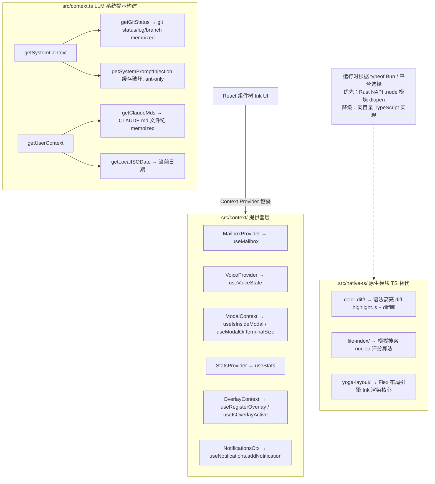
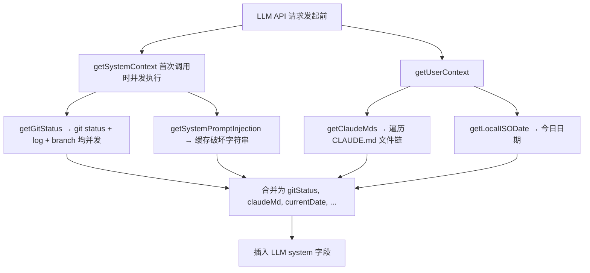
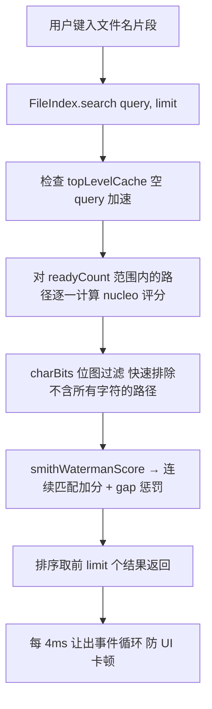

# context 与 native-ts — Claude Code 源码分析

> 模块路径：`src/context/`、`src/context.ts`、`src/native-ts/`
> 核心职责：`context` 提供 React 上下文提供器（Mailbox、Modal、Voice、Notifications 等 UI 状态管理）；`context.ts` 构建 LLM 系统提示的运行时上下文（git 状态、CLAUDE.md 等）；`native-ts` 是 Rust NAPI 原生模块的纯 TypeScript 替代实现
> 源码版本：v2.1.88

## 一、模块概述

### src/context/ — UI 上下文提供器层

该目录包含 9 个 React Context 文件，为 Ink UI 组件树提供全局状态注入：

| 文件 | 职责 |
|---|---|
| `mailbox.tsx` | 跨组件消息信箱（`Mailbox` 类，任务通知队列） |
| `modalContext.tsx` | 模态面板的尺寸/滚动引用（供 Select 分页、Tab 重置用） |
| `notifications.tsx` | 通知队列管理（优先级、超时、fold 合并） |
| `QueuedMessageContext.tsx` | 排队消息的布局上下文（padding 宽度、Brief 模式） |
| `stats.tsx` | 指标收集（计数器、直方图、集合，蓄水池采样） |
| `voice.tsx` | 语音输入状态（idle/recording/processing，音频电平） |
| `overlayContext.tsx` | Overlay 注册（解决 Escape 键与覆盖层的冲突） |
| `promptOverlayContext.tsx` | 提示词覆盖层（slash 命令对话框专用） |
| `fpsMetrics.tsx` | 帧率指标采集（Ink 渲染性能监控） |

### src/context.ts — 系统提示上下文构建器

构建发送给 LLM 的系统提示组成部分：通过 `getSystemContext()`（含 git 状态、缓存破坏注入）和 `getUserContext()`（含 CLAUDE.md 内容、当前日期）提供延迟初始化、memoize 缓存的上下文字典。

### src/native-ts/ — TypeScript 原生模块替代

3 个子目录各为一个 Rust NAPI 模块的纯 TypeScript 端口，使 Claude Code 在无法编译原生代码的环境（如 Windows、Alpine Linux）也能运行：

| 模块 | 替代的 Rust 组件 | 核心功能 |
|---|---|---|
| `color-diff/` | `vendor/color-diff-src`（syntect+bat） | 语法高亮 + 行内词差异渲染 |
| `file-index/` | `vendor/file-index-src`（nucleo） | 模糊文件搜索 + 路径索引 |
| `yoga-layout/` | `yoga-layout`（Meta flexbox C++） | Flex 布局引擎（供 Ink 渲染用） |

---

## 二、架构设计

### 2.1 核心类/接口/函数

| 名称 | 所在位置 | 职责 |
|---|---|---|
| `getSystemContext()` | `context.ts` | 返回系统级上下文字典（git 状态、缓存注入），memoize 缓存 |
| `getUserContext()` | `context.ts` | 返回用户级上下文字典（CLAUDE.md、当前日期），memoize 缓存 |
| `MailboxProvider` / `useMailbox()` | `context/mailbox.tsx` | 提供消息信箱，用于跨组件异步通知 |
| `FileIndex` | `native-ts/file-index/` | 模糊文件搜索类，支持渐进式异步构建索引 |
| `createStatsStore()` | `context/stats.tsx` | 创建指标仓库（计数器/直方图/集合/蓄水池采样） |

### 2.2 模块依赖关系图



### 2.3 关键数据流

**系统提示上下文构建：**


**模糊文件搜索流程（native-ts/file-index）：**


---

## 三、核心实现走读

### 3.1 关键流程（编号步骤）

**系统上下文的 memoize 缓存失效：**
1. `getSystemContext()` 和 `getUserContext()` 均用 `lodash memoize` 包裹
2. 当 `setSystemPromptInjection(value)` 被调用时，显式调用 `getUserContext.cache.clear()` 和 `getSystemContext.cache.clear()` 使缓存失效
3. 下一次 API 请求将重新并发执行所有 git 命令和文件读取
4. `getGitStatus()` 自身也是独立 memoize 缓存，需要单独通过 `getGitStatus.cache.clear()` 失效

**FileIndex 渐进式索引构建：**
1. `loadFromFileList()` 接收路径列表，去重后异步构建索引
2. 每批处理约 4ms（时间切片，而非固定数量），之后让出事件循环（`await new Promise(resolve => setTimeout(resolve, 0))`）
3. 构建过程中 `readyCount` 递增，`search()` 可在索引未完全建立时就搜索已就绪的前缀
4. 为每个路径维护 `charBits`（字符位图），O(1) 过滤：查询中任意字符不在路径中则跳过

### 3.2 重要源码片段（带中文注释）

**系统提示上下文（`src/context.ts`）：**
```typescript
// memoize 包裹：首次调用时执行，后续返回缓存；setSystemPromptInjection 时主动失效
export const getSystemContext = memoize(async (): Promise<{ [k: string]: string }> => {
  // CCR 远程模式不需要 git 状态（容器内有专用 git 环境，避免重复开销）
  const gitStatus =
    isEnvTruthy(process.env.CLAUDE_CODE_REMOTE) || !shouldIncludeGitInstructions()
      ? null : await getGitStatus()

  // 仅 Anthropic 内部构建（ant-only）支持缓存破坏注入，用于压测/调试
  const injection = feature('BREAK_CACHE_COMMAND') ? getSystemPromptInjection() : null
  return {
    ...(gitStatus && { gitStatus }),
    ...(feature('BREAK_CACHE_COMMAND') && injection
      ? { cacheBreaker: `[CACHE_BREAKER: ${injection}]` } : {}),
  }
})

// getGitStatus 自身也 memoize，并发执行 5 个 git 命令
export const getGitStatus = memoize(async (): Promise<string | null> => {
  const [branch, mainBranch, status, log, userName] = await Promise.all([
    getBranch(), getDefaultBranch(),
    execFileNoThrow(gitExe(), ['--no-optional-locks', 'status', '--short'], ...),
    execFileNoThrow(gitExe(), ['--no-optional-locks', 'log', '--oneline', '-n', '5'], ...),
    execFileNoThrow(gitExe(), ['config', 'user.name'], ...),
  ])
  // status 超过 2000 字符时截断（防止填满 context window）
  const truncatedStatus = status.length > MAX_STATUS_CHARS
    ? status.substring(0, MAX_STATUS_CHARS) + '\n... (truncated...)'
    : status
  return [`Current branch: ${branch}`, `Status:\n${truncatedStatus || '(clean)'}`].join('\n\n')
})
```

**蓄水池采样直方图（`src/context/stats.tsx`）：**
```typescript
observe(name: string, value: number) {
  let h = histograms.get(name)
  if (!h) { h = { reservoir: [], count: 0, sum: 0, min: value, max: value } }
  h.count++; h.sum += value
  // Reservoir Sampling (Algorithm R): 保证每个样本以等概率进入蓄水池
  if (h.reservoir.length < RESERVOIR_SIZE) {
    h.reservoir.push(value)
  } else {
    // 随机替换：j 在 [0, count) 均匀分布，若 j < RESERVOIR_SIZE 则替换
    const j = Math.floor(Math.random() * h.count)
    if (j < RESERVOIR_SIZE) h.reservoir[j] = value
  }
  histograms.set(name, h)
}
```

**nucleo 评分算法（`src/native-ts/file-index/index.ts`）：**
```typescript
// 近似 nucleo/fzf-v2 评分：连续匹配加分，gap 惩罚，首字符和边界额外加分
function smithWatermanScore(path: string, query: string, positions: Int32Array): number {
  let score = SCORE_MATCH * query.length  // 基础分
  let prev = -2
  for (let i = 0; i < query.length; i++) {
    const pos = positions[i]!
    if (pos === prev + 1) {
      score += BONUS_CONSECUTIVE    // 连续匹配奖励
    } else {
      score -= PENALTY_GAP_START + PENALTY_GAP_EXTENSION * (pos - prev - 2)  // gap 惩罚
    }
    if (pos === 0 || path[pos - 1] === '/' || path[pos - 1] === '\\') {
      score += BONUS_BOUNDARY       // 路径边界奖励（/ 或 \ 之后）
    }
    prev = pos
  }
  return score
}
```

**ModalContext 的尺寸注入（`src/context/modalContext.tsx`）：**
```typescript
// Modal 区域比终端小（减去转录预览区、分隔线），供 Select 分页时限制显示行数
type ModalCtx = {
  rows: number       // Modal 内可用行数（小于 terminal.rows）
  columns: number    // Modal 内可用列数
  scrollRef: RefObject<ScrollBoxHandle | null> | null
}
export const ModalContext = createContext<ModalCtx | null>(null)

// 替代 useTerminalSize() 的钩子：在 Modal 内返回 Modal 尺寸，在 Modal 外返回终端尺寸
export function useModalOrTerminalSize(fallback: { rows: number; columns: number }) {
  const ctx = useContext(ModalContext)
  return ctx ? { rows: ctx.rows, columns: ctx.columns } : fallback
}
```

### 3.3 设计模式分析

**context.ts：**
- **备忘录模式（Memoize）**：`getSystemContext()` 和 `getGitStatus()` 通过 `lodash memoize` 实现跨 API 请求的缓存，避免每次对话回合都重新执行 git 命令
- **懒加载 + 缓存失效**：`setSystemPromptInjection()` 显式清空 memoize 缓存，是"手动失效"策略，适合配置变更低频的场景

**context/：**
- **发布-订阅（间接）**：`notifications.tsx` 通过 AppState 的队列实现通知流转，`processQueue()` 在每次状态变化时调用，类似事件驱动的发布-订阅
- **组合式 Context（Compound Context）**：多个独立 Context（Mailbox、Voice、Modal）分层包裹，避免单一巨型 Context 导致的不必要重渲染

**native-ts：**
- **适配器 + 降级模式**：TypeScript 实现与 Rust NAPI 模块保持完全相同的 API 面，运行时根据平台选择最优实现（native 优先），调用方代码完全不需要修改
- **时间切片（Time Slicing）**：`FileIndex.loadFromFileList()` 每 4ms 让出事件循环，是浏览器/Node 渐进式计算的标准模式（类似 React 的 Concurrent Mode fiber 切片）

---

## 四、高频面试 Q&A

### 设计决策题

**Q1：`getSystemContext()` 和 `getUserContext()` 为什么分成两个函数而不合并？**

两者的缓存失效策略不同。`getSystemContext()` 在 `setSystemPromptInjection()` 时失效（调试用，低频）；`getUserContext()` 在 CLAUDE.md 文件变化时可独立失效（用户编辑了 CLAUDE.md 后重新加载）。分离也使两者可独立并发调用，避免一方的慢操作（如大型 git 仓库的 `git log`）阻塞另一方（快速的日期获取）。此外，分离清晰地表达了语义——"系统环境"（git 状态）与"用户配置"（CLAUDE.md）是不同关注点。

**Q2：为什么 `ModalContext` 需要暴露 `scrollRef` 而不是让 Modal 自己管理滚动？**

这是 Tabs 组件的特殊需求：Tabs 在 Modal 内部时，切换 Tab 需要重置滚动位置到顶部。但 ScrollBox 由 FullscreenLayout 的 Modal 槽位持有，Tabs 并不在 FullscreenLayout 的直接子树中。通过 `ModalContext.scrollRef`，任何深层嵌套的子组件都能访问 Modal 的 ScrollBox 引用，而不需要 prop drilling（逐层传递 ref）。

### 原理分析题

**Q3：`native-ts/file-index` 的 `charBits` 位图如何实现 O(1) 过滤？**

对每个路径，在索引构建时计算路径包含哪些字符，将其编码为 32 位整数位图（`charBits[i] = bitset`，每个字母对应一个 bit）。搜索时，先将查询字符串同样计算位图，然后用按位与（AND）检查路径位图是否是查询位图的超集（即路径包含所有查询字符）。若结果不等于查询位图，则该路径不可能匹配查询，O(1) 跳过，无需进入耗时的 Smith-Waterman 评分阶段。

**Q4：`stats.tsx` 的蓄水池采样（Reservoir Sampling）相比普通采样有什么优势？**

普通采样（如每 N 个取一个）会有周期性偏差，且需要预知总量。蓄水池采样（Algorithm R）在不知道流长度的情况下，对每个元素以等概率选取，保证最终蓄水池中的样本是均匀无偏的随机子集。对于运行时间不可预知的 CLI 工具（用户可以随时退出），蓄水池采样是理想选择——无论程序运行多久，蓄水池中的样本始终是迄今为止所有观测的无偏代表。

**Q5：`color-diff/` 为什么用 `highlight.js` 而不是继续用 Rust 的 `syntect`？**

`syntect` 是通过 Rust NAPI 模块调用的（`vendor/color-diff-src`），在无法编译 NAPI 的环境（如某些 Windows 配置、Alpine Linux 容器）中不可用。TypeScript 替代需要一个纯 JS 的语法高亮库，`highlight.js` 已经是 Claude Code 的现有依赖（通过 `cli-highlight`），引入成本为零。代价是 `highlight.js` 的 token 分类与 syntect 不完全对齐（普通标识符和操作符无 scope），颜色略有差异，但输出结构（行号、diff 标记）完全一致。

### 权衡与优化题

**Q6：`getGitStatus()` 并发执行 5 个 git 命令，在大型 monorepo 中可能有什么问题？**

`git status --short` 在包含大量未跟踪文件或大型工作区的 monorepo 中可能执行数秒（扫描数十万个文件）。此外，5 个命令同时执行会给 git 进程池（和文件系统缓存）带来并发压力，可能相互竞争 git 的目录锁。缓解方案：① 增加 `--ignore-submodules` 减少递归扫描；② 在 CCR 远程模式下跳过（已实现）；③ 为 `getGitStatus` 增加全局超时（目前没有明确的超时，只有 `MAX_STATUS_CHARS` 截断输出）。

**Q7：`FileIndex` 选择基于时间（4ms）而非计数（如每 5000 个路径）切片的原因是什么？**

固定计数切片假设了每个路径的处理时间相同，而实际上路径长度、字符集、索引计算复杂度因路径而异。Windows 上处理含 Unicode 字符的路径明显慢于 ASCII 路径。时间切片（`Date.now()` 比较）确保每个切片的实际 CPU 占用接近恒定，无论路径特性如何，UI 帧间隔的卡顿都不超过 4ms。

### 实战应用题

**Q8：如何为 `getUserContext()` 添加对 `.claudeignore` 文件的支持？**

1. 在 `getUserContext()` 中调用新函数 `getClaudeIgnoreRules()`，读取 CWD 下的 `.claudeignore` 文件
2. 若文件存在，将规则解析为 glob 列表并序列化为人类可读字符串
3. 返回值加入 `getUserContext()` 的结果对象中（如 `{ claudeIgnore: ... }`）
4. 需要使 `getUserContext` 的 memoize 缓存也在 `.claudeignore` 文件变化时失效（可通过 `fs.watch` 触发 `getUserContext.cache.clear()`）

**Q9：在 CI/CD 流水线中，`getGitStatus()` 的结果对 LLM 性能有什么影响？**

CI 环境通常是浅克隆（`--depth=1`），`git log -n 5` 可能只返回 1 条提交；同时 CI 工作区干净（无未提交更改），`git status --short` 返回空。LLM 收到的系统提示中 git 状态极短，减少了 token 消耗。但若 CI 克隆了大量子模块，git status 会变慢（除非配置了 `--ignore-submodules`）。另一个考量是 CI 可能有较高的 prompt cache 命中率（相同仓库多次运行 git log 结果相同），Anthropic 的 prompt caching 机制会缓存 system prompt 的 token，降低重复运行的成本。

---
> **版权声明**：源码版权归 [Anthropic](https://www.anthropic.com) 所有，本文档基于 Claude Code v2.1.88 source map 还原版本分析，仅供学习研究使用。文档内容采用 [CC BY-NC 4.0](https://creativecommons.org/licenses/by-nc/4.0/) 协议。
