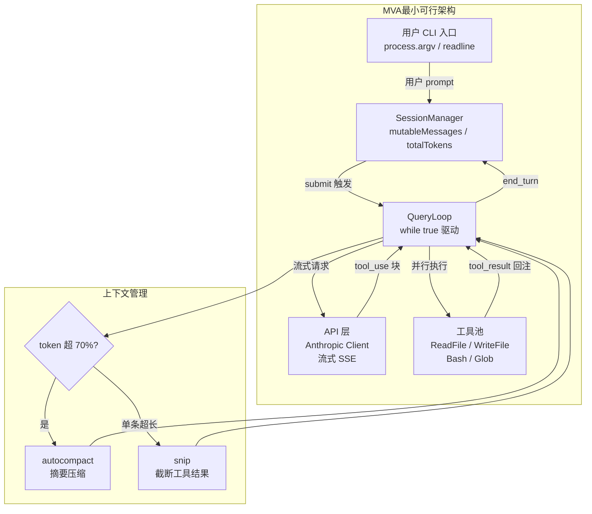
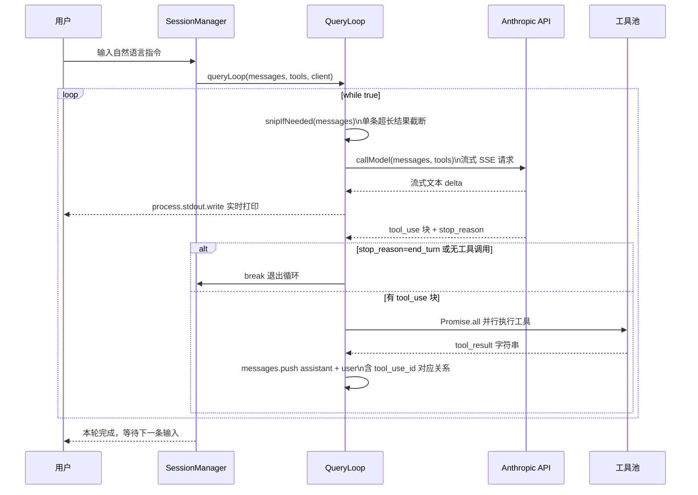

# 搭建轻颗粒 Agent 客户端 — 综合实战指南

> 基于 Claude Code v2.1.88 源码架构的实践指南
> 适合读者：已阅读本系列笔记、希望从零实现一个迷你 AI 编程助手的工程师

---

## 一、目标与最小可行架构

### 什么是"轻颗粒 Agent 客户端"

"轻颗粒"意味着：你不需要 Claude Code 的全部 40+ 工具、React/Ink 渲染引擎、多云认证链、Buddy 伴侣、CCR 远程会话等重量级组件。你需要的是其**核心驱动机制**的最小可运行子集，足以完成以下任务：

- 接受用户的自然语言指令
- 调用 Anthropic API 获取流式响应
- 执行文件读写、命令执行等工具调用
- 将工具结果反馈给模型，继续对话循环
- 在上下文接近上限时做基本压缩

### 可以剥离的组件

| 组件 | Claude Code 的作用 | 轻客户端处理方式 |
|------|-------------------|-----------------|
| React/Ink 渲染 | 终端 TUI、差量渲染、Yoga 布局 | 直接 `process.stdout.write` |
| 7 级认证链 | 多云 API Key / OAuth / Bedrock | 只读 `ANTHROPIC_API_KEY` 环境变量 |
| 四级压缩流水线 | snip / microcompact / contextCollapse / autocompact | 仅保留 snip（截断超长工具结果）+ 简易 autocompact |
| 插件 / 技能系统 | 用户可选功能单元 | 工具硬编码，首期不做插件化 |
| 多 Agent 协调器 | 多进程 Agent Swarm | 可选扩展，初期不实现 |
| MCP 工具 | 延迟加载外部工具服务 | 可选扩展，初期不实现 |
| 版本迁移系统 | 11 级配置迁移幂等运行 | 不需要（初始项目无历史配置） |
| CCR 远程会话 | WebSocket 云端执行 | 不需要 |

### 最小可行架构（MVA）

```
┌─────────────────────────────────────────────┐
│                用户 CLI 入口                  │
│  process.argv 解析 / readline / 标准 I/O      │
└─────────────────┬───────────────────────────┘
                  │  用户 prompt
                  ▼
┌─────────────────────────────────────────────┐
│              SessionManager                  │
│  持有 mutableMessages[] / totalTokens        │
│  每次 submit() 触发一轮 QueryLoop            │
└─────────────────┬───────────────────────────┘
                  │
                  ▼
┌─────────────────────────────────────────────┐
│               QueryLoop                      │
│  while(true):                                │
│    1. 上下文压缩（超限时 snip / summarize）   │
│    2. callModel() → 流式 API 请求            │
│    3. 收集 tool_use 块                       │
│    4. 并行执行工具 → tool_result             │
│    5. stop_reason === 'end_turn' → break     │
└──────┬──────────────┬───────────────────────┘
       │              │
       ▼              ▼
┌──────────┐   ┌──────────────────────────────┐
│  API 层   │   │         工具池（最小集）        │
│ Anthropic │   │  ReadFileTool / WriteFileTool │
│  Client  │   │  BashTool / GlobTool          │
│ 流式 SSE  │   │  （可扩展）                    │
└──────────┘   └──────────────────────────────┘
```



**必须保留的三个核心机制：**
1. **QueryLoop 的 while(true) 驱动结构**：Agent 能力来源于工具调用→反馈→再请求的循环，缺少此循环则退化为普通 LLM 调用。
2. **消息历史的跨轮次持久化**：模型需要上下文才能理解前置操作的结果。
3. **工具执行与结果回注**：`tool_use` 块执行后，必须以 `tool_result` 格式回填到消息历史，否则 API 返回错误。

---

## 二、核心组件拆解

### 2.1 QueryLoop（核心驱动循环）

Claude Code 的 `query.ts` 是一个无状态的异步生成器函数，每次被 `QueryEngine.submitMessage()` 携带完整上下文调用。其核心逻辑是：

```
while (true) {
    压缩消息历史 → 调用 API → 收集输出 → 执行工具 → 追加结果 → 判断是否终止
}
```

轻客户端可以将这个结构简化为以下 TypeScript 骨架：

```typescript
// QueryLoop 核心骨架（简化版，约 12 行）
async function* queryLoop(
  messages: Message[],       // 当前消息历史（含本轮用户输入）
  tools: ToolDef[],          // 工具池
  client: Anthropic,         // API 客户端
): AsyncGenerator<AssistantChunk> {
  while (true) {
    // 步骤1：上下文超限时做简易截断
    const safeMessages = snipIfNeeded(messages)
    // 步骤2：流式 API 调用，收集 tool_use 和文本
    const { text, toolUses, stopReason } = await callModel(safeMessages, tools, client)
    yield { type: 'text', text }
    // 步骤3：若无工具调用或已结束，退出循环
    if (stopReason === 'end_turn' || toolUses.length === 0) break
    // 步骤4：并行执行所有工具，追加结果
    const results = await Promise.all(toolUses.map(t => executeTool(t, tools)))
    messages.push({ role: 'assistant', content: [...toolUses] })
    messages.push({ role: 'user', content: results.map(toToolResult) })
  }
}
```



**关键细节**：Claude Code 原版的 `stop_reason === 'tool_use'` 触发工具执行，`'end_turn'` 触发退出。轻客户端无需精确区分，只要判断 `toolUses.length === 0` 即可退出循环。

### 2.2 工具系统（最小工具集）

Claude Code 有 40+ 内置工具，但对于一个编程助手，以下 4 个工具覆盖了 90% 的实际需求：

| 工具名 | 职责 | 实现要点 |
|--------|------|---------|
| `read_file` | 读取文件内容 | `fs.readFile`，超长时截断并注明行数 |
| `write_file` | 写入 / 覆盖文件 | `fs.writeFile`，需权限确认标志 |
| `bash` | 执行 shell 命令 | `child_process.spawn`，捕获 stdout/stderr，设置超时 |
| `glob` | 文件模式匹配 | `fast-glob` 库，限制返回数量 |

Claude Code 的工具系统使用 `ToolDef<I, O>` 接口 + `buildTool()` 工厂模式，所有工具的 `inputSchema` 通过 `lazySchema()` 延迟构建。轻客户端可以用更简单的结构：

```typescript
// 最小 ToolDef 接口定义
interface MinimalTool {
  name: string                              // 工具名，与 API schema 一致
  description: string                       // 传给模型的功能说明
  inputSchema: Record<string, unknown>      // JSON Schema 格式，API 需要
  call(input: unknown): Promise<string>     // 实际执行，返回字符串结果
}

// 工具派发：找到对应工具并执行
async function executeTool(
  toolUse: ToolUseBlock,
  tools: MinimalTool[],
): Promise<string> {
  const tool = tools.find(t => t.name === toolUse.name)
  if (!tool) return `Error: tool "${toolUse.name}" not found`
  try {
    return await tool.call(toolUse.input)
  } catch (e) {
    return `Error: ${e instanceof Error ? e.message : String(e)}`  // 永远不能抛出
  }
}
```

**设计要点**：工具的 `call()` 函数绝对不能向上抛出异常。Claude Code 原版的工具生命周期在 `call` 步骤捕获所有错误并包装为 `tool_result`，模型可以根据错误信息决定下一步。若工具执行直接抛出异常并中断 QueryLoop，整个 Agent 会话就此结束。

### 2.3 上下文管理（精简版）

Claude Code 实现了完整的四级压缩流水线（见 `04-Agent协调/03-query.md`）。轻客户端只需实现两级：

**第一级：snip（单条消息截断）**

当某条 `tool_result` 消息的字符数超过阈值（建议 5000 字符）时，截断并追加 `[...截断，原始长度 N 字符]` 标注。这解决了 `cat` 大文件时单条结果占满上下文窗口的问题。

**第二级：autocompact（全局摘要）**

当估算的 token 总数超过模型上下文窗口的 70% 时，调用一次独立的摘要 API 请求，让模型用 1-2 段话总结当前对话的关键进展，然后用 `[COMPACTED HISTORY]\n{摘要}` 替换历史消息开头。

```typescript
// token 粗估 + 触发摘要阈值检查
function shouldCompact(messages: Message[], maxTokens: number): boolean {
  // 每个字符约 0.3 token（中英混合文本的粗略估算）
  const estimated = JSON.stringify(messages).length * 0.3
  return estimated > maxTokens * 0.7  // 超过 70% 时触发
}
```

Claude Code 的完整压缩链中，`microcompact` 和 `contextCollapse` 处理的是重复性工具调用序列的中间折叠，对轻客户端而言优先级较低，可在 MVP 稳定后再引入。

### 2.4 流式输出

Claude Code 使用 Anthropic SDK 的 `stream()` 方法消费 SSE 事件流，通过自定义的 `StreamingToolExecutor` 实现边流边执行。轻客户端可以直接使用 SDK 的 `stream` API：

```typescript
// 流式调用并收集 tool_use 块（使用 @anthropic-ai/sdk）
async function callModel(messages: Message[], tools: MinimalTool[], client: Anthropic) {
  let text = ''
  const toolUses: ToolUseBlock[] = []

  // stream() 返回异步可迭代对象，直接 for await 消费
  const stream = await client.messages.stream({
    model: 'claude-sonnet-4-5',
    max_tokens: 8192,
    messages,
    tools: tools.map(t => ({ name: t.name, description: t.description, input_schema: t.inputSchema })),
  })

  for await (const event of stream) {
    if (event.type === 'content_block_delta' && event.delta.type === 'text_delta') {
      process.stdout.write(event.delta.text)   // 实时打印流式文本
      text += event.delta.text
    }
    if (event.type === 'content_block_stop' && event.index !== undefined) {
      const block = (await stream.finalMessage()).content[event.index]
      if (block?.type === 'tool_use') toolUses.push(block)
    }
  }
  const final = await stream.finalMessage()
  return { text, toolUses, stopReason: final.stop_reason }
}
```

---

## 三、逐步实现路径

以下是从零到可运行的分阶段路径，每个阶段结束后都可以独立运行验证。

### 阶段一：单轮 LLM 调用（约 1 小时）

**目标**：能发送一条消息并接收流式回复。

1. `npm init -y && npm install @anthropic-ai/sdk`
2. 创建 `src/client.ts`，实现 `callModel()` 函数（见 2.4 节代码）
3. 在 `src/index.ts` 中读取 `process.argv[2]` 作为 prompt，调用 `callModel()`，打印结果
4. 运行 `npx ts-node src/index.ts "解释一下 async/await"`，确认流式输出

此阶段无工具调用，不可视为 Agent，但验证了 API 连通性和流式处理逻辑。

### 阶段二：工具注册 + 单次工具调用（约 2 小时）

**目标**：模型可以调用 `read_file` 工具读取本地文件。

1. 创建 `src/tools/readFile.ts`，实现 `MinimalTool` 接口
2. 创建 `src/tools/index.ts`，导出工具池数组
3. 修改 `callModel()` 接受 `tools` 参数，将工具定义传给 API
4. 在 `src/index.ts` 中，收到响应后检查 `toolUses`，若非空则调用 `executeTool()`，打印 `tool_result`

此阶段可以测试：`npx ts-node src/index.ts "读取 ./package.json 文件的内容"`。模型会调用 `read_file`，你能看到工具被执行。

**注意**：此时还没有 QueryLoop，工具结果只打印不回注，模型无法看到结果。

### 阶段三：QueryLoop + 消息历史（约 3 小时）

**目标**：实现完整的 Agent 循环，工具结果回注，模型可连续调用多个工具。

1. 创建 `src/queryLoop.ts`，实现 2.1 节的 `queryLoop()` 异步生成器
2. 创建 `src/session.ts`，维护 `mutableMessages: Message[]`
3. 修改 `src/index.ts`：
   - 每次用户输入追加到 `mutableMessages`
   - 调用 `queryLoop(mutableMessages, tools, client)`
   - `for await` 消费生成器输出
4. 添加 `bash` 和 `write_file` 工具到工具池

此阶段已是一个可用的 Agent。测试：`npx ts-node src/index.ts "列出当前目录下的所有 .ts 文件，然后读取最大的一个"`，模型会连续调用 `bash` + `read_file`。

### 阶段四：REPL 交互循环（约 1 小时）

**目标**：从单次命令行参数升级为持续交互的 REPL。

1. 安装 `readline` 模块（Node.js 内置）
2. 在 `src/index.ts` 中用 `readline.createInterface()` 创建交互循环：

```typescript
// 简易 REPL 循环（约 15 行）
const rl = readline.createInterface({ input: process.stdin, output: process.stdout })
const session = new SessionManager(tools, client)

rl.on('line', async (input) => {
  rl.pause()                          // 防止打字期间触发下一次输入
  await session.submit(input.trim())  // 触发一轮 queryLoop
  rl.resume()
  rl.prompt()
})
rl.prompt()
```

### 阶段五：上下文压缩（约 2 小时）

**目标**：处理长对话，防止 `prompt_too_long` 错误。

1. 在 `SessionManager.submit()` 入口处调用 `snipLongToolResults(messages)`
2. 在 `callModel()` 前调用 `shouldCompact()`，若触发则先执行摘要请求
3. 用一个非常大的文件测试：让模型读取 10000 行的日志文件，确认不报 token 超限错误

完成此阶段后，你拥有了一个功能完整的轻颗粒 Agent 客户端。

---

## 四、与 Claude Code 的差异权衡

### 你主动放弃的能力

| 能力 | Claude Code 实现 | 你放弃的后果 | 可接受度 |
|------|-----------------|-------------|---------|
| React/Ink TUI | 差量渲染、Yoga 布局、Spinner | 纯文本输出，无进度指示 | 高——开发工具可接受 |
| 权限系统 | `validateInput` → `checkPermissions` → `call` | 工具调用无用户确认 | **中**——写操作需谨慎 |
| 会话持久化 | 预写日志 JSONL，`/resume` 恢复 | 进程重启后历史丢失 | 高——本地开发可接受 |
| 并行工具执行 | `StreamingToolExecutor` 并发 | 串行执行工具，速度较慢 | 高——简单场景不感知 |
| MCP 工具集成 | 动态加载、延迟 schema | 不能接入外部工具服务 | 中——视需求决定 |

### 绝对不能省略的部分

1. **工具错误不能向上抛出**：必须捕获并包装为字符串结果返回给模型。
2. **消息格式必须严格遵守**：`tool_use` 块和 `tool_result` 块的 `id` 字段必须一一对应，API 校验严格。
3. **`max_tokens` 必须合理设置**：不设或设太低会导致模型输出被截断，工具调用 JSON 残缺后导致解析失败。
4. **系统提示词中必须说明工具用途**：模型是否主动使用工具高度依赖系统提示词的引导质量。

### 权限系统的最小实现

Claude Code 的权限系统有完整的五阶段生命周期。轻客户端至少应为写操作（`write_file`、`bash` 写命令）加一层简单确认：

```typescript
// 写操作前询问用户（约 8 行）
async function confirmWrite(description: string): Promise<boolean> {
  return new Promise(resolve => {
    const rl = readline.createInterface({ input: process.stdin, output: process.stdout })
    rl.question(`允许执行：${description}？(y/N) `, ans => {
      rl.close()
      resolve(ans.toLowerCase() === 'y')
    })
  })
}
```

---

## 五、进阶：可选扩展点

### 5.1 MCP 工具集成

当你需要接入数据库查询、浏览器控制、外部 API 等能力时，可以集成 MCP（Model Context Protocol）。Claude Code 的实现思路：

- 使用 `@modelcontextprotocol/sdk` 连接 MCP 服务器
- 服务器提供的工具动态追加到工具池
- 使用 `lazySchema()` 思路延迟构建工具 schema，避免启动时的连接开销

建议时机：当你需要 3 个以上的非标准工具时引入 MCP，否则直接硬编码工具更简单。

### 5.2 插件系统

参考 Claude Code 的 `BuiltinPluginDefinition` 接口设计，可以为轻客户端添加插件注册机制：

- 定义 `PluginDef { name, tools, systemPromptAddition }` 接口
- 扫描 `~/.your-agent/plugins/` 目录自动加载
- 插件提供的工具合并到工具池，系统提示词拼接

建议时机：当你需要跨项目复用一组工具配置时。

### 5.3 多 Agent 协调

参考 Claude Code 的 `AgentTool` + `coordinator` 模块：

- 主 Agent 在系统提示词中获得"可以启动子 Agent"的说明
- 实现 `spawnSubAgent(prompt)` 工具：在新进程中运行一个独立的 QueryLoop，等待完成后将结果返回给主 Agent
- 子 Agent 有独立的消息历史，通过参数而非共享内存传递上下文（Claude Code 的"self-contained prompt"原则）

建议时机：单次任务超过 100K token 上下文，或任务可拆解为多个独立子任务时。

### 5.4 流式事件总线

若需要将 Agent 状态暴露给 Web 前端（如显示工具调用过程的 UI），可以在 QueryLoop 的每个关键节点 emit 事件：

- `tool_start`：工具开始执行
- `tool_end`：工具执行完成（含结果摘要）
- `text_delta`：模型流式文本片段
- `loop_end`：本轮 QueryLoop 结束

使用 Node.js EventEmitter 或 Server-Sent Events 将这些事件推送给前端。

---

## 六、高频 Q&A

### 设计决策题

**Q1：为什么 QueryLoop 要设计为异步生成器（`AsyncGenerator`），而不是普通的异步函数返回最终结果？**

**A**：生成器允许 QueryLoop 在多轮工具调用的中间状态向消费者持续 yield 输出（流式文本、工具执行通知），而不必等到整个任务完成。若设计为普通异步函数，消费者必须等待所有工具执行完毕才能渲染任何内容，用户体验变成了"长时间等待 + 一次性输出"。Claude Code 的 `query.ts` 使用 `AsyncGenerator<Message>` 正是出于这个原因：上层的 `QueryEngine.submitMessage()` 可以边消费边渲染，Ink 渲染引擎得以在工具执行期间持续刷新进度状态。轻客户端即使只做 `process.stdout.write`，生成器模式也允许你实现"逐字打印"的流式体验，与直接等待完整结果相比，感知延迟显著降低。

**Q2：轻客户端的工具池是否应该在启动时全量加载，还是按需加载？**

**A**：对于工具数量少于 20 个的轻客户端，启动时全量加载是更简单的正确选择。Claude Code 使用 `lazySchema()` 延迟构建工具 schema，是因为它有 40+ 工具，且每个工具的 Zod schema 构建有真实开销（验证函数编译、类型推断）。对于轻客户端，全量加载的代码更直接，也更易于测试和调试。只有当你的工具数量超过 20 个，且测量到启动时间确实受工具加载影响时，才值得引入延迟加载。过早优化是工程成本的主要来源之一。

### 原理分析题

**Q3：为什么 `tool_use` 块和 `tool_result` 块的 `id` 字段必须严格对应？如果对应错误会发生什么？**

**A**：Anthropic API 使用 `id` 字段将工具调用请求（`tool_use`）与工具执行结果（`tool_result`）关联起来。当你将带有 `tool_use` 块的 `assistant` 消息追加到历史后，下一条 `user` 消息的每个 `tool_result` 内容块都必须包含一个 `tool_use_id` 字段，其值与对应 `tool_use.id` 完全一致。若对应错误或遗漏，API 返回 `400 Bad Request`，错误信息通常是 `"tool_result references unknown tool_use_id"`。实现时应始终以 `toolUseBlock.id` 直接构造 `tool_result`，绝不手动生成 ID：`{ type: 'tool_result', tool_use_id: tu.id, content: result }`。

**Q4：Claude Code 的四级压缩流水线中，哪一级对轻客户端最重要？为什么其他级可以暂时省略？**

**A**：最重要的是 **autocompact**（第四级）。它解决的是根本性问题：长对话的消息历史总 token 数超过模型上下文窗口上限，导致 API 返回 `prompt_too_long` 错误、Agent 完全停止工作。snip（第一级）处理单条超长工具结果，同样不可或缺（想象 `cat` 了一个 50000 行的文件）。microcompact（第二级）和 contextCollapse（第三级）属于中间层优化：microcompact 压缩最近一次大型工具调用的冗余部分，contextCollapse 折叠已完成的工具调用序列为摘要——这两级提升了 token 利用效率，但不影响正确性（没有它们，autocompact 最终仍会触发）。轻客户端优先保证正确性，效率优化可以迭代加入。

**Q5：SessionManager 中的"双缓冲消息"设计是什么？轻客户端是否需要它？**

**A**：Claude Code 的 `QueryEngine` 中，`mutableMessages` 是跨轮次的完整历史，每次 `submitMessage()` 开始时创建快照 `const messages = [...this.mutableMessages]`，以这个快照而非 `mutableMessages` 引用作为本次查询的上下文。这防止了一个边界情况：如果 QueryLoop 执行过程中用户又触发了新消息（多线程或 WebSocket 场景），新消息不会污染正在进行的查询上下文。对于单线程的轻客户端（readline REPL 暂停等待），这个问题不存在，可以直接传 `mutableMessages` 引用。但一旦你为客户端加入 HTTP API 或 WebSocket 接口（允许并发请求），就必须实现双缓冲。

### 权衡与优化题

**Q6：轻客户端应该使用 `claude-haiku` 还是 `claude-sonnet` 作为主模型？工具调用能力有差异吗？**

**A**：建议主对话循环使用 `claude-sonnet-4-5`（当前最佳编程模型），而将摘要压缩（autocompact）请求切换为 `claude-haiku-4-5`（约 1/3 成本）。两者的工具调用能力差异体现在：Haiku 在多工具并发调用的规划能力、复杂输入 schema 的参数填充准确性上弱于 Sonnet；但对于简单工具（`read_file`、`bash` 单命令）Haiku 的成功率接近 Sonnet。如果你的场景是简单自动化（如"把这些文件的版权头改成新格式"），Haiku 可以承担全部工具调用；如果场景涉及多步骤规划（如"重构这个模块并确保测试通过"），Sonnet 的工具调用质量显著更高。

**Q7：工具的超时控制应该如何设计？超时后应该向模型报告什么？**

**A**：Claude Code 的 `BashTool` 默认超时 120 秒，可通过 `timeout` 参数覆盖。对于轻客户端，建议：`bash` 工具默认 30 秒（命令行工具类任务），`read_file` 5 秒（本地 I/O），`glob` 10 秒（递归扫描大目录可能很慢）。超时触发时，不应让工具 `call()` 向上抛出异常，而应返回描述性错误字符串：`"命令执行超时（30秒），进程已终止。如需执行耗时命令，请分步执行或增大 timeout 参数。"` 模型收到此信息后，通常会尝试拆解命令或换一种方式完成任务，Agent 的容错能力得以体现。

### 实战应用题

**Q8：如果想让轻客户端支持"恢复上次对话"功能，最小实现需要哪些改动？**

**A**：参考 Claude Code 的预写日志机制，只需 3 处改动：
1. 每次 `SessionManager.submit()` 将新消息追加写入 `~/.your-agent/sessions/{date}.jsonl`（JSONL 格式，每行一条 JSON）
2. 启动时检查 `--resume` 标志，若存在则读取最新的 `.jsonl` 文件，解析后赋值给 `mutableMessages`
3. 在 REPL 首行打印"已恢复上次会话（N 条消息）"提示

关键：**写盘必须在 queryLoop 执行之前完成**（Claude Code 的"预写日志"原则）。若进程在 API 响应前被杀死，磁盘中至少有用户消息，下次恢复时模型会看到"用户提了个问题但未得到回答"，可以继续从该点处理。若等到 queryLoop 结束才写盘，进程崩溃会导致整条消息丢失，恢复点不连续。

**Q9：如何为轻客户端添加"工具执行前用户确认"机制，同时不破坏 QueryLoop 的异步流程？**

**A**：在 `executeTool()` 中，对需要确认的工具（`write_file`、危险 `bash` 命令）加入一个 `confirmWrite()` 调用（见第四节代码）。但注意：readline 的确认交互与 QueryLoop 的流式输出会产生冲突——模型正在打字时，用户被要求回答 Y/N，终端输出会乱掉。解决方案：在触发工具执行前，先打印一个换行符 + 分隔线，暂停模型流式输出，完成确认后再继续执行。更完整的方案参考 Claude Code 的做法：在 `checkPermissions` 步骤中，发出权限请求事件，由 UI 层（Ink 渲染器）显示权限对话框，用户选择后通过 Promise resolve 通知 QueryLoop 继续——这种基于 Promise 的事件解耦，使权限逻辑与工具执行逻辑完全分离，是值得参考的设计模式。

---

> 源码版权归 [Anthropic](https://www.anthropic.com) 所有，本笔记仅供学习研究使用。文档内容采用 [CC BY-NC 4.0](https://creativecommons.org/licenses/by-nc/4.0/) 协议。
