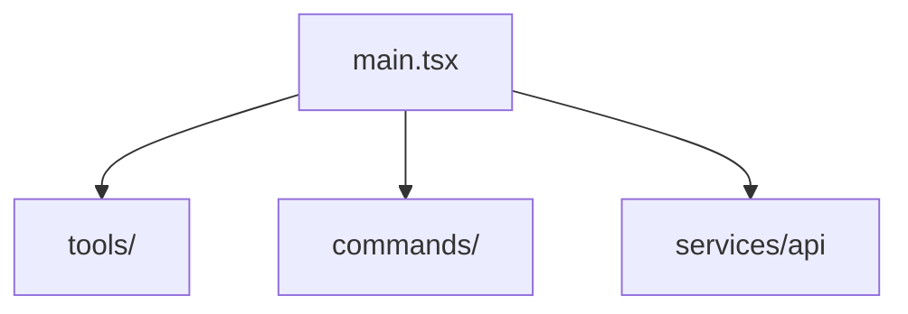

# Claude Code 源码分析笔记 — 设计规范

**日期**：2026-04-01
**项目**：claude-code-notes
**来源仓库**：claude-code-sourcemap（v2.1.88，非官方 source map 还原）

---

## 一、项目目标

对 Claude Code v2.1.88 的 35 个源码模块（1884 个 TypeScript 文件）进行系统性分析，产出一套面向**工程面试复习**与**源码深度学习**的中文技术文档集，并发布至 GitHub 作知识分享。

---

## 二、受众与用途

- **主要读者**：有一定 TypeScript/Node.js 基础的工程师，备战大厂面试或学习 CLI 工具架构
- **主要用途**：
  1. 面试前速查——每篇文档末尾附 10-15 道高频面试题 Q&A，可直接背诵
  2. 源码学习——叙述式正文覆盖架构设计思路、实现细节、设计模式

---

## 三、文档模板规范

每篇文档统一使用以下结构（混合式）：

```markdown
# [模块名] — Claude Code 源码分析

> 模块路径：`src/xxx/`
> 核心职责：一句话概括
> 源码版本：v2.1.88

---

## 一、模块概述（是什么）
- 用途与职责边界
- 在整体架构中的位置
- 与其他模块的关系概述（用箭头说明：依赖谁 / 被谁依赖）

## 二、架构设计（为什么这么设计）

### 2.1 核心类 / 接口 / 函数
（列出最重要的 3-5 个，每个附简短中文说明）

### 2.2 模块依赖关系图
（Mermaid 图，参考示例：

）

### 2.3 关键数据流
（输入 → 中间状态 → 输出的主链路，步骤式描述）

## 三、核心实现走读（怎么做的）

### 3.1 关键流程（编号步骤式）
### 3.2 重要源码片段（带中文注释）
（每段代码不超过 15 行，标注来源如 `src/tools/BashTool/index.ts:45-60`，全文代码占比 15-20%）
### 3.3 设计模式分析
（识别使用了哪些设计模式，为什么用，带来什么好处）

## 四、高频面试 Q&A

### 设计决策题（≥2 题）
Q: 为什么选择 X 而不是 Y？
**A**：...

### 原理分析题（≥3 题）
Q: 请描述 X 的工作流程...
**A**：...

### 权衡与优化题（≥2 题）
Q: 这个设计的缺点是什么？如何改进？
**A**：...

### 实战应用题（≥2 题）
Q: 如果要给这个模块添加 X 功能，你会怎么做？
**A**：...
```

---

## 四、模块分组与分篇规则

采用 **8 组并行分析** 方案：

| 组编号 | 组名 | 覆盖模块 | 分篇规则 |
|--------|------|----------|---------|
| G1 | 核心入口与运行时 | `main.tsx`, `cli/`, `entrypoints/`, `bootstrap/` | 每个模块一篇 |
| G2 | 工具系统 | `tools/`（30+ 工具） | 1篇总览 + 按功能类别聚合：文件类(Read/Write/Edit/Glob/Grep)、执行类(Bash/REPL)、Agent类(AgentTool/Task)、MCP类、其他各1篇，共6-8篇 |
| G3 | 命令系统 | `commands/`, `commands.ts`（40+ 命令） | 1篇总览 + 按功能分类聚合：git类(commit/branch)、会话类(compact/clear/sessions)、AI类(advisor/brief/bughunter)、配置类、调试类，共6-8篇 |
| G4 | Agent 协调与任务 | `coordinator/`, `tasks/`, `query/`, `QueryEngine.ts` | 每个模块一篇 |
| G5 | 扩展系统 | `plugins/`, `skills/`, `keybindings/` | 每个模块一篇 |
| G6 | 服务与基础设施 | `services/`, `utils/`, `schemas/`, `types/`, `constants/`, `state/`, `migrations/`, `memdir/` | 每个顶层目录一篇，相似小模块合并（如 constants+types 合并为1篇） |
| G7 | UI 与交互 | `components/`, `screens/`, `ink/`, `hooks/`, `buddy/`, `voice/`, `vim/`, `outputStyles/` | `ink`（终端渲染引擎）单独1篇；其余按 UI层/交互层 分类聚合 |
| G8 | 网络与远程 | `remote/`, `server/`, `bridge/`, `assistant/`, `context/`, `upstreamproxy/`, `moreright/`, `native-ts/` | 共同职责：处理进程外通信、代理转发、远程会话；按通信层/会话层各聚合1-2篇 |

**预计总文档数**：约 50-60 篇（含总览、分析篇、全局架构总览）

---

## 五、质量标准

每篇文档须满足：

| 维度 | 要求 |
|------|------|
| **完整性** | 模板全部 4 章节均须有实质内容，不得空节 |
| **代码引用** | 所有代码片段必须标注源文件路径（如 `src/tools/BashTool/index.ts:45-60`），禁止臆造 |
| **代码占比** | 代码行数占全文 15-20%，单段不超过 15 行 |
| **图表** | 每篇至少 1 张 Mermaid 依赖图或数据流图 |
| **面试题结构** | 设计决策题 ≥2 题、原理分析题 ≥3 题、权衡优化题 ≥2 题、实战应用题 ≥2 题 |
| **字数（核心模块 G1-G4）** | 每篇 3000-6000 字 |
| **字数（基础模块 G5-G8）** | 每篇 1500-3000 字 |
| **语言** | 正文全部中文；术语、类名、函数名保留英文原文 |

---

## 六、术语统一表（协作规范）

所有 Agent 必须使用以下统一翻译，避免术语不一致：

| 英文术语 | 统一中文译法 |
|---------|------------|
| Tool | 工具 |
| Command | 命令 |
| Plugin | 插件 |
| Skill | 技能 |
| Agent | Agent（不翻译） |
| Coordinator | 协调器 |
| Hook | 钩子 |
| Middleware | 中间件 |
| Stream | 流 / 数据流 |
| Hydration | 水合（React 术语） |
| Context | 上下文 |
| Provider | 提供器 |
| Resolver | 解析器 |
| Schema | 模式 / 结构定义 |
| Spawn | 派生（进程） |

**链接约定**：引用其他模块文档使用相对路径，如 `[工具系统总览](../02-工具系统/00-工具系统总览.md)`

---

## 七、GitHub 仓库结构

```
claude-code-notes/
├── README.md                        # 总索引（含推荐学习路径、快速开始、贡献指南）
├── 00-全局架构总览.md               # 宏观架构图 + 8 组模块关系 + 阅读顺序建议
├── 01-核心入口/
│   ├── 01-main.md
│   ├── 02-cli.md
│   ├── 03-entrypoints.md
│   └── 04-bootstrap.md
├── 02-工具系统/
│   ├── 00-工具系统总览.md
│   ├── 01-文件类工具.md             # FileRead/Write/Edit/Glob/Grep
│   ├── 02-执行类工具.md             # Bash/REPL/PowerShell
│   ├── 03-Agent类工具.md            # AgentTool/TaskCreate/SendMessage
│   ├── 04-MCP类工具.md              # MCPTool/ListMcpResources/ReadMcpResource
│   └── 05-其他工具.md               # Skill/Config/FileWrite 等
├── 03-命令系统/
│   ├── 00-命令系统总览.md
│   ├── 01-git类命令.md              # commit/branch/diff
│   ├── 02-会话类命令.md             # compact/clear/sessions
│   ├── 03-AI类命令.md               # advisor/brief/bughunter
│   ├── 04-配置类命令.md             # config/doctor/setup
│   └── 05-调试类命令.md             # debug/cost/effort
├── 04-Agent协调/
│   ├── 01-coordinator.md
│   ├── 02-tasks.md
│   ├── 03-query.md
│   └── 04-QueryEngine.md
├── 05-扩展系统/
│   ├── 01-plugins.md
│   ├── 02-skills.md
│   └── 03-keybindings.md
├── 06-服务与基础/
│   ├── 01-services.md
│   ├── 02-utils.md
│   ├── 03-state.md
│   ├── 04-schemas.md
│   └── 05-constants-types-migrations.md
├── 07-UI与交互/
│   ├── 01-ink渲染引擎.md
│   ├── 02-components-screens.md
│   ├── 03-hooks.md
│   └── 04-buddy-voice-vim.md
└── 08-网络与远程/
    ├── 01-remote-server.md
    ├── 02-bridge-upstreamproxy.md
    └── 03-assistant-context-native.md
```

---

## 八、版本与许可

- **源码版本锁定**：v2.1.88（source map 还原版），路径引用以此版本为准
- **许可声明**：每篇文档页尾须附注：
  > 源码版权归 [Anthropic](https://www.anthropic.com) 所有，本笔记仅供学习研究使用。文档内容采用 [CC BY-NC 4.0](https://creativecommons.org/licenses/by-nc/4.0/) 协议。

---

## 九、执行流程

1. **初始化仓库**：创建 `~/Documents/claude-code-notes/`，建立目录结构，初始化 git
2. **并行分析**：8 个 Agent 同时工作，各负责一组，读取源码后按模板写文档
3. **汇总审核**：写完后按下方清单逐项核查
4. **写全局总览**：`00-全局架构总览.md` 和 `README.md` 在所有分析完成后汇总写
5. **发布 GitHub**：创建 `TsekaLuk/claude-code-notes` 仓库并推送

---

## 十、交付审核清单

所有 Agent 完成初稿后，由主协调 Agent 逐项检查：

**交叉引用验证**
- [ ] 所有相对路径链接可跳转（`../xx/xx.md` 文件均已存在）
- [ ] 引用的源码路径（如 `src/tools/BashTool/index.ts:45`）在仓库中确实存在

**术语一致性**
- [ ] 全部文档的术语与第六章《术语统一表》对齐，无自造翻译

**模板完整性**
- [ ] 每篇文档均包含 4 个章节，无空节
- [ ] 每篇 Q&A 满足 4 种题型数量要求（设计决策≥2、原理分析≥3、权衡优化≥2、实战应用≥2）
- [ ] 每篇含 ≥1 张 Mermaid 依赖图或数据流图

**版权声明**
- [ ] 每篇页尾附有版权声明（见第八章）

**分组冲突处理原则**：若某模块难以归入已有分类，优先按**调用关系**归组（调用谁就归入哪组）；仍有歧义则独立成篇。
